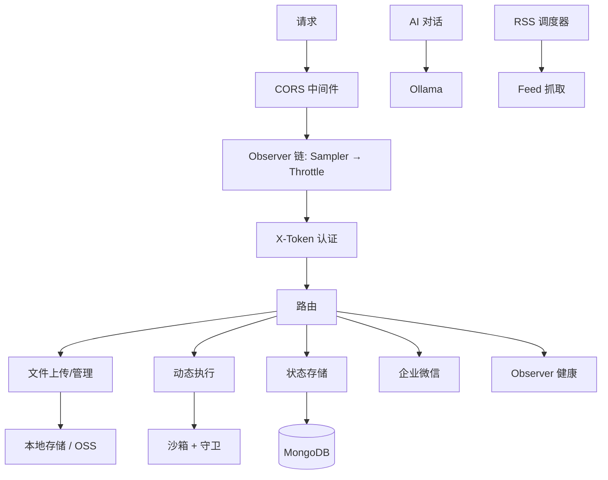

# YiAi

FastAPI 后端服务，提供文件管理、AI 对话、RSS 调度、状态存储、动态执行等 API。基于 MongoDB + Ollama。

## 哲学

**信模型** — 模型有能力判断，所有规则都是这句话的注脚。**惜注意** — 删除直到剩下必要，每个文件每条规则必须证明存在价值。**验现实** — 验证是唯一真相源，没跑过就是没做过。

### 工作原则

**守底线** — 定义不可妥协的底线（事实可验证、影响链闭合），其余交给上下文判断。**思在前** — 陈述假设，呈现权衡，不确定就停下来问。

### 退化对策

先可见后规则：让上下文可见（contracts、类型、验证），规则是最后手段。

## 技术栈

| 层 | 技术 | 版本 |
|---|------|------|
| Web 框架 | FastAPI | ≥0.104 |
| ASGI 服务器 | Uvicorn | ≥0.24 |
| 数据库 | MongoDB (Motor 异步驱动) | motor≥3.3, pymongo≥4.6 |
| 配置 | YAML + Pydantic Settings | pydantic≥2.0 |
| AI | Ollama | ≥0.1.0 |
| RSS | feedparser + APScheduler | ≥6.0, ≥3.10 |
| 对象存储 | Alibaba OSS (oss2) | ≥2.18 |
| CLI | Typer + Rich | ≥0.9, ≥13.0 |

## 目录结构

```
YiAi/
├── main.py                  # 根入口：uvicorn 启动
├── config.yaml              # 运行时配置（YAML → Pydantic Settings 扁平化）
├── requirements.txt         # Python 依赖
├── src/
│   ├── main.py              # FastAPI app 工厂 + 生命周期
│   ├── api/
│   │   ├── deps.py          # 公共依赖
│   │   └── routes/          # 路由模块
│   │       ├── upload.py    # 文件上传/读写/删除/重命名
│   │       ├── execution.py # 动态模块执行（沙箱）
│   │       ├── wework.py    # 企业微信回调
│   │       ├── state.py     # 状态存储 API
│   │       ├── maintenance.py # 维护接口
│   │       └── observer_health.py # Observer 健康检查
│   ├── core/
│   │   ├── config.py        # Settings（YamlConfigSettingsSource）
│   │   ├── database.py      # MongoDB 单例（MongoDB 类）
│   │   ├── middleware.py    # X-Token 认证中间件
│   │   ├── response.py      # success/fail 响应包装
│   │   ├── exceptions.py    # BusinessException
│   │   ├── error_codes.py   # ErrorCode 枚举
│   │   ├── exception_handler.py
│   │   ├── logger.py
│   │   ├── utils.py
│   │   └── observer/        # Observer 可靠性系统
│   │       ├── throttle.py  # 限流中间件
│   │       ├── sampler.py   # 采样中间件 + TailSampler
│   │       ├── guard.py     # 重入守卫
│   │       ├── sandbox.py   # 执行沙箱
│   │       └── lazy_start.py
│   ├── models/
│   │   ├── schemas.py       # Pydantic 请求/响应模型
│   │   └── collections.py   # MongoDB 集合映射
│   ├── services/
│   │   ├── ai/chat_service.py     # Ollama AI 对话
│   │   ├── rss/                   # RSS 调度 + 抓取
│   │   ├── execution/executor.py  # 动态模块执行引擎
│   │   ├── state/                 # 状态存储服务
│   │   ├── storage/oss_client.py  # OSS 上传
│   │   ├── static/                # 静态文件服务
│   │   └── database/              # 数据库服务层
│   └── cli/
│       └── state_query.py  # 状态查询 CLI
├── static/                  # 静态文件根目录
├── tests/                   # 冒烟测试（FastAPI TestClient）
└── logs/                    # 应用日志
```

## 关键文件

| 文件 | 角色 |
|------|------|
| `src/main.py` | App 工厂 `create_app()`，生命周期，中间件注册，路由挂载 |
| `src/core/config.py` | `Settings` 类，YAML 扁平化到 Pydantic field |
| `src/core/database.py` | `MongoDB` 单例，连接池，索引，CRUD 包装 |
| `src/core/middleware.py` | X-Token 认证，白名单路径跳过 |
| `config.yaml` | 所有运行时配置的单一来源 |
| `main.py` (root) | uvicorn 启动入口 |

## 编码约定

- **路径安全**: 所有文件操作必须验证路径在 `base_dir` 内，拒绝 `..` 和绝对路径
- **配置模式**: YAML 扁平化（`server_host` ← `server.host`），通过 `Settings` 单例访问
- **响应格式**: 统一使用 `success(data)` / `fail(error, message)` 包装
- **异常处理**: 业务异常抛 `BusinessException(ErrorCode.XXX)`，全局 handler 捕获
- **数据库**: `MongoDB` 单例，`insert_one` 自动添加 `createdTime`
- **中间件链**: CORS → Observer(Sampler → Throttle) → Auth → Route
- **路由风格**: 双路径注册（`/operation` + `/prefix/operation`）

## 禁止事项

- 禁止在文件路径操作中跳过 `..` 和绝对路径检查
- 禁止绕过 `success()`/`fail()` 响应包装直接返回 dict
- 禁止硬编码密钥/凭证，一律从 `settings` 或环境变量读取
- 禁止在路由中直接操作数据库，通过 `services/` 层

## 运行

```bash
# 安装依赖
pip install -r requirements.txt

# 启动服务 (默认 0.0.0.0:10086)
python main.py

# 或直接 uvicorn
uvicorn main:app --host 0.0.0.0 --port 10086 --reload

# 运行冒烟测试
python tests/smoke_observer.py
```

## 架构


