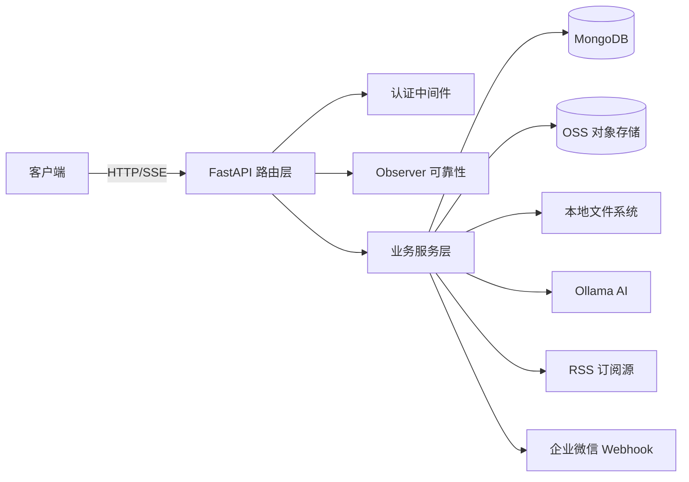

# YiAi

> 宜 AI — 面向智慧养宠的 FastAPI 后端服务

## 系统视图



## 快速开始

```bash
# 安装依赖
pip install -r requirements.txt

# 编辑配置
cp config.yaml config.yaml  # 按需修改 config.yaml

# 启动服务（开发模式，自动重载）
python main.py

# 或使用 uvicorn 直接启动
uvicorn main:app --host 0.0.0.0 --port 10086 --reload
```

服务启动后访问：
- API 文档：http://localhost:10086/docs（Swagger UI）
- 健康检查：http://localhost:10086/observer/health

## 命令流

| 命令 | 说明 |
|------|------|
| `python main.py` | 启动开发服务器（默认 0.0.0.0:10086） |
| `python -m src` | 通过包入口启动 |
| `python -m src.cli.state_query` | 状态查询 CLI |

## 项目结构

```
YiAi/
├── main.py              # 根入口（生产用）
├── config.yaml           # 主配置文件
├── requirements.txt      # Python 依赖
├── src/                  # 应用源码（src-layout）
│   ├── main.py           # 应用工厂 create_app()
│   ├── api/routes/       # HTTP 路由处理器
│   ├── core/             # 核心基础设施（配置/数据库/中间件/Observer）
│   ├── models/           # Pydantic 模型与集合常量
│   ├── services/         # 业务服务（执行/状态/RSS/AI/存储）
│   └── cli/              # CLI 工具
├── static/               # 静态文件根目录
└── logs/                 # 日志输出
```

### API 路由一览

| 路由 | 方法 | 说明 |
|------|------|------|
| `/` | GET/POST | 通用模块执行（支持 SSE 流） |
| `/upload` | POST | 文件上传（JSON 方式） |
| `/upload-image-to-oss` | POST | 图片上传到 OSS（降级到本地） |
| `/read-file` | POST | 读取文件（文本/图片 URL/base64） |
| `/write-file` | POST | 写入文件（文本/base64） |
| `/delete-file` | POST | 删除文件 |
| `/delete-folder` | POST | 删除文件夹 |
| `/rename-file` | POST | 文件重命名 |
| `/rename-folder` | POST | 文件夹重命名 |
| `/wework/webhook` | POST | 企业微信机器人回调 |
| `/maintenance/*` | GET | 维护接口 |
| `/state/*` | POST | 状态记录 CRUD |
| `/observer/health` | GET | Observer 健康检查 |

## 领域语言

### 术语定义

- **Observer** — 可靠性子系统，包含限流（Throttle）、采样（Sampler）、沙箱（Sandbox）、懒启动（LazyStart）、重入守卫（ReentrancyGuard）五个组件
- **Module Execution** — 通用模块执行器，通过 HTTP API 动态导入并调用任意 Python 模块函数，受白名单和沙箱约束
- **State Store** — 结构化状态存储服务，基于 MongoDB 的通用 key-record 存储，支持按 type/tags/title/time 查询
- **Skill Recorder** — 技能执行记录器，异步记录技能执行的输入/输出/耗时/状态到 State Store
- **SSE (Server-Sent Events)** — 服务端推送事件流，用于传输异步生成器和迭代器的流式输出
- **BusinessException** — 业务异常类，携带 ErrorCode 枚举、消息和可选数据，由全局异常处理器统一捕获并返回标准响应
- **StandardResponse** — 统一响应格式 `{ code, message, data }`，通过 `success()` 和 `fail()` 工厂函数创建
- **ErrorCode** — 错误码枚举，1xxx 为客户端错误（参数/认证/权限），5xxx 为服务端错误（内部/存储）
- **ReentrancyGuard** — 重入守卫，限制模块执行的嵌套深度，防止无限递归调用
- **TailSampler** — 尾部采样器，保留最近的 N 条慢请求样本（超过阈值毫秒），用于性能诊断
- **OSS** — 对象存储服务（阿里云 OSS），用于图片/文件的外部存储，不可用时自动降级到本地存储
- **YAML Config Source** — 自定义 pydantic-settings 源（`YamlConfigSettingsSource`），将 `config.yaml` 的嵌套结构扁平化为下划线 key（如 `server.host` → `server_host`），优先级低于环境变量
- **Lifespan** — FastAPI 异步生命周期管理器，通过 `@asynccontextmanager` 在 `_build_lifespan()` 中管理数据库连接和 RSS 调度器的启停
- **路径遍历防护** — `_validate_path()` + `_resolve_static_path()` 双屏障，使用 `os.path.realpath` + `os.path.commonpath` 校验防止目录穿越攻击

### 关系

- `create_app()` 是应用工厂，接收 `enable_auth`/`init_db`/`init_rss` 三个可选参数，返回完整配置的 FastAPI 实例
- Observer 组件在 `create_app()` 中按配置条件注册为 Starlette 中间件，顺序为 Sampler → Throttle
- 所有路由通过 `BusinessException` 抛出异常，由 `register_exception_handlers()` 注册的全局处理器捕获
- 文件操作通过 `_validate_path()` → `_resolve_static_path()` 链路防止路径遍历
- 模块执行通过 `_acquire_guard()` → `_check_whitelist()` → `_import_target_function()` → `_run_function()` 链路执行

### 示例对话

```
"这个请求被限流了" → "Observer Throttle 中间件返回了 429"
"执行模块超时了" → "Executor 的 asyncio.wait_for 超时，进程被 kill"
"图片上传 OSS 失败了" → "upload_bytes_to_oss 抛出异常，降级到 _upload_to_local_storage"
"重入深度超限" → "ReentrancyGuard 检测到嵌套深度超过 observer.guard_max_depth 配置值"
"静态文件路径被拒绝了" → "_resolve_static_path 检测到路径遍历企图，抛出 BusinessException"
"配置改了没生效" → "YamlConfigSettingsSource 优先级低于环境变量，检查是否有同名环境变量覆盖"
"服务启动慢" → "Lifespan 中 init_database 或 init_rss_system 阻塞，检查 MongoDB 可达性和 RSS 源网络"
```

### 歧义标记

- `--from-code` / `--from-doc` 场景下生成的文档中，缺信息来源的章节应标注 `<!-- 待补充 -->` 并在文末列出信息缺口
- `状态记录` vs `会话状态` — State Store 统一用 `StateRecord` 泛型模型，`SessionState` 是其特定变体，查询时按 `record_type` 区分
- 模块执行白名单 `*` 表示允许所有模块，实际部署建议收缩到具体模块列表
