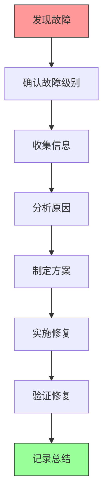

# 故障处理

## 📋 概述

本文档提供 YiAi 项目常见故障的排查步骤和解决方案，帮助快速定位和解决问题。

---

## 🚨 故障分级

| 级别 | 描述 | 响应时间 | 解决时间 | 通知方式 |
|------|------|---------|---------|---------|
| P0 - 紧急 | 服务完全不可用 | 立即 | 1小时内 | 电话、短信 |
| P1 - 高 | 核心功能异常 | 30分钟 | 4小时内 | 邮件、钉钉 |
| P2 - 中 | 次要功能异常 | 2小时 | 24小时内 | 邮件 |
| P3 - 低 | 小问题或优化建议 | 工作日 | 按计划处理 | 邮件 |

---

## 🔍 故障排查流程



### 信息收集清单

- [ ] 故障现象描述
- [ ] 故障发生时间
- [ ] 影响范围
- [ ] 错误日志
- [ ] 系统状态（CPU、内存、磁盘）
- [ ] 最近的变更
- [ ] 复现步骤

---

## 🐛 常见故障

### 服务无法启动

#### 症状
- `systemctl start yiai` 失败
- 端口被占用
- 依赖缺失

#### 排查步骤

```bash
# 1. 查看服务状态
sudo systemctl status yiai

# 2. 查看详细日志
sudo journalctl -u yiai -n 100 --no-pager

# 3. 检查端口占用
sudo netstat -tulpn | grep 8000
# 或
sudo lsof -i :8000

# 4. 检查配置文件语法
python -c "import yaml; yaml.safe_load(open('config.yaml'))"

# 5. 手动启动查看错误
cd /var/www/YiAi
source venv/bin/activate
python main.py
```

#### 常见原因及解决方案

| 原因 | 解决方案 |
|------|---------|
| 端口被占用 | 修改 `config.yaml` 中的端口或停止占用进程 |
| MongoDB 未启动 | `sudo systemctl start mongod` |
| 依赖包缺失 | `pip install -r requirements.txt` |
| 配置文件错误 | 修复 `config.yaml` 语法 |
| 权限不足 | 修正文件权限 `chown -R www-data:www-data /var/www/YiAi` |

---

### 数据库连接失败

#### 症状
- 日志显示 "MongoDB connection failed"
- API 返回 500 错误

#### 排查步骤

```bash
# 1. 检查 MongoDB 服务状态
sudo systemctl status mongod

# 2. 测试连接
mongosh --eval "db.adminCommand('ping')"

# 3. 检查连接字符串
grep mongodb config.yaml

# 4. 检查 MongoDB 日志
sudo tail -n 100 /var/log/mongodb/mongod.log
```

#### 常见原因及解决方案

| 原因 | 解决方案 |
|------|---------|
| MongoDB 未启动 | `sudo systemctl start mongod` |
| 连接字符串错误 | 修正 `config.yaml` 中的 `mongodb.url` |
| 认证失败 | 检查用户名密码 |
| 磁盘空间满 | 清理磁盘空间 |
| 网络问题 | 检查防火墙和网络连接 |

---

### 高 CPU/内存使用率

#### 症状
- 系统响应慢
- `top` 显示 CPU/内存使用率高

#### 排查步骤

```bash
# 1. 查看系统资源使用
top
htop

# 2. 查看进程详情
ps aux | grep python

# 3. 查看 Python 线程
pstree -p <pid>

# 4. 检查数据库操作
mongosh --eval "db.currentOp()"

# 5. 查看应用日志
tail -n 100 /var/log/yiai/app.log
```

#### 常见原因及解决方案

| 原因 | 解决方案 |
|------|---------|
| 死循环 | 检查代码逻辑，修复循环 |
| 内存泄漏 | 分析代码，释放未使用资源 |
| 慢查询 | 优化 MongoDB 查询，添加索引 |
| 并发过高 | 限制并发数，增加资源 |
| RSS 调度任务 | 调整抓取间隔，优化处理逻辑 |

---

### 磁盘空间满

#### 症状
- 服务无法写入文件
- 日志显示 "No space left on device"

#### 排查步骤

```bash
# 1. 查看磁盘使用
df -h

# 2. 查找大文件
sudo du -ah / | sort -rh | head -20

# 3. 检查日志目录
sudo du -sh /var/log/yiai/

# 4. 检查静态文件目录
sudo du -sh /var/www/YiAi/static/

# 5. 检查 MongoDB 数据
sudo du -sh /var/lib/mongodb/
```

#### 常见原因及解决方案

| 原因 | 解决方案 |
|------|---------|
| 日志未轮转 | 配置 logrotate，清理旧日志 |
| 上传文件过多 | 清理未使用的图片，归档旧文件 |
| 数据库数据量大 | 归档旧数据，增加存储 |
| 临时文件堆积 | 清理 `/tmp` 目录 |

---

### API 响应慢或超时

#### 症状
- API 请求响应时间长
- 请求超时

#### 排查步骤

```bash
# 1. 测试简单端点
curl -w '\nTotal: %{time_total}s\n' http://localhost:8000/docs

# 2. 检查应用日志
tail -f /var/log/yiai/app.log

# 3. 检查数据库慢查询
mongosh --eval "db.setProfilingLevel(1, { slowms: 100 })"

# 4. 查看系统资源
vmstat 1
iostat -x 1
```

#### 常见原因及解决方案

| 原因 | 解决方案 |
|------|---------|
| 数据库慢查询 | 添加索引，优化查询 |
| 网络延迟 | 检查网络连接，考虑 CDN |
| 缺少索引 | 在 MongoDB 中创建适当索引 |
| 同步阻塞操作 | 使用异步操作 |
| Ollama 响应慢 | 优化模型或使用更快的模型 |

---

### 文件上传失败

#### 症状
- 文件上传返回错误
- 文件无法保存

#### 排查步骤

```bash
# 1. 检查目录权限
ls -la /var/www/YiAi/static/

# 2. 检查磁盘空间
df -h

# 3. 查看应用日志
tail -n 100 /var/log/yiai/error.log

# 4. 测试 OSS 连接（如果使用）
curl -I <oss-endpoint>
```

#### 常见原因及解决方案

| 原因 | 解决方案 |
|------|---------|
| 目录权限不足 | `chmod 755 /var/www/YiAi/static/` |
| 磁盘空间满 | 清理磁盘空间 |
| 文件过大 | 调整 `client_max_body_size` (Nginx) |
| OSS 配置错误 | 检查 OSS AccessKey 和 Bucket 配置 |
| 文件名非法 | 验证和清理文件名 |

---

### RSS 任务不执行

#### 症状
- RSS 文章未更新
- 调度器不工作

#### 排查步骤

```bash
# 1. 检查调度器是否启用
grep rss config.yaml

# 2. 查看应用日志
grep -i rss /var/log/yiai/app.log

# 3. 手动测试 RSS 抓取
curl -L <rss-feed-url>

# 4. 检查数据库
mongosh yiai --eval "db.rss.find().sort({fetched_at: -1}).limit(5)"
```

#### 常见原因及解决方案

| 原因 | 解决方案 |
|------|---------|
| 调度器未启用 | 设置 `rss.scheduler_enabled: true` |
| RSS 源无法访问 | 检查网络连接和 RSS 源 URL |
| 解析错误 | 检查 RSS 源格式 |
| 数据库写入失败 | 检查 MongoDB 连接 |

---

### 认证问题

#### 症状
- API 返回 401 未授权
- Token 验证失败

#### 排查步骤

```bash
# 1. 检查认证配置
grep middleware config.yaml

# 2. 测试带 Token 的请求
curl -H "X-Token: your-token" http://localhost:8000/docs

# 3. 查看日志
grep -i auth /var/log/yiai/app.log
```

#### 常见原因及解决方案

| 原因 | 解决方案 |
|------|---------|
| Token 不匹配 | 确认使用正确的 Token |
| 认证未启用但客户端发送 Token | 调整配置或客户端行为 |
| Header 名称错误 | 使用 `X-Token` 而不是其他名称 |

---

## 📞 联系与支持

### 升级路径

如需上报故障，请提供以下信息：

1. 故障级别
2. 故障现象描述
3. 发生时间
4. 影响范围
5. 已采取的排查步骤
6. 相关日志片段

### 应急联系人

| 角色 | 联系方式 | 职责 |
|------|---------|------|
| 技术负责人 | - | P0/P1 故障处理 |
| DevOps | - | 基础设施问题 |
| 开发团队 | - | 代码问题 |

---

## 📝 故障报告模板

```markdown
# 故障报告

## 基本信息
- **故障编号**：INC-20260322-001
- **故障级别**：P0/P1/P2/P3
- **开始时间**：2026-03-22 10:30:00
- **结束时间**：2026-03-22 11:15:00
- **持续时间**：45分钟
- **报告人**：姓名

## 故障描述
详细描述故障现象和影响范围。

## 排查过程
记录排查步骤和发现。

## 根因分析
根本原因分析。

## 解决方案
实施的修复措施。

## 预防措施
防止类似故障再次发生的措施。

## 经验教训
总结经验教训。
```

---

**文档版本**：v1.0
**创建时间**：2026年3月
**最后更新**：2026年3月
