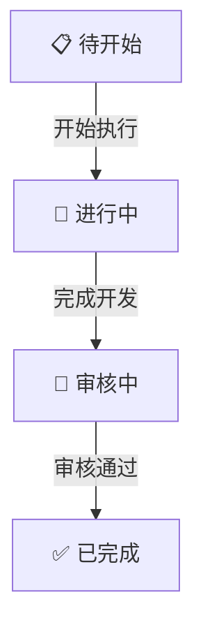
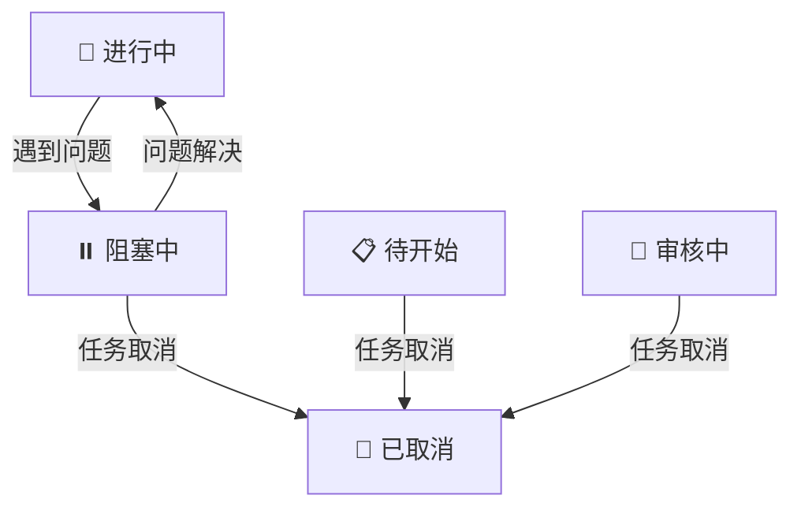
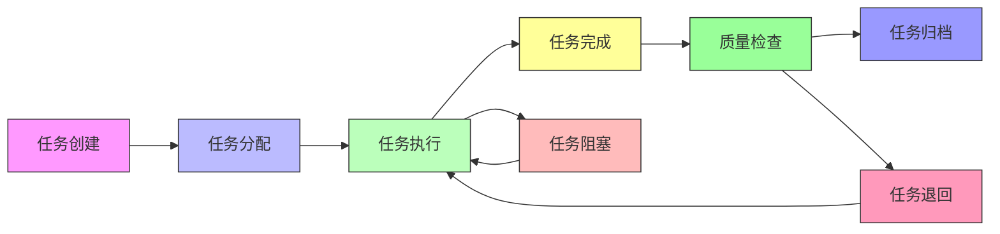
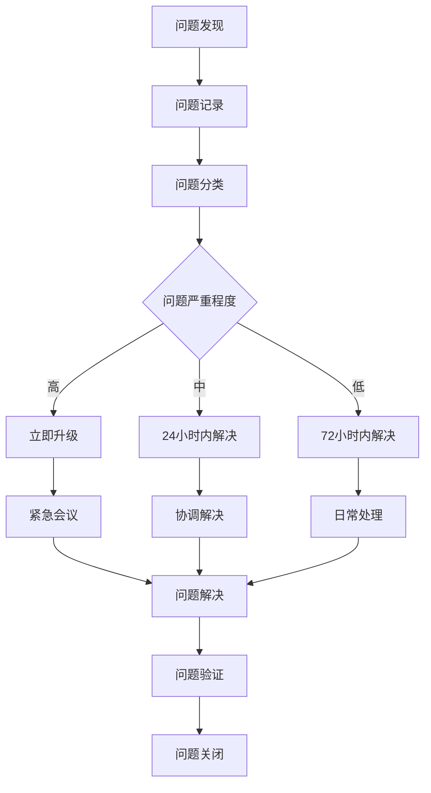

# 任务状态与进度监控

## 📋 概述

本文档详细定义 YiAi 项目的任务状态管理体系和进度监控机制，包括任务状态定义、转换规则、流程管理方法，以及进度监控体系、报告机制和问题处理流程，确保项目任务的清晰可见和高效管理。

## 🎯 任务状态定义

### 1. 核心状态

| 状态 | 图标 | 颜色 | 说明 | 负责人 |
|------|------|------|------|--------|
| 📋 待开始 | 待开始 | 灰色 | 任务已定义，等待执行 | 项目负责人 |
| 🔄 进行中 | 进行中 | 蓝色 | 正在开发或执行中 | 开发工程师 |
| 👀 审核中 | 审核中 | 黄色 | 开发完成，等待审核 | 质量保证 |
| ✅ 已完成 | 已完成 | 绿色 | 审核通过，任务完成 | 项目负责人 |
| ⏸️ 阻塞中 | 阻塞中 | 红色 | 任务受阻，等待解决 | 团队成员 |

### 2. 子状态

#### 待开始子状态
```markdown
## 📋 待开始 - 子状态

### 需求分析中
**说明**：任务正在进行需求分析
**负责人**：项目负责人

### 设计阶段
**说明**：任务正在进行技术设计
**负责人**：架构师

### 等待资源
**说明**：任务准备完毕，等待资源分配
**负责人**：项目负责人
```

#### 进行中子状态
```markdown
## 🔄 进行中 - 子状态

### 开发阶段
**说明**：正在进行代码开发
**负责人**：开发工程师

### 测试阶段
**说明**：正在进行功能测试
**负责人**：测试工程师

### 优化阶段
**说明**：正在进行性能优化
**负责人**：开发工程师
```

#### 审核中子状态
```markdown
## 👀 审核中 - 子状态

### 代码审查
**说明**：正在进行代码审查
**负责人**：开发团队

### 功能验证
**说明**：正在进行功能验证
**负责人**：项目负责人

### 质量检查
**说明**：正在进行质量检查
**负责人**：测试工程师
```

## 🔄 状态转换规则

### 1. 标准流程



### 2. 特殊转换



### 3. 状态转换矩阵

| 源状态 \ 目标状态 | 📋 待开始 | 🔄 进行中 | 👀 审核中 | ✅ 已完成 | ⏸️ 阻塞中 | 📝 已取消 |
|-------------------|-----------|-----------|-----------|-----------|-----------|-----------|
| 📋 待开始 | ❌ | ✅ | ❌ | ❌ | ❌ | ✅ |
| 🔄 进行中 | ❌ | ✅ | ✅ | ❌ | ✅ | ✅ |
| 👀 审核中 | ❌ | ❌ | ✅ | ✅ | ✅ | ✅ |
| ✅ 已完成 | ❌ | ❌ | ❌ | ✅ | ❌ | ❌ |
| ⏸️ 阻塞中 | ❌ | ✅ | ❌ | ❌ | ✅ | ✅ |
| 📝 已取消 | ❌ | ❌ | ❌ | ❌ | ❌ | ✅ |

---

## 📊 监控体系

### 1. 任务状态监控

#### 实时状态监控



#### 每日任务状态报告

| 状态 | 任务数量 | 完成率 | 说明 |
|------|---------|--------|------|
| 📋 待开始 | 5 | 0% | 任务已创建，未开始执行 |
| 🔄 进行中 | 3 | - | 任务正在执行中 |
| 👀 审核中 | 2 | - | 任务开发完成，待审核 |
| ✅ 已完成 | 4 | 29% | 任务已完成，通过审核 |
| ⏸️ 阻塞中 | 0 | - | 任务阻塞，无法继续 |
| **总计** | **14** | **29%** | **整体进度** |

---

### 2. 进度偏差监控

#### 进度偏差计算

```markdown
# 进度偏差计算方法

## 进度偏差（SV）
**计算公式**：SV = 已完成工作预算成本 - 计划工作预算成本

## 进度绩效指数（SPI）
**计算公式**：SPI = 已完成工作预算成本 / 计划工作预算成本
```

#### 项目进度趋势

```mermaid
graph TD
    A[项目启动] --> B[第一阶段]
    B --> C[第二阶段]
    C --> D[第三阶段]
    D --> E[第四阶段]

    A1[0%] --> B1[25%]
    B1 --> C1[55%]
    C1 --> D1[80%]
    D1 --> E1[100%]

    style A1 fill:#99f,stroke:#333
    style B1 fill:#55f,stroke:#333
    style C1 fill:#00f,stroke:#333
    style D1 fill:#009,stroke:#333
    style E1 fill:#003,stroke:#333
```



---

## 📋 报告机制

### 1. 每日进度报告

#### 每日报告模板

```markdown
# YiAi 项目每日进度报告

## 报告日期：2026-03-22

### 今日任务完成情况
- ✅ 完成动态模块执行引擎基础框架
- ✅ 完成 MongoDB 连接单例实现

### 今日任务进行中
- 🔄 RSS 抓取服务开发 - 60%完成
- 🔄 统一异常处理 - 40%完成

### 今日任务审核中
- 👀 配置管理系统 - 等待审核

### 任务阻塞情况
- 无

### 明日计划任务
- 📋 AI 聊天服务集成
- 📋 API 端点开发

### 问题与风险
- Ollama 服务连接需要确认
```

---

### 2. 每周进度报告

#### 每周报告模板

```markdown
# YiAi 项目每周进度报告

## 报告期间：2026-03-16 至 2026-03-22

### 本周任务完成情况
- ✅ 基础框架搭建
- ✅ 配置管理系统
- ✅ 模块执行引擎

### 本周任务进度
| 模块 | 计划任务 | 完成任务 | 完成率 |
|------|---------|---------|--------|
| 核心基础设施 | 5 | 4 | 80% |
| API 端点 | 4 | 2 | 50% |
| **总计** | **9** | **6** | **67%** |

### 进度偏差分析
| 指标 | 计划值 | 实际值 | 偏差 | 说明 |
|------|--------|--------|------|------|
| 任务完成率 | 75% | 67% | -8% | 进度略有滞后 |
| 资源利用率 | 85% | 80% | -5% | 资源使用略有不足 |

### 下周重点工作
- RSS 管理功能
- AI 聊天集成
- 文件上传功能

### 风险评估
| 风险 | 影响程度 | 发生概率 | 应对措施 |
|------|---------|---------|----------|
| Ollama 集成问题 | 中 | 中 | 提前进行原型验证 |
```

---

## 🚨 问题处理机制

### 1. 问题识别与分类

#### 问题识别流程



#### 问题分类标准

| 问题类型 | 影响程度 | 响应时间 | 解决时间 | 升级条件 |
|---------|---------|---------|---------|---------|
| API 故障 | 高 | 30分钟 | 8小时 | 超过2小时 |
| 数据库问题 | 高 | 30分钟 | 24小时 | 超过4小时 |
| 性能问题 | 中 | 2小时 | 48小时 | 超过12小时 |
| 安全问题 | 高 | 30分钟 | 24小时 | 超过4小时 |
| 文档问题 | 低 | 24小时 | 72小时 | 超过3天 |

---

### 2. 问题处理流程

#### 问题处理模板

```markdown
# 问题处理记录

## 问题基本信息
- **问题编号**：Q-20260322-001
- **问题类型**：功能问题
- **问题标题**：模块执行器异步函数处理错误
- **发现时间**：2026-03-22
- **发现人**：张三
- **影响程度**：高
- **发生概率**：100%

## 问题描述
异步函数执行时未正确处理 asyncio.Task，导致并发请求阻塞。

## 问题分析
- 缺少 asyncio.create_task() 包装
- 并发控制机制不完善
- 需要调整执行器的异步处理逻辑

## 解决措施
1. 修复异步函数处理逻辑
2. 添加并发信号量控制
3. 测试各种异步场景

## 负责人信息
- **负责人**：张三
- **开始时间**：2026-03-22
- **预计完成时间**：2026-03-23
- **实际完成时间**：-

## 进度跟踪
| 时间 | 更新人 | 进度 | 说明 |
|------|--------|------|------|
| 2026-03-22 | 张三 | 开始分析 | 问题确认，开始分析 |
| 2026-03-22 | 张三 | 找到原因 | 定位到异步处理逻辑问题 |
| 2026-03-22 | 张三 | 开始修复 | 开始代码修复 |

## 问题验证
- **验证人**：李四
- **验证时间**：-
- **验证结果**：-

## 问题关闭
- **关闭时间**：-
- **关闭原因**：-
- **关闭人**：-
```

---

## 📈 质量监控

### 1. 缺陷管理

#### 缺陷统计报告

| 严重程度 | 数量 | 修复率 | 说明 |
|---------|------|--------|------|
| 🔴 严重缺陷 | 0 | 0% | 无严重缺陷 |
| 🟡 一般缺陷 | 2 | 0% | 2个一般缺陷待修复 |
| 🟢 轻微缺陷 | 3 | 0% | 3个轻微缺陷待修复 |
| **总计** | **5** | **0%** | **5个缺陷待修复** |

---

### 2. 代码质量监控

#### 代码质量指标

| 指标 | 基准值 | 实际值 | 说明 |
|------|--------|--------|------|
| 代码复杂度 | <15 | 10 | 代码复杂度良好 |
| 代码重复率 | <5% | 2.5% | 代码重复率较低 |
| 测试覆盖率 | >70% | 45% | 需要提升测试覆盖 |
| 代码注释率 | >20% | 28% | 代码注释率良好 |
| 代码规范 | 符合规范 | 符合规范 | 代码规范检查通过 |

---

## 📊 工具支持

### 1. 项目管理工具

| 工具名称 | 功能 | 负责人 | 用途 |
|---------|------|--------|------|
| GitHub Projects | 任务看板 | 项目负责人 | 任务管理与追踪 |
| GitHub Issues | 问题跟踪 | 全体成员 | 问题记录与追踪 |

### 2. 开发管理工具

| 工具名称 | 功能 | 负责人 | 用途 |
|---------|------|--------|------|
| GitHub | 代码托管 | 开发团队 | 版本控制与代码管理 |
| GitHub Actions | CI/CD | DevOps | 自动化构建与测试 |

### 3. 质量保证工具

| 工具名称 | 功能 | 负责人 | 用途 |
|---------|------|--------|------|
| pytest | 单元测试 | 开发团队 | 测试执行 |
| black | 代码格式化 | 开发团队 | 代码风格统一 |
| ruff | 代码检查 | 开发团队 | 代码质量检查 |

---

**文档版本**：v1.0
**创建时间**：2026年3月
**最后更新**：2026年3月
