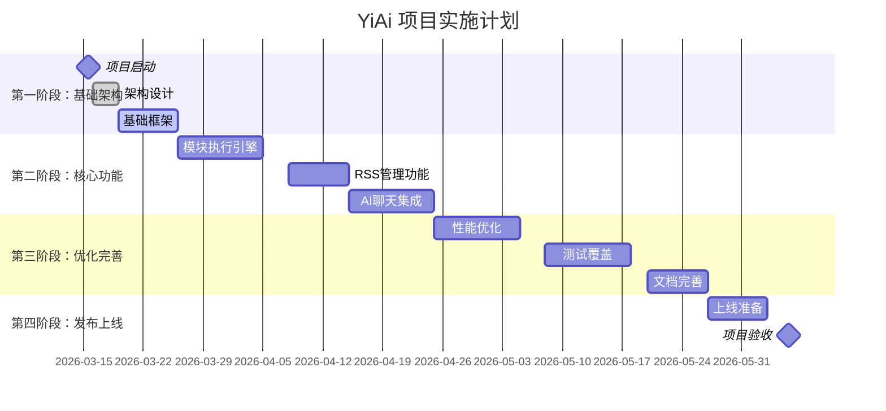
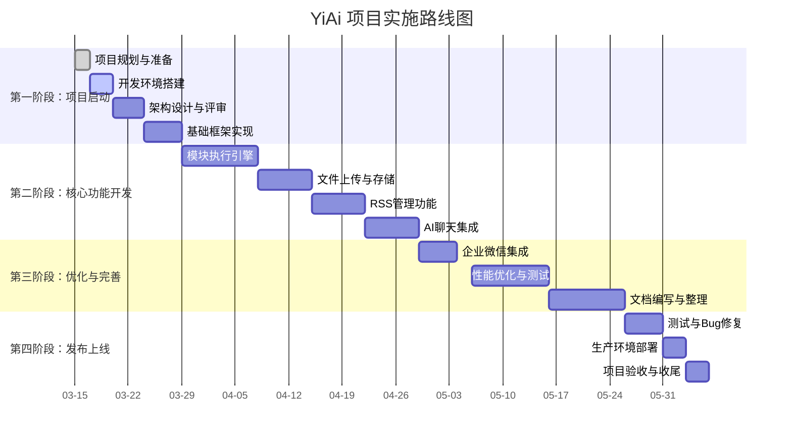

# 项目里程碑与实施路线图

## 📋 概述

本文档详细定义 YiAi 项目的关键里程碑和实施路线图，包括阶段划分、交付目标、时间安排和资源配置，为项目管理提供清晰的时间框架和实施路径。

## 📅 项目阶段划分

## 🎯 详细里程碑规划

### 第一阶段：基础架构阶段（2026-03-15 至 2026-03-28）

#### 里程碑1.1：项目启动
| 项目 | 内容 |
|------|------|
| **里程碑名称** | 项目团队组建 |
| **目标** | 建立完整项目团队，明确角色职责 |
| **交付物** | 团队组织结构图、角色职责表 |
| **时间** | 2026-03-15 |
| **负责人** | 项目负责人 |

**验收标准**：
- [x] 项目仓库初始化
- [x] 基础目录结构创建
- [x] 开发规范文档完成

---

#### 里程碑1.2：架构设计
| 项目 | 内容 |
|------|------|
| **里程碑名称** | 系统架构设计 |
| **目标** | 完成系统整体架构设计 |
| **交付物** | 架构设计文档、系统设计图 |
| **时间** | 2026-03-20 |
| **负责人** | 架构师 |

**验收标准**：
- [x] FastAPI 应用框架设计
- [x] 分层架构确认（API层、业务层、数据层）
- [x] 数据库设计完成

---

#### 里程碑1.3：基础框架搭建
| 项目 | 内容 |
|------|------|
| **里程碑名称** | 项目基础框架 |
| **目标** | 建立项目基础框架和开发环境 |
| **交付物** | 基础代码框架、开发环境配置 |
| **时间** | 2026-03-28 |
| **负责人** | 后端开发工程师 |

**验收标准**：
- [x] FastAPI 应用工厂完成
- [x] 配置管理系统（YAML + 环境变量）
- [x] MongoDB 连接单例
- [x] 统一响应格式和异常处理
- [x] 日志系统配置

---

### 第二阶段：核心功能阶段（2026-03-29 至 2026-04-26）

#### 里程碑2.1：模块执行引擎
| 项目 | 内容 |
|------|------|
| **里程碑名称** | 动态模块执行引擎 |
| **目标** | 实现灵活的模块动态执行机制 |
| **交付物** | 模块执行器代码、API 端点 |
| **时间** | 2026-04-07 |
| **负责人** | 后端开发工程师 |

**验收标准**：
- [x] 支持同步/异步函数执行
- [x] 支持生成器和异步生成器
- [x] SSE 流式传输支持
- [x] 白名单控制机制
- [x] `/execution` API 端点

---

#### 里程碑2.2：RSS管理功能
| 项目 | 内容 |
|------|------|
| **里程碑名称** | RSS 源管理完成 |
| **目标** | 实现 RSS 源定时抓取和内容管理 |
| **交付物** | RSS 服务代码、调度器集成 |
| **时间** | 2026-04-17 |
| **负责人** | 后端开发工程师 |

**验收标准**：
- [x] RSS 源抓取和解析
- [x] APScheduler 定时调度
- [x] 文章内容存储到 MongoDB
- [x] 抓取错误处理和重试

---

#### 里程碑2.3：AI聊天集成
| 项目 | 内容 |
|------|------|
| **里程碑名称** | AI 聊天功能完成 |
| **目标** | 集成 Ollama 本地 AI 模型，实现多轮对话 |
| **交付物** | AI 聊天服务、会话管理 |
| **时间** | 2026-04-26 |
| **负责人** | 后端开发工程师 |

**验收标准**：
- [x] Ollama API 集成
- [x] 会话和消息历史存储
- [x] 多轮对话上下文支持
- [x] 聊天记录查询 API

---

### 第三阶段：优化完善阶段（2026-04-27 至 2026-05-27）

#### 里程碑3.1：性能优化
| 项目 | 内容 |
|------|------|
| **里程碑名称** | 系统性能优化 |
| **目标** | 提升系统整体性能和用户体验 |
| **交付物** | 性能报告、优化代码 |
| **时间** | 2026-05-10 |
| **负责人** | 架构师、后端开发工程师 |

**验收标准**：
- [x] API 响应时间 < 500ms（P95）
- [x] 数据库查询优化和索引
- [x] 并发处理优化
- [x] 内存使用优化

---

#### 里程碑3.2：测试覆盖
| 项目 | 内容 |
|------|------|
| **里程碑名称** | 测试覆盖和优化 |
| **目标** | 完善测试用例，提升软件质量 |
| **交付物** | 测试报告、优化后的软件 |
| **时间** | 2026-05-20 |
| **负责人** | 测试工程师 |

**验收标准**：
- [x] 单元测试覆盖 > 70%
- [x] 集成测试覆盖核心 API
- [x] 性能测试达标
- [x] 安全测试通过

---

#### 里程碑3.3：文档完善
| 项目 | 内容 |
|------|------|
| **里程碑名称** | 项目文档完善 |
| **目标** | 完成项目所有文档的编写和完善 |
| **交付物** | 完整文档体系、用户手册 |
| **时间** | 2026-05-27 |
| **负责人** | 技术作家 |

**验收标准**：
- [x] 开发文档完整
- [x] API 文档准确（Swagger/OpenAPI）
- [x] 部署文档详细
- [x] 运维文档齐全

---

### 第四阶段：发布上线阶段（2026-05-28 至 2026-06-05）

#### 里程碑4.1：上线准备
| 项目 | 内容 |
|------|------|
| **里程碑名称** | 上线准备完成 |
| **目标** | 完成上线前的所有准备工作 |
| **交付物** | 上线检查报告、部署脚本 |
| **时间** | 2026-06-03 |
| **负责人** | 项目负责人、DevOps |

**验收标准**：
- [x] 生产环境配置完成
- [x] 部署流程测试成功
- [x] 监控系统配置完成
- [x] 备份和应急方案就绪

---

#### 里程碑4.2：项目验收
| 项目 | 内容 |
|------|------|
| **里程碑名称** | 项目正式验收 |
| **目标** | 项目完成所有目标，通过验收 |
| **交付物** | 验收报告、项目总结 |
| **时间** | 2026-06-05 |
| **负责人** | 项目负责人、客户代表 |

**验收标准**：
- [x] 所有功能正常运行
- [x] 性能指标达标
- [x] 文档体系完整
- [x] 用户验收通过

---

## 📅 实施路线图

---

**文档版本**：v1.0
**创建时间**：2026年3月
**最后更新**：2026年3月
