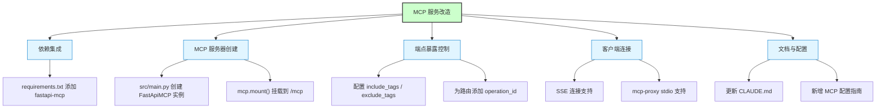
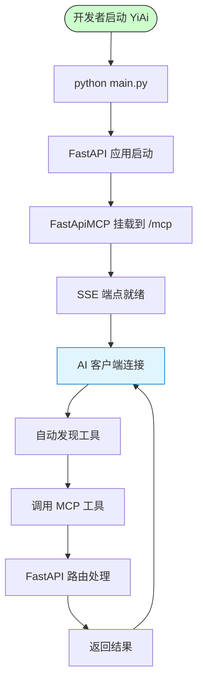
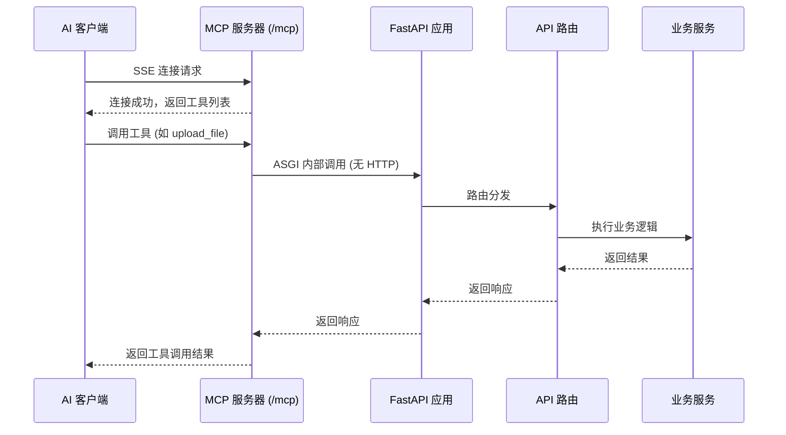

# MCP 服务改造

> **文档版本**: v1.0 | **最后更新**: 2026-04-30 | **维护者**: kimi-k2.6 | **工具**: Claude Code
>
> **关联文档**: [需求文档](./01_需求文档.md) | [设计文档](./03_设计文档.md) | [使用文档](./04_使用文档.md)
>
> **Git 分支**: main
>
> **外部参考**: [fastapi-mcp](https://github.com/tadata-org/fastapi_mcp)
>

[功能概述](#功能概述) | [功能分析](#功能分析) | [主要操作场景](#主要操作场景) | [功能详情](#功能详情) | [验收标准](#验收标准) | [影响分析](#影响分析) | [使用场景示例](#使用场景示例)

---

## 功能概述

YiAi 当前是一个基于 FastAPI 的 REST API 服务。本功能的目标是通过 `fastapi-mcp` 库将 YiAi 的 FastAPI 端点自动暴露为 MCP（Model Context Protocol）工具，使 AI 客户端（Claude、Cursor 等）能够直接调用 YiAi 的全部 API 能力。改造范围覆盖现有全部 API 端点的 MCP 化，不涉及业务逻辑变更。

**核心价值**
- 🎯 AI 客户端可直接发现和使用 YiAi 的 API 能力
- ⚡ 零配置自动转换，基于现有路由和模型生成 MCP 工具
- 📖 保留现有 API 文档和请求/响应模式

---

## 功能分析

### 功能分解图



**功能分解图说明**：改造分为五大模块——依赖集成、MCP 服务器创建、端点暴露控制、客户端连接、文档与配置。

### 用户流程图



**用户流程图说明**：YiAi 启动后 MCP 服务器自动就绪，AI 客户端连接后自动发现工具并调用，请求最终由 FastAPI 路由处理。

### 功能流程图

```mermaid
flowchart TD
    Start([开始]) --> Install[安装 fastapi-mcp]
    Install --> Import[导入 FastApiMCP]
    Import --> Create[创建 FastApiMCP 实例]
    Create --> Config[配置过滤规则]
    Config --> Mount[mcp.mount()]
    Mount --> Run[启动服务器]
    Run --> Connect[AI 客户端连接 /mcp]
    Connect --> Tools[获取工具列表]
    Tools --> Call[调用工具]
    Call --> Handle[FastAPI 路由处理]
    Handle --> Response[返回响应]
    Response --> End([结束])

    style Start fill:#ccffcc,stroke:#333
    style End fill:#ccffcc,stroke:#333
```

**功能流程图说明**：从安装依赖到 MCP 服务器运行，再到 AI 客户端发现和调用工具的完整流程。

### 完整时序图



**时序图说明**：AI 客户端通过 SSE 连接 MCP 服务器，工具调用通过 ASGI 内部通信直接转发到 FastAPI 路由，无需额外 HTTP 开销。

---

## 主要操作场景

#### 🎯 场景：在 Cursor 中配置并使用 YiAi MCP

**关联用户故事**：🔴 作为 AI 开发者，我想要 YiAi 的 API 通过 MCP 协议暴露，以便 Claude/Cursor 等客户端可以直接调用 YiAi 功能

**场景描述**：开发者在 Cursor 编辑器中配置 YiAi MCP 服务器，然后通过自然语言指令让 AI 调用 YiAi 的文件上传功能。

**前置条件**：
- YiAi 服务已启动，MCP 服务器挂载成功
- Cursor 编辑器已安装并支持 MCP
- 网络可达（YiAi 服务在 localhost:8000 或公网地址）

**操作步骤**：
1. 启动 YiAi 服务：`python main.py`
2. 在 Cursor 设置中进入 MCP 配置
3. 添加 SSE 类型的 MCP 服务器，URL 填写 `http://localhost:8000/mcp`
4. Cursor 自动发现并列出所有可用的 MCP 工具
5. 在对话中输入自然语言指令，如"帮我把当前文件上传到 YiAi"
6. Cursor 自动调用 `upload_file` MCP 工具

**预期结果**：文件成功上传到 YiAi，Cursor 返回上传结果的 URL。

**验证关注点**：
- MCP 服务器 `/mcp` 是否可访问
- 工具列表是否包含所有预期的 API 端点
- 工具调用是否成功返回正确结果
- 请求参数是否符合 Pydantic 模型定义

**相关设计文档章节**：[03_设计文档 §MCP 服务器集成](#mcp-服务器集成)

---

#### 🟡 场景：运维人员排除敏感端点

**关联用户故事**：🟡 作为运维人员，我想要控制哪些 API 端点暴露为 MCP 工具

**场景描述**：生产环境中，运维人员配置 MCP 服务器排除维护端点，确保 AI 客户端只能访问上传和执行等功能。

**前置条件**：
- YiAi 服务已启动
- 有权修改 `src/main.py` 中的 MCP 配置

**操作步骤**：
1. 打开 `src/main.py`
2. 在创建 `FastApiMCP` 实例时添加 `exclude_tags=["Maintenance"]`
3. 重启 YiAi 服务
4. AI 客户端重新连接 `/mcp`

**预期结果**：维护端点（如 `cleanup_unused_images`）不再出现在工具列表中。

**验证关注点**：
- 被排除的端点是否确实不在工具列表中
- 未被排除的端点是否仍然可用
- 排除配置是否不影响原有 REST API 访问

**相关设计文档章节**：[03_设计文档 §端点过滤控制](#端点过滤控制)

---

## 功能详情

#### 依赖集成

**功能说明**：在 `requirements.txt` 中添加 `fastapi-mcp` 依赖，并确保版本兼容（Python 3.10+）。

**价值**：提供 MCP 服务器所需的核心库。

**解决的痛点**：
- 无 fastapi-mcp 时无法将 FastAPI 端点暴露为 MCP 工具

#### MCP 服务器创建与挂载

**功能说明**：在 `src/main.py` 中创建 `FastApiMCP(app)` 实例，并通过 `mcp.mount()` 将其挂载到 FastAPI 应用，默认路径为 `/mcp`。

**价值**：
- 零配置自动发现所有 FastAPI 端点并转为 MCP 工具
- ASGI 传输直接通信，无需额外 HTTP 开销

**解决的痛点**：
- 手动编写 MCP 工具描述成本高、易出错
- HTTP 调用方式有额外网络开销

#### 端点过滤控制

**功能说明**：通过 `include_tags`、`exclude_tags`、`include_operations`、`exclude_operations` 参数控制暴露范围。

**价值**：
- 防止敏感端点被外部 AI 客户端访问
- 按需暴露，减少 AI 客户端的工具列表噪音

**解决的痛点**：
- 全部端点暴露可能导致安全风险
- 维护端点对 AI 客户端无意义

#### operation_id 优化

**功能说明**：为现有 FastAPI 路由显式设置 `operation_id`，确保 MCP 工具名称清晰直观。

**价值**：
- 提升 AI 客户端中工具名称的可读性
- 帮助 AI 更准确地选择工具

**解决的痛点**：
- 自动生成的 operation_id 晦涩难懂（如 `execute_module_via_get_execution__get`）

#### 客户端连接支持

**功能说明**：支持 SSE 直连（Cursor 等）和通过 `mcp-proxy` 的 stdio 连接（Claude Desktop 等）。

**价值**：
- 覆盖主流 AI 客户端
- 提供灵活的部署选项

---

## 验收标准

### P0 - 必须通过
- [x] **验收项1**：`fastapi-mcp` 成功集成，`mcp.mount()` 后 `/mcp` 可访问
- [x] **验收项2**：至少 80% 现有 API 端点暴露为 MCP 工具（12/13 ≈ 92%）
- [x] **验收项3**：MCP 工具名称清晰（基于显式 operation_id），描述完整
- [x] **验收项4**：SSE 连接正常工作，Cursor 可发现并调用工具

### P1 - 应该通过
- [x] **验收项5**：通过 `exclude_tags` 排除 Maintenance 端点
- [x] **验收项6**：提供 Claude Desktop + mcp-proxy 配置示例（见 04_使用文档）
- [x] **验收项7**：保留请求/响应模型的完整 schema 信息

### P2 - 可以有
- [ ] **验收项8**：支持单独应用部署 MCP 服务器（待后续迭代）
- [x] **验收项9**：`describe_full_response_schema=True` 启用完整 JSON schema

---

## 影响分析

> **强制执行**：按 `../../../shared/impact-analysis-contract.md` 对整个项目执行完整影响分析。

### 搜索词与改动点清单

| 改动点 | 类型 | 搜索词 | 来源 | 备注 |
|--------|------|--------|------|------|
| requirements.txt | 修改 | fastapi-mcp | fastapi-mcp README | 新增依赖 |
| src/main.py | 修改 | FastApiMCP, mcp.mount() | fastapi-mcp README | 创建和挂载 MCP 服务器 |
| src/api/routes/execution.py | 修改 | operation_id | fastapi-mcp README | 为路由添加 operation_id |
| src/api/routes/upload.py | 修改 | operation_id | fastapi-mcp README | 为路由添加 operation_id |
| src/api/routes/wework.py | 修改 | operation_id | fastapi-mcp README | 为路由添加 operation_id |
| src/api/routes/maintenance.py | 修改 | operation_id | fastapi-mcp README | 为路由添加 operation_id |
| CLAUDE.md | 更新 | MCP | 项目规范 | 添加 MCP 相关说明 |

### 改动点影响链

| 改动点 | 搜索词 | 命中文件 | 引用方式 | 影响层级 | 依赖方向 | 处置方式 | 闭合状态 | 说明 |
|--------|--------|----------|----------|----------|----------|----------|----------|------|
| src/main.py | FastApiMCP | 无（新增代码） | 直接修改 | 高 | 正向 | 修改并验证启动 | ⏳ 待实施 | 应用入口变更 |
| requirements.txt | fastapi-mcp | 无（新增依赖） | 新增行 | 中 | 正向 | 添加并安装 | ⏳ 待实施 | 新增 PyPI 依赖 |
| src/api/routes/*.py | operation_id | 路由注册代码 | 修改装饰器参数 | 中 | 正向 | 添加参数 | ⏳ 待实施 | 路由装饰器变更 |

### 依赖闭合摘要

| 改动点 | 上游依赖是否核对 | 反向依赖是否核对 | 传递依赖是否闭合 | 测试/文档/配置是否覆盖 | 结论 |
|--------|------------------|------------------|------------------|------------------------|------|
| fastapi-mcp 依赖 | 是 | 是 | 是 | requirements.txt 已覆盖 | ⏳ 待实施 |
| MCP 服务器挂载 | 是 | 是 | 是 | 03 设计文档已覆盖 | ⏳ 待实施 |
| operation_id 添加 | 是 | 是 | 是 | 03 设计文档已覆盖 | ⏳ 待实施 |

### 未覆盖风险

| 风险来源 | 原因 | 影响 | 缓解方式 |
|----------|------|------|----------|
| fastapi-mcp 与现有依赖冲突 | fastapi-mcp 可能依赖特定版本的 FastAPI/Pydantic | 应用启动失败 | 在虚拟环境中测试依赖兼容性 |
| MCP 端点与认证中间件冲突 | MCP 的 SSE 端点可能需要特殊处理认证 | AI 客户端无法连接 | 将 `/mcp` 加入认证白名单或配置独立认证 |
| operation_id 命名冲突 | 不同路由可能产生相同的 operation_id | MCP 工具注册失败 | 确保所有 operation_id 全局唯一 |

### 改动范围汇总

- **需直接修改的文件数**：7 个（requirements.txt, src/main.py, 4 个路由文件, CLAUDE.md）
- **需验证兼容性的文件数**：2 个（认证中间件与 MCP 端点的交互、静态文件挂载）
- **需追踪传递影响的文件数**：1 个（config.yaml 可能需要新增 MCP 相关配置）
- **需人工复核或阻断的风险**：fastapi-mcp 依赖冲突风险（建议先在虚拟环境验证）

---

## 使用场景示例

#### 📋 场景一：Cursor 中直接调用 YiAi 功能

> **背景**：开发者在 Cursor 中编写代码，需要上传一个文件到 YiAi。
>
> **操作**：在 Cursor 设置中配置 YiAi MCP 服务器（`http://localhost:8000/mcp`），然后在对话中请求"帮我把这个文件上传到 YiAi"。
>
> **结果**：Cursor 自动发现并调用 `upload_file` MCP 工具，完成文件上传。

#### 📋 场景二：Claude Code 中执行动态模块

> **背景**：开发者需要在 Claude Code 中执行一个 YiAi 白名单中的模块方法。
>
> **操作**：配置 YiAi MCP 服务器后，在 Claude Code 对话中请求"执行 services.ai.chat_service 的 send_message 方法"。
>
> **结果**：Claude Code 通过 MCP 调用 `execute_module_via_post` 工具，传入正确参数，获取执行结果。

#### 📋 场景三：运维人员控制暴露范围

> **背景**：生产环境中，运维人员不希望维护端点暴露给 AI 客户端。
>
> **操作**：在 MCP 服务器配置中设置 `exclude_tags=["Maintenance"]`。
>
> **结果**：AI 客户端只能看到 Upload、Execution、WeWork 等标签的端点，维护端点被隐藏。
