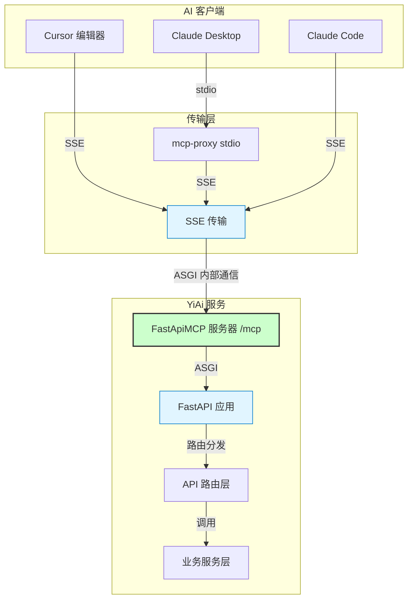
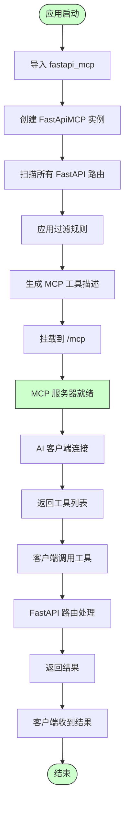
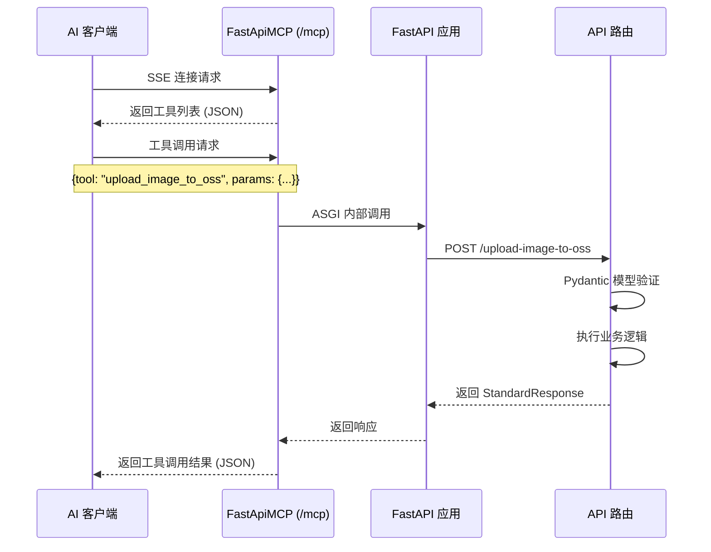

# MCP 服务改造

> **文档版本**: v1.0 | **最后更新**: 2026-04-30 | **维护者**: kimi-k2.6 | **工具**: Claude Code
>
> **关联文档**: [需求文档](./01_需求文档.md) | [需求任务](./02_需求任务.md) | [使用文档](./04_使用文档.md)
>
> **外部参考**: [fastapi-mcp](https://github.com/tadata-org/fastapi_mcp)
>

[设计概述](#设计概述) | [架构设计](#架构设计) | [变更内容](#变更内容) | [影响分析](#影响分析) | [实现细节](#实现细节) | [主要操作场景实现](#主要操作场景实现) | [数据结构设计](#数据结构设计)

---

## 设计概述

本次改造的目标是将 YiAi 的 FastAPI 应用通过 `fastapi-mcp` 自动暴露为 MCP 服务器，使 AI 客户端能够直接发现和调用 YiAi 的 API 能力。设计遵循三个核心原则：最小侵入（不修改业务逻辑）、零配置自动发现（利用 fastapi-mcp 的自动化能力）、安全可控（通过过滤机制控制暴露范围）。

**设计原则**
- 🎯 **最小侵入**：仅修改应用入口和路由装饰器，不触碰业务逻辑
- ⚡ **零配置自动发现**：fastapi-mcp 自动扫描 FastAPI 路由生成 MCP 工具
- 🔧 **安全可控**：通过 include/exclude 参数精确控制暴露范围

---

## 架构设计

### 整体架构



**整体架构说明**：AI 客户端通过 SSE 或 mcp-proxy 连接到 YiAi 的 MCP 服务器，MCP 服务器通过 ASGI 内部通信直接调用 FastAPI 路由，无需额外 HTTP 请求。

### 模块划分

| 模块名称 | 职责 | 位置 |
|---------|------|------|
| FastApiMCP | MCP 服务器核心，自动发现路由并生成工具 | `fastapi_mcp` 库 |
| MCP Mount | 将 MCP 服务器挂载到 FastAPI 应用 | `src/main.py` |
| Route Registry | FastAPI 路由注册（需补充 operation_id） | `src/api/routes/*.py` |
| Filter Config | 控制哪些端点暴露为 MCP 工具 | `src/main.py` 中 FastApiMCP 参数 |
| Transport Layer | SSE 端点和 stdio 代理支持 | MCP 协议层（库内置） |

### 核心流程



**核心流程说明**：应用启动时 fastapi-mcp 自动扫描路由、应用过滤、生成工具描述并挂载。客户端连接后获取工具列表并调用，请求直接由 FastAPI 路由处理。

---

## 变更内容

### 问题分析

YiAi 当前仅提供 REST API 接口，AI 客户端（如 Claude、Cursor）无法直接调用这些能力。开发者需要手动编写 HTTP 请求代码来调用 YiAi API，集成成本高且易出错。通过 MCP 协议暴露 API 能力，可以让 AI 客户端自动发现并调用工具，大幅降低集成门槛。

### 方案

#### 思路

引入 `fastapi-mcp` 库，在 YiAi 的 FastAPI 应用中创建 MCP 服务器并挂载。利用 fastapi-mcp 的自动发现能力，将现有路由转换为 MCP 工具，同时通过过滤配置控制暴露范围。

#### 文件清单

| 文件 | 操作 | 变更内容 |
|------|------|---------|
| `requirements.txt` | 新增行 | 添加 `fastapi-mcp` 依赖 |
| `src/main.py` | 修改 | 导入 `FastApiMCP`，创建实例，配置过滤，挂载到 `/mcp` |
| `src/api/routes/execution.py` | 修改 | 为 `@router.get` 和 `@router.post` 添加 `operation_id` |
| `src/api/routes/upload.py` | 修改 | 为所有 `@router.post` 添加 `operation_id` |
| `src/api/routes/wework.py` | 修改 | 为 `@router.post` 添加 `operation_id` |
| `src/api/routes/maintenance.py` | 修改 | 为 `@router.post` 添加 `operation_id` |
| `CLAUDE.md` | 更新 | 在架构说明中补充 MCP 相关内容 |

#### 选择理由

- `fastapi-mcp` 是专为 FastAPI 设计的 MCP 集成方案，零配置即可工作
- ASGI 传输直接通信，无需额外 HTTP 开销
- 保留 Pydantic 模型 schema，AI 客户端可准确理解参数要求
- 支持灵活的过滤机制，满足安全控制需求

### 前后对比

| 维度 | 变更前 | 变更后 |
|------|--------|--------|
| 协议支持 | 仅 REST API | REST API + MCP 协议 |
| AI 客户端集成 | 需手动编写 HTTP 调用 | AI 自动发现并调用工具 |
| 端点暴露 | 全部 REST 端点可访问 | REST 全部可访问，MCP 端点可按需过滤 |
| 传输方式 | HTTP | HTTP + SSE + ASGI 内部通信 |

---

## 影响分析

> **强制**：按 `../../../shared/impact-analysis-contract.md` 全项目影响链闭合。

### 搜索词与改动点清单

| 改动点 | 类型 | 搜索词 | 来源 | 备注 |
|--------|------|--------|------|------|
| requirements.txt | 新增依赖 | fastapi-mcp | fastapi-mcp README | 新增 PyPI 依赖 |
| src/main.py | 修改 | FastApiMCP, mcp.mount() | fastapi-mcp README | 应用入口变更 |
| src/api/routes/execution.py | 修改 | operation_id | fastapi-mcp README | 路由装饰器参数 |
| src/api/routes/upload.py | 修改 | operation_id | fastapi-mcp README | 路由装饰器参数 |
| src/api/routes/wework.py | 修改 | operation_id | fastapi-mcp README | 路由装饰器参数 |
| src/api/routes/maintenance.py | 修改 | operation_id | fastapi-mcp README | 路由装饰器参数 |

### 改动点影响链

| 改动点 | 搜索词 | 命中文件 | 引用方式 | 影响层级 | 依赖方向 | 处置方式 | 闭合状态 | 说明 |
|--------|--------|----------|----------|----------|----------|----------|----------|------|
| src/main.py | create_app | 根 main.py | 导入 | 高 | 反向 | 同步更新 | ⏳ 待实施 | 根 main.py 从 src.main 导入 app |
| src/main.py | lifespan | src/main.py 内部 | 直接引用 | 高 | 正向 | 在 lifespan 后挂载 | ⏳ 待实施 | MCP 挂载应在 lifespan 内 |
| requirements.txt | fastapi-mcp | 无 | 新增 | 低 | 正向 | pip install | ⏳ 待实施 | 新增依赖 |

### 依赖闭合摘要

| 改动点 | 上游依赖是否核对 | 反向依赖是否核对 | 传递依赖是否闭合 | 测试/文档/配置是否覆盖 | 结论 |
|--------|------------------|------------------|------------------|------------------------|------|
| fastapi-mcp 依赖 | 是 | 是 | 是 | requirements.txt | ⏳ 待实施 |
| MCP 服务器挂载 | 是 | 是 | 是 | 03 设计文档 | ⏳ 待实施 |
| operation_id 添加 | 是 | 是 | 是 | 03 设计文档 | ⏳ 待实施 |

### 未覆盖风险

| 风险来源 | 原因 | 影响 | 缓解方式 |
|----------|------|------|----------|
| fastapi-mcp 与现有认证中间件冲突 | MCP 的 SSE 端点走 FastAPI 中间件，可能被认证拦截 | AI 客户端无法连接 | 将 `/mcp` 加入认证白名单，或单独配置 MCP 认证 |
| fastapi-mcp 版本与 FastAPI/Pydantic 不兼容 | fastapi-mcp 可能依赖特定版本 | 应用启动失败 | 先在虚拟环境测试兼容性 |
| operation_id 冲突 | 手动设置的 operation_id 可能重复 | MCP 工具注册失败 | 全局检查 operation_id 唯一性 |

### 改动范围汇总

- **需直接修改的文件数**：6 个（requirements.txt, src/main.py, 4 个路由文件）
- **需验证兼容性的文件数**：2 个（认证中间件、静态文件挂载）
- **需追踪传递影响的文件数**：1 个（根 main.py 需确认兼容性）
- **需人工复核或阻断的风险**：fastapi-mcp 依赖冲突（建议先在虚拟环境验证）

---

## 实现细节

### 技术要点

#### 做什么
在 YiAi 的 FastAPI 应用中集成 `fastapi-mcp`，将现有 REST API 端点自动暴露为 MCP 工具，支持 SSE 和 stdio（通过 mcp-proxy）两种连接方式。

#### 怎么做

**步骤 1：添加依赖**

在 `requirements.txt` 中添加：
```
fastapi-mcp>=0.1.0
```

**步骤 2：修改 src/main.py**

```python
from fastapi import FastAPI
from fastapi_mcp import FastApiMCP

# ... 现有导入 ...

def create_app(...) -> FastAPI:
    # ... 现有代码 ...
    app = FastAPI(...)

    # 创建 MCP 服务器
    mcp = FastApiMCP(
        app,
        name="YiAi MCP",
        describe_all_responses=True,
        describe_full_response_schema=True,
        # 排除 Maintenance 标签的端点
        exclude_tags=["Maintenance"]
    )

    # 挂载 MCP 服务器到 /mcp
    mcp.mount()

    return app
```

**步骤 3：为路由添加 operation_id**

以 `src/api/routes/execution.py` 为例：

```python
@router.get("/", operation_id="execute_module_get")
async def execute_module_via_get(...):
    ...

@router.post("/", operation_id="execute_module_post")
async def execute_module_via_post(...):
    ...
```

以 `src/api/routes/upload.py` 为例，部分路由：

```python
@router.post("/upload-image-to-oss", operation_id="upload_image_to_oss")
@router.post("/upload/upload-image-to-oss", operation_id="upload_image_to_oss_alt")
async def upload_image_to_oss(...):
    ...

@router.post("/read-file", operation_id="read_file")
async def read_file(...):
    ...

@router.post("/write-file", operation_id="write_file")
async def write_file(...):
    ...
```

**步骤 4：认证中间件适配**

检查 `src/core/middleware.py`，将 `/mcp` 加入白名单或配置独立认证策略：

```python
# 现有白名单
if request.url.path in ["/write-file", "/read-file", "/delete-file", "/upload"] or request.url.path.startswith("/static"):
    return await call_next(request)

# 新增：允许 MCP 端点无需认证（或按需配置）
if request.url.path == "/mcp" or request.url.path.startswith("/mcp/"):
    return await call_next(request)
```

#### 为什么
- `fastapi-mcp` 是官方推荐的 FastAPI MCP 集成方案，社区活跃
- ASGI 传输避免额外 HTTP 开销，性能更优
- 保留 Pydantic schema 使 AI 客户端能准确理解参数要求
- 过滤机制满足生产环境的安全需求

### 关键代码

**MCP 服务器创建与挂载**（`src/main.py` 变更）：

```python
from fastapi_mcp import FastApiMCP

def create_app(...) -> FastAPI:
    app = FastAPI(
        title="YiAi API",
        description="YiPet AI 服务 API",
        version="1.0.0",
        lifespan=_build_lifespan(db_init_enabled, rss_init_enabled)
    )

    # 注册全局异常处理器
    register_exception_handlers(app)

    # 注册 API 路由
    app.include_router(upload.router, tags=["Upload"])
    app.include_router(execution.router, tags=["Execution"])
    app.include_router(wework.router, tags=["WeWork"])
    app.include_router(maintenance.router, tags=["Maintenance"])

    # ... 现有 CORS、认证、静态文件配置 ...

    # 创建并挂载 MCP 服务器
    mcp = FastApiMCP(
        app,
        name="YiAi MCP",
        describe_all_responses=True,
        describe_full_response_schema=True,
        exclude_tags=["Maintenance"]
    )
    mcp.mount()

    return app
```

**operation_id 示例**（`src/api/routes/upload.py` 变更）：

```python
@router.post("/upload-image-to-oss", operation_id="upload_image_to_oss")
@router.post("/upload/upload-image-to-oss", operation_id="upload_image_to_oss_alt")
async def upload_image_to_oss(request: ImageUploadToOssRequest):
    ...

@router.post("/read-file", operation_id="read_file")
async def read_file(request: FileReadRequest):
    ...
```

### 依赖关系

| 依赖 | 用途 |
|------|------|
| `fastapi-mcp` | MCP 服务器核心库 |
| `fastapi` | 现有 Web 框架（fastapi-mcp 的上游依赖） |
| `pydantic` | 现有数据验证（fastapi-mcp 利用其 schema） |

### 测试考虑

- 验证 MCP 服务器 `/mcp` 可访问
- 验证工具列表包含预期的 API 端点
- 验证工具调用返回正确结果
- 验证过滤规则生效（被排除的端点不在工具列表中）
- 验证认证中间件与 MCP 端点的交互

---

## 主要操作场景实现

### 场景一：在 Cursor 中配置并使用 YiAi MCP

**关联需求任务场景**：[02_需求任务 §场景：在 Cursor 中配置并使用 YiAi MCP](#主要操作场景)

**实现概述**：通过在 `src/main.py` 中创建并挂载 MCP 服务器，使 YiAi 启动后自动暴露 `/mcp` SSE 端点。Cursor 配置该端点后自动发现并调用工具。

**模块与职责**：

| 模块 | 职责 |
|------|------|
| `src/main.py` | 创建 FastApiMCP 实例并挂载 |
| `fastapi-mcp` 库 | 扫描路由、生成工具描述、处理 SSE 通信 |
| `src/api/routes/*.py` | 提供带 operation_id 的路由定义 |

**关键代码路径**：
- `src/main.py`（MCP 服务器创建与挂载）
- `src/api/routes/upload.py`（上传端点 operation_id）
- `src/api/routes/execution.py`（执行端点 operation_id）

**验证要点**：
- `GET /mcp` 返回 SSE 流
- 工具列表包含 `upload_image_to_oss`、`read_file`、`execute_module_post` 等
- 调用工具返回正确的 JSON 响应

### 场景二：运维人员排除敏感端点

**关联需求任务场景**：[02_需求任务 §场景：运维人员排除敏感端点](#主要操作场景)

**实现概述**：通过在创建 `FastApiMCP` 时传入 `exclude_tags=["Maintenance"]`，使维护端点不暴露为 MCP 工具。

**模块与职责**：

| 模块 | 职责 |
|------|------|
| `src/main.py` | 配置 FastApiMCP 的过滤参数 |
| `fastapi-mcp` 库 | 根据过滤规则生成工具列表 |

**关键代码路径**：
- `src/main.py` 中 `FastApiMCP(..., exclude_tags=["Maintenance"])`
- `src/api/routes/maintenance.py` 中 `@router.post(..., tags=["Maintenance"])`

**验证要点**：
- 工具列表中不包含 `cleanup_unused_images`
- 原有 REST API `/cleanup-unused-images` 仍然可访问
- 其他端点（Upload、Execution、WeWork）正常暴露

---

## 数据结构设计

MCP 协议的数据交互流程：



**说明**：
- MCP 协议使用 JSON-RPC 2.0 格式进行通信
- 工具调用请求包含工具名称和参数（基于 Pydantic 模型 schema）
- MCP 服务器通过 ASGI 内部调用将请求转发给 FastAPI 路由
- 响应通过 StandardResponse 统一格式返回
- SSE 传输保持长连接，支持双向通信
