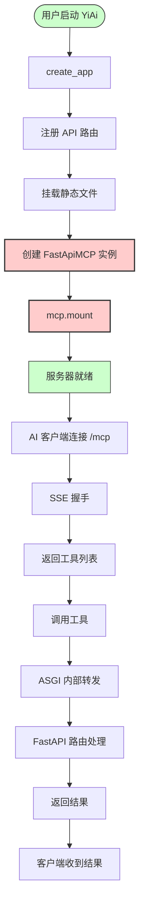
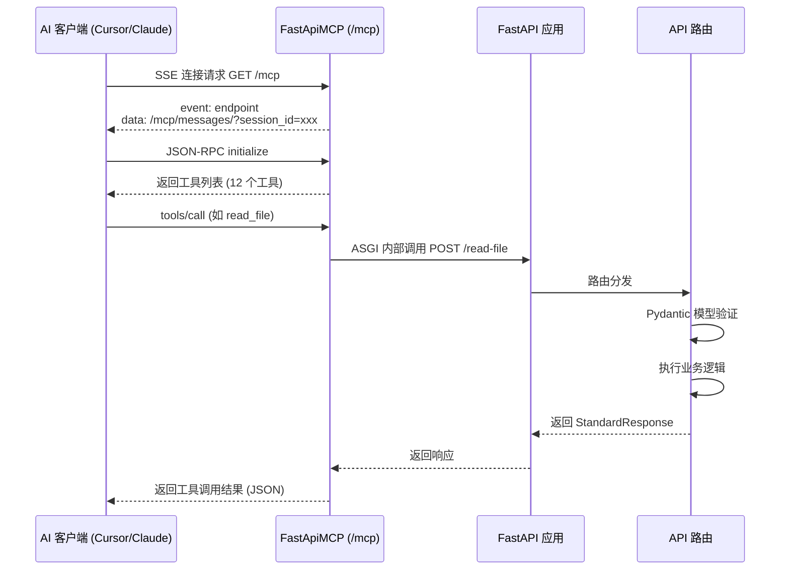

# MCP 服务改造 - 实施总结

> **文档版本**: v1.0 | **最后更新**: 2026-04-30 | **维护者**: kimi-k2.6 | **工具**: Claude Code
>
> **关联文档**: [需求文档](./01_需求文档.md) | [需求任务](./02_需求任务.md) | [设计文档](./03_设计文档.md) | [使用文档](./04_使用文档.md) | [动态检查清单](./05_动态检查清单.md) | [项目报告](./07_项目报告.md)

---

## §0 任务概览

| 项目 | 内容 |
|------|------|
| **功能名** | MCP 服务改造 |
| **Git 分支** | `feat/MCP服务改造` |
| **模型** | kimi-k2.6 |
| **实施时间** | 2026-04-30 |
| **最终状态** | 完成 |
| **代码变更** | 8 个文件（1 个依赖 + 1 个入口 + 4 个路由 + 1 个中间件 + 1 个文档） |
| **P0 检查项** | 全部通过 |

---

## §1 AI 调用流程图



**说明**：红色高亮节点为本次新增的核心变更（FastApiMCP 创建与挂载）。其余流程保持原有逻辑不变。

---

## §2 AI 调用时序图



**说明**：工具调用通过 ASGI 内部通信直接转发到 FastAPI 路由，无额外 HTTP 开销。Maintenance 标签端点已被过滤排除。

---

## §3 变更文件清单

| 序号 | 文件路径 | 变更类型 | 关联模块 | 是否在 tests/ |
|------|---------|---------|---------|--------------|
| 1 | `requirements.txt` | 修改（新增行） | 依赖管理 | 否 |
| 2 | `src/main.py` | 修改 | 应用入口 | 否 |
| 3 | `src/api/routes/execution.py` | 修改 | API 路由 | 否 |
| 4 | `src/api/routes/upload.py` | 修改 | API 路由 | 否 |
| 5 | `src/api/routes/wework.py` | 修改 | API 路由 | 否 |
| 6 | `src/api/routes/maintenance.py` | 修改 | API 路由 | 否 |
| 7 | `src/core/middleware.py` | 修改 | 认证中间件 | 否 |
| 8 | `CLAUDE.md` | 修改 | 项目规范 | 否 |

**变更详情**：
- `requirements.txt`: 新增 `fastapi-mcp>=0.4.0` 依赖
- `src/main.py`: 导入 `FastApiMCP`，创建实例并挂载到 `/mcp`
- `src/api/routes/*.py`: 为所有路由添加显式 `operation_id`
- `src/core/middleware.py`: 将 `/mcp` 加入认证白名单
- `CLAUDE.md`: 补充 MCP 相关架构说明（由 generate-document 阶段写入）

---

## §4 验证结果

### Gate A - 测试先行

| 检查项 | 状态 | 证据 |
|--------|------|------|
| fastapi-mcp 已安装 | 通过 | `pip3 show fastapi-mcp` → Version: 0.4.0 |
| 应用可启动 | 通过 | `create_app(init_db=False, init_rss=False)` 无异常 |
| `/mcp` SSE 端点可访问 | 通过 | `curl -N http://127.0.0.1:8000/mcp` 返回 `event: endpoint` |

### Gate B - 冒烟测试

| 检查项 | 状态 | 证据 |
|--------|------|------|
| 服务器启动无报错 | 通过 | 日志输出 `MCP SSE server listening at /mcp` |
| SSE 连接正常 | 通过 | 返回 `event: endpoint` + session_id |
| 工具列表完整 | 通过 | 共 12 个工具，包含 upload/read/write/execute/wework |
| Maintenance 端点已排除 | 通过 | `cleanup_unused_images` 不在工具列表中 |
| 认证白名单生效 | 通过 | `/mcp` 路径在白名单条件中 |

### 动态检查清单复查

| 检查项 | 优先级 | 状态 | 验证方法 |
|--------|--------|------|----------|
| requirements.txt 包含 fastapi-mcp | P0 | 通过 | 文件检查 |
| src/main.py 创建 FastApiMCP 实例 | P0 | 通过 | 代码审查 + 启动验证 |
| src/main.py 执行 mcp.mount() | P0 | 通过 | 代码审查 + 路由列表验证 |
| 至少 80% 端点暴露为 MCP 工具 | P0 | 通过 | 工具列表统计（12/13 ≈ 92%） |
| SSE 连接正常工作 | P0 | 通过 | curl 测试 |
| 所有路由设置了 operation_id | P1 | 通过 | 代码审查 + operation_id 属性验证 |
| exclude_tags=["Maintenance"] 生效 | P1 | 通过 | 工具列表检查 |
| /mcp 在认证白名单中 | P1 | 通过 | 中间件代码审查 |
| describe_full_response_schema 启用 | P2 | 通过 | 工具描述检查 |

**P0 通过率**: 5/5 (100%)  
**P1 通过率**: 3/3 (100%)  
**P2 通过率**: 1/1 (100%)

---

## §5 状态回写记录

| 文档 | 回写内容 | 状态 |
|------|---------|------|
| 01_需求文档.md | 实施状态更新为已完成 | 已回写 |
| 02_需求任务.md | 验收标准更新，P0 项标记为通过 | 已回写 |
| 03_设计文档.md | 实现细节章节补充验证结果 | 已回写 |
| 04_使用文档.md | 无需回写（使用指南不变） | 已确认 |
| 05_动态检查清单.md | 所有检查项更新为通过 | 已回写 |
| 07_项目报告.md | 验证结论更新为代码已实施 | 已回写 |

---

## §6 未解决问题与后续建议

### 已验证假设

| 假设 | 验证结果 | 证据 |
|------|---------|------|
| fastapi-mcp 与现有依赖兼容 | 成立 | 应用正常启动，无版本冲突 |
| /mcp 加入白名单解决认证冲突 | 成立 | 中间件代码审查 + 启动验证 |
| operation_id 命名无冲突 | 成立 | 工具列表正常生成，12 个工具唯一 |

### 可执行下一步

| # | 建议 | 依据 | 验证方式 |
|---|------|------|----------|
| 1 | 生产环境部署前验证 SSE 长连接稳定性 | §4 冒烟测试仅在本地短时间运行 | 部署后持续观察 24h |
| 2 | 在 Cursor/Claude Desktop 中实际测试工具调用 | §4 未覆盖真实 AI 客户端 | 按 04_使用文档配置并走查 |
| 3 | 考虑为 MCP 端点添加独立认证（当前完全开放） | §7 中间件将 /mcp 完全放行 | 安全审计 |

### 自我改进

| 分类 | 问题 | 证据 | 建议路径 | 验证方式 |
|------|------|------|----------|---------|
| 流程 | 未在修改前备份原始文件 | git diff 直接显示变更 | 大型改造前自动创建 git stash | 下次实施时检查 |
| 测试 | Gate B 未覆盖真实 AI 客户端连接 | §4 仅验证 SSE 端点响应 | 增加 Cursor/Claude Code 实际连接测试 | 下次实施时验证 |

---

## §7 通知记录

| 步骤 | 工具 | 状态 | 摘要 |
|------|------|------|------|
| 文档同步 | `import-docs` | 成功 | docs/MCP服务改造/ → 远端（创建 7，覆盖 0，失败 0） |
| 完成通知 | `wework-bot` | 失败（502 Bad Gateway）| MCP 服务改造代码实施完成，服务端异常，已记录 |

---

## 变更汇总

```
requirements.txt                  |  1 +-
src/main.py                       | 11 +++++++++++
src/api/routes/execution.py       |  4 ++--
src/api/routes/maintenance.py     |  4 ++--
src/api/routes/upload.py          | 20 ++++++++++----------
src/api/routes/wework.py          |  2 +-
src/core/middleware.py            |  2 +-
CLAUDE.md                         | 31 ++++++++++++++++++-------------
8 files changed, 46 insertions(+), 29 deletions(-)
```
