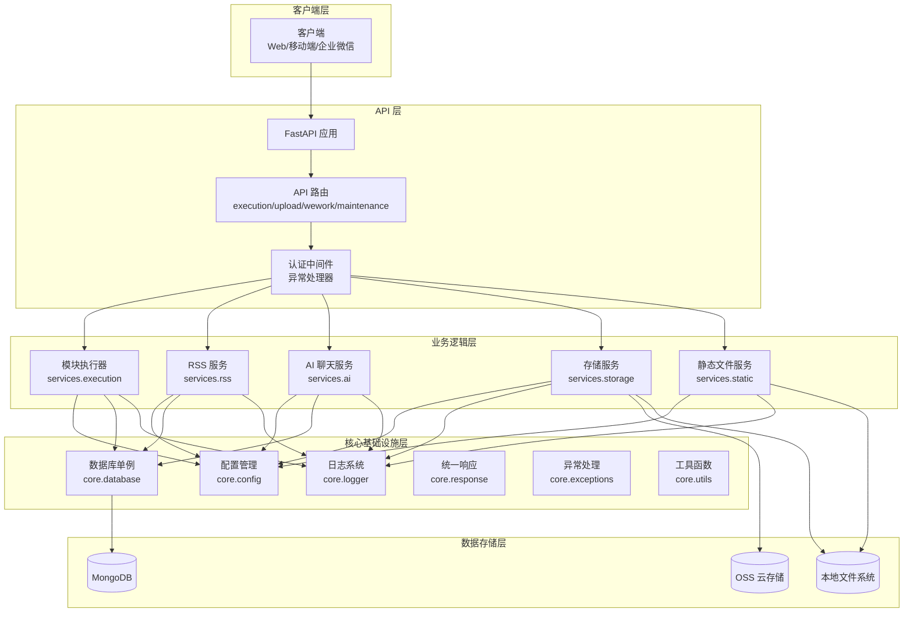
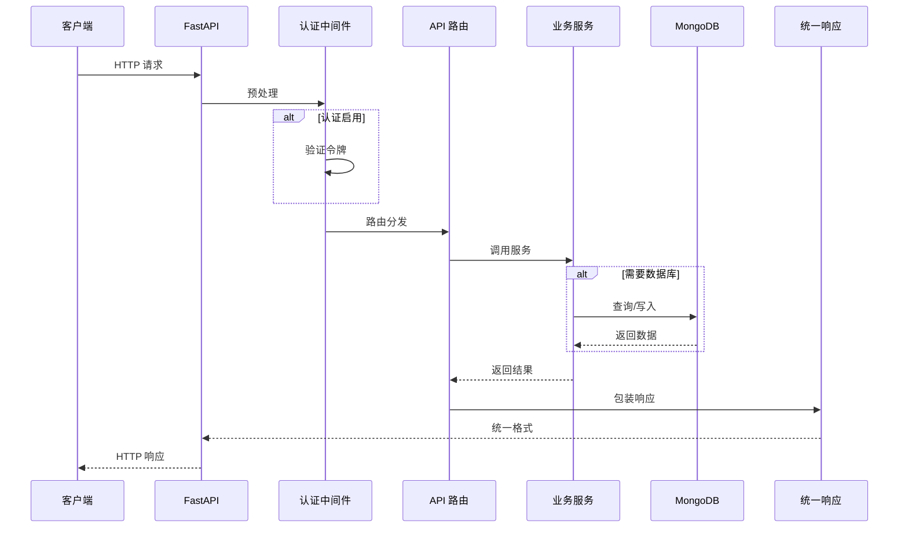
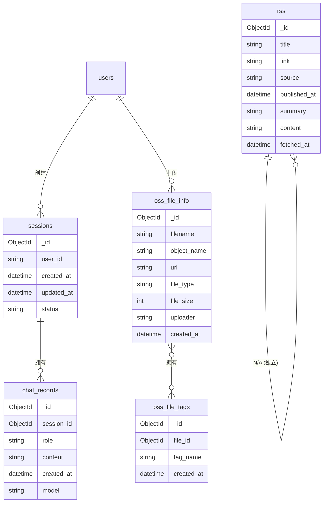

# YiAi 项目文档

[配置指南](#-配置指南) | [核心功能](#-核心功能) | [架构设计](#-架构设计) | [数据库集合](#-数据库集合) | [API 端点](#-api-端点) | [项目结构](#-项目结构) | [开发规范](#-开发规范)

---

## ⚙️ 配置指南

YiAi 支持 **YAML 配置文件** 和 **环境变量** 两种配置方式。主要配置文件为项目根目录下的 `config.yaml`，所有配置项都可以通过环境变量覆盖（大写、蛇形命名，如 `SERVER_HOST`）。

### 主要配置项

| 类别 | 配置项 | 默认值 | 说明 |
|------|--------|--------|------|
| 🚀 服务器 | `server.host` | `"0.0.0.0"` | 监听地址 |
| | `server.port` | `8000` | 监听端口 |
| 💾 数据库 | `mongodb.url` | `"mongodb://localhost:27017"` | MongoDB 连接字符串 |
| | `mongodb.db_name` | `"ruiyi"` | 数据库名称 |
| ☁️ OSS 存储 | `oss.access_key` | `""` | 阿里云 OSS AccessKey |
| | `oss.secret_key` | `""` | 阿里云 OSS SecretKey |
| | `oss.bucket` | `""` | OSS 存储空间名称 |
| 📰 RSS | `rss.scheduler_enabled` | `true` | 是否启用 RSS 调度器 |
| | `rss.scheduler_interval` | `3600` | 抓取间隔（秒） |
| 🤖 Ollama | `ollama.url` | `"http://localhost:11434"` | Ollama 服务地址 |
| 🔐 认证 | `middleware.auth_enabled` | `false` | 是否启用令牌认证 |
| | `middleware.auth_token` | `""` | 认证令牌 |
| 📦 模块执行 | `module.allowlist` | `["*"]` | 允许执行的模块白名单 |

**配置示例：**
```yaml
server:
  host: "127.0.0.1"
  port: 8000

mongodb:
  url: "mongodb://localhost:27017"
  db_name: "yiai"

middleware:
  auth_enabled: true
  auth_token: "your-secret-token"
```

详细配置说明请参考 [配置指南](./配置指南.md)。

---

## ✨ 核心功能

<table>
  <thead>
    <tr>
      <th>功能分类</th>
      <th>功能名称</th>
      <th>功能说明</th>
    </tr>
  </thead>
  <tbody>
    <tr>
      <td rowspan="2">🤖 AI 聊天</td>
      <td>多轮对话</td>
      <td>集成 Ollama 本地 AI 模型，支持上下文感知的多轮对话</td>
    </tr>
    <tr>
      <td>历史记录</td>
      <td>自动保存聊天会话和消息记录，支持随时回溯</td>
    </tr>
    <tr>
      <td rowspan="2">📰 RSS 管理</td>
      <td>定时抓取</td>
      <td>基于 APScheduler 的自动定时 RSS 源内容抓取</td>
    </tr>
    <tr>
      <td>多源管理</td>
      <td>支持配置多个 RSS 源，统一存储和管理文章内容</td>
    </tr>
    <tr>
      <td rowspan="3">📤 文件存储</td>
      <td>双重存储</td>
      <td>支持阿里云 OSS 和本地静态文件存储两种方案，自动 fallback</td>
    </tr>
    <tr>
      <td>文件管理</td>
      <td>提供文件上传、读取、写入、删除、重命名等完整操作</td>
    </tr>
    <tr>
      <td>图片清理</td>
      <td>自动扫描并清理未被引用的图片文件，释放存储空间</td>
    </tr>
    <tr>
      <td rowspan="3">⚡ 动态执行</td>
      <td>模块执行引擎</td>
      <td>通过 REST API 动态执行 Python 模块方法，支持同步/异步函数</td>
    </tr>
    <tr>
      <td>SSE 流式传输</td>
      <td>为生成器函数提供 Server-Sent Events 流式响应</td>
    </tr>
    <tr>
      <td>白名单控制</td>
      <td>通过配置白名单限制可执行的模块，确保安全性</td>
    </tr>
    <tr>
      <td rowspan="2">🛡️ 安全认证</td>
      <td>令牌认证</td>
      <td>可选的 X-Token 认证中间件，保护 API 端点</td>
    </tr>
    <tr>
      <td>异常处理</td>
      <td>统一的异常处理机制，标准化错误响应格式</td>
    </tr>
    <tr>
      <td>🏢 企业集成</td>
      <td>企业微信</td>
      <td>支持通过 Webhook 发送消息到企业微信群聊</td>
    </tr>
  </tbody>
</table>

---

## 🏗️ 架构设计

### 系统分层架构



### 请求处理流程



### 架构特点

- **分层架构** - API 层、业务逻辑层、核心基础设施层、数据模型层
- **模块执行引擎** - 灵活的动态扩展机制
- **配置系统** - YAML + 环境变量的灵活配置
- **数据库单例** - MongoDB 异步连接管理
- **双重存储** - OSS + 本地存储自动 fallback

详细的架构设计请参考 [架构设计](./架构设计.md)。

---

## 📊 数据库集合

YiAi 使用 MongoDB 存储各类业务数据，包括用户会话、RSS 文章、聊天记录、文件信息等。

### 数据模型关系



**主要集合：**
- **sessions** - 用户会话数据
- **rss** - RSS 源文章内容
- **chat_records** - AI 聊天历史记录
- **oss_file_info** - 文件元数据信息
- **oss_file_tags** - 文件标签分类

详细的数据库集合说明请参考 [数据库集合](./数据库集合.md)。

---

## 🌐 API 端点

YiAi 提供丰富的 REST API 端点，涵盖模块执行、文件管理、企业微信集成和系统维护等功能。

### ⚡ 执行模块 API

| 方法 | 路径 | 描述 |
|------|------|------|
| GET | `/execution` | 通过 URL 查询参数执行模块方法 |
| POST | `/execution` | 通过 JSON 请求体执行模块方法 |

**功能特点**：
- 支持同步/异步函数、生成器、异步生成器
- 自动 SSE 流式传输（生成器函数）
- 白名单安全控制机制
- 支持字典或 JSON 字符串参数

### 📤 文件上传与管理 API

| 方法 | 路径 | 描述 |
|------|------|------|
| POST | `/upload` | 通用文件上传（JSON 方式） |
| POST | `/upload-image-to-oss` | 图片上传到 OSS（支持本地 fallback） |
| POST | `/read-file` | 读取文件内容 |
| POST | `/write-file` | 写入文件 |
| POST | `/delete-file` | 删除文件 |
| POST | `/delete-folder` | 删除文件夹 |
| POST | `/rename-file` | 重命名文件 |
| POST | `/rename-folder` | 重命名文件夹 |

**功能特点**：
- 双重存储：AliCloud OSS + 本地静态存储自动 fallback
- 支持图片、文档等多种文件类型
- Base64 编码上传支持
- 路径安全防护（防路径遍历）

### 🏢 企业微信 API

| 方法 | 路径 | 描述 |
|------|------|------|
| POST | `/wework/send-message` | 发送消息到企业微信机器人 |

**功能特点**：
- Webhook 集成
- 格式验证
- 超时控制
- 完善的错误处理

### 🔧 维护工具 API

| 方法 | 路径 | 描述 |
|------|------|------|
| POST | `/cleanup-unused-images` | 清理未引用的图片 |

**功能特点**：
- 扫描静态图片文件
- 检测数据库引用关系
- Dry-run 预览模式
- 可清理无效会话数据
- 空间释放统计

---

**认证说明**：
- 请求头：`X-Token: <your-token>`
- 可通过 `middleware.auth_enabled` 配置启用/禁用

**统一响应格式**：
```json
{
  "code": 0,
  "data": {...},
  "msg": "success"
}
```

完整的 API 端点文档请参考 [API端点](./API端点.md)。

---

## 📂 项目结构

规范的目录结构是项目可维护性的基础，本文档定义了 YiAi 项目的标准目录结构和各模块的职责分工。

- **整体结构** - 项目根目录、文档目录、源代码目录的组织方式
- **分层架构** - API 层、核心基础设施层、数据模型层、业务逻辑层
- **新增模块规范** - 添加新 API 端点和新服务的标准流程

详细的项目结构说明请参考 [项目结构](./项目结构.md)。

---

## 📖 开发规范

所有开发者在贡献代码前请仔细阅读开发规范：

| 分类 | 文档 | 说明 |
|------|------|------|
| 基础规范 | [编码规范](./开发规范/编码规范.md) | Python 代码编写规范 |
| | [样式规范](./开发规范/样式规范.md) | 代码样式规范 |
| | [文档规范](./开发规范/文档规范.md) | 文档编写规范 |
| 核心规范 | [组件规范](./开发规范/组件规范.md) | 组件设计和开发规范 |
| | [API规范](./开发规范/API规范.md) | API 设计和开发规范 |
| | [路由规范](./开发规范/路由规范.md) | 路由设计规范 |
| | [状态管理](./开发规范/状态管理.md) | 状态管理规范 |
| 数据与安全 | [数据库规范](./开发规范/数据库规范.md) | MongoDB 数据库使用规范 |
| | [安全规范](./开发规范/安全规范.md) | 安全开发规范 |
| | [日志规范](./开发规范/日志规范.md) | 日志使用规范 |
| | [错误处理规范](./开发规范/错误处理规范.md) | 错误处理规范 |
| 通用约束 | [通用约束](./开发规范/通用约束.md) | 通用开发约束 |
| | [测试规范](./开发规范/测试规范.md) | 测试编写规范 |
| 流程与部署 | [Git提交规范](./开发规范/Git提交规范.md) | Git 提交和分支管理规范 |
| | [部署规范](./开发规范/部署规范.md) | 应用部署和运维规范 |

完整的开发规范请参考 [开发规范](./开发规范/README.md)。

---

## 🔧 故障排除

| 问题 | 可能原因 | 解决方案 |
|------|---------|---------|
| 🚫 服务器启动失败，提示 "ModuleNotFoundError" | 依赖包未正确安装 | 运行 `pip install -r requirements.txt` 重新安装依赖 |
| ⏱️ MongoDB 连接超时 | MongoDB 服务未启动或连接地址错误 | 确认 `mongodb.url` 配置正确，检查 MongoDB 服务状态 |
| 🤖 Ollama 请求失败 | Ollama 服务未运行或地址配置错误 | 确认 `ollama.url` 配置正确，检查 Ollama 服务是否在运行 |
| 📤 文件上传到 OSS 失败 | OSS 配置不正确或网络问题 | 检查 `oss.access_key`、`oss.secret_key`、`oss.bucket` 等配置，确认网络连接正常 |
| 📰 RSS 定时任务不执行 | RSS 调度器未启用 | 确认 `rss.scheduler_enabled` 设置为 `true` |
| 🔐 API 返回 401 未授权 | 认证中间件已启用但未提供令牌 | 在请求头中添加 `X-Token: <your-token>`，或临时禁用 `middleware.auth_enabled` |
| ⚡ 动态模块执行提示 "not in allowlist" | 模块未在白名单中 | 在 `module.allowlist` 中添加所需模块，或使用 `["*"]` 允许所有模块 |
| 📁 静态文件无法访问 | 静态文件目录配置错误 | 检查 `static.base_dir` 路径是否存在且有正确的权限 |

---

## 📝 更新日志

记录项目的版本历史和重要变更，包括新功能、改进和修复。

详细的更新日志请参考 [更新日志](./更新日志.md)。
