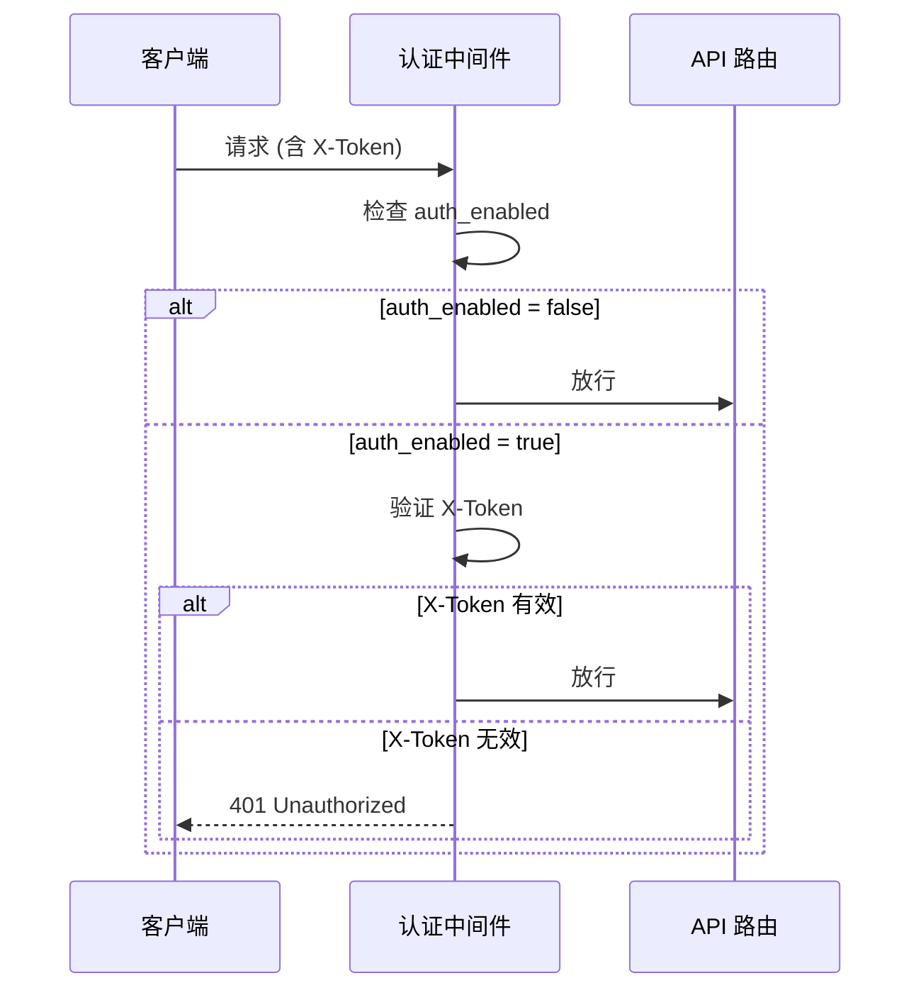
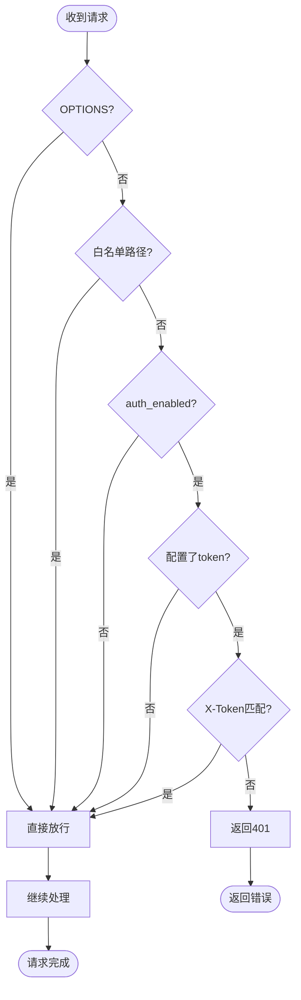

# Auth 文档

> 认证鉴权方案

---

## 认证架构

YiAi 采用简单的基于请求头的令牌认证方案：

- 认证中间件：`core.middleware.header_verification_middleware`
- 认证方式：请求头 `X-Token`
- 令牌来源：`API_X_TOKEN` 环境变量 或 `middleware.auth_token` 配置
- 开关控制：`middleware.auth_enabled`

## 认证流程

## 鉴权流程

## 权限层级

| 层级 | 控制点 | 说明 |
|------|--------|------|
| 路由级 | `middleware.py` 白名单 | `/write-file`, `/read-file`, `/delete-file`, `/upload`, `/static/*`, `/mcp*` 跳过认证 |
| API 级 | `module.allowlist` | 动态模块执行的白名单控制 |
| API 级 | `X-Token` 认证 | `/state/records`, `/health/observer`, `/execution`, `/wework/send-message` 等需认证 |
| 数据级 | 暂无 | 当前无用户级数据隔离 |

## Token 管理

### 配置方式

1. **环境变量（推荐）**：`export API_X_TOKEN=your-secure-token`
2. **配置文件**：`config.yaml` 中 `middleware.auth_token`

### 优先级

环境变量 `API_X_TOKEN` > `config.yaml` 中 `middleware.auth_token`

## 自检规则

| 检查项 | 检查方法 | 不通过后果 |
|--------|---------|-----------|
| 生产环境 auth_enabled | 检查 `config.yaml` | 未启用则存在未授权访问风险 |
| 令牌已配置 | 检查 `API_X_TOKEN` 或 `middleware.auth_token` | 未配置则认证形同虚设 |
| 令牌强度 | 人工检查令牌长度和随机性 | 弱令牌易被暴力破解 |
| 白名单合理性 | 审查白名单路径 | 过度放行导致安全漏洞 |

## 无认证场景

- 开发环境可禁用认证：`middleware.auth_enabled: false`
- 白名单路径（文件操作和静态资源）默认无需认证
