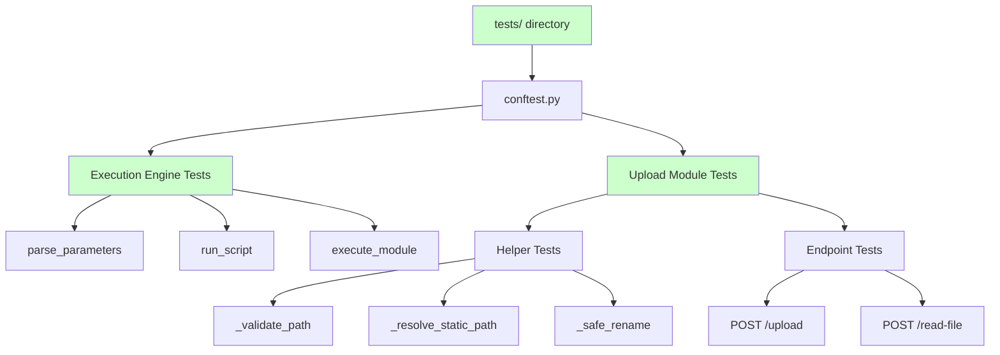
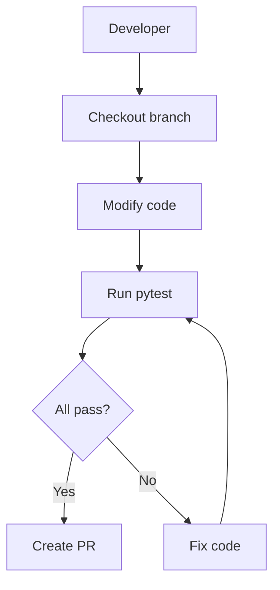
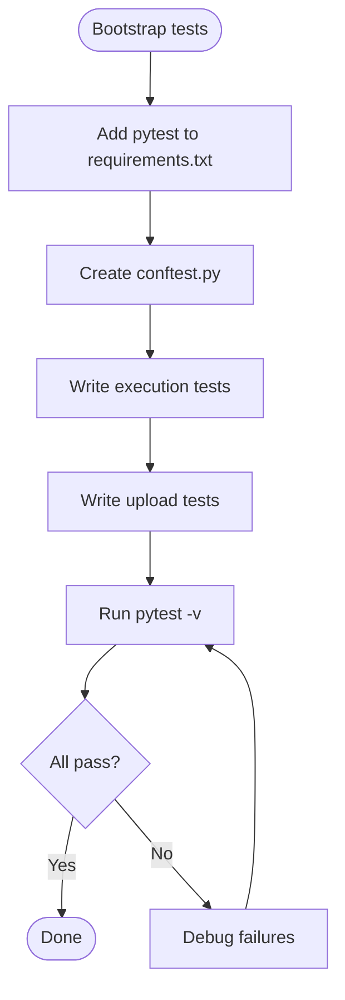
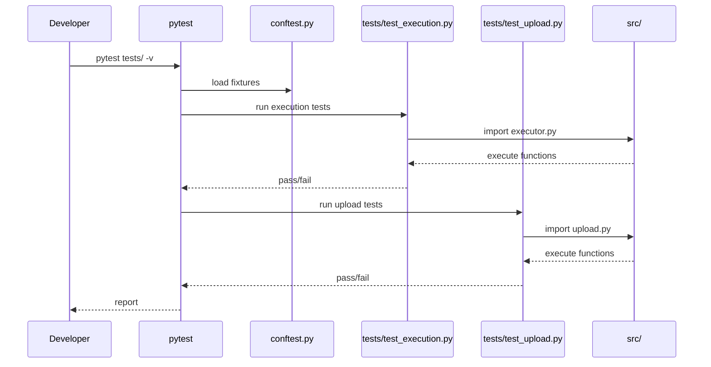

# core-unit-tests — Requirement Tasks

> **Document Version**: v1.0 | **Last Updated**: 2026-05-02 | **Maintainer**: kimi-k2.6
>
> **Related Documents**: [Requirement Document](./01_requirement-document.md) | [Design Document](./03_design-document.md) | [Usage Document](./04_usage-document.md)

[Feature Overview](#feature-overview) | [Feature Analysis](#feature-analysis) | [Feature Details](#feature-details) | [Acceptance Criteria](#acceptance-criteria) | [Usage Scenario Examples](#usage-scenario-examples)

---

## Feature Overview

YiAi lacks any automated testing infrastructure. This feature bootstraps `tests/`, adds pytest dependencies, and writes unit tests for the two most critical modules: the execution engine (`executor.py`) and the upload router (`upload.py`). The execution engine is the project's primary extensibility mechanism; the upload module handles file system operations that require strict path traversal guards. Establishing tests for these modules first provides the highest risk-reduction value.

- 🎯 **Goal**: `pytest tests/ -v` passes with core coverage
- ⚡ **Impact**: Regressions in execution and upload caught before merge
- 📖 **Clarity**: Tests document expected behavior for edge cases

---

## Feature Analysis

### Feature Decomposition Diagram

### User Flow Diagram

### Feature Flow Diagram

### Sequence Diagram

---

## User Story Table

| Priority | User Story | Main Operation Scenarios |
|----------|------------|-------------------------|
| 🔴 P0 | As a developer, I want a tests/ directory with core unit tests for the execution engine and upload module, so that code quality and maintainability are improved and regressions are caught early. | 1. Developer runs pytest and all core tests pass 2. Execution engine whitelist, parameter parsing, and async invocation are tested 3. Upload module path validation, file operations, and endpoints are tested |

---

## Main Operation Scenario Definitions

### Scenario 1: Developer runs pytest and all core tests pass

- **Scenario description**: A developer checks out the project and runs the test suite.
- **Pre-conditions**: `requirements.txt` installed; `tests/` directory exists.
- **Operation steps**:
  1. Run `pytest tests/ -v`
  2. Observe test discovery and execution
  3. Review pass/fail summary
- **Expected result**: All tests pass; no import errors; test count > 0.
- **Verification focus points**: pytest discovers tests; fixtures load correctly; no environment dependency failures.
- **Related design document chapters**: [Architecture Design](./03_design-document.md#architecture-design)

### Scenario 2: Execution engine tests cover core logic

- **Scenario description**: `executor.py` functions are tested in isolation.
- **Pre-conditions**: `tests/test_execution.py` exists; `executor.py` importable.
- **Operation steps**:
  1. Run `pytest tests/test_execution.py -v`
  2. Verify `parse_parameters` tests (dict, JSON string, invalid JSON, non-dict)
  3. Verify `execute_module` tests (whitelist, async, sync, generator, errors)
  4. Verify `run_script` tests (success, failure, timeout)
- **Expected result**: All execution tests pass; edge cases covered.
- **Verification focus points**: Whitelist enforcement blocks forbidden modules; async functions are awaited; generators return generators.
- **Related design document chapters**: [Implementation Details](./03_design-document.md#implementation-details)

### Scenario 3: Upload module tests cover path safety and endpoints

- **Scenario description**: `upload.py` helpers and endpoints are tested.
- **Pre-conditions**: `tests/test_upload.py` exists; FastAPI `TestClient` available.
- **Operation steps**:
  1. Run `pytest tests/test_upload.py -v`
  2. Verify helper tests (path validation, resolution, safe rename)
  3. Verify endpoint tests with `TestClient` (valid/invalid inputs)
- **Expected result**: All upload tests pass; path traversal attempts rejected.
- **Verification focus points**: `_validate_path` raises on `..` and leading `/`; `_resolve_static_path` stays within base_dir; endpoints return correct status codes.
- **Related design document chapters**: [Implementation Details](./03_design-document.md#implementation-details)

---

## Impact Analysis

### 1. Search Terms and Change Point List

| Search Term | Matched File | Line | Context | Change Required |
|-------------|--------------|------|---------|-----------------|
| `tests/` | `tests/` | N/A | Directory does not exist | Create directory |
| `requirements.txt` | `requirements.txt` | 1-20 | Python dependencies | Add pytest, pytest-asyncio, httpx |
| `executor.py` | `src/services/execution/executor.py` | 1-146 | Execution engine | Reference for test targets; no code change |
| `upload.py` | `src/api/routes/upload.py` | 1-200+ | Upload router | Reference for test targets; no code change |
| `create_app` | `src/main.py` | 1-59 | App factory | Reference for TestClient setup |
| `settings` | `src/core/config.py` | 1-59 | Pydantic Settings | May need test overrides |
| `module_allowlist` | `src/core/config.py` | 1-59 | Execution whitelist | Must be set for executor tests |
| `static_base_dir` | `src/core/config.py` | 1-59 | Static file path | Must be set for upload tests |

### 2. Change Point Impact Chain

| Change Point | Direct Impact | Transitive Impact | Disposition |
|--------------|---------------|-------------------|-------------|
| Create `tests/` | New directory in repo | All future tests have a home | Create directory |
| Add pytest deps | `requirements.txt` grows | Installation time increases slightly | Append to requirements.txt |
| Test `executor.py` | May reveal latent bugs | Fixes improve production reliability | Write tests; fix any bugs found |
| Test `upload.py` | May reveal latent bugs | Fixes improve production security | Write tests; fix any bugs found |

### 3. Dependency Closure Summary

- **Upstream**: `src/` modules are the test targets; no upstream changes needed.
- **Downstream**: CI pipelines (when added) will depend on `tests/`.
- **Cross-cutting**: No production runtime changes.

### 4. Uncovered Risks

| Risk | Likelihood | Impact | Mitigation |
|------|------------|--------|------------|
| Tests fail on different OS due to path separators | Medium | Low | Use `os.path` and `pathlib` in tests |
| `settings` singleton causes test isolation issues | Medium | Medium | Monkeypatch settings or use env vars in conftest |
| MongoDB lifespan prevents TestClient initialization | Low | Medium | Use `create_app(init_db=False)` in tests |

**Change scope summary**: directly modify 2 / verify compatibility 4 / trace transitive 2 / need manual review 0.

---

## Feature Details

### tests/ Directory Bootstrap

- **Feature description**: Create `tests/` with `__init__.py` and `conftest.py` containing shared fixtures.
- **Value**: Standard pytest project structure.
- **Pain point solved**: No place to put tests.

### Execution Engine Tests

- **Feature description**: Unit tests for `parse_parameters`, `run_script`, `execute_module`.
- **Value**: Validates dynamic execution safety net.
- **Pain point solved**: Whitelist bypass or parameter injection could be catastrophic.

### Upload Module Tests

- **Feature description**: Unit tests for helpers and endpoint tests with `TestClient`.
- **Value**: Validates path safety and file operation correctness.
- **Pain point solved**: Path traversal is a critical security concern.

---

## Acceptance Criteria

### P0 — Core

1. `tests/` directory created with `conftest.py`
2. `pytest` and `pytest-asyncio` added to `requirements.txt`
3. `parse_parameters` unit tests cover all branches
4. `execute_module` unit tests cover whitelist, async/sync/generator, and errors
5. Upload helper unit tests cover path validation, resolution, and safe rename
6. `pytest tests/ -v` runs successfully and all new tests pass

### P1 — Important

7. Upload endpoints tested with `TestClient`
8. `run_script` tested with success, failure, and timeout paths
9. Test settings monkeypatch for isolated execution

### P2 — Nice-to-have

10. Coverage report generated
11. CI configuration for push-triggered tests

---

## Usage Scenario Examples

### Scenario 1: Developer runs pytest after changes

- **Background**: Developer modifies whitelist logic.
- **Operation**: Runs `pytest tests/ -v`.
- **Result**: All tests pass.
- 📋 **Verification**: Console shows green output.
- 🎨 **UX**: Developer confident in change safety.

### Scenario 2: Path traversal attempt is caught

- **Background**: Malicious input with `../etc/passwd`.
- **Operation**: Upload endpoint test with malicious path.
- **Result**: Test asserts `BusinessException` with correct error code.
- 📋 **Verification**: `test_validate_path_traversal` passes.
- 🎨 **UX**: Security behavior is executable and verifiable.

### Scenario 3: New feature adds test coverage

- **Background**: Team adds endpoint.
- **Operation**: Developer writes test following existing patterns.
- **Result**: PR includes test; review verifies.
- 📋 **Verification**: New test passes in CI.
- 🎨 **UX**: Clear pattern for extending test suite.

## Postscript: Future Planning & Improvements

- Add integration tests for MongoDB interactions using `mongomock`.
- Add async endpoint tests for SSE streaming in `execution.py`.
