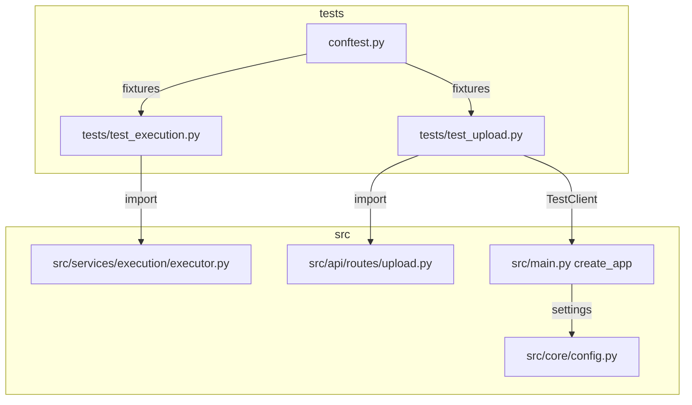
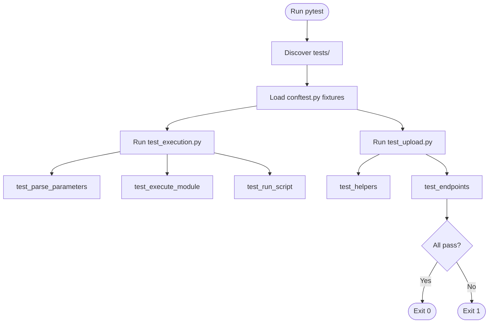
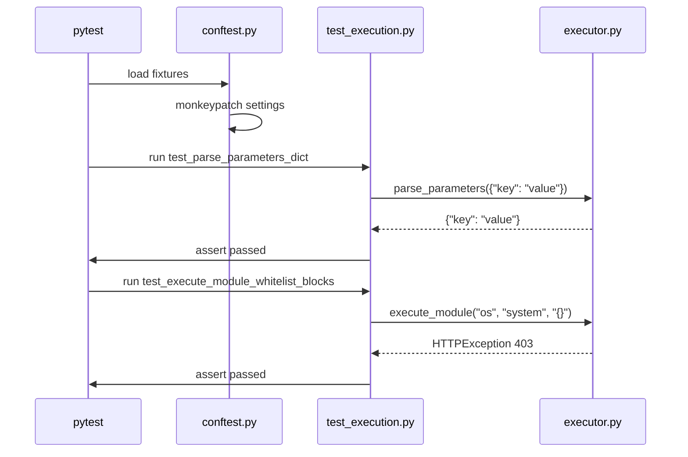

# core-unit-tests — Design Document

> **Document Version**: v1.0 | **Last Updated**: 2026-05-02 | **Maintainer**: kimi-k2.6
>
> **Related Documents**: [Requirement Document](./01_requirement-document.md) | [Requirement Tasks](./02_requirement-tasks.md) | [Usage Document](./04_usage-document.md)

[Design Overview](#design-overview) | [Architecture Design](#architecture-design) | [Changes](#changes) | [Implementation Details](#implementation-details) | [Impact Analysis](#impact-analysis)

---

## Design Overview

This design bootstraps a pytest-based test suite for YiAi, focusing on the two highest-risk modules: the execution engine (`executor.py`) and the upload router (`upload.py`). The test architecture uses FastAPI's `TestClient` for endpoint tests, `pytest-asyncio` for async function tests, and monkeypatching for configuration isolation. No changes to production code are required unless tests reveal latent bugs.

- 🎯 **Principle**: Test behavior, not implementation. Assert on outputs and side effects, not internal state.
- ⚡ **Principle**: Fast and isolated. Tests should run in < 10 seconds and not depend on external services.
- 🔧 **Principle**: Minimal fixtures. Only create fixtures that are genuinely shared across multiple tests.

---

## Architecture Design

### Overall Architecture



### Module Division

| Module Name | Responsibility | Location |
|-------------|---------------|----------|
| `conftest.py` | Shared fixtures: app client, temp directory, mocked settings | `tests/conftest.py` |
| `test_execution.py` | Unit tests for `parse_parameters`, `run_script`, `execute_module` | `tests/test_execution.py` |
| `test_upload.py` | Unit tests for upload helpers and endpoint tests with `TestClient` | `tests/test_upload.py` |

### Core Flow



---

## Changes

### Problem Analysis

YiAi has zero automated tests. The `tests/` directory does not exist, `requirements.txt` lacks `pytest`, and core functions like `execute_module` (which dynamically imports and runs arbitrary modules) and `_resolve_static_path` (which guards against directory traversal) are verified only by manual code review.

### Solution

1. **Create `tests/`**: `conftest.py` with fixtures for app factory (`create_app(init_db=False, enable_auth=False)`), temp directory, and mocked `settings`.
2. **Add dependencies**: `pytest>=8.0`, `pytest-asyncio>=0.23`, `httpx>=0.27` to `requirements.txt`.
3. **Write `test_execution.py`**:
   - `test_parse_parameters_dict`
   - `test_parse_parameters_json_string`
   - `test_parse_parameters_invalid_json`
   - `test_parse_parameters_non_dict`
   - `test_execute_module_whitelist_blocks`
   - `test_execute_module_whitelist_allows`
   - `test_execute_module_wildcard`
   - `test_execute_module_async`
   - `test_execute_module_sync`
   - `test_execute_module_generator`
   - `test_execute_module_import_error`
   - `test_execute_module_runtime_error`
4. **Write `test_upload.py`**:
   - `test_is_image_file`
   - `test_normalize_no_spaces`
   - `test_validate_path_traversal`
   - `test_validate_path_leading_slash`
   - `test_resolve_static_path_traversal`
   - `test_safe_rename_type_mismatch`
   - `test_upload_endpoint_valid`
   - `test_read_file_not_found`

### Before/After Comparison

| Aspect | Before | After |
|--------|--------|-------|
| Test directory | None | `tests/` with `conftest.py` and test modules |
| Test dependencies | None | `pytest`, `pytest-asyncio`, `httpx` |
| Execution engine coverage | 0% | Core functions covered |
| Upload module coverage | 0% | Helpers and endpoints covered |
| CI readiness | None | `pytest tests/ -v` is runnable |

---

## Impact Analysis

### 1. Search Terms and Change Point List

| Search Term | Matched File | Line | Context | Change Required |
|-------------|--------------|------|---------|-----------------|
| `tests/` | N/A | N/A | Directory missing | Create `tests/` |
| `requirements.txt` | `requirements.txt` | 1-20 | Dependencies | Append pytest, pytest-asyncio, httpx |
| `executor.py` | `src/services/execution/executor.py` | 1-146 | Execution engine | No code change; test target |
| `upload.py` | `src/api/routes/upload.py` | 1-200+ | Upload router | No code change; test target |
| `create_app` | `src/main.py` | 1-59 | App factory | No code change; used by TestClient |
| `settings` | `src/core/config.py` | 1-59 | Config singleton | Monkeypatch in tests |
| `module_allowlist` | `src/core/config.py` | 1-59 | Execution whitelist | Override in test fixtures |
| `static_base_dir` | `src/core/config.py` | 1-59 | Static path | Override in test fixtures |

### 2. Change Point Impact Chain

| Change Point | Direct Impact | Transitive Impact | Disposition |
|--------------|---------------|-------------------|-------------|
| Create `tests/` | New directory | Future tests have standard location | Create directory |
| Add pytest deps | requirements.txt change | Developers must reinstall dependencies | Append to file |
| Test `executor.py` | May reveal bugs | Production reliability improves | Write tests; fix bugs if found |
| Test `upload.py` | May reveal bugs | Security posture improves | Write tests; fix bugs if found |

### 3. Dependency Closure Summary

- **Upstream**: Production modules are test targets; no upstream changes.
- **Downstream**: CI pipelines (future) will run `pytest tests/ -v`.
- **Cross-cutting**: No runtime or API changes.

### 4. Uncovered Risks

| Risk | Likelihood | Impact | Disposition |
|------|------------|--------|-------------|
| Tests fail on Windows due to path handling | Medium | Low | Use `pathlib` and `os.path` abstractions |
| `settings` singleton leaks between tests | Medium | Medium | Monkeypatch per test or use autouse fixture |
| `run_script` timeout test is flaky | Low | Low | Use very short timeout (0.1s) with simple sleep script |

**Change scope summary**: directly modify 2 / verify compatibility 4 / trace transitive 2 / need manual review 0.

---

## Implementation Details

### Technical Points

**What**: Bootstrap pytest suite with unit tests for execution and upload modules.
**How**: Create `tests/`, add dependencies, write test modules using pytest conventions.
**Why**: Zero test coverage in a project with dynamic code execution and file system operations is high risk.

### Key Code

**tests/conftest.py:**

```python
import os
import pytest
from fastapi.testclient import TestClient
from src.main import create_app
from src.core.config import settings

@pytest.fixture
def client():
    app = create_app(enable_auth=False, init_db=False, init_rss=False)
    return TestClient(app)

@pytest.fixture
def temp_static_dir(tmp_path, monkeypatch):
    monkeypatch.setattr(settings, "static_base_dir", str(tmp_path))
    return tmp_path

@pytest.fixture(autouse=True)
def allow_all_modules(monkeypatch):
    monkeypatch.setattr(
        "src.services.execution.executor.EXEC_ALLOWLIST", {"*"}
    )
```

**tests/test_execution.py:**

```python
import pytest
import json
from fastapi import HTTPException
from src.services.execution.executor import parse_parameters, execute_module

class TestParseParameters:
    def test_dict_input(self):
        assert parse_parameters({"key": "value"}) == {"key": "value"}

    def test_json_string_input(self):
        assert parse_parameters('{"key": "value"}') == {"key": "value"}

    def test_invalid_json(self):
        with pytest.raises(HTTPException) as exc:
            parse_parameters("not json")
        assert exc.value.status_code == 400

    def test_non_dict_json(self):
        with pytest.raises(HTTPException) as exc:
            parse_parameters('["list"]')
        assert exc.value.status_code == 400

class TestExecuteModule:
    async def test_whitelist_blocks(self):
        with pytest.raises(HTTPException) as exc:
            await execute_module("os", "system", "{}")
        assert exc.value.status_code == 403

    async def test_import_error(self):
        with pytest.raises(HTTPException) as exc:
            await execute_module("nonexistent.module", "func", "{}")
        assert exc.value.status_code == 422
```

**tests/test_upload.py:**

```python
import pytest
from src.api.routes.upload import _validate_path, _is_image_file

class TestUploadHelpers:
    def test_is_image_file_png(self):
        assert _is_image_file("photo.png") is True

    def test_is_image_file_txt(self):
        assert _is_image_file("doc.txt") is False

    def test_validate_path_traversal(self):
        from core.exceptions import BusinessException
        with pytest.raises(BusinessException):
            _validate_path("../etc/passwd")

    def test_validate_path_leading_slash(self):
        from core.exceptions import BusinessException
        with pytest.raises(BusinessException):
            _validate_path("/absolute/path")

class TestUploadEndpoints:
    def test_read_file_not_found(self, client):
        response = client.post("/read-file", json={"file_path": "nonexistent.txt"})
        assert response.status_code == 400
```

### Dependencies

- `pytest>=8.0`
- `pytest-asyncio>=0.23`
- `httpx>=0.27` (for FastAPI `TestClient`)

### Testing Considerations

1. Run `pytest tests/ -v` after implementation.
2. Verify tests run in < 10 seconds.
3. Verify no external services (MongoDB, OSS) are required.
4. If latent bugs are found, fix them in separate commits.

---

## Main Operation Scenario Implementation

### Scenario 1: Developer runs pytest and all core tests pass

- **Linked 02 scenario**: [Scenario 1](./02_requirement-tasks.md#scenario-1-developer-runs-pytest-and-all-core-tests-pass)
- **Implementation overview**: pytest discovers and runs tests; fixtures set up isolated environment.
- **Modules and responsibilities**:
  - `conftest.py`: Provides `client`, `temp_static_dir`, `allow_all_modules` fixtures
  - pytest: Discovers and executes tests
- **Key code paths**: `pytest` → `conftest.py` fixture setup → test execution → teardown
- **Verification points**: Exit code 0; all tests green; no warnings about unclosed resources.

### Scenario 2: Execution engine tests cover core logic

- **Linked 02 scenario**: [Scenario 2](./02_requirement-tasks.md#scenario-2-execution-engine-tests-cover-core-logic)
- **Implementation overview**: `test_execution.py` exercises `parse_parameters` and `execute_module`.
- **Modules and responsibilities**:
  - `test_execution.py`: Defines test classes and cases
  - `executor.py`: Test target
- **Key code paths**: `test_parse_parameters_dict` → `parse_parameters` → assertion; `test_execute_module_whitelist_blocks` → `execute_module` → `HTTPException`
- **Verification points**: All branches of `parse_parameters` covered; whitelist enforcement verified; async/sync/generator paths exercised.

### Scenario 3: Upload module tests cover path safety and endpoints

- **Linked 02 scenario**: [Scenario 3](./02_requirement-tasks.md#scenario-3-upload-module-tests-cover-path-safety-and-endpoints)
- **Implementation overview**: `test_upload.py` exercises helpers and endpoints.
- **Modules and responsibilities**:
  - `test_upload.py`: Defines helper and endpoint tests
  - `upload.py`: Test target
- **Key code paths**: `test_validate_path_traversal` → `_validate_path` → `BusinessException`; `test_read_file_not_found` → `TestClient.post` → 400 response
- **Verification points**: Path traversal blocked; leading slash blocked; missing file returns 400.

---

## Data Structure Design

### Test Data Flow



## Postscript: Future Planning & Improvements

- Add `pytest-cov` for coverage reporting.
- Add GitHub Actions workflow for automated test execution on PR.
