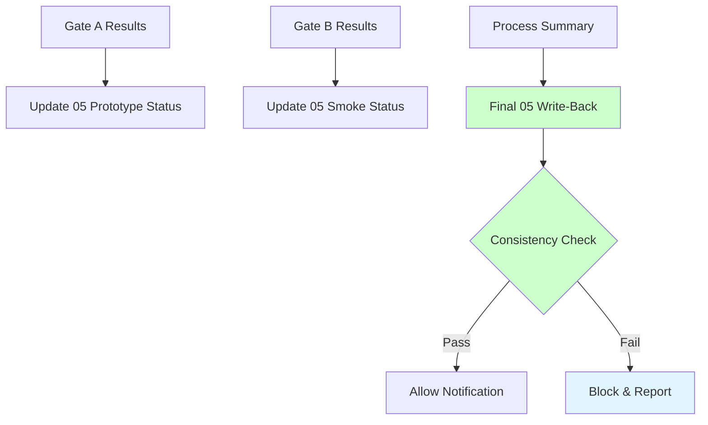
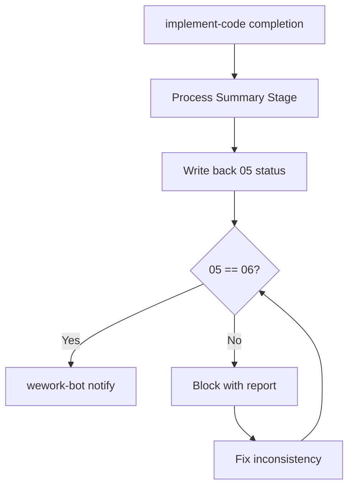
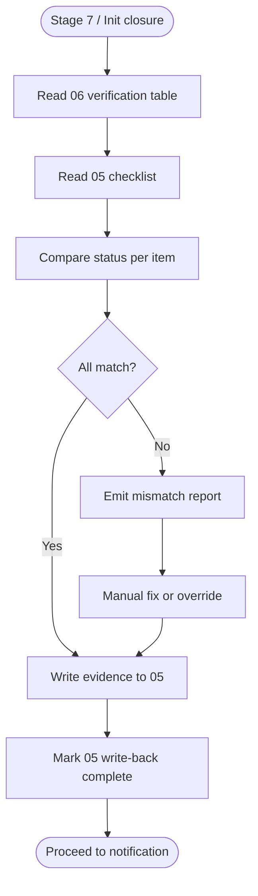
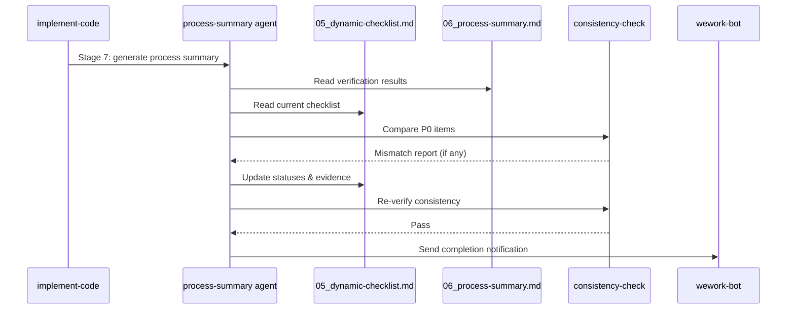

# implement-code-checklist-sync — Requirement Tasks

> **Document Version**: v1.0 | **Last Updated**: 2026-05-02 | **Maintainer**: kimi-k2.6
>
> **Related Documents**: [Requirement Document](./01_requirement-document.md) | [Design Document](./03_design-document.md) | [Usage Document](./04_usage-document.md)

[Feature Overview](#feature-overview) | [Feature Analysis](#feature-analysis) | [Feature Details](#feature-details) | [Acceptance Criteria](#acceptance-criteria) | [Usage Scenario Examples](#usage-scenario-examples)

---

## Feature Overview

The dynamic checklist (`05_dynamic-checklist.md`) is intended to be the single source of truth for feature readiness. In practice, after `implement-code` and `generate-document init` deliveries, the 05 checklist often remains at its initial template state while `06_process-summary.md` claims all P0 items passed. This feature hardens the process summary rules to make 05 write-back mandatory and verifiable, ensuring consistency across the document set.

- 🎯 **Goal**: 05 checklist always reflects the final verification state
- ⚡ **Impact**: Eliminates misleading "all pending" checklists for completed features
- 📖 **Clarity**: Write-back is a hard gate, not a best-effort step

---

## Feature Analysis

### Feature Decomposition Diagram

### User Flow Diagram

### Feature Flow Diagram

### Sequence Diagram

---

## User Story Table

| Priority | User Story | Main Operation Scenarios |
|----------|------------|-------------------------|
| 🔴 P0 | As a process maintainer, I want the 05 dynamic checklist to be automatically updated with final verification results during the process summary stage, so that it remains the single source of truth for feature readiness. | 1. implement-code completion updates 05 to match Gate B results 2. generate-document init completion updates 05 to match final verification 3. Cross-skill delivery syncs 05 after both stages |

---

## Main Operation Scenario Definitions

### Scenario 1: implement-code completion updates 05 to match Gate B results

- **Scenario description**: A feature implementation completes all stages; Gate B smoke tests pass.
- **Pre-conditions**: 02 and 03 exist; 05 checklist created; Gate B executed.
- **Operation steps**:
  1. Process summary stage reads 06 verification table
  2. For each P0 checklist item, copy Gate B result (✅/❌) to 05 status column
  3. Append evidence: stage name, date, and verification method
  4. Save 05 with updated statuses
- **Expected result**: 05 P0 items match 06 Gate B results; write-back recorded in 06 §5.
- **Verification focus points**: Every P0 item in 05 has non-default status; evidence is traceable.
- **Related design document chapters**: [Implementation Details](./03_design-document.md#implementation-details)

### Scenario 2: generate-document init completion updates 05

- **Scenario description**: `generate-document init` produces the project initialization document set.
- **Pre-conditions**: Init command executed; 01-07 generated.
- **Operation steps**:
  1. Init closure stage performs document quality checks (path verification, Mermaid syntax, structure compliance)
  2. For each 05 checklist item, set status based on actual check result
  3. Append evidence: check method and result
  4. Save 05
- **Expected result**: 05 no longer shows 0% completion; statuses reflect actual verification.
- **Verification focus points**: `docs/项目初始化/05_动态检查清单.md` shows updated statuses.
- **Related design document chapters**: [Implementation Details](./03_design-document.md#implementation-details)

### Scenario 3: Inconsistency detected and blocked

- **Scenario description**: A manual edit or agent error causes 05 and 06 to diverge.
- **Pre-conditions**: 05 and 06 both exist; statuses differ.
- **Operation steps**:
  1. Consistency check compares 05 and 06 P0 items
  2. Mismatch detected (e.g., 05 shows ❌ but 06 shows ✅)
  3. Block or warning emitted before wework-bot
  4. Operator fixes mismatch or overrides with explicit reason
- **Expected result**: No notification sent with inconsistent state; divergence is explicit.
- **Verification focus points**: Console shows exact mismatch items; block reason recorded.
- **Related design document chapters**: [Main Operation Scenario Implementation](./03_design-document.md#main-operation-scenario-implementation)

---

## Impact Analysis

### 1. Search Terms and Change Point List

| Search Term | Matched File | Line | Context | Change Required |
|-------------|--------------|------|---------|-----------------|
| `05_dynamic-checklist.md` | `docs/项目初始化/05_动态检查清单.md` | 1-200+ | Checklist with pending statuses | Reference: shows sync gap |
| `06_process-summary.md` | `docs/项目初始化/06_实施总结.md` | 82-83 | Claims P0 passed | Reference: shows sync gap |
| `S0-5` | `.claude/skills/implement-code/rules/process-summary.md` | 15 | "Must write back implementation status to 01/02/03/04/05/07" | Strengthen from "must" to hard gate with verification |
| `process-summary.md` | `.claude/skills/implement-code/rules/process-summary.md` | 1-59 | Full process summary spec | Add 05 write-back verification sub-section |
| `orchestration.md` stage 7 | `.claude/skills/implement-code/rules/orchestration.md` | 111 | "import-docs executed + wework-bot sent by end type" | Add 05 consistency check before wework-bot |
| `verification-gate.md` Gate B | `.claude/skills/implement-code/rules/verification-gate.md` | 1-59 | Gate B specification | Clarify 05 write-back as Gate B exit condition |
| `artifact-contracts.md` | `.claude/skills/implement-code/rules/artifact-contracts.md` | 1-59 | Status value definitions | No change needed (status icons already defined) |
| `init.md` | `.claude/skills/generate-document/rules/init.md` | 1-59 | Init command spec | Add 05 write-back step to init closure |
| `generate-document SKILL.md` | `.claude/skills/generate-document/SKILL.md` | 192 | Blocking summary format | Ensure block summary also updates 05 if possible |

### 2. Change Point Impact Chain

| Change Point | Direct Impact | Transitive Impact | Disposition |
|--------------|---------------|-------------------|-------------|
| `process-summary.md` add hard gate | Process summary agent must perform 05 write-back | All implement-code deliveries now have consistent 05 | Modify rule; update agent instructions |
| `init.md` add 05 write-back | Init closure must update 05 | All future init deliveries have consistent 05 | Modify rule |
| `orchestration.md` add consistency check | Stage 8 entry now requires 05 pass | wework-bot notifications delayed until consistency verified | Add check step |

### 3. Dependency Closure Summary

- **Upstream**: Gate A/B verification results are the source of truth for 05 updates.
- **Downstream**: wework-bot notification depends on 05 consistency.
- **Cross-cutting**: No code files affected; only skill rules and process documents.

### 4. Uncovered Risks

| Risk | Likelihood | Impact | Mitigation |
|------|------------|--------|------------|
| Agent fails to parse 05 markdown table | Low | Medium | Use simple regex/line-based updates; keep table format stable |
| Concurrent edits to 05 during write-back | Low | Low | Single-agent execution model prevents concurrency |
| False-positive block due to formatting drift | Low | Low | Tolerance for whitespace/formatting differences in comparison |

**Change scope summary**: directly modify 3 / verify compatibility 5 / trace transitive 2 / need manual review 0.

---

## Feature Details

### Mandatory 05 Write-Back in implement-code

- **Feature description**: Stage 7 process summary must update 05 checklist statuses from Gate A/B results before marking complete.
- **Value**: Ensures checklist reflects reality.
- **Pain point solved**: `项目初始化` 05 showed 0% while 06 claimed 100%.

### Mandatory 05 Write-Back in generate-document init

- **Feature description**: Init closure must update 05 from document quality verification results.
- **Value**: Prevents init-generated docs from leaving 05 at template defaults.
- **Pain point solved**: Init deliveries have no code gates, so 05 was never updated.

### Consistency Verification

- **Feature description**: A check ensures 05 and 06 are consistent before notification.
- **Value**: Catches write-back omissions or manual drift.
- **Pain point solved**: Silent inconsistencies mislead stakeholders.

---

## Acceptance Criteria

### P0 — Core

1. `process-summary.md` mandates 05 write-back as hard gate
2. `init.md` mandates 05 write-back as hard gate
3. Write-back updates status and adds evidence
4. Existing 06/07 rules unchanged except new gate

### P1 — Important

5. Consistency check script verifies 05 matches 06
6. Inconsistency blocks or warns before wework-bot
7. Write-back is idempotent

### P2 — Nice-to-have

8. Auto-generate 05 "diff" section showing changes

---

## Usage Scenario Examples

### Scenario 1: implement-code completion with 05 sync

- **Background**: Feature passes Gate B.
- **Operation**: Process summary runs.
- **Result**: 05 updated; 06 matches 05.
- 📋 **Verification**: Side-by-side comparison shows matching P0 counts.
- 🎨 **UX**: Operator sees "05 write-back complete" in summary.

### Scenario 2: generate-document init with 05 sync

- **Background**: Init produces docs.
- **Operation**: Init closure runs quality checks.
- **Result**: 05 statuses updated from template.
- 📋 **Verification**: `docs/项目初始化/05_动态检查清单.md` shows non-default statuses.
- 🎨 **UX**: Operator sees checklist reflecting actual doc quality.

### Scenario 3: Inconsistency detected and blocked

- **Background**: Manual edit causes drift.
- **Operation**: Consistency check runs.
- **Result**: Block issued; mismatch explicit.
- 📋 **Verification**: Console shows exact mismatched items.
- 🎨 **UX**: Clear block reason with recovery steps.

## Postscript: Future Planning & Improvements

- Generalize consistency check into a shared utility for all skills.
- Consider auto-generating 05 from 06 to eliminate manual write-back.
