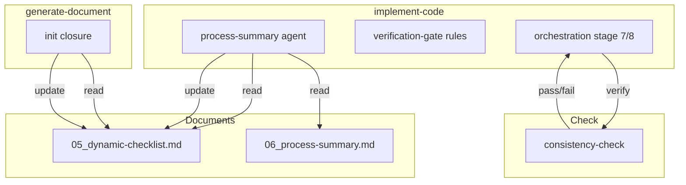
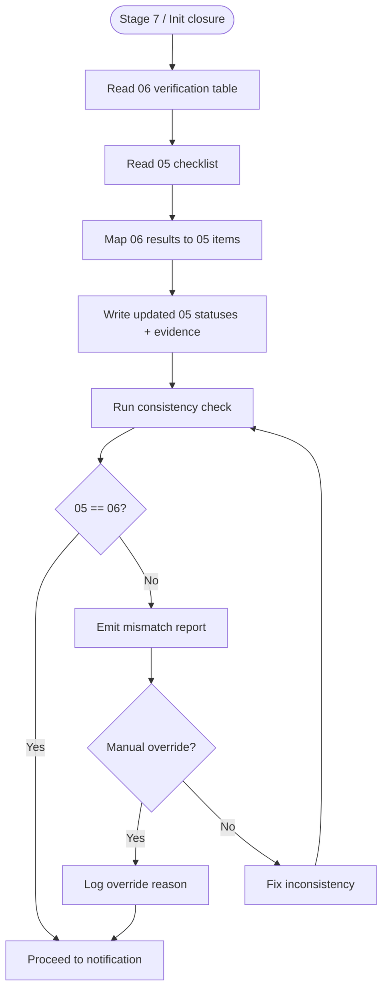
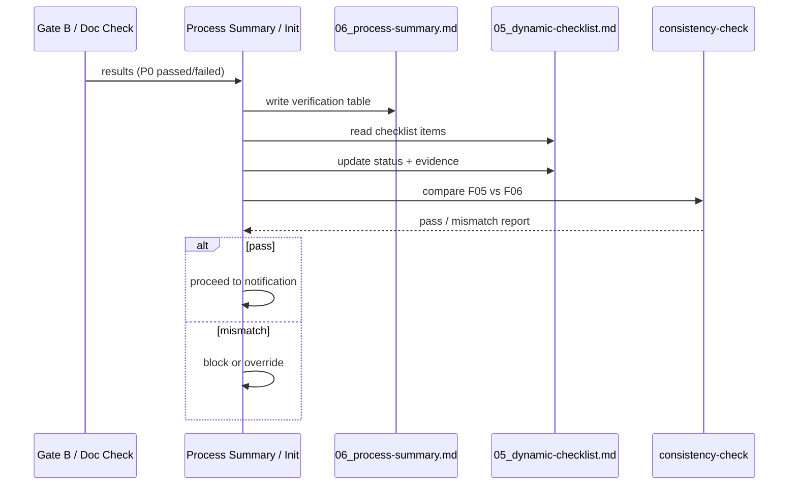

# implement-code-checklist-sync — Design Document

> **Document Version**: v1.0 | **Last Updated**: 2026-05-02 | **Maintainer**: kimi-k2.6
>
> **Related Documents**: [Requirement Document](./01_requirement-document.md) | [Requirement Tasks](./02_requirement-tasks.md) | [Usage Document](./04_usage-document.md)

[Design Overview](#design-overview) | [Architecture Design](#architecture-design) | [Changes](#changes) | [Implementation Details](#implementation-details) | [Impact Analysis](#impact-analysis)

---

## Design Overview

This design closes the synchronization gap between `05_dynamic-checklist.md` and `06_process-summary.md` by making 05 write-back a mandatory, verifiable gate in both `implement-code` and `generate-document init` lifecycles. The solution is rule-level: strengthen existing process-summary and init specifications, add a consistency verification step to the orchestration stage machine, and provide a reusable helper pattern for status updates. No new dependencies or external services are required.

- 🎯 **Principle**: Single source of truth. If 05 and 06 disagree, 06 is the temporary authority; 05 must be updated to match.
- ⚡ **Principle**: Fail closed. Inconsistency blocks notification until resolved or explicitly overridden.
- 🔧 **Principle**: Reuse over invent. Leverage existing status icon conventions and archive patterns.

---

## Architecture Design

### Overall Architecture



### Module Division

| Module Name | Responsibility | Location |
|-------------|---------------|----------|
| `process-summary.md` | Define 05 write-back as hard gate in process summary | `.claude/skills/implement-code/rules/process-summary.md` |
| `verification-gate.md` | Define 05 write-back as Gate B exit condition | `.claude/skills/implement-code/rules/verification-gate.md` |
| `orchestration.md` | Add consistency check before stage 8 (notification) | `.claude/skills/implement-code/rules/orchestration.md` |
| `init.md` | Add 05 write-back to init closure specification | `.claude/skills/generate-document/rules/init.md` |

### Core Flow



---

## Changes

### Problem Analysis

`docs/项目初始化/05_动态检查清单.md` shows all items as "pending check" (0% complete) while `docs/项目初始化/06_实施总结.md` claims all P0 passed. Root cause: `generate-document init` does not enforce 05 write-back after document verification. For `implement-code`, the rule `process-summary.md` S0-5 says "Must write back implementation status to 01/02/03/04/05/07" but lacks a verification mechanism to ensure it actually happens.

### Solution

1. **Strengthen `process-summary.md`**: Add a sub-section "05 Write-Back Verification" that mandates updating 05 status column and evidence before 06 can be saved.
2. **Extend `verification-gate.md`**: Explicitly state that Gate B exit condition includes "05 updated with smoke test results."
3. **Add consistency check to `orchestration.md`**: Before stage 8 (wework-bot), verify 05 and 06 consistency. Block if mismatch and no override.
4. **Extend `init.md`**: Add a closure step "Update 05 checklist statuses from document verification results."

### Before/After Comparison

| Aspect | Before | After |
|--------|--------|-------|
| 05 write-back | Mentioned as "must" but unverified | Hard gate with explicit verification step |
| Init closure | No 05 update step | Mandatory 05 update after doc verification |
| Consistency check | None | Required before wework-bot notification |
| Failure mode | Silent inconsistency | Explicit block or warning |

---

## Impact Analysis

### 1. Search Terms and Change Point List

| Search Term | Matched File | Line | Context | Change Required |
|-------------|--------------|------|---------|-----------------|
| `process-summary.md` | `.claude/skills/implement-code/rules/process-summary.md` | 15 | S0-5 write-back rule | Add verification sub-section |
| `verification-gate.md` | `.claude/skills/implement-code/rules/verification-gate.md` | 1-59 | Gate B spec | Add 05 write-back exit condition |
| `orchestration.md` stage 8 | `.claude/skills/implement-code/rules/orchestration.md` | 111 | Completion gate | Add consistency check step |
| `init.md` | `.claude/skills/generate-document/rules/init.md` | 1-59 | Init command spec | Add 05 write-back closure step |
| `05_动态检查清单.md` | `docs/项目初始化/05_动态检查清单.md` | 1-200+ | All pending | Reference: sync gap evidence |
| `06_实施总结.md` | `docs/项目初始化/06_实施总结.md` | 82-83 | P0 passed claims | Reference: sync gap evidence |
| `generate-document SKILL.md` | `.claude/skills/generate-document/SKILL.md` | 192 | Block summary format | Ensure block summary references 05 |

### 2. Change Point Impact Chain

| Change Point | Direct Impact | Transitive Impact | Disposition |
|--------------|---------------|-------------------|-------------|
| `process-summary.md` add verification | Agent must perform explicit 05 update | All implement-code deliveries have consistent 05 | Modify rule; no code changes |
| `verification-gate.md` add exit condition | Gate B cannot pass without 05 update | Stage 7 cannot complete without Gate B pass | Modify rule |
| `orchestration.md` add consistency check | Stage 8 entry requires 05 pass | wework-bot delayed until consistency verified | Modify rule |
| `init.md` add closure step | Init command must update 05 | All future init deliveries consistent | Modify rule |

### 3. Dependency Closure Summary

- **Upstream**: Gate A/B results and document verification are the data sources.
- **Downstream**: wework-bot notification depends on consistency check pass.
- **Cross-cutting**: No code or runtime changes; pure process rule updates.

### 4. Uncovered Risks

| Risk | Likelihood | Impact | Disposition |
|------|------------|--------|-------------|
| Agent cannot reliably parse 05 markdown table | Low | Medium | Keep table format stable; use line-based updates |
| False block due to minor formatting drift | Low | Low | Tolerance for whitespace in comparison |
| Rule changes not adopted by future agents | Medium | Medium | Update skill contracts and checklists |

**Change scope summary**: directly modify 4 / verify compatibility 3 / trace transitive 2 / need manual review 0.

---

## Implementation Details

### Technical Points

**What**: Add mandatory 05 write-back and consistency check to skill rules.
**How**: Edit four Markdown rule files; no code or scripts required.
**Why**: The gap is a process failure, not a tool failure; fixing the rules fixes the process.

### Key Code (Rule Changes)

**process-summary.md — add after S0-5:**

```markdown
### S0-5a: 05 Write-Back Verification (Mandatory)

Before 06_process-summary.md is considered complete:

1. Read `05_dynamic-checklist.md`.
2. For each P0 item, update the status column to match the final Gate B result:
   - ✅ passed
   - ❌ failed
   - ⏳ pending (only if explicitly deferred)
3. Append evidence to the status column: verification stage, date, and method.
4. Save 05.
5. Run consistency check: verify that every P0 item in 05 matches 06 verification table.
6. If mismatch, block and emit report; do not proceed to notification until resolved.
```

**verification-gate.md — add to Gate B exit:**

```markdown
Gate B exit conditions:
- All P0 dynamic checklist items passed or have acceptable N/A justification
- **05_dynamic-checklist.md status column updated with Gate B results**
- Process summary agent has verified 05/06 consistency
```

**orchestration.md — add before stage 8:**

```markdown
| 7.5 | Consistency Check | Verify 05 matches 06 | 05 statuses consistent with 06 verification table, or explicit override logged |
```

**init.md — add to closure:**

```markdown
### Init Closure Step: 05 Write-Back

After all documents (01-07) are generated and verified:

1. Perform document quality checks (path verification, Mermaid syntax, structure compliance).
2. Update `05_dynamic-checklist.md` statuses to reflect actual check results.
3. Append evidence to each updated item.
4. Save 05 before proceeding to import-docs and wework-bot.
```

### Dependencies

- No new dependencies.
- Requires agents to read/write Markdown files.

### Testing Considerations

1. Apply updated rules to a mock feature delivery and verify 05 is updated.
2. Deliberately introduce a 05/06 mismatch and verify the block triggers.
3. Verify init command updates 05 after document generation.

---

## Main Operation Scenario Implementation

### Scenario 1: implement-code completion updates 05

- **Linked 02 scenario**: [Scenario 1](./02_requirement-tasks.md#scenario-1-implement-code-completion-updates-05-to-match-gate-b-results)
- **Implementation overview**: Process summary agent reads 06, maps results to 05, writes back, verifies consistency.
- **Modules and responsibilities**:
  - `process-summary.md`: Defines the write-back gate
  - `verification-gate.md`: Defines 05 update as Gate B exit condition
  - `orchestration.md`: Defines consistency check before notification
- **Key code paths**: `process-summary.md:S0-5a` → `05_dynamic-checklist.md` update → `orchestration.md:7.5` consistency check
- **Verification points**: 05 P0 statuses match 06; evidence present; block triggers on mismatch.

### Scenario 2: generate-document init completion updates 05

- **Linked 02 scenario**: [Scenario 2](./02_requirement-tasks.md#scenario-2-generate-document-init-completion-updates-05)
- **Implementation overview**: Init closure performs doc quality checks, updates 05, saves.
- **Modules and responsibilities**:
  - `init.md`: Defines 05 write-back closure step
- **Key code paths**: `init.md:closure` → document checks → `05_dynamic-checklist.md` update
- **Verification points**: 05 no longer at template defaults; statuses reflect actual checks.

### Scenario 3: Inconsistency detected and blocked

- **Linked 02 scenario**: [Scenario 3](./02_requirement-tasks.md#scenario-3-inconsistency-detected-and-blocked)
- **Implementation overview**: Consistency check compares 05 and 06; mismatch triggers block.
- **Modules and responsibilities**:
  - `orchestration.md`: Defines consistency check stage
- **Key code paths**: `orchestration.md:7.5` → comparison → block or override → notification
- **Verification points**: Exact mismatch items reported; block reason logged; override reason logged if used.

---

## Data Structure Design

### Status Mapping Flow



### Evidence Format

Updated status cell in 05:

```markdown
| Item | Priority | Status |
|------|----------|--------|
| Health check performs HEAD | P0 | ✅ passed (Gate B, 2026-05-02, mock-gateway test) |
```

## Postscript: Future Planning & Improvements

- Extract consistency check into a reusable script for all skills.
- Consider adding a pre-commit hook to reject 05/06 mismatches.
