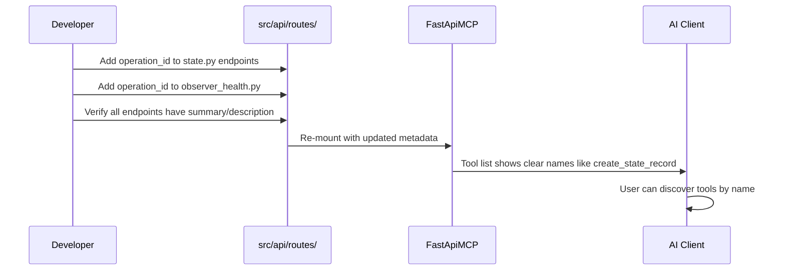
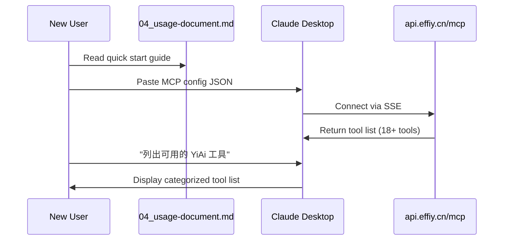
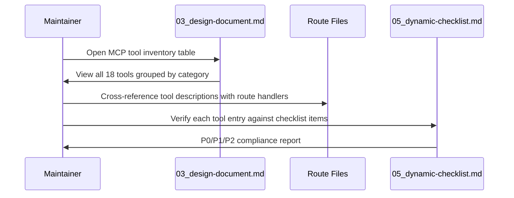
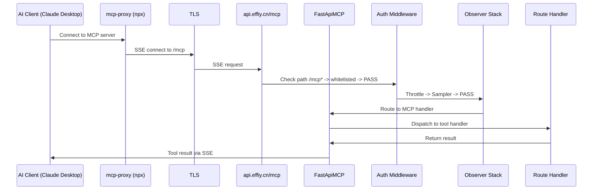

# MCP 服务优化 — 需求任务

> **Document Version**: v1.0 | **Last Updated**: 2026-05-03 | **Maintainer**: Claude Opus 4.7 | **Tool**: Claude Code
>
> **Related Documents**: [Requirement Document](./01_requirement-document.md) | [Design Document](./03_design-document.md) | [Usage Document](./04_usage-document.md) | [CLAUDE.md](../../CLAUDE.md)
>
> **Git Branch**: main
>
> **Doc Start Time**: 14:30:00 | **Doc Last Update Time**: 14:30:00

[Feature Overview](#feature-overview) | [Feature Analysis](#feature-analysis) | [User Story Table](#user-story-table) | [Main Operation Scenarios](#main-operation-scenarios) | [Impact Analysis](#impact-analysis) | [Feature Details](#feature-details) | [Acceptance Criteria](#acceptance-criteria)

---

## Feature Overview

优化 YiAi MCP 服务的工具元数据（operation_id、描述），建立快速入门指南和工具清单文档，提升 AI 客户端的功能触达率和用户易用性。MCP 服务基于 `fastapi-mcp>=0.4.0`，当前已在 `src/main.py` 完成基础挂载，18 个端点通过 `/mcp` SSE 端点暴露。

---

## Feature Analysis

### 当前 MCP 暴露端点状态

| # | 路由文件 | 标签 | 端点数 | operation_id 状态 |
|---|---------|------|--------|-------------------|
| 1 | `src/api/routes/upload.py` | Upload | 9 | 已设置（upload_file, upload_image_to_oss, upload_image_to_oss_alt, read_file, write_file, delete_file, delete_folder, rename_file, rename_folder） |
| 2 | `src/api/routes/execution.py` | Execution | 2 | 已设置（execute_module_get, execute_module_post） |
| 3 | `src/api/routes/wework.py` | WeWork | 1 | 已设置（send_wework_message） |
| 4 | `src/api/routes/state.py` | State | 5 | **缺失** — 需补充 |
| 5 | `src/api/routes/observer_health.py` | Observer | 1 | **缺失** — 需补充 |
| 6 | `src/api/routes/maintenance.py` | Maintenance | 2 | **排除** — exclude_tags=["Maintenance"] |

### MCP 可达性分析

| 维度 | 当前状态 | 目标状态 |
|------|---------|---------|
| 工具名可读性 | State/Observer 端点工具名不可控（自动生成） | 所有端点显式 operation_id，snake_case 动词_名词 |
| 工具描述 | 部分端点无 summary/description | 每个端点至少有 1 句中文功能描述 |
| 用户文档 | 无 MCP 专属用户文档 | 04_usage-document.md 含完整快速入门 |
| 工具清单 | 工具列表仅能从代码推导 | 03_design-document.md 含完整分类清单 |
| 安全说明 | MCP 无认证风险未显式标注 | 文档中明确说明安全模型和风险 |

---

## User Story Table

| Priority | User Story | Acceptance Criteria | Dependencies |
|----------|-----------|---------------------|-------------|
| P0 | As an AI agent developer, I want clear MCP tool names and descriptions | All endpoints have explicit operation_id; MCP tool names are readable; descriptions explain tool purpose | State router, Observer health route |
| P1 | As a new user, I want a quick start guide to connect in 2 minutes | Copy-paste config snippet works; verification steps produce expected output | Working MCP endpoint |
| P2 | As a maintainer, I want a complete MCP tool inventory for auditing | All 18+ tools listed with parameters and response format | operation_id completion |

---

## Main Operation Scenarios

### Scenario 1: 补全 MCP 工具元数据



### Scenario 2: 新用户快速入门



### Scenario 3: 工具清单审计



### Scenario 4: MCP 请求生命周期



---

## Impact Analysis

### 代码变更影响

| 变更点 | 文件 | 影响范围 | 优先级 | 风险等级 |
|--------|------|---------|--------|---------|
| 添加 operation_id（5 端点） | `src/api/routes/state.py` | MCP 工具名变更，Observer fallback 映射表 | P0 | 中 — 工具名变化可能影响已集成客户端 |
| 添加 operation_id（1 端点） | `src/api/routes/observer_health.py` | MCP 工具名变更 | P1 | 低 |
| 补充 Field 描述 | `src/api/routes/upload.py` | MCP 参数描述改善 | P1 | 低 |
| 评估 alt 路由 | `src/api/routes/upload.py` | 可能的 breaking change | P2 | 高 — 需确认是否有客户端依赖 |

### 文档变更影响

| 变更 | 文件 | 类型 | 优先级 |
|------|------|------|--------|
| 新建 01-05, 07 文档 | `docs/mcp-service-optimization/` | CREATE | P0 |
| 更新 MCP 集成章节 | `docs/architecture.md` §6 | UPDATE | P1 |
| 更新架构总览 | `CLAUDE.md` | UPDATE | P1 |
| 更新认证白名单说明 | `docs/auth.md` | UPDATE | P2 |
| 更新网络请求规则 | `docs/network.md` | UPDATE | P2 |

### 配置变更影响

| 变更 | 文件 | 影响 | 优先级 |
|------|------|------|--------|
| 无直接配置变更 | — | MCP 配置在代码中，config.yaml 无 MCP 段 | — |

### 依赖传递闭包

```text
FastApiMCP (fastapi-mcp>=0.4.0)
├── src/main.py (create_app)
│   ├── src/api/routes/execution.py (Execution tag)
│   ├── src/api/routes/upload.py (Upload tag)
│   ├── src/api/routes/wework.py (WeWork tag)
│   ├── src/api/routes/state.py (State tag) ← 需补全 operation_id
│   ├── src/api/routes/observer_health.py (Observer tag) ← 需补全 operation_id
│   └── src/api/routes/maintenance.py (Maintenance tag) ← 已排除
├── src/core/middleware.py (Auth whitelist: /mcp*)
├── .claude/mcp.json (Client config: mcp-proxy → api.effiy.cn/mcp)
├── .claude/shared/mcp-fallback-contract.md (Fallback strategy)
└── .claude/skills/observer/ (Observer MCP client wrapper)
    ├── scripts/observer-client.js (Reliability-wrapped MCP calls)
    └── rules/reliability-contract.md (Rate limits per tool category)
```

### 上游/下游影响

**上游**：
- `fastapi-mcp` 库版本升级可能改变工具名生成规则 → operation_id 显式设置可隔离此风险
- FastAPI 路由注册顺序影响 MCP 工具列表顺序 → 按标签分组，用户感知稳定

**下游**：
- Observer fallback 映射表引用 MCP 工具名 → operation_id 变更后需同步更新
- Claude Desktop 客户端在工具名变更后可能需重新发现工具 → 非破坏性（自动重新发现）
- 已有 `mcp-fallback-contract.md` 引用的工具名需验证一致性

### 风险清单

| ID | 风险 | 等级 | 缓解措施 |
|----|------|------|---------|
| R01 | operation_id 变更导致工具名变化 | P1 | 变更前记录旧名新名映射，文档标注 |
| R02 | MCP 无认证暴露所有非 Maintenance 端点 | P0 | 在文档中显式标注安全模型，建议 IP 白名单 |
| R03 | module.allowlist: ["*"] 允许 MCP 调用任意模块 | P0 | 文档风险标注，建议收紧白名单 |
| R04 | FastApiMCP.mount() 可能绕过 HTTP 中间件 | P1 | 需运行时验证（Observer 可靠性文档已有标注） |
| R05 | MCP SSE 连接无服务端超时控制 | P2 | 文档标注，建议后续增加配置 |
| R06 | upload_image_to_oss_alt 重复路由 | P2 | 评估向后兼容需求后决定去留 |
| R07 | 无 MCP 测试覆盖 | P1 | 建议添加基本连通性测试 |

### 文档闭包状态

| 类别 | 状态 | 数量 |
|------|------|------|
| 需新建 | OPEN | 6（01-05, 07） |
| 需更新 | OPEN | 4（architecture, CLAUDE, auth, network） |
| 已验证无需变更 | CLOSED | 3（devops, changelog, FAQ） |

---

## Feature Details

### 工具元数据补全

- **State 路由** (`src/api/routes/state.py`): 为 5 个端点添加 operation_id:
  - `POST /state/records` → `create_state_record`
  - `GET /state/records` → `query_state_records`
  - `GET /state/records/{key}` → `get_state_record`
  - `PUT /state/records/{key}` → `update_state_record`
  - `DELETE /state/records/{key}` → `delete_state_record`
- **Observer Health** (`src/api/routes/observer_health.py`): 添加 `operation_id="get_observer_health"`
- **Upload 路由** (`src/api/routes/upload.py`): 增强 `FileUploadRequest` 和 `ImageUploadToOssRequest` 的 `Field(description=...)` 注解

### 快速入门指南

- 包含 Claude Desktop 和 Cursor 两种客户端的 MCP 配置
- 提供 `npx mcp-proxy` 命令行验证方法
- 列出第一个推荐调用的工具（`query_state_records` 或 `get_observer_health`）
- 覆盖常见问题：连接失败、工具不显示、SSE 超时

### 工具清单文档

- 按 5 个功能分类（Upload, Execution, WeWork, State, Observer）
- 每项含：工具名、HTTP 方法、路径、参数表、响应格式、认证要求
- 标注已知限制和安全风险

---

## Acceptance Criteria

### P0 - Must Pass
- [ ] State 路由 5 个端点全部添加 operation_id
- [ ] Observer Health 端点添加 operation_id
- [ ] 所有 18+ MCP 暴露端点在工具清单中有完整记录
- [ ] 快速入门指南覆盖 Claude Desktop 和 Cursor 两种客户端
- [ ] 架构文档 MCP 章节包含请求生命周期序列图

### P1 - Should Pass
- [ ] Upload 路由的 Pydantic schema Field 描述增强
- [ ] 工具清单和文档交叉引用完整
- [ ] 安全风险在至少 3 处文档中显式标注
- [ ] MCP 工具名与 Observer fallback 映射表一致

### P2 - Nice to Have
- [ ] upload_image_to_oss_alt 的向后兼容评估结论写入文档
- [ ] MCP 连通性基本测试方案
- [ ] Python 客户端接入示例

---

## Usage Scenario Examples

### Scenarios

#### Scenario 1: State 路由 operation_id 补全前后对比

> **Background**: 当前 State 路由的 5 个端点无 operation_id，fastapi-mcp 自动生成不可控的工具名。
>
> **Operation**: 开发者在 state.py 中为每个端点添加 operation_id 参数。
>
> **Result**: MCP 工具名从 `api_v1_state_records_post` 变为 `create_state_record`，用户可直观理解工具功能。

#### Scenario 2: 新用户 Claude Desktop 接入验证

> **Background**: 用户首次在 Claude Desktop 中配置 YiAi MCP。
>
> **Operation**: 复制 `04_usage-document.md` 中的 JSON 配置 → 粘贴到 `claude_desktop_config.json` → 重启 Claude Desktop → 在对话中查看工具列表。
>
> **Result**: 用户看到 18+ YiAi MCP 工具，工具名清晰可读，可直接在对话中调用。

## Postscript: Future Planning & Improvements

- 建立 CI 检查：验证所有非 Maintenance 端点具有 operation_id
- 从 OpenAPI schema 自动生成 MCP 工具清单（去手工维护）
- MCP 工具调用统计（Prometheus metrics）用于优化高频工具的文档和描述

## Workflow Standardization Review
1. **Repetitive labor identification**: 每次新增路由后手动确保 MCP 文档更新是重复劳动；可模板化工具清单生成
2. **Decision criteria missing**: 什么情况下端点应排除在 MCP 之外（除了 Maintenance 标签）缺乏明确标准
3. **Information silos**: MCP fallback 映射、Observer 限流配置、工具清单分布在 3 个不同文件中
4. **Feedback loop**: 无机制收集 AI 客户端对 MCP 工具描述质量的反馈

## System Architecture Evolution Thinking
- **A1. Current architecture bottleneck**: MCP 工具描述质量完全依赖开发者自觉添加 operation_id 和 docstring
- **A2. Next natural evolution node**: 自动化工具元数据校验 → OpenAPI → MCP 文档生成管道
- **A3. Risks and rollback plans for evolution**: 自动化管道可能生成不准确的工具描述（LLM 幻觉），需保留人工审核环节
