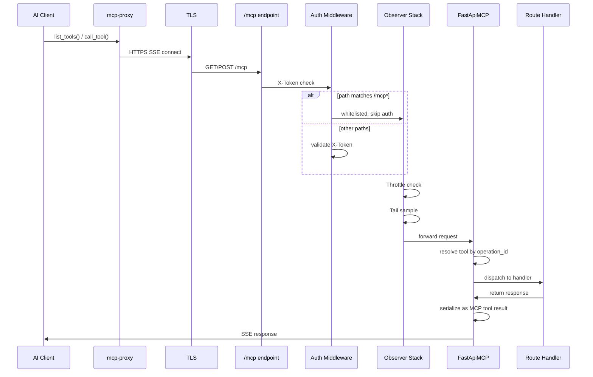
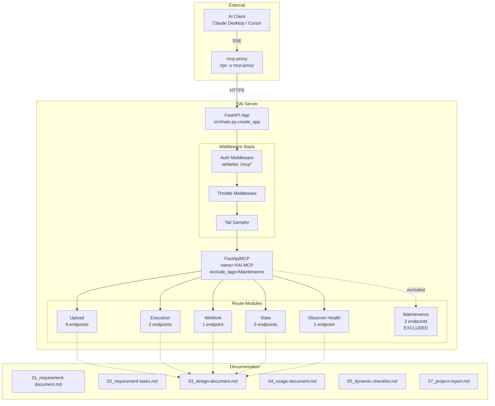
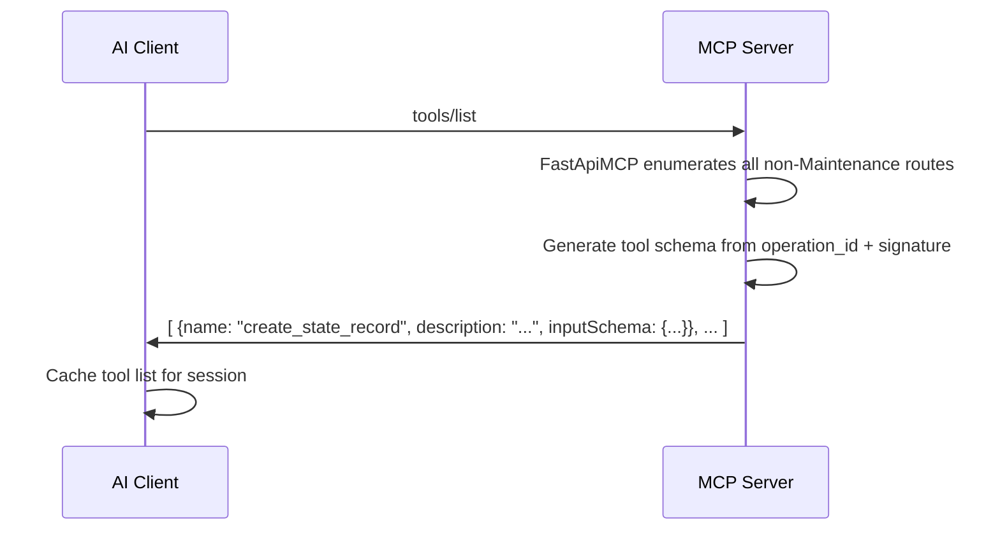
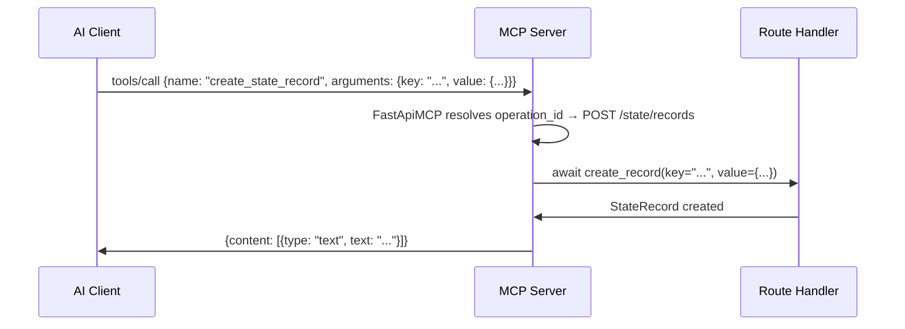

# MCP 服务优化 — 设计文档

> **Document Version**: v1.0 | **Last Updated**: 2026-05-03 | **Maintainer**: Claude Opus 4.7 | **Tool**: Claude Code
>
> **Related Documents**: [Requirement Document](./01_requirement-document.md) | [Requirement Tasks](./02_requirement-tasks.md) | [Usage Document](./04_usage-document.md) | [CLAUDE.md](../../CLAUDE.md)
>
> **Git Branch**: main
>
> **Doc Start Time**: 14:35:00 | **Doc Last Update Time**: 14:35:00

[Design Overview](#design-overview) | [Architecture Design](#architecture-design) | [Changes](#changes) | [Impact Analysis](#impact-analysis) | [Implementation Details](#implementation-details) | [Main Operation Scenario Implementation](#main-operation-scenario-implementation) | [Data Structure Design](#data-structure-design)

---

## Design Overview

本次 MCP 服务优化聚焦于**接口层面**的改进，不引入新的架构组件。核心设计原则：(1) 通过显式 `operation_id` 保证工具名稳定性和可读性；(2) 通过文档体系（01-07 编号集）建立 MCP 服务的知识沉淀；(3) 通过架构文档更新补充请求生命周期和安全模型说明。

**不涉及**：新模块、新中间件、数据库变更、配置文件变更。

---

## Architecture Design

### MCP 请求生命周期



### 模块架构图



### MCP 工具命名规则

`fastapi-mcp` 自动从 FastAPI 路由的 `operation_id` 生成 MCP 工具名。规则如下：

| 来源 | 示例 | 生成的 MCP 工具名 |
|------|------|-------------------|
| 显式 `operation_id="create_state_record"` | `state.py:POST /state/records` | `create_state_record` |
| 无 `operation_id`（自动生成） | `state.py:GET /state/records/{key}` | `api_v1_state_records__key__get` |

**命名约定**（本次优化确立）：
- 格式：`snake_case`，动词_名词
- 动词前缀：`create_`, `get_`, `query_`, `update_`, `delete_`, `send_`, `upload_`, `execute_`
- 禁止自动生成（不可控、易变）

---

## Changes

### 代码层变更

| # | 文件 | 变更类型 | 描述 | operation_id |
|---|------|---------|------|-------------|
| C1 | `src/api/routes/state.py` | MODIFY | `create_record` 端点添加 operation_id | `create_state_record` |
| C2 | `src/api/routes/state.py` | MODIFY | `query_records` 端点添加 operation_id | `query_state_records` |
| C3 | `src/api/routes/state.py` | MODIFY | `get_record` 端点添加 operation_id | `get_state_record` |
| C4 | `src/api/routes/state.py` | MODIFY | `update_record` 端点添加 operation_id | `update_state_record` |
| C5 | `src/api/routes/state.py` | MODIFY | `delete_record` 端点添加 operation_id | `delete_state_record` |
| C6 | `src/api/routes/observer_health.py` | MODIFY | 健康检查端点添加 operation_id | `get_observer_health` |

### 文档层变更

| # | 文件 | 类型 | 描述 |
|---|------|------|------|
| D1 | `docs/mcp-service-optimization/01-05,07` | CREATE | 完整 6 文档集 |
| D2 | `docs/architecture.md` §6 | UPDATE | 补充请求生命周期、工具命名规则、安全模型 |
| D3 | `CLAUDE.md` | UPDATE | 架构模式 6 补充 MCP 工具清单入口 |
| D4 | `docs/auth.md` | UPDATE | 补充 MCP 无认证安全模型说明 |
| D5 | `docs/network.md` | UPDATE | 补充 `/mcp` SSE 端点 URL 和传输说明 |

---

## Impact Analysis

### 代码依赖图

```
state.py:add operation_id ──> FastApiMCP tool name change
    ├──> observer/scripts/observer-client.js (fallback map)
    ├──> .claude/shared/mcp-fallback-contract.md (tool references)
    └──> docs/mcp-service-optimization/03_design-document.md (tool inventory)

observer_health.py:add operation_id ──> FastApiMCP tool name change
    └──> docs/mcp-service-optimization/03_design-document.md (tool inventory)
```

### 向后兼容性

| 变更 | 兼容性 | 说明 |
|------|--------|------|
| State 路由 operation_id | 需通知 | 工具名从自动生成变为显式命名，已集成客户端需更新工具引用 |
| Observer Health operation_id | 低风险 | 新工具名首次使用，无历史客户端依赖 |
| 文档新建 | 无影响 | 纯新增内容，不改现有接口 |

---

## Implementation Details

### State 路由 operation_id 添加

```python
# src/api/routes/state.py — 变更示意

@router.post("/records", operation_id="create_state_record")
async def create_record(...): ...

@router.get("/records", operation_id="query_state_records")
async def query_records(...): ...

@router.get("/records/{key}", operation_id="get_state_record")
async def get_record(...): ...

@router.put("/records/{key}", operation_id="update_state_record")
async def update_record(...): ...

@router.delete("/records/{key}", operation_id="delete_state_record")
async def delete_record(...): ...
```

### Observer Health 路由 operation_id 添加

```python
# src/api/routes/observer_health.py — 变更示意

@router.get("/health/observer", operation_id="get_observer_health")
async def observer_health(): ...
```

### MCP 工具完整清单

#### Upload（9 工具）

| 工具名 | HTTP | 路径 | 参数 | 认证 | 描述 |
|--------|------|------|------|------|------|
| `upload_file` | POST | `/upload` | `file_path`, `content`, `encoding` | 无需 | 通用文件上传（JSON body） |
| `upload_image_to_oss` | POST | `/upload-image-to-oss` | `image_data`, `filename` | 无需 | 图片上传到 OSS |
| `upload_image_to_oss_alt` | POST | `/upload/upload-image-to-oss` | 同 `upload_image_to_oss` | 无需 | 备用路径（可能废弃） |
| `read_file` | POST | `/read-file` | `target_file` | 无需 | 读取文件内容（文本/base64/图片URL） |
| `write_file` | POST | `/write-file` | `target_file`, `content`, `is_base64` | 无需 | 写入文件（文本或 base64） |
| `delete_file` | POST | `/delete-file` | `target_file` | 无需 | 删除文件 |
| `delete_folder` | POST | `/delete-folder` | `target_dir` | 无需 | 删除文件夹 |
| `rename_file` | POST | `/rename-file` | `old_path`, `new_path` | 无需 | 重命名文件 |
| `rename_folder` | POST | `/rename-folder` | `old_dir`, `new_dir` | 无需 | 重命名文件夹 |

#### Execution（2 工具）

| 工具名 | HTTP | 路径 | 参数 | 认证 | 描述 |
|--------|------|------|------|------|------|
| `execute_module_get` | GET | `/execution` | `module_path`, `function_name`, `parameters` | 无需 | 执行模块方法（GET） |
| `execute_module_post` | POST | `/execution` | `module_path`, `function_name`, `parameters` | 无需 | 执行模块方法（POST） |

#### WeWork（1 工具）

| 工具名 | HTTP | 路径 | 参数 | 认证 | 描述 |
|--------|------|------|------|------|------|
| `send_wework_message` | POST | `/wework/send-message` | `content`, `msgtype` | 无需 | 发送企业微信消息 |

#### State（5 工具）

| 工具名 | HTTP | 路径 | 参数 | 认证 | 描述 |
|--------|------|------|------|------|------|
| `create_state_record` | POST | `/state/records` | `key`, `value`, `tags` | 无需 | 创建状态记录 |
| `query_state_records` | GET | `/state/records` | `tags`, `limit`, `offset` | 无需 | 查询状态记录列表 |
| `get_state_record` | GET | `/state/records/{key}` | `key` | 无需 | 获取单条状态记录 |
| `update_state_record` | PUT | `/state/records/{key}` | `key`, `value` | 无需 | 更新状态记录 |
| `delete_state_record` | DELETE | `/state/records/{key}` | `key` | 无需 | 删除状态记录 |

#### Observer（1 工具）

| 工具名 | HTTP | 路径 | 参数 | 认证 | 描述 |
|--------|------|------|------|------|------|
| `get_observer_health` | GET | `/health/observer` | 无 | 无需 | 查询 Observer 可靠性组件健康状态 |

#### 排除端点（Maintenance 标签）

| 端点 | 原因 |
|------|------|
| `POST /cleanup-unused-images` | 维护操作，非用户工具 |
| `POST /cleanup-unused-images/alt` | 备用路径，同上 |

---

## Main Operation Scenario Implementation

### 工具发现流程



### 工具调用流程



---

## Data Structure Design

### MCP Tool Schema（由 fastapi-mcp 自动生成）

每个 MCP 工具的 inputSchema 由 FastAPI 路由的 Pydantic 模型自动推断：

```yaml
Tool:
  name: str              # operation_id
  description: str       # route summary + description
  inputSchema:           # JSON Schema from Pydantic model
    type: object
    properties: {...}
    required: [...]
```

### operation_id 命名空间

```text
Operation ID Registry (18 tools):
  upload.*               (9): upload_file, upload_image_to_oss, upload_image_to_oss_alt,
                              read_file, write_file, delete_file, delete_folder,
                              rename_file, rename_folder
  execute_module.*       (2): execute_module_get, execute_module_post
  wework.*               (1): send_wework_message
  state.*                (5): create_state_record, query_state_records, get_state_record,
                              update_state_record, delete_state_record
  observer.*             (1): get_observer_health
  [EXCLUDED] maintenance.* (2): cleanup_unused_images, cleanup_unused_images_alt
```

## Postscript: Future Planning & Improvements

- 考虑引入 `fastapi-mcp` 的 `describe_function` 参数实现更丰富的工具描述
- 评估在 `config.yaml` 中增加 `mcp` 配置段（如 `mcp.exclude_tags`、`mcp.max_tools` 等）
- 建立 operation_id 命名规范 CI lint 规则

## Workflow Standardization Review
1. **Repetitive labor identification**: 工具清单表的维护可自动化（从 OpenAPI schema 生成）
2. **Decision criteria missing**: 标签排除决策（Maintenance 之外还有哪些应排除）缺乏分级标准
3. **Information silos**: Observer 的 MCP 工具类别限流配置与工具清单分属不同文件
4. **Feedback loop**: 缺少工具使用频率和质量反馈的采集通道

## System Architecture Evolution Thinking
- **A1. Current architecture bottleneck**: MCP 工具元数据质量完全依赖开发者手动维护，无自动化校验
- **A2. Next natural evolution node**: OpenAPI spec → MCP tool manifest 自动生成 + CI 校验管道
- **A3. Risks and rollback plans for evolution**: 自动生成可能与人工优化冲突，需支持 overlay/override 机制
