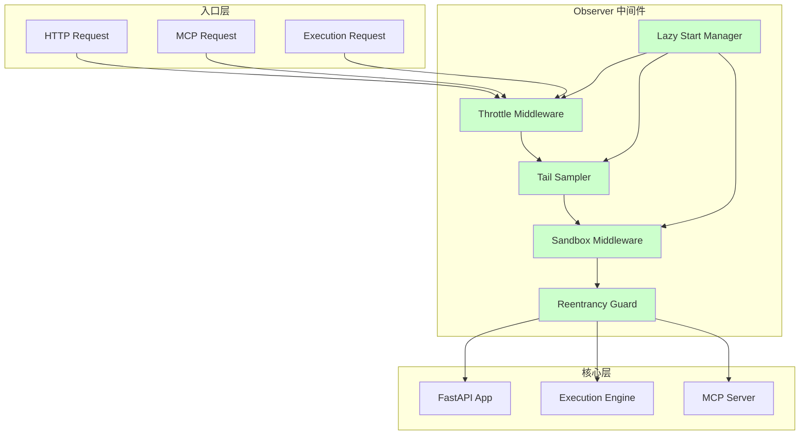
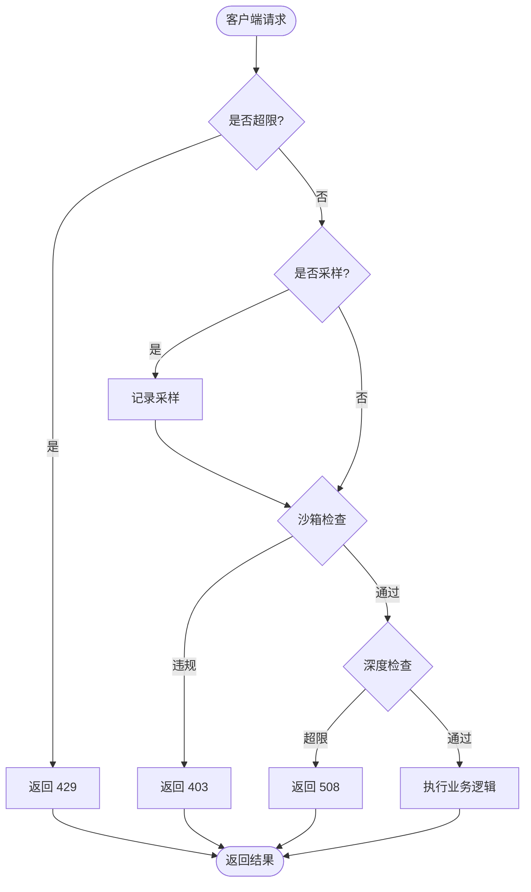
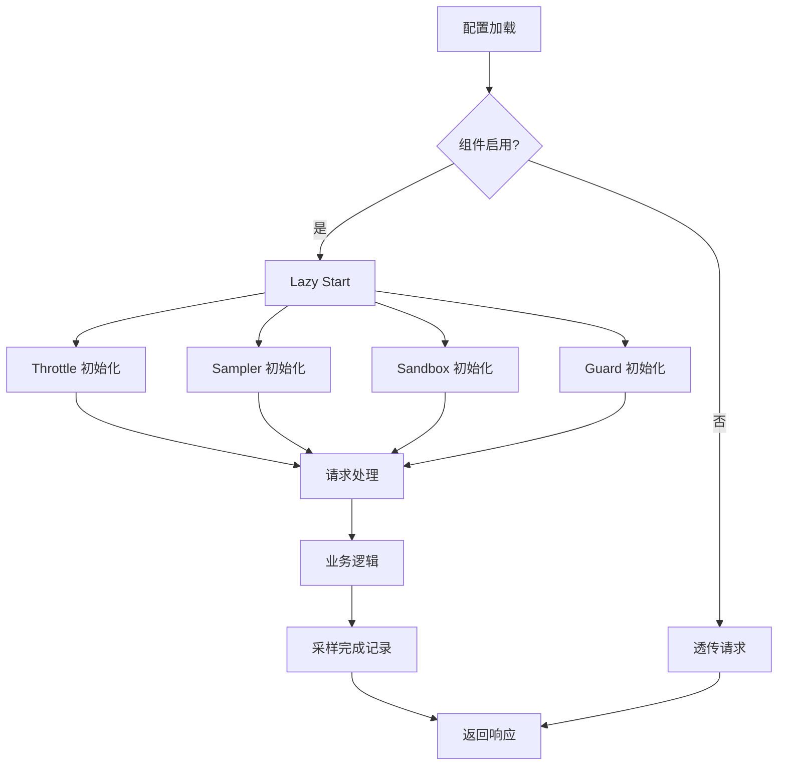
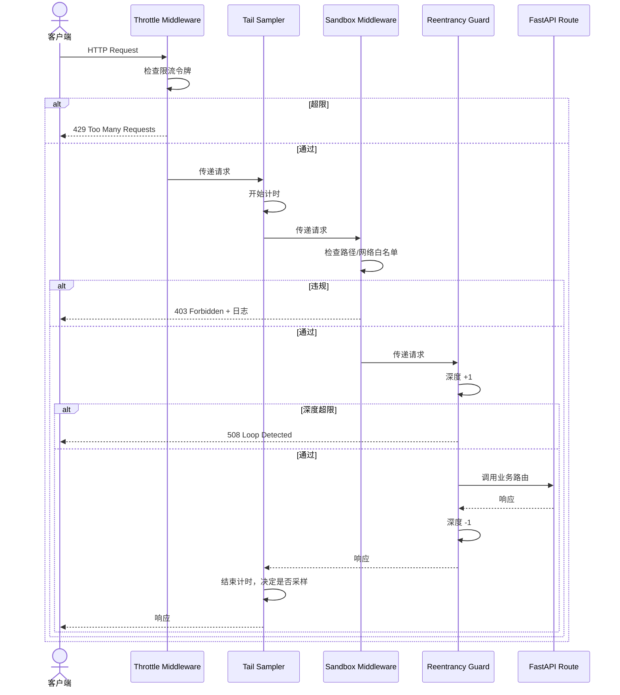

# Observer Reliability — Requirement Tasks

> **Document Version**: v1.0 | **Last Updated**: 2026-05-03 | **Upstream**: [01 Requirement Document](./01_requirement-document.md) | **Downstream**: [03 Design Document](./03_design-document.md)>

[Feature Overview](#feature-overview) | [Feature Analysis](#feature-analysis) | [Feature Details](#feature-details) | [Acceptance Criteria](#acceptance-criteria) | [Usage Scenario Examples](#usage-scenario-examples)

---

## Feature Overview

Observer Reliability 为 YiAi 的 MCP 端点、HTTP API 和动态模块执行引擎提供四层外围防护：节流与尾部采样防止内存膨胀；沙箱访问控制隔离不可信代码；懒启动减少冷启动开销；重入守卫阻断递归风暴。所有组件以非侵入式中间件和装饰器接入现有请求链，不修改业务逻辑。设计遵循现有 FastAPI 中间件约定和 Pydantic 配置体系，新增依赖控制在最小范围（无需额外服务进程）。

🎯 **可控可观测**：统一入口层的限流、采样和访问控制。

⚡ **资源保护**：懒启动和重入守卫降低峰值资源消耗。

🔧 **安全加固**：沙箱隔离动态执行和 MCP 工具调用。

---

## Feature Analysis

### Feature Decomposition Diagram

上图展示了 Observer 作为中间件层包裹所有入口请求：HTTP、MCP 和 Execution 均经过 Throttle → Sampler → Sandbox → Reentrancy Guard 的处理链；Lazy Start Manager 负责按需初始化 Observer 组件。

### User Flow Diagram

用户请求经过四层关卡：节流、采样、沙箱、重入。任意一层失败都会提前返回，不进入业务逻辑。

### Feature Flow Diagram

配置决定 Observer 是否启用；启用时各组件懒初始化，随后参与请求处理链。

### Sequence Diagram

---

## User Story Table

| Priority | User Story | Acceptance Criteria | Documents |
|----------|------------|---------------------|-----------|
| 🔴 P0 | As a system operator, I want request throttling and tail sampling on MCP and API endpoints, so that memory explosion under high load is prevented. | 1. Per-client rate limit 2. 429 with Retry-After 3. Tail sampler captures p95 + errors 4. Memory flat under load | [01](./01_requirement-document.md), [03](./03_design-document.md) |
| 🔴 P0 | As a security engineer, I want sandbox access control around module execution and MCP, so that untrusted code cannot access sensitive host resources. | 1. FS sandbox blocks non允许路径 2. Network sandbox blocks非允许主机 3. MCP tools 默认沙箱 4. 违规日志含上下文 | [01](./01_requirement-document.md), [03](./03_design-document.md) |
| 🟡 P1 | As a backend developer, I want lazy-start initialization for heavy observer components, so that cold-start time and resource waste are reduced. | 1. 首次请求时初始化 2. Health check 不触发 3. 线程安全 4. 启动增加 < 50ms | [01](./01_requirement-document.md), [03](./03_design-document.md) |
| 🟡 P1 | As the system, I want re-entrancy guards on observer middleware and execution hooks, so that recursive or cyclic invocations do not stack-overflow or deadlock. | 1. 深度限制可配置 2. 超限时 508 3. 按 async context 隔离 4. 无并发误报 | [01](./01_requirement-document.md), [03](./03_design-document.md) |

---

## Main Operation Scenario Definitions

### Scenario S1: Request Throttled Under Load

- **Scenario Description**: 高并发场景下，某客户端发送过量请求，触发节流拒绝。
- **Pre-conditions**: Observer 已启用，Throttle 组件已懒初始化，客户端 IP 未在白名单。
- **Operation Steps**:
  1. 客户端发送请求到 `/execution`。
  2. Throttle 中间件检查该客户端当前秒内的请求计数。
  3. 计数超过 `throttle_requests_per_second` 阈值，返回 429。
  4. 响应头包含 `Retry-After` 提示客户端等待秒数。
- **Expected Result**: 客户端收到 429；系统内存不随请求量增长。
- **Verification Focus Points**: 限流计数正确重置；白名单客户端不受限；429 响应包含正确 Retry-After。
- **Related Design Document Chapters**: [03 Architecture Design](#architecture-design), [03 Implementation Details](#implementation-details)

### Scenario S2: Tail Sampling Captures Slow Request

- **Scenario Description**: 一次执行耗时异常高，被尾部采样器捕获。
- **Pre-conditions**: Tail Sampler 已启用，采样缓冲区未满。
- **Operation Steps**:
  1. 请求进入 Sampler，记录开始时间。
  2. 业务逻辑执行完成，Sampler 计算耗时。
  3. 耗时超过 p95 阈值，或状态码为 5xx，记录采样。
  4. 采样数据写入固定大小的 ring buffer。
- **Expected Result**: Ring buffer 包含该请求的元数据（路径、耗时、状态码、请求 ID）。
- **Verification Focus Points**: 正常请求不被过度采样；错误请求 100% 采样；buffer 满时循环覆盖。
- **Related Design Document Chapters**: [03 Architecture Design](#architecture-design), [03 Data Structure Design](#data-structure-design)

### Scenario S3: Sandbox Blocks File Access

- **Scenario Description**: 动态模块尝试读取敏感文件，被沙箱拦截。
- **Pre-conditions**: Sandbox 已启用，文件系统规则已加载。
- **Operation Steps**:
  1. 模块执行期间调用 `open("/etc/passwd")`。
  2. Sandbox 拦截器解析真实路径（解符号链接）。
  3. 路径不在 `sandbox_fs_allowlist` 中，拒绝访问。
  4. 抛出 `SandboxViolation` 异常，写入结构化日志。
- **Expected Result**: 模块收到异常；日志包含请求 ID、目标路径、堆栈。
- **Verification Focus Points**: 符号链接穿透检查；允许路径正常通过；日志 JSON 格式正确。
- **Related Design Document Chapters**: [03 Implementation Details](#implementation-details)

### Scenario S4: Lazy Start on First Request

- **Scenario Description**: 应用启动后，第一个请求触发 Observer 组件初始化。
- **Pre-conditions**: `observer_lazy_start=true`，应用刚启动，无请求到达。
- **Operation Steps**:
  1. `create_app()` 完成，lifespan 未初始化 Observer 内部状态。
  2. 第一个客户端请求到达 Throttle 中间件。
  3. Throttle 检查内部状态为未初始化，执行线程安全的懒加载。
  4. 后续请求复用已初始化组件。
- **Expected Result**: 启动时间无明显增加；第一个请求耗时略高（含初始化）。
- **Verification Focus Points**: Health check 不触发懒加载；并发首个请求无竞态；关闭时清理懒加载资源。
- **Related Design Document Chapters**: [03 Implementation Details](#implementation-details)

### Scenario S5: Re-entrant Execution Detected

- **Scenario Description**: 模块执行期间回调 `/execution`，重入守卫拦截超限调用。
- **Pre-conditions**: Reentrancy Guard 已启用，默认深度限制为 3。
- **Operation Steps**:
  1. 外层请求进入 Execution，Guard 深度从 0 变为 1。
  2. 模块内部调用 `/execution`，深度变为 2。
  3. 第二层模块再次调用 `/execution`，深度变为 3。
  4. 第三层尝试再次调用，深度将达到 4，Guard 拒绝并返回 508。
- **Expected Result**: 第三层调用收到 508；前两层正常完成。
- **Verification Focus Points**: 不同客户端并发请求不共享深度计数；深度在异常时正确回滚；508 响应包含当前深度信息。
- **Related Design Document Chapters**: [03 Implementation Details](#implementation-details)

---

## Impact Analysis

### 1. Search Terms and Change Point List

| Change Point | Type | Search Term | Source | Notes |
|--------------|------|-------------|--------|-------|
| Throttle Middleware | New | `throttle`, `rate_limit`, `token_bucket` | Feature requirement | 新增中间件 |
| Tail Sampler | New | `tail_sample`, `sampler`, `ring_buffer` | Feature requirement | 新增中间件/服务 |
| Sandbox Middleware | New | `sandbox`, `allowlist`, `filesystem` | Feature requirement | 新增中间件 |
| Lazy Start Manager | New | `lazy_start`, `lazy_init` | Feature requirement | 新增管理器 |
| Reentrancy Guard | New | `reentrancy`, `guard`, `depth` | Feature requirement | 新增中间件/装饰器 |
| Observer Config | Modify | `observer_*` | Feature requirement | config.py 新增字段 |
| Health Endpoint | New | `/health/observer` | Feature requirement | 新增路由 |
| Execution Hook | Modify | `execute_module` | Existing code | 集成沙箱和守卫 |
| MCP Integration | Modify | `FastApiMCP`, `mcp` | Existing code | 中间件需覆盖 MCP |

### 2. Change Point Impact Chain

| Change Point | Search Term | Hit File | Reference Method | Impact Level | Dependency Direction | Disposition Method | Closure Status | Explanation |
|--------------|-------------|----------|-----------------|--------------|---------------------|-------------------|----------------|-------------|
| Throttle Middleware | `throttle` | No references found | N/A | Low | New module | No action needed | Closed | 全新中间件 |
| Tail Sampler | `sampler` | No references found | N/A | Low | New module | No action needed | Closed | 全新采样器 |
| Sandbox Middleware | `sandbox` | No references found | N/A | Low | New module | No action needed | Closed | 全新沙箱 |
| Lazy Start Manager | `lazy_start` | No references found | N/A | Low | New module | No action needed | Closed | 全新管理器 |
| Reentrancy Guard | `reentrancy` | No references found | N/A | Low | New module | No action needed | Closed | 全新守卫 |
| Observer Config | `observer` | No references found | N/A | Low | Upstream dependency | Sync modify | Closed | 新增 Settings 字段 |
| Health Endpoint | `health` | No references found | N/A | Low | New route | No action needed | Closed | 全新路由 |
| Execution Hook | `execute_module` | `src/services/execution/executor.py` | Function body | Medium | Downstream consumer | Sync modify | Closed | 需集成沙箱和守卫 |
| MCP Integration | `FastApiMCP` | `src/main.py` | `FastApiMCP` mount | Medium | Downstream consumer | Sync modify | Closed | 需确保中间件覆盖 MCP |
| Middleware Stack | `middleware` | `src/main.py` | `add_middleware` | Medium | Downstream consumer | Sync modify | Closed | 需注册 Observer 中间件 |

### 3. Dependency Closure Summary

| Change Point | Upstream Verified | Reverse Verified | Transitive Closed | Tests/Docs/Config Covered | Conclusion |
|--------------|-------------------|------------------|-------------------|--------------------------|------------|
| Throttle Middleware | Yes (config.py) | Yes (main.py) | Yes | Yes | Closed |
| Tail Sampler | Yes (config.py) | Yes (main.py) | Yes | Yes | Closed |
| Sandbox Middleware | Yes (config.py, executor.py) | Yes (main.py) | Yes | Yes | Closed |
| Lazy Start Manager | Yes (config.py) | Yes (all observer components) | Yes | Yes | Closed |
| Reentrancy Guard | Yes (config.py, executor.py) | Yes (main.py) | Yes | Yes | Closed |
| Health Endpoint | Yes (main.py) | Yes | Yes | Yes | Closed |
| Execution Hook | Yes (executor.py) | Yes (sandbox, guard) | Yes | Yes | Closed |
| MCP Integration | Yes (main.py) | Yes (middleware) | Yes | Yes | Closed |

### 4. Uncovered Risks

| Risk Source | Reason | Impact | Mitigation |
|-------------|--------|--------|------------|
| MCP 中间件覆盖不完整 | `FastApiMCP.mount()` 可能绕过部分 FastAPI 中间件 | MCP 请求不受节流/沙箱保护 | 验证 `FastApiMCP` 的路由注册方式；必要时在 MCP 层面单独挂载拦截器 |
| 沙箱 monkey-patch 副作用 | 对 `open()` 或 `aiohttp` 的 patch 可能影响其他服务 | 正常请求被误拦截 | 使用上下文管理器限定 patch 范围；仅对 Execution 和 MCP 生效 |
| Lazy Start 并发竞态 | 多个并发首个请求同时触发初始化 | 重复初始化或状态不一致 | 使用 `asyncio.Lock` 或 `threading.Lock` 实现双检锁 |
| Reentrancy Guard ContextVar 泄漏 | 异常导致深度未正确递减 | 后续请求被误判为重入 | 使用 `try/finally` 确保 depth--；定期清理孤立 context |

### Change Scope Summary

- **Directly modify**: 4 files (`config.py`, `main.py`, `executor.py`, `config.yaml`)
- **Verify compatibility**: 2 files (`middleware.py`, `exception_handler.py`)
- **Trace transitive**: 1 file (`database.py` — sandbox 可能限制 DB 连接路径)
- **Need manual review**: 0 files

---

## Feature Details

### 1. Memory Explosion Fix — Throttling and Tail Sampling

**Feature Description**: 在请求入口处实施令牌桶限流，防止单客户端或全局请求洪泛导致内存膨胀。尾部采样器维护固定大小的 ring buffer，仅保留异常慢请求和错误请求的元数据。

**Value**: 将内存占用与请求速率解耦；提供聚焦的异常追踪数据。

**Pain Point**: 当前 Uvicorn 仅有服务器级并发限制，无应用层限流；所有请求日志无差别保留，内存随 QPS 线性增长。

**Benefit**: 在高并发场景下保障服务稳定性，同时保留问题排查所需的关键信息。

### 2. Sandbox Access Fix

**Feature Description**: 为动态模块执行和 MCP 工具调用提供文件系统和网络访问的 allowlist 沙箱。通过拦截系统调用和 HTTP 传输层实现。

**Value**: 将不可信代码的破坏面限制在允许范围内。

**Pain Point**: `executor.py` 使用 `importlib` 和 `subprocess` 直接加载外部代码，无任何隔离；MCP 工具同样运行在完整主机环境中。

**Benefit**: 降低供应链攻击和提示词注入导致的数据泄露风险。

### 3. Lazy-Start Logic

**Feature Description**: Observer 的重型组件（令牌桶状态机、采样 ring buffer、沙箱规则缓存）推迟到首次实际请求时初始化。

**Value**: 减少启动时间和闲置资源占用。

**Pain Point**: 当前所有服务在 lifespan 中同步初始化，即使某些功能在特定部署中从不使用。

**Benefit**: 更适合 serverless 或按需扩展的部署模式。

### 4. Re-entrancy Guard

**Feature Description**: 基于 `contextvars` 的异步上下文深度计数器，在 Guarded 路由和 Execution 入口自动递增/递减，超限即拒。

**Value**: 防止递归和循环调用导致的栈溢出或死锁。

**Pain Point**: 当前 `/execution` 可被模块递归调用，无任何深度限制；MCP 工具也可能触发级联调用。

**Benefit**: 将无限递归转化为可控的 508 错误，保护进程稳定性。

---

## Acceptance Criteria

### P0

- [ ] Throttle 中间件按客户端 IP 限流，超限返回 429 + Retry-After。
- [ ] Tail Sampler 的 ring buffer 大小固定，不随请求量增长。
- [ ] Sandbox 拦截非 allowlist 的文件路径和网络主机。
- [ ] Lazy Start 在首次请求时初始化，不在 lifespan 中阻塞。
- [ ] Reentrancy Guard 按 async context 计数，超限返回 508。
- [ ] Observer 故障不穿透到业务层。

### P1

- [ ] 配置支持热重载。
- [ ] 沙箱违规输出结构化 JSON 日志。
- [ ] Health 端点暴露 Observer 状态。
- [ ] 守卫深度支持按路由配置。
- [ ] 支持通过 feature flag 单独关闭各组件。

### P2

- [ ] 分布式限流（Redis 后端）。
- [ ] 基于内存压力的自适应限流。
- [ ] WebSocket 沙箱支持。

---

## Usage Scenario Examples

### Example 1: Load Test with Throttling

📋 **Background**: 压测工具向 `/execution` 发送 1000 req/sec。

🎨 **Operation**:
1. 配置 `throttle_requests_per_second=100`。
2. 运行压测。
3. 观察 90% 请求返回 429。

📋 **Result**: 内存曲线平稳，服务未 OOM。

### Example 2: Investigating Slow Requests

📋 **Background**: 用户报告偶发超时。

🎨 **Operation**:
1. 调用 `GET /health/observer`。
2. 查看 `tail_sample_buffer` 中的慢请求记录。
3. 根据 `request_id` 关联详细日志。

📋 **Result**：定位到特定模块在特定输入下的性能退化。

### Example 3: Refactoring a Recursive Module

📋 **Background**：某模块意外回调 `/execution` 导致 508。

🎨 **Operation**：
1. 查看日志中的 `ReentrancyGuard` 告警。
2. 分析调用链深度和请求路径。
3. 修改模块避免同步回调。

📋 **Result**：消除 508，模块正确完成。

---

## Postscript: Future Planning & Improvements

1. **Policy DSL**：用 YAML/JSON 定义动态沙箱策略，支持时间窗口和角色条件。
2. **采样导出**：将 tail sample buffer 定期刷新到 MongoDB 或 S3，支持长期分析。
3. **Guard Graph**：构建模块调用关系图，可视化重入链和循环依赖。
4. **性能基准**：为 Observer 中间件建立微基准，确保单请求开销 < 1ms。
5. **多云沙箱**：对接 gVisor 或 Firecracker，实现进程级轻量级沙箱。
