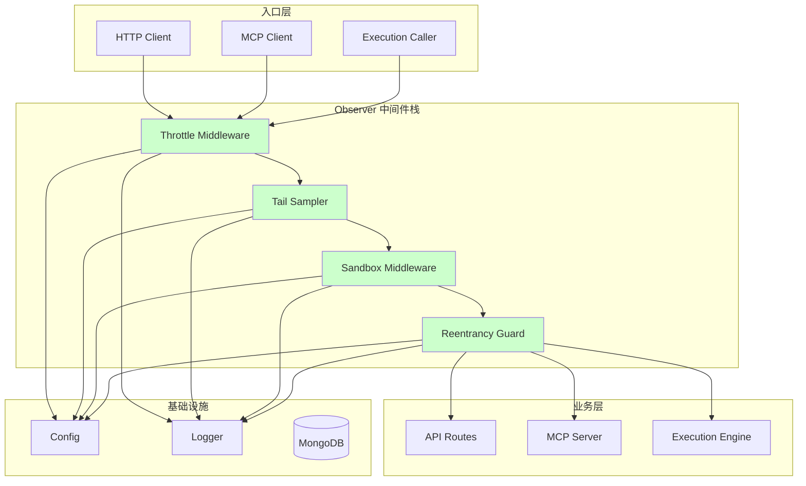
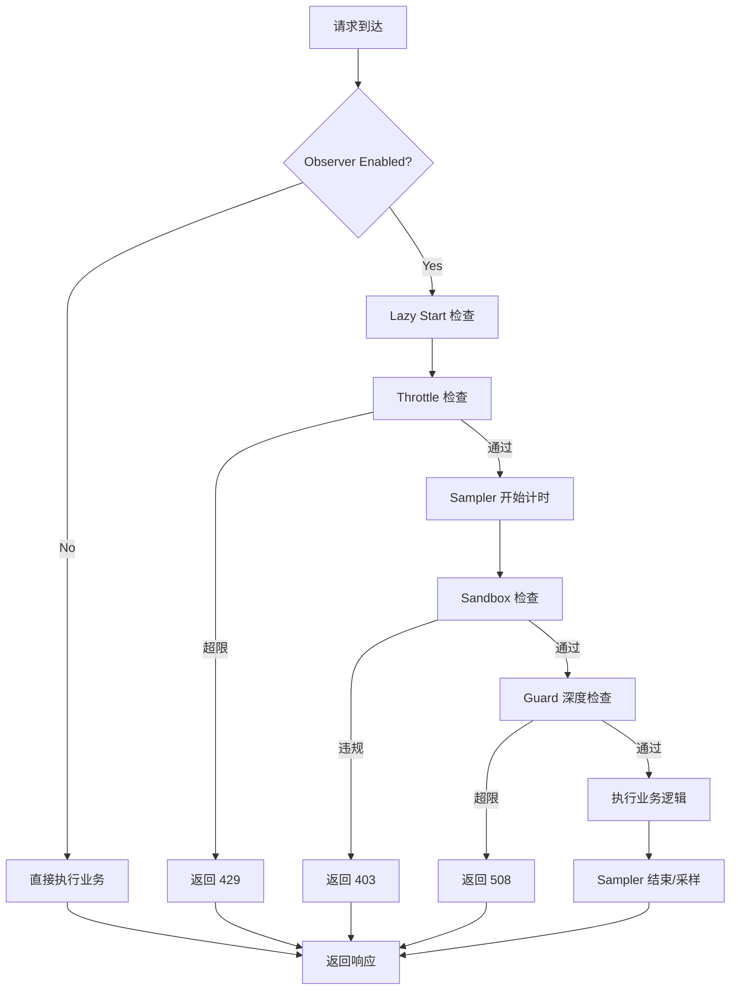
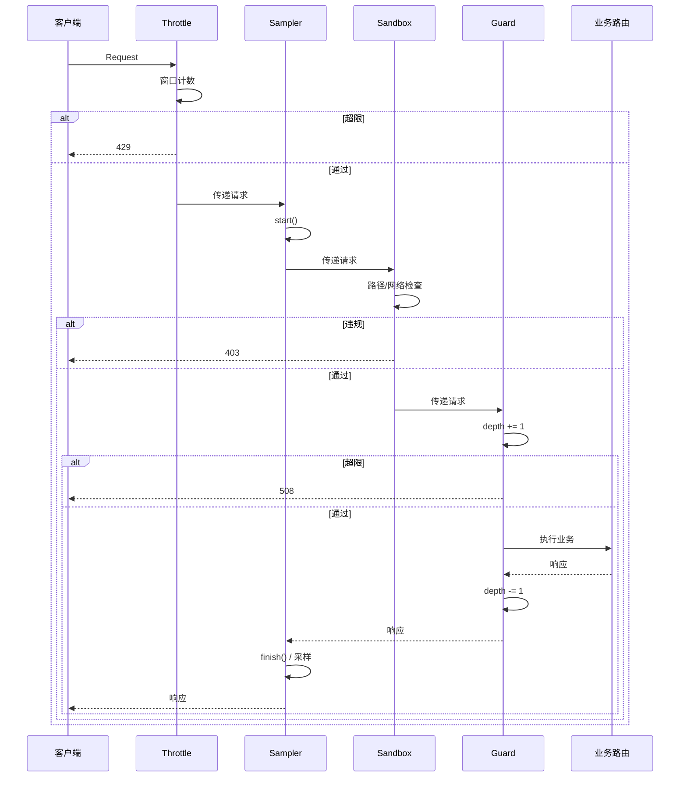

# Observer Reliability — Design Document

> **Document Version**: v1.0 | **Last Updated**: 2026-05-03 | **Upstream**: [02 Requirement Tasks](./02_requirement-tasks.md) | **Downstream**: [04 Usage Document](./04_usage-document.md)
>

[Design Overview](#design-overview) | [Architecture Design](#architecture-design) | [Changes](#changes) | [Implementation Details](#implementation-details) | [Impact Analysis](#impact-analysis)

---

## Design Overview

Observer Reliability 作为 YiAi 的外围可靠性层，以 FastAPI 中间件和 Python 装饰器为载体，为 HTTP API、MCP 端点和动态模块执行提供统一的限流、采样、沙箱和重入防护。设计遵循“非侵入、可组合、故障隔离”原则：Observer 组件包裹业务逻辑但不嵌入其中；各组件可独立启用或禁用；任何 Observer 内部故障都不会穿透到业务层。

设计原则：

🎯 **非侵入接入**：通过标准 FastAPI 中间件栈和装饰器接入，不修改现有路由处理器或执行引擎内部逻辑。

⚡ **最小开销**：节流使用固定窗口计数器（O(1)），采样使用预分配 ring buffer（无动态扩容），守卫使用 ContextVar（无锁）。

🔧 **故障隔离**：所有 Observer 组件内部使用 `try/except` 包裹，异常仅记录日志，请求继续处理。

---

## Architecture Design

### Overall Architecture



### Module Division

| Module Name | Responsibility | Location |
|-------------|--------------|----------|
| Throttle Middleware | 固定窗口请求限流，按客户端 IP 计数 | `src/core/observer/throttle.py` |
| Tail Sampler | 记录慢请求和错误到固定 ring buffer | `src/core/observer/sampler.py` |
| Sandbox Middleware | 文件系统和网络访问 allowlist 控制 | `src/core/observer/sandbox.py` |
| Lazy Start Manager | 按需初始化 Observer 重型组件 | `src/core/observer/lazy_start.py` |
| Reentrancy Guard | 异步上下文深度计数与拦截 | `src/core/observer/guard.py` |
| Observer Config | 配置项：开关、阈值、allowlist | `src/core/config.py` (新增字段) |
| Health Route | 暴露 Observer 运行时状态 | `src/api/routes/observer_health.py` |
| Execution Hook | 在 `executor.py` 中集成沙箱和守卫 | `src/services/execution/executor.py` (修改) |
| MCP Hook | 在 MCP 层挂载沙箱和守卫 | `src/main.py` (修改) |

### Core Flow



---

## Changes

### Problem Analysis

1. **无应用层限流**：Uvicorn 的 `limit_concurrency` 是服务器级，无法针对单客户端或单端点做精细限流，导致内存随请求堆积膨胀。
2. **无安全隔离**：`executor.py` 和 MCP 工具直接运行在主机环境中，可访问任意文件和网络资源。
3. **启动即全量初始化**：所有服务在 lifespan 中同步初始化，即使某些 Observer 能力在特定场景不需要。
4. **无递归保护**：模块可通过 `/execution` 回调自身或调用其他模块形成无限递归。

### Solution

引入 `src/core/observer/` 包，包含四个可独立启用的中间件/组件，通过标准 FastAPI 中间件栈接入。

#### File List

| # | File Path | Change Type | Description |
|---|-----------|-------------|-------------|
| 1 | `src/core/observer/__init__.py` | New | 包初始化，导出核心组件 |
| 2 | `src/core/observer/throttle.py` | New | 令牌桶/固定窗口限流中间件 |
| 3 | `src/core/observer/sampler.py` | New | 尾部采样 ring buffer |
| 4 | `src/core/observer/sandbox.py` | New | 文件系统 + 网络沙箱中间件 |
| 5 | `src/core/observer/lazy_start.py` | New | 懒启动管理器 |
| 6 | `src/core/observer/guard.py` | New | 重入守卫 |
| 7 | `src/api/routes/observer_health.py` | New | Health 端点 |
| 8 | `src/core/config.py` | Modify | 新增 observer_* 配置字段 |
| 9 | `src/main.py` | Modify | 注册 Observer 中间件，调整 MCP 挂载顺序 |
| 10 | `src/services/execution/executor.py` | Modify | 集成沙箱和守卫装饰器 |
| 11 | `config.yaml` | Modify | 添加 observer 默认配置 |

#### Selection Rationale

- `src/core/observer/` 作为核心基础设施包，与 `core/middleware.py`、`core/exceptions.py` 并列，体现其基础设施定位。
- 不使用 `src/services/` 是因为 Observer 是横切关注点，不属于特定业务域。
- 固定窗口限流选择原因：实现简单（O(1)），适合单实例部署；若未来需要分布式可平滑替换为 Redis 滑动窗口。

### Before/After Comparison

| Aspect | Before | After |
|--------|--------|-------|
| 限流 | Uvicorn 服务器级并发限制 | 应用层按客户端 IP 限流 + 429 响应 |
| 采样 | 无差别日志保留 | 固定 ring buffer 仅采样异常和慢请求 |
| 沙箱 | 无隔离，模块可访问任意资源 | 文件系统 + 网络 allowlist 拦截 |
| 启动 | Lifespan 中全量同步初始化 | Observer 组件懒加载 |
| 重入 | 无限制，可无限递归 | ContextVar 深度计数，超限 508 |

---

## Impact Analysis

### 1. Search Terms and Change Point List

| Change Point | Type | Search Term | Source | Notes |
|--------------|------|-------------|--------|-------|
| `ThrottleMiddleware` | New class | `throttle`, `rate_limit` | Design | 新增中间件 |
| `TailSampler` | New class | `sampler`, `ring_buffer` | Design | 新增采样器 |
| `SandboxMiddleware` | New class | `sandbox`, `allowlist` | Design | 新增沙箱 |
| `LazyStartManager` | New class | `lazy_start` | Design | 新增管理器 |
| `ReentrancyGuard` | New class | `reentrancy`, `guard` | Design | 新增守卫 |
| `observer_*` config | Modify | `observer_enabled` | Existing | config.py 新增 |
| `/health/observer` | New route | `health`, `observer` | Design | 新增健康端点 |
| `execute_module` | Modify | `execute_module` | Existing | executor.py 集成 |
| `FastApiMCP` | Modify | `FastApiMCP` | Existing | main.py 调整 |

### 2. Change Point Impact Chain

| Change Point | Search Term | Hit File | Reference Method | Impact Level | Dependency Direction | Disposition Method | Closure Status | Explanation |
|--------------|-------------|----------|-----------------|--------------|---------------------|-------------------|----------------|-------------|
| ThrottleMiddleware | `throttle` | No references | N/A | Low | New | No action | Closed | 全新 |
| TailSampler | `sampler` | No references | N/A | Low | New | No action | Closed | 全新 |
| SandboxMiddleware | `sandbox` | No references | N/A | Low | New | No action | Closed | 全新 |
| LazyStartManager | `lazy_start` | No references | N/A | Low | New | No action | Closed | 全新 |
| ReentrancyGuard | `reentrancy` | No references | N/A | Low | New | No action | Closed | 全新 |
| observer config | `observer` | `src/core/config.py` | Field list | Low | Upstream | Sync modify | Closed | 新增字段 |
| Health route | `health` | No references | N/A | Low | New | No action | Closed | 全新端点 |
| execute_module | `execute_module` | `src/services/execution/executor.py` | Function | Medium | Downstream | Sync modify | Closed | 需集成沙箱和守卫 |
| FastApiMCP | `FastApiMCP` | `src/main.py` | Mount | Medium | Downstream | Sync modify | Closed | 需确保中间件覆盖 |

### 3. Dependency Closure Summary

| Change Point | Upstream Verified | Reverse Verified | Transitive Closed | Tests/Docs/Config Covered | Conclusion |
|--------------|-------------------|------------------|-------------------|--------------------------|------------|
| ThrottleMiddleware | Yes (config.py) | Yes (main.py) | Yes | Yes | Closed |
| TailSampler | Yes (config.py) | Yes (main.py) | Yes | Yes | Closed |
| SandboxMiddleware | Yes (config.py, executor.py) | Yes (main.py) | Yes | Yes | Closed |
| LazyStartManager | Yes (config.py) | Yes (all) | Yes | Yes | Closed |
| ReentrancyGuard | Yes (config.py, executor.py) | Yes (main.py) | Yes | Yes | Closed |
| Health route | Yes (main.py) | Yes | Yes | Yes | Closed |
| execute_module | Yes (executor.py) | Yes (sandbox, guard) | Yes | Yes | Closed |
| FastApiMCP | Yes (main.py) | Yes (middleware) | Yes | Yes | Closed |

### 4. Uncovered Risks

| Risk Source | Reason | Impact | Mitigation |
|-------------|--------|--------|------------|
| MCP 路由绕过中间件 | `FastApiMCP.mount()` 可能使用独立路由表 | MCP 不受 Observer 保护 | 在 MCP 注册阶段显式包装工具调用；或在 `main.py` 中调整挂载顺序使 Observer 中间件先于 MCP |
| 沙箱 patch 范围过大 | 对 builtins 的 monkey-patch 可能影响全局 | 正常服务异常 | 使用上下文管理器限定 patch 范围；仅在 `execute_module` 调用期间激活 |
| ContextVar 泄漏 | 异常导致 Guard 深度未递减 | 后续请求误拦截 | `try/finally` 保证递减；设置超时清理 |
| 固定窗口限流边界突发 | 窗口切换瞬间可能允许 2x 请求通过 | 短暂超限 | 接受单实例固定窗口的固有缺陷；未来迁移到滑动窗口或令牌桶 |

### Change Scope Summary

- **Directly modify**: 4 files (`config.py`, `main.py`, `executor.py`, `config.yaml`)
- **Verify compatibility**: 2 files (`middleware.py`, `exception_handler.py`)
- **Trace transitive**: 1 file (`database.py`)
- **Need manual review**: 0 files

---

## Implementation Details

### Technical Points

#### 1. Throttle Middleware (`src/core/observer/throttle.py`)

**What**: 固定窗口请求计数器，按客户端 IP 限流。

**How**: 使用 `dict[str, list[float]]` 存储每个 IP 的请求时间戳列表，每分钟清理一次过期条目。窗口大小和阈值从 `config.py` 读取。

**Why**: 固定窗口实现最简单（O(1) 检查），内存占用可控（仅保留窗口内时间戳）。

#### 2. Tail Sampler (`src/core/observer/sampler.py`)

**What**：固定大小的 ring buffer，记录慢请求和错误。

**How**：预分配 `collections.deque(maxlen=N)`，请求结束时根据耗时或状态码决定是否入队。

**Why**：`deque` 在 maxlen 满时自动丢弃最旧元素，无动态扩容，内存严格有界。

#### 3. Sandbox Middleware (`src/core/observer/sandbox.py`)

**What**：文件系统和网络访问控制。

**How**：文件系统通过 `pathlib.Path.resolve()` 解析真实路径后前缀匹配 allowlist；网络通过自定义 `aiohttp` Connector 限制目标 host。

**Why**：路径解析防止符号链接绕过；Connector 替换比全局 monkey-patch 更安全。

#### 4. Lazy Start Manager (`src/core/observer/lazy_start.py`)

**What**：线程/协程安全的按需初始化。

**How**：使用 `asyncio.Lock` + 布尔标志实现双检锁。首次请求获取锁、初始化、设置标志；后续请求直接跳过。

**Why**：纯 Python 实现，无需额外依赖；`asyncio.Lock` 在异步上下文中无阻塞。

#### 5. Reentrancy Guard (`src/core/observer/guard.py`)

**What**：异步上下文深度计数器。

**How**：使用 `contextvars.ContextVar[int]` 存储当前深度，进入 Guarded 函数时 `set(depth + 1)`，退出时恢复。

**Why**：`ContextVar` 是 asyncio 原生支持的上下文隔离机制，无需显式传递上下文对象。

### Key Code

以下代码展示 `ThrottleMiddleware` 的核心实现：

```python
import time
import logging
from typing import Dict, List
from fastapi import Request, Response
from starlette.middleware.base import BaseHTTPMiddleware

logger = logging.getLogger(__name__)

class ThrottleMiddleware(BaseHTTPMiddleware):
    """固定窗口请求限流中间件"""

    def __init__(self, app, max_requests: int = 100, window_seconds: int = 60):
        super().__init__(app)
        self.max_requests = max_requests
        self.window_seconds = window_seconds
        self._requests: Dict[str, List[float]] = {}

    async def dispatch(self, request: Request, call_next):
        client_ip = request.client.host if request.client else "unknown"
        now = time.time()

        # 清理过期时间戳
        timestamps = self._requests.get(client_ip, [])
        cutoff = now - self.window_seconds
        timestamps = [t for t in timestamps if t > cutoff]

        if len(timestamps) >= self.max_requests:
            logger.warning(f"Throttle: {client_ip} exceeded limit")
            return Response(
                content='{"code":1003,"message":"Too Many Requests"}',
                status_code=429,
                headers={"Retry-After": str(self.window_seconds)},
                media_type="application/json",
            )

        timestamps.append(now)
        self._requests[client_ip] = timestamps

        return await call_next(request)
```

以下代码展示 `ReentrancyGuard` 使用 ContextVar 的实现：

```python
import contextvars
from functools import wraps
from typing import Callable

_reentrancy_depth: contextvars.ContextVar[int] = contextvars.ContextVar(
    "reentrancy_depth", default=0
)

class ReentrancyGuard:
    """重入守卫：基于 ContextVar 的深度计数器"""

    def __init__(self, max_depth: int = 3):
        self.max_depth = max_depth

    def guard(self, func: Callable) -> Callable:
        @wraps(func)
        async def wrapper(*args, **kwargs):
            depth = _reentrancy_depth.get()
            if depth >= self.max_depth:
                raise ReentrancyExceeded(f"Depth {depth} >= limit {self.max_depth}")
            token = _reentrancy_depth.set(depth + 1)
            try:
                return await func(*args, **kwargs)
            finally:
                _reentrancy_depth.reset(token)
        return wrapper
```

### Dependencies

| Dependency | Purpose | Install Command | Risk |
|-----------|---------|-----------------|------|
| 无新增 | 全部使用标准库（asyncio, contextvars, collections, pathlib） | — | 无 |

### Testing Considerations

- **单元测试**：使用 `fastapi.testclient.TestClient` 测试中间件的 429/403/508 响应。
- **并发测试**：使用 `pytest-asyncio` + `asyncio.gather` 验证限流计数和 ContextVar 隔离。
- **沙箱测试**：在临时目录中创建符号链接，验证 `SandboxMiddleware` 的解析和拦截。
- **集成测试**：启动完整 FastAPI 应用，通过 HTTP 调用触发各 Observer 组件。

---

## Main Operation Scenario Implementation

### Scenario S1: Request Throttled Under Load

- **Linked 02 Scenario**: [S1](./02_requirement-tasks.md#scenario-s1-request-throttled-under-load)
- **Implementation Overview**: `ThrottleMiddleware` 拦截请求，按 IP 计数，超限返回 429。
- **Modules and Responsibilities**:
  - `src/core/observer/throttle.py`: 维护时间戳窗口，做出限流决策。
  - `src/main.py`: 注册中间件到 FastAPI 应用栈。
- **Key Code Paths**:
  1. 请求进入 `ThrottleMiddleware.dispatch()`
  2. 获取 client_ip，清理过期时间戳
  3. 计数 >= max_requests → 返回 429
  4. 否则追加时间戳，调用 `call_next()`
- **Verification Points**:
  - 429 响应包含 `Retry-After`
  - 白名单 IP 不受限
  - 时间戳定期清理，内存不泄漏

### Scenario S2: Tail Sampling Captures Slow Request

- **Linked 02 Scenario**: [S2](./02_requirement-tasks.md#scenario-s2-tail-sampling-captures-slow-request)
- **Implementation Overview**: `TailSampler` 在请求前后记录时间，根据阈值决定是否采样。
- **Modules and Responsibilities**:
  - `src/core/observer/sampler.py`: 维护 `deque`，提供 `start()` 和 `finish()` 方法。
  - `src/main.py`: 中间件在请求前后调用 sampler。
- **Key Code Paths**:
  1. 请求进入 → `sampler.start(request_id, path)`
  2. 请求完成 → `sampler.finish(request_id, status_code, duration_ms)`
  3. 若 `duration_ms > p95_threshold` 或 `status_code >= 500`，入队
- **Verification Points**:
  - Ring buffer 大小严格等于 maxlen
  - 满时自动丢弃最旧记录
  - 可通过 `/health/observer` 读取 buffer 内容

### Scenario S3: Sandbox Blocks File Access

- **Linked 02 Scenario**: [S3](./02_requirement-tasks.md#scenario-s3-sandbox-blocks-file-access)
- **Implementation Overview**: `SandboxMiddleware` 拦截文件系统调用，检查 allowlist。
- **Modules and Responsibilities**:
  - `src/core/observer/sandbox.py`: 提供路径解析和 allowlist 匹配。
  - `src/services/execution/executor.py`: 在执行模块前激活沙箱上下文。
- **Key Code Paths**:
  1. 模块执行前 → 进入 `SandboxContext(allowlist)`
  2. `open()` 被替换为包装函数
  3. 包装函数解析真实路径，检查前缀
  4. 不在 allowlist → 抛出 `SandboxViolation`
- **Verification Points**:
  - 符号链接被正确解析
  - 允许路径正常通过
  - 异常时正确恢复原始 `open`

### Scenario S4: Lazy Start on First Request

- **Linked 02 Scenario**: [S4](./02_requirement-tasks.md#scenario-s4-lazy-start-on-first-request)
- **Implementation Overview**: `LazyStartManager` 使用 `asyncio.Lock` 延迟初始化。
- **Modules and Responsibilities**:
  - `src/core/observer/lazy_start.py`: 提供 `LazyStartManager.ensure_initialized()`。
  - 各 Observer 组件：在首次使用时调用 `ensure_initialized()`。
- **Key Code Paths**:
  1. 首次请求 → `manager.ensure_initialized()`
  2. 检查 `_initialized` 标志
  3. 未初始化 → `async with self._lock:` 双检锁
  4. 执行初始化逻辑，设置标志
- **Verification Points**:
  - 并发首个请求只有一个执行初始化
  - Health check 不触发初始化
  - 关闭时清理资源

### Scenario S5: Re-entrant Execution Detected

- **Linked 02 Scenario**: [S5](./02-requirement-tasks.md#scenario-s5-re-entrant-execution-detected)
- **Implementation Overview**: `ReentrancyGuard` 使用 ContextVar 跟踪深度。
- **Modules and Responsibilities**:
  - `src/core/observer/guard.py`: 提供装饰器和深度检查。
  - `src/services/execution/executor.py`: 用 `@guard` 装饰 `execute_module`。
- **Key Code Paths**:
  1. 外层调用 `execute_module()` → depth=1
  2. 模块回调 → depth=2
  3. 再次回调 → depth=3
  4. 第三次回调 → depth 将达到 4，抛出 `ReentrancyExceeded`
- **Verification Points**:
  - 不同 Task 的深度独立
  - 异常时深度正确回滚
  - 508 响应包含当前深度

---

## Data Structure Design

### Data Flow



### Schema Definitions

#### ThrottleState (内部)

```python
from typing import Dict, List

class ThrottleState:
    """固定窗口限流状态"""
    requests: Dict[str, List[float]]  # ip -> 时间戳列表
    max_requests: int
    window_seconds: int
```

#### SampleRecord (内部)

```python
from typing import Optional
from pydantic import BaseModel, Field

class SampleRecord(BaseModel):
    """采样记录"""
    request_id: str = Field(..., description="请求唯一标识")
    path: str = Field(..., description="请求路径")
    method: str = Field(..., description="HTTP 方法")
    status_code: int = Field(..., description="响应状态码")
    duration_ms: float = Field(..., description="耗时毫秒")
    client_ip: str = Field(..., description="客户端 IP")
    timestamp: str = Field(..., description="ISO 时间戳")
    error_message: Optional[str] = Field(None, description="错误信息")
```

#### SandboxViolation (异常)

```python
class SandboxViolation(Exception):
    """沙箱违规异常"""
    def __init__(self, path: str, reason: str):
        self.path = path
        self.reason = reason
        super().__init__(f"Sandbox blocked {path}: {reason}")
```

#### ReentrancyExceeded (异常)

```python
class ReentrancyExceeded(Exception):
    """重入深度超限异常"""
    def __init__(self, depth: int, limit: int):
        self.depth = depth
        self.limit = limit
        super().__init__(f"Reentrancy depth {depth} exceeds limit {limit}")
```

#### ObserverHealth (响应模型)

```python
from typing import Dict, Any
from pydantic import BaseModel

class ObserverHealth(BaseModel):
    """Observer 健康状态"""
    throttle_enabled: bool
    throttle_active_ips: int
    sampler_enabled: bool
    sampler_buffer_size: int
    sampler_buffer_max: int
    sandbox_enabled: bool
    sandbox_violations_total: int
    guard_enabled: bool
    guard_current_max_depth: int
```

---

## Postscript: Future Planning & Improvements

1. **滑动窗口限流**：将固定窗口升级为滑动窗口或令牌桶，消除窗口边界突发。
2. **采样持久化**：将 ring buffer 定期刷新到 MongoDB，支持跨进程分析和历史回溯。
3. **gVisor 集成**：为 `executor.py` 的 subprocess 模式提供进程级沙箱，替代轻量级 allowlist。
4. **自适应限流**：基于内存使用率和 GC 压力动态调整限流阈值。
5. **OpenTelemetry 导出**：将采样数据以 OTLP 格式导出，接入现有可观测性栈。
