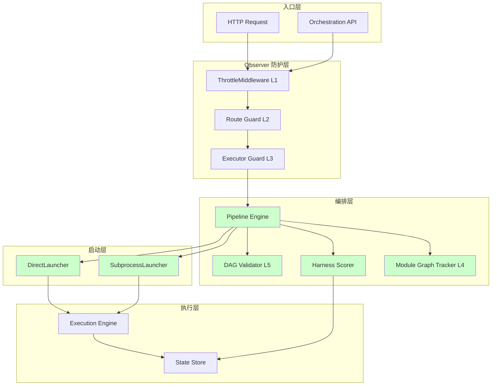
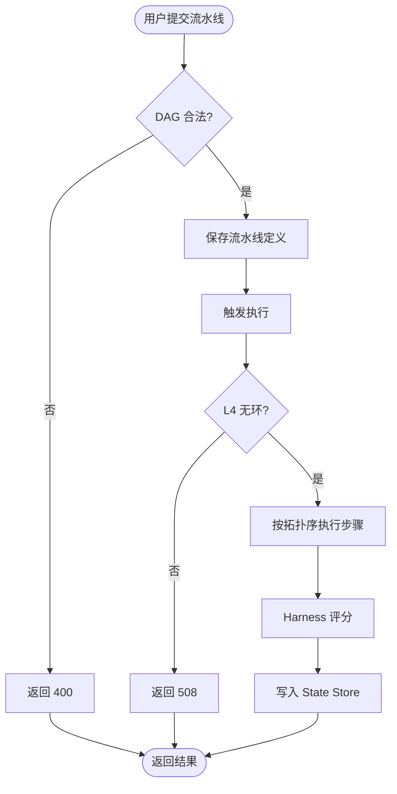
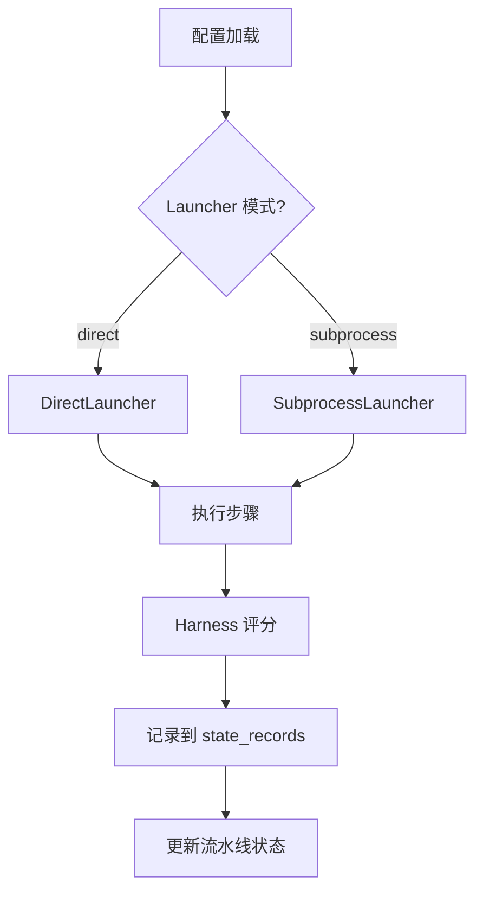
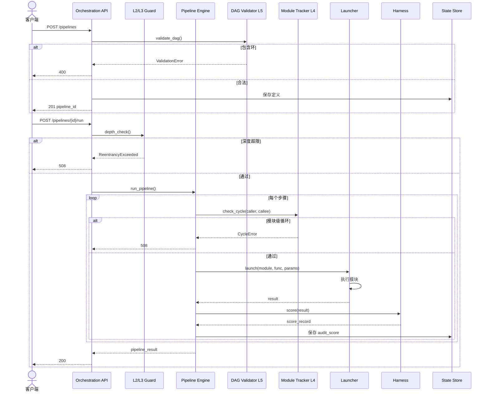

# Orchestration Overhaul — Requirement Tasks

> **Document Version**: v1.0 | **Last Updated**: 2026-05-03 | **Upstream**: [01 Requirement Document](./01_requirement-document.md) | **Downstream**: [03 Design Document](./03_design-document.md)
>

[Feature Overview](#feature-overview) | [Feature Analysis](#feature-analysis) | [Feature Details](#feature-details) | [Acceptance Criteria](#acceptance-criteria) | [Usage Scenario Examples](#usage-scenario-examples)

---

## Feature Overview

Orchestration Overhaul 为 YiAi 引入确定性执行编排层，将零散模块调用升级为可审计的流水线执行。核心能力包括：基于 DAG 的流水线引擎、Harness 确定性评分、Launcher 多模式兼容、以及 5 层循环防护。所有组件以非侵入方式集成到现有 `/execution` 和 State Store 体系之上。

🎯 **确定性执行**：流水线定义 → 拓扑排序 → 可重现结果。

⚡ **Launcher 硬化**：统一抽象接口，直接导入与子进程模式无缝切换。

📖 **5 层防护**：HTTP 限流 → 路由守卫 → 执行器守卫 → 模块图检测 → DAG 静态验证。

---

## Feature Analysis

### Feature Decomposition Diagram

### User Flow Diagram

### Feature Flow Diagram

### Sequence Diagram

---

## User Story Table

| Priority | User Story | Acceptance Criteria | Documents |
|----------|------------|---------------------|-----------|
| 🔴 P0 | As a system operator, I want orchestration pipelines with deterministic audit scoring, so that module execution chains are reproducible and quality is measured consistently. | 1. Pipeline JSON 定义 → 确定性执行顺序 2. Harness 每步评分 0-100 3. 分数持久化到 state_records 4. 失败步骤终止流水线并记录审计 | [01](./01_requirement-document.md), [03](./03_design-document.md) |
| 🔴 P0 | As a platform engineer, I want a hardened launcher abstraction, so that execution mode can switch between direct import and subprocess without route changes. | 1. Launcher 接口覆盖 direct + subprocess 2. 配置驱动模式切换 3. Launcher 健康检查端点 4. Launcher 失败优雅降级 | [01](./01_requirement-document.md), [03](./03_design-document.md) |
| 🟡 P1 | As a security engineer, I want 5-layer loop prevention, so that recursive or cyclic orchestration graphs cannot stack-overflow or deadlock the process. | 1. L1 HTTP 限流 2. L2 路由守卫 3. L3 执行器守卫 4. L4 模块级图检测 5. L5 DAG 静态验证 6. 任意层触发 508 或终止流水线 | [01](./01_requirement-document.md), [03](./03_design-document.md) |

---

## Main Operation Scenario Definitions

### Scenario S1: Submit and Execute a Pipeline

- **Scenario Description**: 用户提交一个 3 步骤流水线，成功执行并获得 Harness 评分。
- **Pre-conditions**: Orchestration 服务已启用；Launcher 已初始化；State Store 可写入。
- **Operation Steps**:
  1. 客户端 POST `/orchestration/pipelines`，提交包含 3 个步骤的 DAG 定义。
  2. 服务端验证 DAG 无环，保存定义，返回 pipeline_id。
  3. 客户端 POST `/orchestration/pipelines/{id}/run`。
  4. 编排引擎按拓扑序执行步骤。
  5. Harness 对每个步骤输出评分。
  6. 评分记录写入 `state_records`。
  7. 返回流水线结果和总分。
- **Expected Result**: 流水线完成；每个步骤有 0-100 评分；总分可查询。
- **Verification Focus Points**: 拓扑序正确；步骤失败时流水线终止；评分确定性（相同输入输出相同分数）。
- **Related Design Document Chapters**: [03 Architecture Design](#architecture-design), [03 Implementation Details](#implementation-details)

### Scenario S2: Switch Launcher Mode

- **Scenario Description**: 运维人员通过配置切换 Launcher 模式，从 direct 切换到 subprocess。
- **Pre-conditions**: 服务器可重启；subprocess 环境可用（python3 可执行）。
- **Operation Steps**:
  1. 修改 `config.yaml`：`orchestration_launcher_mode: subprocess`。
  2. 重启服务。
  3. 调用 GET `/health/launcher` 确认当前模式。
  4. 调用现有 `/execution` 端点，参数不变。
- **Expected Result**: `/execution` 返回与之前一致的结果；Launcher 模式显示为 subprocess；无 500 错误。
- **Verification Focus Points**: 配置热重载（若实现）；fallback 行为；子进程超时处理。
- **Related Design Document Chapters**: [03 Architecture Design](#architecture-design), [03 Implementation Details](#implementation-details)

### Scenario S3: 5-Layer Loop Prevention Blocks Cyclic Pipeline

- **Scenario Description**: 用户提交的流水线定义包含环，被 L5 DAG Validator 拦截。
- **Pre-conditions**: Orchestration API 可访问。
- **Operation Steps**:
  1. 客户端 POST `/orchestration/pipelines`，步骤 A 依赖步骤 C，步骤 C 依赖步骤 A。
  2. DAG Validator 检测环。
  3. 返回 400 错误，附带环路径信息。
- **Expected Result**: 流水线未被创建；响应包含具体环描述。
- **Verification Focus Points**: 错误信息可读；复杂环（A→B→C→A）也能检测；自环（A→A）也能检测。
- **Related Design Document Chapters**: [03 Architecture Design](#architecture-design), [03 Data Structure Design](#data-structure-design)

### Scenario S4: Runtime Module Cycle Blocked by L4

- **Scenario Description**: 合法 DAG 在执行时，某模块动态回调自身，被 L4 Module Graph Tracker 拦截。
- **Pre-conditions**: 流水线已提交且无静态环；模块代码存在动态自调用。
- **Operation Steps**:
  1. 提交并运行合法流水线。
  2. 步骤执行期间，模块内部调用 `/execution` 回调自身。
  3. L4 Tracker 记录 caller→callee 边，检测到重复节点，抛出异常。
  4. 流水线终止，返回 508。
- **Expected Result**: 流水线终止；L4 记录违规边；响应包含当前调用链。
- **Verification Focus Points**: ContextVar 隔离不同请求；异常后图状态清理；并发请求互不干扰。
- **Related Design Document Chapters**: [03 Implementation Details](#implementation-details)

---

## Impact Analysis

### 1. Search Terms and Change Point List

| Change Point | Type | Search Term | Source | Notes |
|--------------|------|-------------|--------|-------|
| PipelineEngine | New | `pipeline`, `orchestrat` | Design | 全新编排引擎 |
| DAGValidator | New | `dag`, `validate`, `cycle` | Design | 全新 DAG 验证器 |
| HarnessScorer | New | `harness`, `score`, `audit` | Design | 全新评分器 |
| BaseLauncher | New | `launcher`, `direct`, `subprocess` | Design | 全新启动器抽象 |
| ModuleGraphTracker | New | `graph`, `tracker`, `caller` | Design | 全新 L4 追踪器 |
| OrchestrationConfig | Modify | `orchestration_*` | Existing | config.py 新增字段 |
| OrchestrationRoute | New | `/orchestration` | Design | 新增 API 路由 |
| HealthLauncher | New | `/health/launcher` | Design | 新增健康端点 |
| execute_module | Modify | `execute_module` | Existing | executor.py 集成 Launcher |
| state_records | Modify | `state_records` | Existing | 新增 audit_score 记录类型 |

### 2. Change Point Impact Chain

| Change Point | Search Term | Hit File | Reference Method | Impact Level | Dependency Direction | Disposition Method | Closure Status | Explanation |
|--------------|-------------|----------|-----------------|--------------|---------------------|-------------------|----------------|-------------|
| PipelineEngine | `pipeline` | No references | N/A | Low | New | No action | Closed | 全新 |
| DAGValidator | `dag` | No references | N/A | Low | New | No action | Closed | 全新 |
| HarnessScorer | `harness` | No references | N/A | Low | New | No action | Closed | 全新 |
| BaseLauncher | `launcher` | No references | N/A | Low | New | No action | Closed | 全新 |
| ModuleGraphTracker | `tracker` | No references | N/A | Low | New | No action | Closed | 全新 |
| OrchestrationConfig | `orchestration` | `src/core/config.py` | Field list | Low | Upstream | Sync modify | Closed | 新增字段 |
| OrchestrationRoute | `orchestration` | No references | N/A | Low | New | No action | Closed | 全新端点 |
| HealthLauncher | `health` | No references | N/A | Low | New | No action | Closed | 全新端点 |
| execute_module | `execute_module` | `src/services/execution/executor.py` | Function | Medium | Downstream | Sync modify | Closed | 需集成 Launcher 抽象 |
| state_records | `state_records` | `src/services/state/state_service.py` | Collection | Low | Downstream | Sync modify | Closed | 新增 record_type |

### 3. Dependency Closure Summary

| Change Point | Upstream Verified | Reverse Verified | Transitive Closed | Tests/Docs/Config Covered | Conclusion |
|--------------|-------------------|------------------|-------------------|--------------------------|------------|
| PipelineEngine | Yes (config.py) | Yes (routes, main.py) | Yes | Yes | Closed |
| DAGValidator | Yes (config.py) | Yes (PipelineEngine) | Yes | Yes | Closed |
| HarnessScorer | Yes (config.py) | Yes (PipelineEngine, state.py) | Yes | Yes | Closed |
| BaseLauncher | Yes (config.py) | Yes (executor.py, main.py) | Yes | Yes | Closed |
| ModuleGraphTracker | Yes (config.py) | Yes (executor.py) | Yes | Yes | Closed |
| OrchestrationRoute | Yes (main.py) | Yes | Yes | Yes | Closed |
| HealthLauncher | Yes (main.py) | Yes | Yes | Yes | Closed |
| execute_module | Yes (executor.py) | Yes (launcher, guard) | Yes | Yes | Closed |
| state_records | Yes (state_service.py) | Yes (harness) | Yes | Yes | Closed |

### 4. Uncovered Risks

| Risk Source | Reason | Impact | Mitigation |
|-------------|--------|--------|------------|
| Launcher 模式切换未验证 | SubprocessLauncher 在真实负载下可能超时或内存泄漏 | 执行失败 | 在 CI 中增加 subprocess 模式集成测试 |
| Harness 评分标准主观 | 默认 rubric 可能不适用所有模块类型 | 评分失真 | 支持按模块类型自定义 rubric（P1） |
| DAG 验证性能 | 100 步以内无影响；超大规模图验证可能耗时 | 提交延迟 | 限制最大步数；使用 Kahn 算法 O(V+E) |
| L4 Tracker 内存泄漏 | ContextVar 清理异常导致图状态残留 | 误报循环 | try/finally 保证清理；设置 tracker TTL |

### Change Scope Summary

- **Directly modify**: 4 files (`config.py`, `main.py`, `executor.py`, `config.yaml`)
- **Verify compatibility**: 2 files (`middleware.py`, `exception_handler.py`)
- **Trace transitive**: 2 files (`database.py`, `state_service.py`)
- **Need manual review**: 0 files

---

## Feature Details

### Orchestration Pipeline Engine

**Feature Description**: DAG 驱动的流水线执行引擎，支持步骤依赖和变量传递。

**Value**: 将分散的模块调用组织成可复现、可观测的流水线。

**Pain Point**: 当前 `/execution` 只能单次调用一个模块，无法表达多步骤业务逻辑。

**Benefit**: 客户端只需提交一次定义，服务端负责调度、重试、评分和持久化。

### Harness Audit Scoring

**Feature Description**: 确定性评分系统，为每个步骤输出计算 0-100 分。

**Value**: 提供量化质量指标，支持回归检测和 A/B 对比。

**Pain Point**: 当前执行结果只有 success/failed，无质量梯度。

**Benefit**: 细粒度质量数据驱动持续优化。

### Launcher Compatibility

**Feature Description**: 统一 Launcher 抽象，支持 direct 和 subprocess 两种模式。

**Value**: 执行模式切换对 API 调用方透明。

**Pain Point**: 当前 `executor.py` 混用直接导入和 subprocess，逻辑耦合。

**Benefit**: 安全加固时零代码改动切换隔离模式。

### 5-Layer Loop Prevention

**Feature Description**: 在现有 ReentrancyGuard 基础上增加 L4 模块图追踪和 L5 DAG 验证。

**Value**: 静态 + 动态双重保障，阻断所有已知循环场景。

**Pain Point**: 单一深度守卫无法检测跨模块间接循环（A→B→A）。

**Benefit**: 将无限循环消灭在发生前（L5）或第一时间（L4）。

---

## Acceptance Criteria

### P0

- [ ] Pipeline 定义可通过 API 提交并确定性执行。
- [ ] Harness 为每步评分 0-100。
- [ ] Launcher 抽象支持 direct 和 subprocess 模式。
- [ ] Launcher 失败时安全降级。
- [ ] 5 层循环防护全部生效，任意层可终止递归。

### P1

- [ ] Pipeline 执行状态可通过 API 查询。
- [ ] Harness 分数支持过滤和导出。
- [ ] Launcher 健康端点显示当前模式和最近错误。
- [ ] Pipeline DAG 在提交前拒绝环。

### P2

- [ ] 可视化流水线编辑器（未来）。
- [ ] 远程 Worker Launcher 模式（未来）。
- [ ] 基于历史数据的自适应评分标准（未来）。

---

## Usage Scenario Examples

### Example 1: Running an Audit Pipeline

📋 **Background**: 数据加工工作流需要抓取 RSS、总结文章、上传结果。

🎨 **Operation**:
1. POST `/orchestration/pipelines` 提交 3 步 DAG 定义。
2. POST `/orchestration/pipelines/{id}/run`。
3. GET `/orchestration/pipelines/{id}/status` 观察进度。
4. GET `/state/records?record_type=audit_score` 查看评分。

📋 **Result**: 流水线完成；每步有评分；总分可查询。

### Example 2: Switching Launcher Mode

📋 **Background**: 安全审计要求所有模块执行使用子进程隔离。

🎨 **Operation**:
1. 更新 `config.yaml`：`orchestration_launcher_mode: subprocess`。
2. 重启服务。
3. GET `/health/launcher` 验证当前模式。
4. 现有 `/execution` 调用无需修改。

📋 **Result**: 所有模块执行在子进程中运行；API 契约不变。

### Example 3: Detecting Cyclic Pipeline

📋 **Background**: 用户误定义步骤 C 依赖步骤 A，同时步骤 A 依赖步骤 C。

🎨 **Operation**:
1. POST `/orchestration/pipelines` 提交含环定义。

📋 **Result**: API 返回 400，附带 `Cycle detected: A -> C -> A`。

---

## Postscript: Future Planning & Improvements

1. **Remote Worker Launcher**: 扩展 `BaseLauncher` 支持 Celery/RQ 远程派发。
2. **Pipeline Visualization**: 从流水线定义生成 Mermaid 图表用于文档。
3. **Adaptive Rubrics**: 利用历史 Harness 分数训练质量预测模型。
4. **Distributed Loop Detection**: 通过 Redis 共享 L4 调用图状态，实现集群级循环防护。
