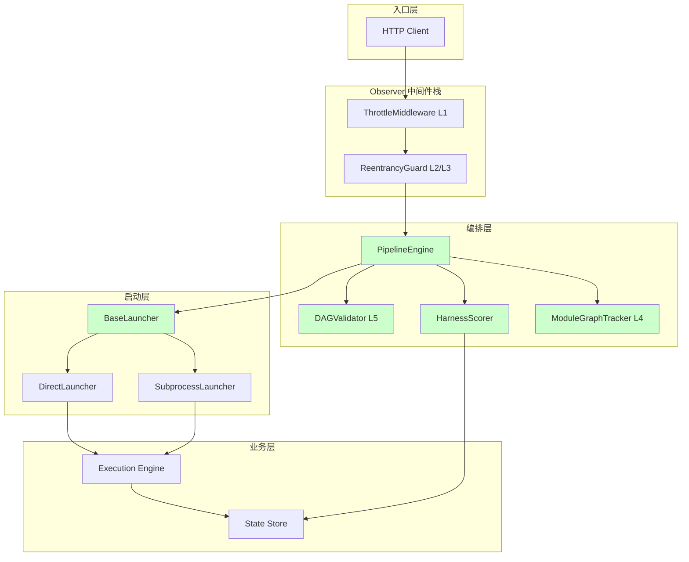
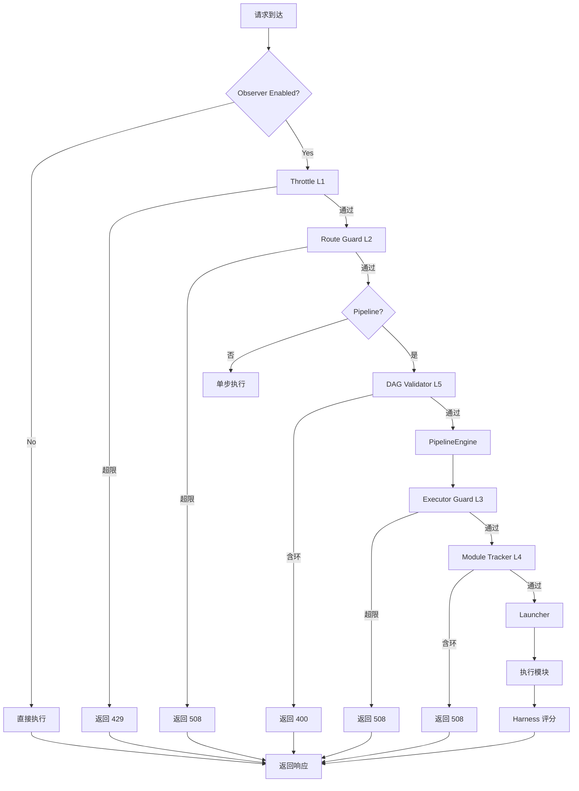
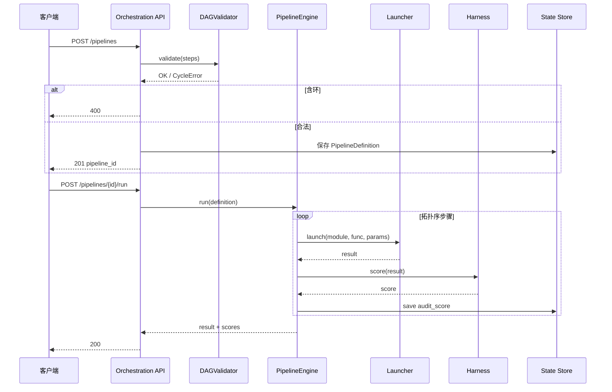

# Orchestration Overhaul — Design Document

> **Document Version**: v1.0 | **Last Updated**: 2026-05-03 | **Upstream**: [02 Requirement Tasks](./02_requirement-tasks.md) | **Downstream**: [04 Usage Document](./04_usage-document.md)
>

[Design Overview](#design-overview) | [Architecture Design](#architecture-design) | [Changes](#changes) | [Implementation Details](#implementation-details) | [Impact Analysis](#impact-analysis)

---

## Design Overview

Orchestration Overhaul 为 YiAi 引入确定性编排层，核心组件包括 PipelineEngine（DAG 执行）、DAGValidator（环检测）、HarnessScorer（审计评分）、BaseLauncher（启动抽象）和 ModuleGraphTracker（L4 循环检测）。设计遵循“非侵入、可组合、故障隔离”原则：编排层包裹现有执行引擎但不嵌入其中；Launcher 抽象对上层透明；5 层循环防护可独立启用或禁用。

设计原则：

🎯 **非侵入接入**：PipelineEngine 调用现有 `execute_module`，不修改 executor 内部逻辑。

⚡ **最小开销**：DAG 验证使用 Kahn 算法 O(V+E)；Harness 评分仅对最终输出计算一次；ModuleGraphTracker 使用 ContextVar（无锁）。

🔧 **故障隔离**：任何 Launcher 失败都触发 fallback 到 DirectLauncher；Harness 评分失败不影响执行结果。

---

## Architecture Design

### Overall Architecture



### Module Division

| Module Name | Responsibility | Location |
|-------------|--------------|----------|
| PipelineEngine | DAG 拓扑排序执行、步骤调度、结果聚合 | `src/services/orchestration/engine.py` |
| DAGValidator | Kahn 算法环检测、步骤依赖合法性校验 | `src/services/orchestration/validator.py` |
| HarnessScorer | 确定性评分、默认 rubric、分数持久化 | `src/services/orchestration/harness.py` |
| BaseLauncher | 统一启动接口、配置驱动模式选择 | `src/services/orchestration/launcher.py` |
| DirectLauncher | 直接 import + 异步调用 | `src/services/orchestration/launcher.py` |
| SubprocessLauncher | asyncio subprocess 隔离执行 | `src/services/orchestration/launcher.py` |
| ModuleGraphTracker | L4 调用图追踪、ContextVar 存储 | `src/core/observer/tracker.py` |
| Orchestration Config | 配置项：launcher 模式、超时、步数限制 | `src/core/config.py` (新增字段) |
| Orchestration Route | API 端点：提交/运行/查询流水线 | `src/api/routes/orchestration.py` |
| Health Launcher | 暴露 Launcher 运行时状态 | `src/api/routes/observer_health.py` (扩展) |

### Core Flow



---

## Changes

### Problem Analysis

1. **无编排能力**：`/execution` 只能单次调用一个模块，无法表达多步骤业务逻辑和依赖关系。
2. **执行模式耦合**：`executor.py` 混用直接导入和 subprocess 逻辑，切换模式需改代码。
3. **无质量评分**：执行结果只有二元 success/failed，无法衡量输出质量梯度。
4. **单层循环防护**：现有 ReentrancyGuard 只能检测同请求深度，无法检测跨模块间接循环。

### Solution

引入 `src/services/orchestration/` 包和 `src/core/observer/tracker.py`，提供流水线编排、Launcher 抽象、Harness 评分和 5 层循环防护。

#### File List

| # | File Path | Change Type | Description |
|---|-----------|-------------|-------------|
| 1 | `src/services/orchestration/__init__.py` | New | 包初始化 |
| 2 | `src/services/orchestration/engine.py` | New | PipelineEngine DAG 执行 |
| 3 | `src/services/orchestration/validator.py` | New | DAGValidator 环检测 |
| 4 | `src/services/orchestration/harness.py` | New | HarnessScorer 评分器 |
| 5 | `src/services/orchestration/launcher.py` | New | BaseLauncher + DirectLauncher + SubprocessLauncher |
| 6 | `src/core/observer/tracker.py` | New | ModuleGraphTracker L4 |
| 7 | `src/api/routes/orchestration.py` | New | 流水线 API 路由 |
| 8 | `src/core/config.py` | Modify | 新增 orchestration_* 配置字段 |
| 9 | `src/main.py` | Modify | 注册 orchestration 路由 |
| 10 | `src/services/execution/executor.py` | Modify | 集成 Launcher 抽象和 ModuleGraphTracker |
| 11 | `src/api/routes/observer_health.py` | Modify | 扩展 Launcher 健康状态 |
| 12 | `config.yaml` | Modify | 添加 orchestration 默认配置 |

#### Selection Rationale

- `src/services/orchestration/` 作为新业务域包，与 `services/execution/` 并列，体现其业务编排定位。
- Launcher 抽象放在 orchestration 包而非 core，因为它属于业务逻辑而非纯基础设施。
- ModuleGraphTracker 放在 `core/observer/` 是因为它是横切关注点的安全层，与 ReentrancyGuard 并列。

### Before/After Comparison

| Aspect | Before | After |
|--------|--------|-------|
| 编排 | 无，仅单次 `/execution` | DAG 流水线引擎 + 拓扑执行 |
| 启动模式 | 直接导入和 subprocess 混杂 | 统一 BaseLauncher，配置切换 |
| 评分 | 二元 success/failed | Harness 0-100 确定性评分 |
| 循环防护 | L3 ReentrancyGuard 单一层 | L1-L5 五层防御 |

---

## Impact Analysis

### 1. Search Terms and Change Point List

| Change Point | Type | Search Term | Source | Notes |
|--------------|------|-------------|--------|-------|
| PipelineEngine | New class | `pipeline`, `engine` | Design | 新增 |
| DAGValidator | New class | `validator`, `cycle` | Design | 新增 |
| HarnessScorer | New class | `harness`, `score` | Design | 新增 |
| BaseLauncher | New class | `launcher` | Design | 新增 |
| DirectLauncher | New class | `direct` | Design | 新增 |
| SubprocessLauncher | New class | `subprocess` | Design | 新增 |
| ModuleGraphTracker | New class | `tracker`, `graph` | Design | 新增 |
| orchestration config | Modify | `orchestration_*` | Existing | config.py 新增 |
| orchestration route | New route | `/orchestration` | Design | 新增 |
| execute_module | Modify | `execute_module` | Existing | executor.py 集成 |
| state_records | Modify | `state_records` | Existing | 新增 record_type |

### 2. Change Point Impact Chain

| Change Point | Search Term | Hit File | Reference Method | Impact Level | Dependency Direction | Disposition Method | Closure Status | Explanation |
|--------------|-------------|----------|-----------------|--------------|---------------------|-------------------|----------------|-------------|
| PipelineEngine | `pipeline` | No references | N/A | Low | New | No action | Closed | 全新 |
| DAGValidator | `validator` | No references | N/A | Low | New | No action | Closed | 全新 |
| HarnessScorer | `harness` | No references | N/A | Low | New | No action | Closed | 全新 |
| BaseLauncher | `launcher` | No references | N/A | Low | New | No action | Closed | 全新 |
| ModuleGraphTracker | `tracker` | No references | N/A | Low | New | No action | Closed | 全新 |
| orchestration config | `orchestration` | `src/core/config.py` | Field list | Low | Upstream | Sync modify | Closed | 新增字段 |
| orchestration route | `orchestration` | No references | N/A | Low | New | No action | Closed | 全新端点 |
| execute_module | `execute_module` | `src/services/execution/executor.py` | Function | Medium | Downstream | Sync modify | Closed | 集成 launcher + tracker |
| state_records | `state_records` | `src/services/state/state_service.py` | Collection | Low | Downstream | Sync modify | Closed | 新增 audit_score |

### 3. Dependency Closure Summary

| Change Point | Upstream Verified | Reverse Verified | Transitive Closed | Tests/Docs/Config Covered | Conclusion |
|--------------|-------------------|------------------|-------------------|--------------------------|------------|
| PipelineEngine | Yes (config.py) | Yes (routes) | Yes | Yes | Closed |
| DAGValidator | Yes (config.py) | Yes (engine) | Yes | Yes | Closed |
| HarnessScorer | Yes (config.py) | Yes (engine, state) | Yes | Yes | Closed |
| BaseLauncher | Yes (config.py) | Yes (executor) | Yes | Yes | Closed |
| ModuleGraphTracker | Yes (config.py) | Yes (executor) | Yes | Yes | Closed |
| Orchestration Route | Yes (main.py) | Yes | Yes | Yes | Closed |
| execute_module | Yes (executor.py) | Yes (launcher, tracker) | Yes | Yes | Closed |
| state_records | Yes (state_service.py) | Yes (harness) | Yes | Yes | Closed |

### 4. Uncovered Risks

| Risk Source | Reason | Impact | Mitigation |
|-------------|--------|--------|------------|
| SubprocessLauncher 超时 | 子进程执行可能无限挂起 | 请求阻塞 | 配置 timeout + kill |
| Harness rubric 不适用 | 默认评分标准不适合所有模块 | 评分失真 | 支持模块级自定义 rubric |
| Pipeline 状态丢失 | 服务重启导致内存中 pipeline 状态丢失 | 状态不一致 | 持久化到 MongoDB |
| L4 Tracker 并发泄漏 | 异常导致调用图未清理 | 后续请求误拦截 | try/finally + TTL 清理 |

### Change Scope Summary

- **Directly modify**: 5 files (`config.py`, `main.py`, `executor.py`, `observer_health.py`, `config.yaml`)
- **Verify compatibility**: 2 files (`middleware.py`, `exception_handler.py`)
- **Trace transitive**: 2 files (`database.py`, `state_service.py`)
- **Need manual review**: 0 files

---

## Implementation Details

### Technical Points

#### 1. PipelineEngine (`src/services/orchestration/engine.py`)

**What**: DAG 拓扑排序执行引擎。

**How**: 使用 Kahn 算法计算拓扑序。每个步骤执行后，将输出写入共享上下文，下游步骤通过变量插值引用。步骤失败时终止流水线并记录审计。

**Why**: Kahn 算法时间复杂度 O(V+E)，适合 100 步以内的流水线。

#### 2. DAGValidator (`src/services/orchestration/validator.py`)

**What**: 静态环检测和依赖合法性校验。

**How**: 在 Kahn 算法中统计入度；若算法结束后仍有未访问节点，说明存在环。

**Why**: 在提交阶段拒绝非法定义，避免运行时才发现循环。

#### 3. HarnessScorer (`src/services/orchestration/harness.py`)

**What**: 确定性评分器。

**How**: 默认 rubric：输出非空 dict/list 且无副作用 → 100；输出空但无异常 → 50；异常或超时 → 0。评分函数纯函数，给定相同输入输出必有相同分数。

**Why**: 纯函数保证确定性，支持回归测试对比。

#### 4. BaseLauncher (`src/services/orchestration/launcher.py`)

**What**: 启动器抽象。

**How**: `BaseLauncher` 定义 async `launch(module_path, function_name, parameters)` 接口。`DirectLauncher` 委托 `execute_module`；`SubprocessLauncher` 序列化参数到 JSON，通过 `asyncio.create_subprocess_exec` 调用独立进程。

**Why**: 抽象隔离使模式切换对调用方透明。

#### 5. ModuleGraphTracker (`src/core/observer/tracker.py`)

**What**: L4 模块调用图追踪。

**How**: 使用 `ContextVar[dict]` 存储当前请求已访问的 `caller→callee` 边集合。每次模块调用前检查是否已存在该边，存在则抛出 `LoopDetected`。

**Why**: ContextVar 保证请求隔离；集合查找 O(1)。

### Key Code

PipelineEngine 核心执行循环：

```python
import asyncio
import logging
from typing import Dict, Any, List
from collections import deque

logger = logging.getLogger(__name__)

class PipelineEngine:
    """DAG 流水线执行引擎"""

    def __init__(self, launcher, harness, tracker):
        self.launcher = launcher
        self.harness = harness
        self.tracker = tracker

    async def run(self, pipeline_def: Dict[str, Any]) -> Dict[str, Any]:
        steps = pipeline_def["steps"]
        adj = {s["id"]: s.get("depends_on", []) for s in steps}
        # Kahn 算法拓扑排序
        in_degree = {s["id"]: 0 for s in steps}
        for deps in adj.values():
            for d in deps:
                in_degree[d] = in_degree.get(d, 0) + 1
        queue = deque([sid for sid, deg in in_degree.items() if deg == 0])
        order = []
        while queue:
            sid = queue.popleft()
            order.append(sid)
            for dep in adj.get(sid, []):
                in_degree[dep] -= 1
                if in_degree[dep] == 0:
                    queue.append(dep)
        if len(order) != len(steps):
            raise ValueError("Cycle detected in pipeline")

        context = {}
        scores = {}
        for sid in order:
            step = next(s for s in steps if s["id"] == sid)
            result = await self.launcher.launch(
                step["module"], step["function"], step.get("parameters", {})
            )
            context[sid] = result
            scores[sid] = self.harness.score(result)
        return {"context": context, "scores": scores}
```

ModuleGraphTracker 实现：

```python
import contextvars
from typing import Set, Tuple

_call_graph: contextvars.ContextVar[Set[Tuple[str, str]]] = contextvars.ContextVar(
    "call_graph", default=set()
)

class ModuleGraphTracker:
    """L4 模块调用图追踪器"""

    def check(self, caller: str, callee: str) -> None:
        graph = _call_graph.get()
        edge = (caller, callee)
        if edge in graph:
            raise LoopDetected(f"Cycle detected: {caller} -> {callee}")
        graph.add(edge)
        _call_graph.set(graph)

    def reset(self, token) -> None:
        _call_graph.reset(token)
```

### Dependencies

| Dependency | Purpose | Install Command | Risk |
|-----------|---------|-----------------|------|
| 无新增 | 全部使用标准库 + 现有依赖 | — | 无 |

### Testing Considerations

- **单元测试**：验证 Kahn 算法拓扑序、环检测、Harness 评分确定性。
- **集成测试**：通过 `TestClient` 提交流水线并验证完整执行。
- **并发测试**：验证 ModuleGraphTracker 在不同请求间的隔离性。
- **Launcher 测试**：对比 DirectLauncher 和 SubprocessLauncher 输出一致性。

---

## Main Operation Scenario Implementation

### Scenario S1: Submit and Execute a Pipeline

- **Linked 02 Scenario**: [S1](./02_requirement-tasks.md#scenario-s1-submit-and-execute-a-pipeline)
- **Implementation Overview**: PipelineEngine 解析 DAG，按拓扑序执行，Harness 评分，结果持久化。
- **Modules and Responsibilities**:
  - `src/services/orchestration/validator.py`: 验证 DAG 无环。
  - `src/services/orchestration/engine.py`: 拓扑排序执行。
  - `src/services/orchestration/harness.py`: 评分。
  - `src/services/state/state_service.py`: 持久化 audit_score。
- **Key Code Paths**:
  1. POST `/orchestration/pipelines` → `DAGValidator.validate()`
  2. 验证通过 → 保存定义
  3. POST `/orchestration/pipelines/{id}/run` → `PipelineEngine.run()`
  4. 每步 → `BaseLauncher.launch()` → `Harness.score()`
  5. 分数 → `StateStoreService.create(record_type="audit_score")`
- **Verification Points**:
  - 拓扑序与依赖定义一致
  - 相同定义多次执行结果一致
  - 评分在 0-100 之间

### Scenario S2: Switch Launcher Mode

- **Linked 02 Scenario**: [S2](./02_requirement-tasks.md#scenario-s2-switch-launcher-mode)
- **Implementation Overview**: 配置驱动 `BaseLauncher` 具体实现选择。
- **Modules and Responsibilities**:
  - `src/services/orchestration/launcher.py`: 根据配置实例化 DirectLauncher 或 SubprocessLauncher。
  - `src/core/config.py`: `orchestration_launcher_mode` 字段。
  - `src/api/routes/observer_health.py`: 暴露当前 launcher 模式。
- **Key Code Paths**:
  1. `config.yaml` 设置 `orchestration_launcher_mode`
  2. `main.py` 读取配置，实例化对应 Launcher
  3. `executor.py` 通过 Launcher 接口执行，不感知具体模式
  4. GET `/health/launcher` 返回当前模式
- **Verification Points**:
  - 切换后 `/execution` 行为不变
  - SubprocessLauncher 超时配置生效
  - Health 端点反映实际模式

### Scenario S3: 5-Layer Loop Prevention Blocks Cyclic Pipeline

- **Linked 02 Scenario**: [S3](./02_requirement-tasks.md#scenario-s3-5-layer-loop-prevention-blocks-cyclic-pipeline)
- **Implementation Overview**: L5 DAGValidator 在提交阶段拦截环；L4 ModuleGraphTracker 在执行阶段拦截动态循环。
- **Modules and Responsibilities**:
  - `src/services/orchestration/validator.py`: L5 静态验证。
  - `src/core/observer/tracker.py`: L4 动态追踪。
- **Key Code Paths**:
  1. 提交含环定义 → `validator.validate()` 失败 → 400
  2. 合法定义执行时模块自调用 → `tracker.check()` 失败 → 508
- **Verification Points**:
  - 自环（A→A）被检测
  - 多节点环（A→B→C→A）被检测
  - 错误信息包含环路径

---

## Data Structure Design

### Data Flow



### Schema Definitions

#### PipelineDefinition (Pydantic)

```python
from typing import Dict, Any, List, Optional
from pydantic import BaseModel, Field

class PipelineStep(BaseModel):
    id: str = Field(..., min_length=1)
    module: str = Field(..., min_length=1)
    function: str = Field(..., min_length=1)
    parameters: Dict[str, Any] = Field(default_factory=dict)
    depends_on: List[str] = Field(default_factory=list)

class PipelineDefinition(BaseModel):
    name: str = Field(default="")
    steps: List[PipelineStep] = Field(..., min_length=1)
```

#### AuditScoreRecord (内部)

```python
class AuditScoreRecord(BaseModel):
    pipeline_id: str
    step_id: str
    score: int = Field(..., ge=0, le=100)
    rubric_version: str
    timestamp: str
```

#### LauncherHealth (响应模型)

```python
class LauncherHealth(BaseModel):
    mode: str  # "direct" | "subprocess"
    healthy: bool
    last_error: Optional[str]
```

---

## Postscript: Future Planning & Improvements

1. **Remote Launcher**: 扩展 `BaseLauncher` 支持 Celery/RQ 远程派发。
2. **Pipeline Visualization**: 从定义生成 Mermaid 流程图。
3. **Adaptive Rubrics**: 基于历史 Harness 分数训练评分模型。
4. **分布式 Loop Detection**: Redis 共享 L4 调用图状态。
5. **Pipeline Cache**: 对纯函数步骤启用结果缓存，避免重复执行。
