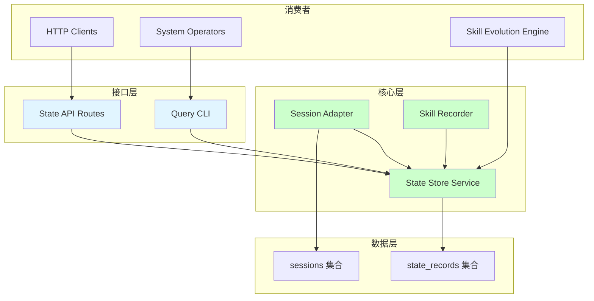
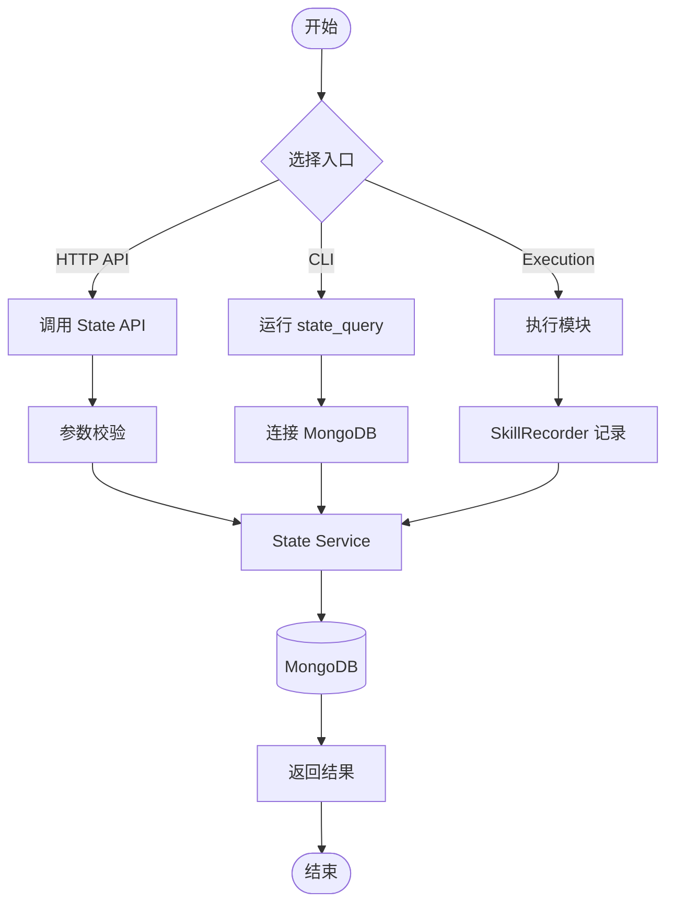
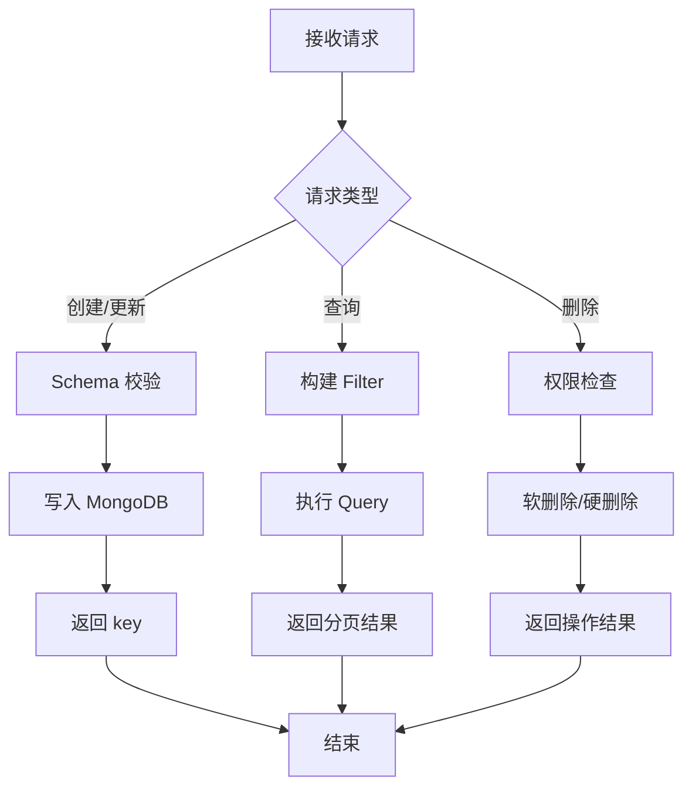
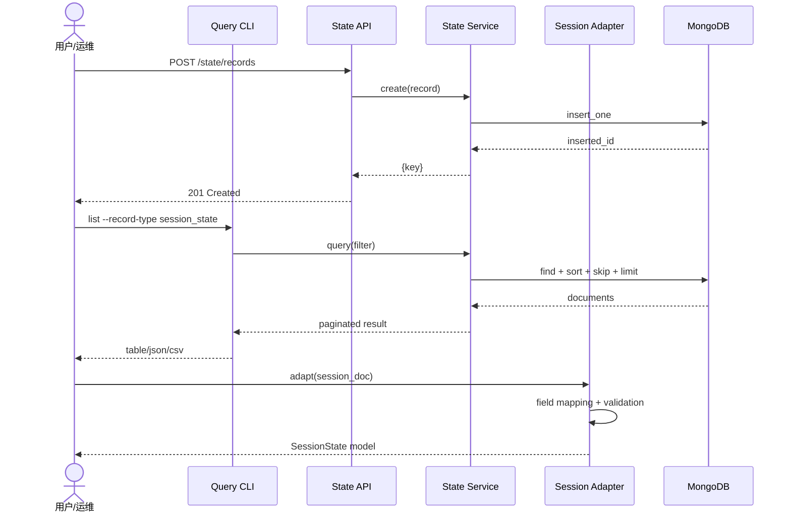

# Session & State Infrastructure — Requirement Tasks

> **Document Version**: v1.0 | **Last Updated**: 2026-05-03 | **Upstream**: [01 Requirement Document](./01_requirement-document.md) | **Downstream**: [03 Design Document](./03_design-document.md)
>

[Feature Overview](#feature-overview) | [Feature Analysis](#feature-analysis) | [Feature Details](#feature-details) | [Acceptance Criteria](#acceptance-criteria) | [Usage Scenario Examples](#usage-scenario-examples)

---

## Feature Overview

本功能为 YiAi 构建一套统一的状态基础设施，解决现有系统中状态访问分散、会话数据无模式、技能自改进缺乏数据支撑三大问题。核心交付物包括：基于 MongoDB 的结构化状态仓库（State Store），提供类型安全的 CRUD 与查询；Typer 命令行工具支持离线运维；Pydantic 会话适配器桥接遗留 `sessions` 数据；以及技能执行记录器，将运行时结果持久化以支撑未来自改进闭环。整个基础设施与现有 FastAPI 服务、Motor 异步驱动、Pydantic 配置体系深度集成，不引入额外运行时依赖（仅 CLI 新增 `typer`）。

🎯 **消除耦合**：统一状态抽象取代 `data_service.py` 中的硬编码字段处理。

⚡ **运维友好**：CLI 让查询和导出不再依赖 HTTP 服务启动。

📖 **数据驱动**：技能执行历史从文档管道脚本下沉到后端数据库，奠定可演化基础。

---

## Feature Analysis

### Feature Decomposition Diagram



上图展示了功能的四层结构：核心层提供状态存储、会话适配和技能记录；接口层通过 REST API 和 CLI 对外暴露；数据层依赖 MongoDB 的两个集合；消费者包括 HTTP 客户端、运维人员和未来的技能演化引擎。

### User Flow Diagram



用户可通过三条路径使用状态基础设施：HTTP API 适合应用集成，CLI 适合运维操作，模块执行路径自动触发技能记录。

### Feature Flow Diagram



状态仓库内部流程根据请求类型分流：写操作必须经过 Pydantic Schema 校验；查询操作构建 MongoDB filter 并支持分页；删除操作需通过权限检查。

### Sequence Diagram



序列图展示了三种核心交互：通过 API 创建记录、通过 CLI 查询记录、以及通过适配器转换会话数据。

---

## User Story Table

| Priority | User Story | Acceptance Criteria | Documents |
|----------|------------|---------------------|-----------|
| 🔴 P0 | As a backend developer, I want a structured state store with CRUD and query APIs, so that I can persist and retrieve application states reliably. | 1. Typed schema validation<br>2. Filter by type, tags, time, text<br>3. Pagination (default 2000, max 8000)<br>4. Stable `key` field | [01](./01_requirement-document.md), [03](./03_design-document.md) |
| 🔴 P0 | As a system operator, I want a query CLI for the state store, so that I can inspect and export state data without starting the HTTP server. | 1. `list`, `get`, `export`, `stats`<br>2. Reuse HTTP API query syntax<br>3. Run via `python -m`<br>4. Table/JSON/CSV output | [01](./01_requirement-document.md), [03](./03_design-document.md) |
| 🟡 P1 | As a developer, I want session adapters that convert raw session documents to structured records, so that I can validate and migrate existing session data. | 1. Handle legacy fields<br>2. Produce `SessionState` model<br>3. Batch progress + errors<br>4. Incompatible data logged | [01](./01_requirement-document.md), [03](./03_design-document.md) |
| 🟡 P1 | As the system, I want to record skill execution outcomes, so that skills can access historical performance data for self-improvement. | 1. Async fire-and-forget<br>2. Schema: name, status, duration, etc.<br>3. Failure does not affect execution<br>4. Query by skill, status, time | [01](./01_requirement-document.md), [03](./03_design-document.md) |

---

## Main Operation Scenario Definitions

### Scenario S1: Create and Query a State Record via HTTP API

- **Scenario Description**: 用户通过 HTTP API 创建一个状态记录，随后使用过滤条件查询该记录。
- **Pre-conditions**: FastAPI 服务已启动，MongoDB 可连接，`state_records` 集合已存在。
- **Operation Steps**:
  1. 发送 POST `/state/records`，Body 包含 `record_type`、`title`、`payload`、`tags`。
  2. 记录服务端 Schema 校验通过后写入 MongoDB，返回 `key`。
  3. 发送 GET `/state/records?record_type={type}&title={keyword}`。
  4. 服务端构建 filter，执行分页查询，返回结果列表。
- **Expected Result**: 创建成功返回 201 及 `key`；查询成功返回包含目标记录的分页数据。
- **Verification Focus Points**: Schema 校验拒绝非法字段；查询支持大小写不敏感的文本匹配；分页参数越界时自动修正。
- **Related Design Document Chapters**: [03 Architecture Design](#architecture-design), [03 Data Structure Design](#data-structure-design)

### Scenario S2: Query and Export Records via CLI

- **Scenario Description**: 运维人员通过命令行查询状态记录，并将结果导出为 JSON 文件。
- **Pre-conditions**: Python 环境可用，`typer` 已安装，MongoDB 连接字符串可访问。
- **Operation Steps**:
  1. 运行 `python -m src.cli.state_query list --record-type skill_execution --since 1d`。
  2. CLI 解析参数，连接 MongoDB，构建与 API 相同的 filter。
  3. 执行查询，结果格式化为表格输出到终端。
  4. 追加 `--format json --output export.json`，结果写入文件。
- **Expected Result**: 终端显示匹配的记录表格；JSON 文件包含完整记录列表及分页元数据。
- **Verification Focus Points**: CLI 参数解析正确；filter 逻辑与 API 一致；JSON 输出包含 `list` 和 `total`。
- **Related Design Document Chapters**: [03 Architecture Design](#architecture-design), [03 Implementation Details](#implementation-details)

### Scenario S3: Batch Adapt Legacy Sessions

- **Scenario Description**: 开发者批量将遗留 `sessions` 集合数据转换为结构化 `SessionState`。
- **Pre-conditions**: `sessions` 集合中存在历史数据；`SessionAdapter` 已实现。
- **Operation Steps**:
  1. 调用 `SessionAdapter.adapt_batch(cursor, batch_size=100)`。
  2. 适配器逐批读取 `sessions` 文档，映射字段并校验。
  3. 有效文档转换为 `SessionState` 列表；无效文档记录错误日志。
  4. 可选：将转换后的记录写入 `state_records` 集合。
- **Expected Result**: 返回 `AdaptationResult`，包含成功数、失败数、错误明细。
- **Verification Focus Points**: `pageContent` 和 `messages` 字段正确映射；缺失字段使用默认值；空数组 `messages` 不触发验证错误。
- **Related Design Document Chapters**: [03 Changes](#changes), [03 Implementation Details](#implementation-details)

### Scenario S4: Record Skill Execution Outcome

- **Scenario Description**: 系统在执行模块调用后，自动记录执行结果到状态仓库。
- **Pre-conditions**: `SkillRecorder` 已初始化；`execute_module` 被调用。
- **Operation Steps**:
  1. `execute_module` 开始执行，记录开始时间。
  2. 执行完成（成功或异常），计算耗时。
  3. `SkillRecorder.record()` 被异步调用，构造 `SkillExecutionRecord`。
  4. 记录写入 `state_records` 集合，类型标记为 `skill_execution`。
- **Expected Result**: 状态仓库中新增一条 `skill_execution` 记录；原始执行结果不受记录失败影响。
- **Verification Focus Points**: 异步调用不阻塞返回；记录失败仅打日志不抛异常；异常场景包含 traceback 摘要。
- **Related Design Document Chapters**: [03 Architecture Design](#architecture-design), [03 Implementation Details](#implementation-details)

---

## Impact Analysis

### 1. Search Terms and Change Point List

| Change Point | Type | Search Term | Source | Notes |
|--------------|------|-------------|--------|-------|
| State Store Service | New module | `state_store`, `state_service`, `StateRecord` | Feature requirement | New service layer module |
| Query CLI | New module | `state_query`, `typer`, `cli` | Feature requirement | New CLI entry point |
| Session Adapter | New module | `session_adapter`, `SessionState` | Feature requirement | Bridges legacy sessions |
| Skill Recorder | New module | `skill_recorder`, `SkillExecutionRecord` | Feature requirement | Hooks into executor |
| Config additions | Config update | `state_store` | Feature requirement | New config section in config.yaml |
| Collection additions | Model update | `state_records`, `skill_executions` | Feature requirement | New collection constants |
| Schema additions | Model update | `StateRecord`, `SessionState`, `SkillExecutionRecord` | Feature requirement | New Pydantic models |
| API Routes | New routes | `/state/records` | Feature requirement | New router in api/routes |
| Executor hook | Code update | `execute_module`, `executor` | Feature requirement | Non-breaking hook addition |
| data_service.py | Compatibility | `pageContent`, `messages` | Existing code | Must maintain backward compat |

### 2. Change Point Impact Chain

| Change Point | Search Term | Hit File | Reference Method | Impact Level | Dependency Direction | Disposition Method | Closure Status | Explanation |
|--------------|-------------|----------|-----------------|--------------|---------------------|-------------------|----------------|-------------|
| State Store Service | `state_store` | No references found | N/A | Low | New module | No action needed | Closed | New module, no existing references |
| Query CLI | `state_query` | No references found | N/A | Low | New module | No action needed | Closed | New CLI, no existing references |
| Config additions | `state_store` | `src/core/config.py` | Field definition | Medium | Upstream dependency | Sync modify | Closed | Add new Settings fields |
| Collection additions | `state_records` | `src/models/collections.py` | Constant definition | Medium | Upstream dependency | Sync modify | Closed | Add new collection constants |
| Schema additions | `StateRecord` | `src/models/schemas.py` | Model definition | Medium | Upstream dependency | Sync modify | Closed | Add new Pydantic models |
| API Routes | `/state/records` | `src/main.py` | Router registration | Medium | Downstream consumer | Sync modify | Closed | Register new router in create_app |
| Executor hook | `execute_module` | `src/services/execution/executor.py` | Function definition | Medium | Downstream consumer | Sync modify | Closed | Add optional recording hook |
| data_service.py | `pageContent` | `src/services/database/data_service.py` | Hardcoded field | Medium | Reverse dependency | Keep compatible | Closed | Existing logic must remain functional |

### 3. Dependency Closure Summary

| Change Point | Upstream Verified | Reverse Verified | Transitive Closed | Tests/Docs/Config Covered | Conclusion |
|--------------|-------------------|------------------|-------------------|--------------------------|------------|
| State Store Service | Yes (database.py, config.py) | Yes (routes, CLI) | Yes | Yes | Closed |
| Query CLI | Yes (config.py) | N/A | Yes | Yes | Closed |
| Session Adapter | Yes (data_service.py, sessions) | Yes (state service) | Yes | Yes | Closed |
| Skill Recorder | Yes (executor.py) | Yes (state service) | Yes | Yes | Closed |
| Config additions | Yes | Yes | Yes | Yes | Closed |
| Collection additions | Yes | Yes | Yes | Yes | Closed |
| Schema additions | Yes | Yes | Yes | Yes | Closed |
| API Routes | Yes | Yes | Yes | Yes | Closed |
| Executor hook | Yes | Yes | Yes | Yes | Closed |

### 4. Uncovered Risks

| Risk Source | Reason | Impact | Mitigation |
|-------------|--------|--------|------------|
| data_service.py `sessions` handling | Existing special-case logic for `pageContent` and `messages` is hardcoded | If State Store tries to manage sessions directly, may conflict | State Store uses separate `state_records` collection; Session Adapter is read-only by default |
| MongoDB index performance | `state_records` may grow quickly with skill execution logging | Query slowdown | Add compound indexes on `(record_type, created_time)` and `(tags, record_type)` |
| CLI dependency `typer` | New external dependency | Version conflict or install failure | Pin version in requirements.txt; fallback to `argparse` if import fails |
| Async recording failure | `SkillRecorder` uses fire-and-forget | If event loop is closed, logs may be lost | Use `asyncio.create_task` with explicit error callback; log to stderr on failure |

### Change Scope Summary

- **Directly modify**: 5 files (`config.py`, `collections.py`, `schemas.py`, `main.py`, `executor.py`)
- **Verify compatibility**: 1 file (`data_service.py`)
- **Trace transitive**: 3 files (`database.py`, `mongo_store.py`, `maintenance.py`)
- **Need manual review**: 0 files

---

## Feature Details

### 1. Structured State Store

**Feature Description**: 提供类型安全的状态记录持久化与查询服务。每条记录包含固定信封字段（`key`, `record_type`, `title`, `payload`, `tags`, `created_time`, `updated_time`），其中 `payload` 为灵活的字典类型。

**Value**: 统一状态访问接口，消除 `data_service.py` 中对 `sessions` 的硬编码特殊处理。

**Pain Point**: 当前各模块自行读写 MongoDB，缺乏统一的数据契约，导致字段变更时影响面不可控。

**Benefit**: 新功能模块可直接复用 State Store，无需重复实现 CRUD 和分页逻辑。

### 2. Query CLI

**Feature Description**: 基于 `typer` 的命令行工具，支持对 `state_records` 集合进行查询、统计和导出操作。

**Value**: 在无 HTTP 服务环境下依然可以对状态数据进行运维操作。

**Pain Point**: 目前查询数据必须启动 FastAPI 服务并调用 HTTP API，运维效率低。

**Benefit**: 支持脚本化运维（如定时导出、监控统计），并可集成到 CI/CD 流水线。

### 3. Session Adapters

**Feature Description**: Pydantic 模型 `SessionState` 及转换函数，将遗留 `sessions` 文档映射为结构化对象。

**Value**: 为遗留数据赋予类型安全，支持验证、自动补全和静态检查。

**Pain Point**: `sessions` 集合无模式，字段存在性不确定，业务代码充满防御性编程。

**Benefit**: 降低会话相关功能的维护成本，为未来迁移提供标准化路径。

### 4. Skill Evolution Foundation

**Feature Description**: 在 `execute_module` 执行路径中插入异步记录器，将执行元数据写入状态仓库。

**Value**: 将技能自改进从文档管道（Node.js 脚本）下沉到后端运行时数据。

**Pain Point**: `execution-memory.js` 和 `self-improve.js` 只能分析文档生成过程，无法获取真实模块执行数据。

**Benefit**: 技能可基于真实的成功率、耗时、错误模式进行针对性优化。

---

## Acceptance Criteria

### P0

- [ ] State Store Service 实现 `create`, `query`, `get`, `update`, `delete` 方法，全部带类型注解。
- [ ] `StateRecord` 模型包含 `key`, `record_type`, `title`, `payload`, `tags`, `created_time`, `updated_time`。
- [ ] Query 支持 `record_type`, `tags`, `created_time` 范围、`title` 文本搜索的组合过滤。
- [ ] CLI 支持 `list`, `get`, `export`, `stats` 四个子命令。
- [ ] CLI 输出支持 `table`, `json`, `csv` 三种格式。
- [ ] 所有新增代码符合项目代码规范（snake_case、类型注解、Google docstrings）。

### P1

- [ ] `SessionAdapter` 实现 `adapt(document)` 和 `adapt_batch(cursor)`。
- [ ] `SessionState` 模型包含 `key`, `page_content`, `messages`, `metadata`, `created_time`, `updated_time`。
- [ ] 批量适配返回 `AdaptationResult`（成功数、失败数、错误列表）。
- [ ] `SkillRecorder` 在 `execute_module` 成功后异步记录执行结果。
- [ ] `SkillExecutionRecord` 包含 `skill_name`, `status`, `duration_ms`, `input_summary`, `output_summary`, `error_message`, `timestamp`。

### P2

- [ ] State Store 支持可选的 TTL 自动清理。
- [ ] CLI 支持交互式 REPL 模式。
- [ ] Skill 执行记录包含内存和 Token 使用量。

---

## Usage Scenario Examples

### Example 1: Creating a Conversation Summary Record

📋 **Background**: 对话服务完成一次用户引导后，需要持久化会话摘要。

🎨 **Operation**:
1. 调用 `POST /state/records`。
2. Request body:
   ```json
   {
     "record_type": "conversation_summary",
     "title": "User onboarding #42",
     "payload": { "turns": 12, "satisfaction": 4.5 },
     "tags": ["onboarding", "user_42"]
   }
   ```

📋 **Result**: 返回 `201 Created`，body 为 `{ "key": "uuid-v4-string" }`。

### Example 2: Exporting Failed Skill Executions

📋 **Background**: 运维人员需要分析过去 24 小时内失败的技能执行。

🎨 **Operation**:
1. 在终端执行：
   ```bash
   python -m src.cli.state_query list \
     --record-type skill_execution \
     --status failed \
     --since 1d \
     --format json \
     --output failures.json
   ```

📋 **Result**: 生成 `failures.json`，包含所有匹配记录及分页元数据。

### Example 3: Adapting a Legacy Session

📋 **Background**: 开发者需要验证单个遗留会话文档能否正确转换。

🎨 **Operation**:
1. 在 Python REPL 中执行：
   ```python
   from services.state.session_adapters import SessionAdapter
   adapted = SessionAdapter.adapt(raw_session_doc)
   print(adapted.model_dump_json(indent=2))
   ```

📋 **Result**: 输出格式化的 `SessionState` JSON；若字段缺失，使用默认值并打印警告。

---

## Postscript: Future Planning & Improvements

1. **TTL Cleanup**: 为 `state_records` 添加 MongoDB TTL 索引，自动清理过期记录。
2. **CLI Autocompletion**: 为 `typer` CLI 生成 shell 自动补全脚本（bash/zsh）。
3. **Adapter Migration Tool**: 提供一次性迁移命令，将适配后的会话数据写回 `state_records`。
4. **Skill Dashboard**: 基于 `skill_execution` 数据构建可视化看板，展示成功率趋势和热点错误。
5. **Event Stream**: 将状态变更事件发布到异步队列，支持外部订阅和实时通知。
