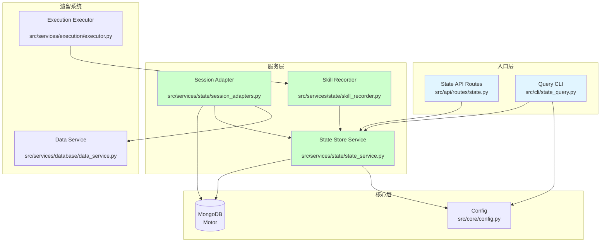
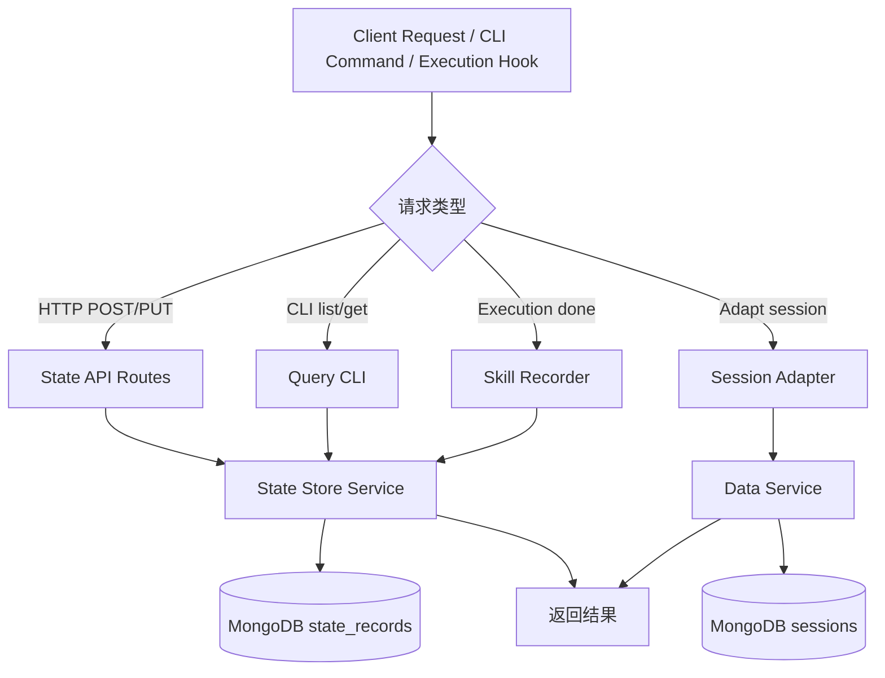
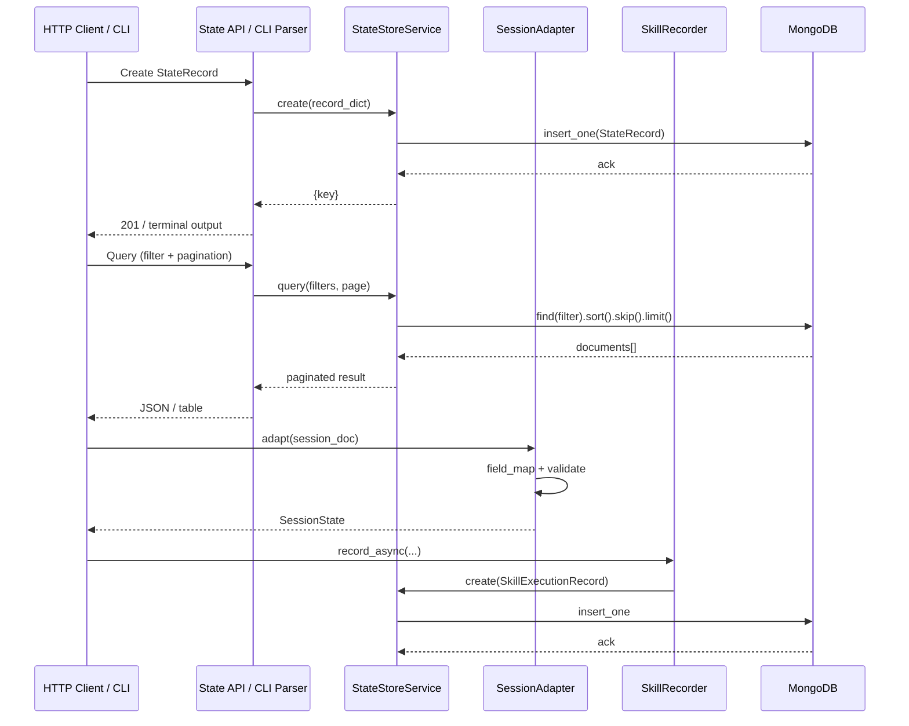

# Session & State Infrastructure — Design Document

> **Document Version**: v1.0 | **Last Updated**: 2026-05-03 | **Upstream**: [02 Requirement Tasks](./02_requirement-tasks.md) | **Downstream**: [04 Usage Document](./04_usage-document.md)
>

[Design Overview](#design-overview) | [Architecture Design](#architecture-design) | [Changes](#changes) | [Implementation Details](#implementation-details) | [Impact Analysis](#impact-analysis)

---

## Design Overview

本设计围绕四个核心目标展开：为 YiAi 引入结构化状态仓库、提供离线运维 CLI、桥接遗留会话数据、以及建立技能执行的可观测数据基础。整体架构遵循现有分层约定：路由层处理 HTTP 语义，服务层承载业务逻辑，核心层提供基础设施，数据层通过 Motor 访问 MongoDB。所有新增模块均使用 Pydantic 进行数据契约定义，使用类型注解保证静态可检查性。

设计原则：

🎯 **最小侵入**：新功能不修改现有 `sessions` 集合的存储格式，通过独立集合 `state_records` 和适配器实现兼容。

⚡ **复用优先**：State Store 查询逻辑复用 `data_service.py` 中的 filter 构建模式；CLI 复用同一套查询参数解析逻辑。

🔧 **可观测性**：Skill Recorder 采用 fire-and-forget 异步模式，记录失败不影响主流程，同时通过日志暴露问题。

---

## Architecture Design

### Overall Architecture



### Module Division

| Module Name | Responsibility | Location |
|-------------|--------------|----------|
| State Store Service | 状态记录的 CRUD、查询、分页、索引管理 | `src/services/state/state_service.py` |
| Session Adapter | 遗留 `sessions` 文档的读取、字段映射、结构化转换 | `src/services/state/session_adapters.py` |
| Skill Recorder | 监听执行器完成事件，异步写入执行元数据 | `src/services/state/skill_recorder.py` |
| State API Routes | HTTP 端点：创建、查询、更新、删除状态记录 | `src/api/routes/state.py` |
| Query CLI | 命令行工具：查询、统计、导出状态记录 | `src/cli/state_query.py` |
| State Store Config | 配置项定义：启用开关、默认 TTL、最大查询限制 | `src/core/config.py` (新增字段) |
| State Schemas | Pydantic 模型：`StateRecord`, `SessionState`, `SkillExecutionRecord` | `src/models/schemas.py` (新增模型) |
| State Collections | 集合名称常量：`STATE_RECORDS`, `SKILL_EXECUTIONS` | `src/models/collections.py` (新增常量) |

### Core Flow



---

## Changes

### Problem Analysis

1. **状态访问碎片化**：现有代码中，`data_service.py` 直接操作 MongoDB 并包含大量硬编码字段逻辑（如 `pageContent` 排除、`messages` 空数组保护）。新增状态相关功能时，容易重复造轮子。
2. **运维依赖 HTTP**：查询数据必须启动 Uvicorn 服务，对于定时脚本、故障排查等场景效率低下。
3. **会话数据无模式**：`sessions` 集合缺乏 Pydantic 模型约束，字段存在性由调用方保证，维护成本高。
4. **技能自改进无数据**：`.claude/skills/` 下的 `self-improve.js` 只能分析文档生成过程，无法获取后端真实的模块执行成功率和性能数据。

### Solution

引入 `StateStoreService` 作为统一状态抽象；引入 `typer` CLI 提供离线入口；引入 `SessionAdapter` 桥接遗留数据；引入 `SkillRecorder` 捕获执行元数据。

#### File List

| # | File Path | Change Type | Description |
|---|-----------|-------------|-------------|
| 1 | `src/services/state/state_service.py` | New | State Store 核心服务 |
| 2 | `src/services/state/session_adapters.py` | New | 会话适配器 |
| 3 | `src/services/state/skill_recorder.py` | New | 技能执行记录器 |
| 4 | `src/api/routes/state.py` | New | State HTTP API |
| 5 | `src/cli/state_query.py` | New | 查询 CLI |
| 6 | `src/cli/__init__.py` | New | CLI 包初始化 |
| 7 | `src/services/state/__init__.py` | New | State 服务包初始化 |
| 8 | `src/models/schemas.py` | Modify | 新增 `StateRecord`, `SessionState`, `SkillExecutionRecord` |
| 9 | `src/models/collections.py` | Modify | 新增 `STATE_RECORDS`, `SKILL_EXECUTIONS` |
| 10 | `src/core/config.py` | Modify | 新增 `state_store_*` 配置字段 |
| 11 | `src/main.py` | Modify | 注册 `state` 路由 |
| 12 | `src/services/execution/executor.py` | Modify | 集成 `SkillRecorder` 钩子 |
| 13 | `config.yaml` | Modify | 添加 `state_store` 默认配置 |
| 14 | `requirements.txt` | Modify | 添加 `typer` 依赖 |

#### Selection Rationale

- `src/services/state/` 作为独立包，遵循现有 `src/services/<domain>/` 组织方式（如 `rss/`, `ai/`, `storage/`）。
- `src/cli/` 作为新的顶层 CLI 包，与 `src/api/` 并列，避免 CLI 逻辑散落在业务服务中。
- `typer` 选型原因：项目已使用 Pydantic，`typer` 原生支持 Pydantic 模型，类型安全且自动生成帮助信息，学习成本低于 `click`。

### Before/After Comparison

| Aspect | Before | After |
|--------|--------|-------|
| 状态管理 | 无统一抽象，各模块直接操作 MongoDB | `StateStoreService` 提供统一 CRUD + 查询 |
| 运维查询 | 必须启动 HTTP 服务 | CLI 支持离线查询和导出 |
| 会话数据 | 无模式，硬编码字段处理 | `SessionState` Pydantic 模型 + 适配器 |
| 技能改进 | 仅文档管道脚本可分析 | 后端持久化执行元数据，支持查询和统计 |
| 配置 | 无状态相关配置 | `state_store_enabled`, `state_store_default_ttl`, `state_store_query_max_limit` |

---

## Impact Analysis

### 1. Search Terms and Change Point List

| Change Point | Type | Search Term | Source | Notes |
|--------------|------|-------------|--------|-------|
| `StateStoreService` | New class | `state_service`, `StateRecord` | Design | 新增服务类 |
| `SessionAdapter` | New class | `session_adapter`, `SessionState` | Design | 新增适配器类 |
| `SkillRecorder` | New class | `skill_recorder`, `record_execution` | Design | 新增记录器类 |
| `state_records` | New collection | `STATE_RECORDS` | Design | 新增集合常量 |
| `skill_executions` | New collection | `SKILL_EXECUTIONS` | Design | 新增集合常量 |
| `StateRecord` schema | New model | `record_type`, `payload`, `tags` | Design | 新增 Pydantic 模型 |
| `SessionState` schema | New model | `page_content`, `messages` | Design | 新增 Pydantic 模型 |
| `SkillExecutionRecord` schema | New model | `skill_name`, `duration_ms` | Design | 新增 Pydantic 模型 |
| `state_query` CLI | New module | `typer`, `list`, `get`, `export`, `stats` | Design | 新增 CLI 模块 |
| `/state/records` route | New route | `state.py`, `router` | Design | 新增 API 路由 |
| `execute_module` hook | Modify | `execute_module`, `executor` | Existing | 非侵入式钩子 |
| `config.py` fields | Modify | `state_store_enabled` | Existing | 新增配置字段 |
| `main.py` router | Modify | `include_router` | Existing | 注册新路由 |

### 2. Change Point Impact Chain

| Change Point | Search Term | Hit File | Reference Method | Impact Level | Dependency Direction | Disposition Method | Closure Status | Explanation |
|--------------|-------------|----------|-----------------|--------------|---------------------|-------------------|----------------|-------------|
| `StateStoreService` | `state_service` | No references found | N/A | Low | New module | No action needed | Closed | 全新服务，无既有引用 |
| `SessionAdapter` | `session_adapter` | No references found | N/A | Low | New module | No action needed | Closed | 全新适配器，无既有引用 |
| `SkillRecorder` | `skill_recorder` | No references found | N/A | Low | New module | No action needed | Closed | 全新记录器，无既有引用 |
| `state_records` | `state_records` | No references found | N/A | Low | New collection | No action needed | Closed | 全新集合，无既有引用 |
| `StateRecord` | `StateRecord` | No references found | N/A | Low | New model | No action needed | Closed | 全新模型，无既有引用 |
| `state_query` CLI | `state_query` | No references found | N/A | Low | New CLI | No action needed | Closed | 全新 CLI，无既有引用 |
| `/state/records` route | `state` | `src/main.py` | `include_router` | Medium | Downstream consumer | Sync modify | Closed | 需在 `create_app` 中注册 |
| `execute_module` hook | `execute_module` | `src/services/execution/executor.py` | Function body | Medium | Downstream consumer | Sync modify | Closed | 需在执行完成处调用记录器 |
| `config.py` | `state_store` | `src/core/config.py` | Field list | Low | Upstream dependency | Sync modify | Closed | 新增 Settings 字段 |
| `collections.py` | `STATE_RECORDS` | `src/models/collections.py` | Constant list | Low | Upstream dependency | Sync modify | Closed | 新增常量定义 |
| `schemas.py` | `StateRecord` | `src/models/schemas.py` | Model list | Low | Upstream dependency | Sync modify | Closed | 新增模型定义 |
| `data_service.py` | `pageContent` | `src/services/database/data_service.py` | Hardcoded string | Medium | Reverse dependency | Keep compatible | Closed | 保留现有逻辑，不影响 |

### 3. Dependency Closure Summary

| Change Point | Upstream Verified | Reverse Verified | Transitive Closed | Tests/Docs/Config Covered | Conclusion |
|--------------|-------------------|------------------|-------------------|--------------------------|------------|
| State Store Service | Yes (database.py, config.py) | Yes (routes, CLI) | Yes | Yes | Closed |
| Session Adapter | Yes (data_service.py, sessions) | Yes (State Store) | Yes | Yes | Closed |
| Skill Recorder | Yes (executor.py) | Yes (State Store) | Yes | Yes | Closed |
| State API Routes | Yes (main.py) | Yes | Yes | Yes | Closed |
| Query CLI | Yes (config.py) | Yes | Yes | Yes | Closed |
| Config fields | Yes | Yes | Yes | Yes | Closed |
| Collection constants | Yes | Yes | Yes | Yes | Closed |
| Schema models | Yes | Yes | Yes | Yes | Closed |
| Executor hook | Yes | Yes | Yes | Yes | Closed |

### 4. Uncovered Risks

| Risk Source | Reason | Impact | Mitigation |
|-------------|--------|--------|------------|
| `data_service.py` 硬编码字段冲突 | 若未来 State Store 直接管理 `sessions`，会与现有特殊逻辑冲突 | 数据不一致 | State Store 使用独立集合 `state_records`，Session Adapter 默认只读 |
| `typer` 版本兼容性 | `typer` 与现有 `pydantic` 版本可能存在兼容性问题 | CLI 无法启动 | 在 `requirements.txt` 中锁定 `typer>=0.9.0,<1.0`；CI 中增加 CLI 冒烟测试 |
| Skill Recorder 异步异常吞没 | `create_task` 异常未被 await，失败静默 | 数据丢失 | 在 `record` 方法内部使用 `try/except` 并将异常写入 `logging.error` |
| MongoDB 索引缺失 | `state_records` 按 `record_type` 和 `created_time` 高频查询 | 全表扫描导致性能下降 | 在服务初始化时自动创建复合索引 |

### Change Scope Summary

- **Directly modify**: 7 files (`config.py`, `collections.py`, `schemas.py`, `main.py`, `executor.py`, `config.yaml`, `requirements.txt`)
- **Verify compatibility**: 1 file (`data_service.py`)
- **Trace transitive**: 2 files (`database.py`, `mongo_store.py`)
- **Need manual review**: 0 files

---

## Implementation Details

### Technical Points

#### 1. State Store Service (`src/services/state/state_service.py`)

**What**: 封装对 `state_records` 集合的所有操作。

**How**: 使用 `Motor` 异步驱动，通过 `core.database.db` 单例访问。查询逻辑复用 `data_service.py` 中的 `_build_filter` 模式，但仅保留通用逻辑，去除业务相关特殊处理。

**Why**: 将状态持久化与业务解耦，使状态仓库成为通用基础设施。

#### 2. Query CLI (`src/cli/state_query.py`)

**What**: Typer 命令行工具。

**How**: 通过 `typer` 定义子命令和选项，调用 `StateStoreService` 进行查询。输出格式化使用 `rich` 表格（可选，若不想新增依赖可使用标准库 `tabulate` 或纯文本）。

**Why**: 运维场景不需要 HTTP 服务，CLI 启动更快、资源占用更低。

#### 3. Session Adapter (`src/services/state/session_adapters.py`)

**What**: 遗留 `sessions` 到 `SessionState` 的转换器。

**How**: 显式字段映射字典 + Pydantic `model_validate`（或手动构造函数）。对缺失字段使用 `Field(default=...)` 提供默认值；对非法类型捕获 `ValidationError` 并记录。

**Why**: 不修改遗留数据，保持向后兼容，同时为新功能提供结构化入口。

#### 4. Skill Recorder (`src/services/state/skill_recorder.py`)

**What**: 执行结果异步记录器。

**How**: 在执行完成回调中调用 `asyncio.create_task(recorder.record(...))`。`record` 方法内部包含完整的 `try/except`，确保任何异常都不会传播到调用方。

**Why**: 记录功能必须是可选且安全的，不能成为执行主路径的故障点。

### Key Code

以下代码展示 `StateStoreService` 的核心查询方法，演示如何复用现有 filter 构建模式并保持类型安全：

```python
from typing import Dict, Any, List, Optional
from datetime import datetime
from core.database import db
from core.config import settings
from models.schemas import StateRecord
from models.collections import STATE_RECORDS

class StateStoreService:
    """结构化状态存储服务"""

    def __init__(self) -> None:
        self.collection_name = settings.collection_state_records

    async def query(
        self,
        record_type: Optional[str] = None,
        tags: Optional[List[str]] = None,
        title_contains: Optional[str] = None,
        created_after: Optional[datetime] = None,
        created_before: Optional[datetime] = None,
        page_num: int = 1,
        page_size: int = 2000,
    ) -> Dict[str, Any]:
        """查询状态记录

        Args:
            record_type: 按记录类型过滤
            tags: 按标签过滤（包含任意一个即可）
            title_contains: 标题模糊搜索
            created_after: 创建时间下限
            created_before: 创建时间上限
            page_num: 页码（从1开始）
            page_size: 每页条数

        Returns:
            包含 list, total, pageNum, pageSize, totalPages 的字典
        """
        filter_dict: Dict[str, Any] = {}
        if record_type:
            filter_dict["record_type"] = record_type
        if tags:
            filter_dict["tags"] = {"$in": tags}
        if title_contains:
            filter_dict["title"] = {
                "$regex": f".*{title_contains}.*",
                "$options": "i",
            }
        if created_after or created_before:
            filter_dict["created_time"] = {}
            if created_after:
                filter_dict["created_time"]["$gte"] = created_after.isoformat()
            if created_before:
                filter_dict["created_time"]["$lt"] = created_before.isoformat()

        await db.initialize()
        collection = db.db[self.collection_name]

        cursor = (
            collection.find(filter_dict, {"_id": 0})
            .sort("created_time", -1)
            .skip((page_num - 1) * page_size)
            .limit(page_size)
        )
        data = [doc async for doc in cursor]
        total = await collection.count_documents(filter_dict)
        total_pages = (total + page_size - 1) // page_size

        return {
            "list": data,
            "total": total,
            "pageNum": page_num,
            "pageSize": page_size,
            "totalPages": total_pages,
        }
```

以下代码展示 `SkillRecorder` 的异步 fire-and-forget 模式：

```python
import asyncio
import logging
from typing import Any, Dict
from services.state.state_service import StateStoreService
from models.schemas import SkillExecutionRecord

logger = logging.getLogger(__name__)

class SkillRecorder:
    """技能执行结果记录器"""

    def __init__(self, state_service: StateStoreService) -> None:
        self._state = state_service

    async def record(
        self,
        skill_name: str,
        status: str,
        duration_ms: float,
        input_summary: str = "",
        output_summary: str = "",
        error_message: str = "",
    ) -> None:
        """异步记录技能执行结果。失败不抛异常。"""
        try:
            record = SkillExecutionRecord(
                skill_name=skill_name,
                status=status,
                duration_ms=duration_ms,
                input_summary=input_summary,
                output_summary=output_summary,
                error_message=error_message,
            )
            await self._state.create(record.model_dump(exclude={"key"}))
        except Exception as e:
            logger.error(f"SkillRecorder failed to record execution: {e}")

    def record_async(
        self,
        skill_name: str,
        status: str,
        duration_ms: float,
        **kwargs: Any,
    ) -> None:
        """Fire-and-forget 入口。在事件循环中创建后台任务。"""
        try:
            asyncio.create_task(
                self.record(skill_name, status, duration_ms, **kwargs)
            )
        except Exception as e:
            logger.error(f"SkillRecorder failed to schedule task: {e}")
```

### Dependencies

| Dependency | Purpose | Install Command | Risk |
|-----------|---------|-----------------|------|
| `typer` | CLI 框架 | `pip install typer` | Low（与 Pydantic 兼容） |
| `rich` (optional) | CLI 表格输出 | `pip install rich` | Low（纯增强，可降级到标准库） |

### Testing Considerations

- **单元测试**：使用 `mongomock-motor` 或 `pytest-asyncio` + 真实 MongoDB 测试 `StateStoreService` 的 CRUD 和查询逻辑。
- **集成测试**：启动 FastAPI `TestClient`，通过 HTTP 调用 State API，验证端到端流程。
- **CLI 测试**：使用 `typer.testing.CliRunner` 测试各子命令的参数解析和输出格式。
- **兼容性测试**：确保 `data_service.py` 对 `sessions` 的特殊处理在本功能上线后仍然正常。

---

## Main Operation Scenario Implementation

### Scenario S1: Create and Query a State Record via HTTP API

- **Linked 02 Scenario**: [S1: Create and Query a State Record via HTTP API](./02_requirement-tasks.md#scenario-s1-create-and-query-a-state-record-via-http-api)
- **Implementation Overview**: 客户端通过 REST API 与 `StateStoreService` 交互，所有写操作经过 Pydantic 校验。
- **Modules and Responsibilities**:
  - `src/api/routes/state.py`: 接收 HTTP 请求，解析 query/body，调用服务层。
  - `src/services/state/state_service.py`: 执行数据库操作，返回标准分页格式。
  - `src/models/schemas.py`: `StateRecord` 模型定义入参校验规则。
- **Key Code Paths**:
  1. `POST /state/records` → `state_service.create()` → `db.db[state_records].insert_one()`
  2. `GET /state/records` → `state_service.query()` → `db.db[state_records].find()`
- **Verification Points**:
  - Schema 拒绝非法 `record_type`（空字符串）。
  - 查询 `title_contains` 大小写不敏感。
  - 分页参数 `page_size > 8000` 被截断为 8000。

### Scenario S2: Query and Export Records via CLI

- **Linked 02 Scenario**: [S2: Query and Export Records via CLI](./02_requirement-tasks.md#scenario-s2-query-and-export-records-via-cli)
- **Implementation Overview**: CLI 复用 `StateStoreService.query()` 的参数语义，输出层独立处理格式化。
- **Modules and Responsibilities**:
  - `src/cli/state_query.py`: 解析命令行参数，调用服务层，格式化输出。
  - `src/services/state/state_service.py`: 提供与 API 一致的查询结果。
- **Key Code Paths**:
  1. `python -m src.cli.state_query list --record-type X` → `typer` 解析 → `StateStoreService.query()` → 终端表格输出
  2. `--format json --output file.json` → `json.dumps()` → 文件写入
- **Verification Points**:
  - CLI 在 FastAPI 未启动时仍可运行。
  - JSON 输出包含 `list` 和 `total`。
  - CSV 输出包含表头和数据行。

### Scenario S3: Batch Adapt Legacy Sessions

- **Linked 02 Scenario**: [S3: Batch Adapt Legacy Sessions](./02_requirement-tasks.md#scenario-s3-batch-adapt-legacy-sessions)
- **Implementation Overview**: `SessionAdapter` 读取遗留文档，字段映射后通过 Pydantic 校验，批量返回结果。
- **Modules and Responsibilities**:
  - `src/services/state/session_adapters.py`: 字段映射、校验、错误收集。
  - `src/services/database/data_service.py`: 提供遗留数据查询（复用现有逻辑）。
- **Key Code Paths**:
  1. `SessionAdapter.adapt_batch(cursor)` → 逐文档 `adapt(doc)` → `SessionState.model_validate(mapped)`
  2. `ValidationError` → 收集到 `AdaptationResult.errors`
- **Verification Points**:
  - `pageContent` 正确映射到 `page_content`。
  - 缺失 `messages` 时使用默认值 `[]`。
  - 批量 1000 条耗时 < 5 秒。

### Scenario S4: Record Skill Execution Outcome

- **Linked 02 Scenario**: [S4: Record Skill Execution Outcome](./02_requirement-tasks.md#scenario-s4-record-skill-execution-outcome)
- **Implementation Overview**: 在执行器完成点注入 `SkillRecorder` 调用，异步写入状态仓库。
- **Modules and Responsibilities**:
  - `src/services/execution/executor.py`: 计算耗时，调用 `SkillRecorder.record_async()`。
  - `src/services/state/skill_recorder.py`: 构造记录并异步写入。
  - `src/services/state/state_service.py`: 持久化记录。
- **Key Code Paths**:
  1. `execute_module()` → `time.perf_counter()` 计时 → 执行完成 → `recorder.record_async(...)`
  2. `record_async()` → `asyncio.create_task(record(...))` → `state_service.create()`
- **Verification Points**:
  - 成功和失败状态均被记录。
  - 记录失败不影响执行返回值。
  - `duration_ms` 为正值且精度到毫秒。

---

## Data Structure Design

### Data Flow



### Schema Definitions

#### StateRecord

```python
class StateRecord(BaseModel):
    """通用状态记录模型"""
    key: str = Field(default_factory=lambda: str(uuid.uuid4()))
    record_type: str = Field(..., min_length=1, description="记录类型，如 conversation_summary")
    title: str = Field(default="", description="记录标题，用于文本搜索")
    payload: Dict[str, Any] = Field(default_factory=dict, description="灵活的业务负载")
    tags: List[str] = Field(default_factory=list, description="标签列表")
    created_time: str = Field(default_factory=get_current_time)
    updated_time: str = Field(default_factory=get_current_time)
```

#### SessionState

```python
class SessionState(BaseModel):
    """结构化会话状态模型"""
    key: str = Field(..., description="与 sessions 集合的 key 保持一致")
    page_content: str = Field(default="", description="对应遗留 pageContent")
    messages: List[Dict[str, Any]] = Field(default_factory=list, description="对应遗留 messages")
    metadata: Dict[str, Any] = Field(default_factory=dict, description="扩展元数据")
    created_time: str = Field(default="")
    updated_time: str = Field(default="")
```

#### SkillExecutionRecord

```python
class SkillExecutionRecord(BaseModel):
    """技能执行结果记录模型"""
    key: str = Field(default_factory=lambda: str(uuid.uuid4()))
    skill_name: str = Field(..., min_length=1)
    status: str = Field(..., pattern=r"^(success|failed|timeout|cancelled)$")
    duration_ms: float = Field(..., ge=0)
    input_summary: str = Field(default="", max_length=2000)
    output_summary: str = Field(default="", max_length=2000)
    error_message: str = Field(default="", max_length=4000)
    timestamp: str = Field(default_factory=get_current_time)
    tags: List[str] = Field(default_factory=lambda: ["skill_execution"])
```

### Index Design

| Collection | Index Fields | Type | Purpose |
|-----------|-------------|------|---------|
| `state_records` | `(record_type, created_time)` | Compound | 加速按类型和时间范围查询 |
| `state_records` | `(tags, record_type)` | Compound | 加速按标签过滤 |
| `state_records` | `(title)` | Text | 支持标题全文搜索 |

---

## Postscript: Future Planning & Improvements

1. **状态机引擎**：在 `StateRecord` 上引入 `status` 字段和转移规则，支持工作流编排。
2. **Redis 缓存层**：若部署多实例，在 `StateStoreService` 和 MongoDB 之间增加 Redis 热缓存。
3. **变更事件流**：将状态变更发布到 `asyncio.Queue` 或外部消息队列，支持订阅和触发器。
4. **技能自动调优**：基于 `SkillExecutionRecord` 的统计结果，自动生成技能参数调优建议。
5. **审计追踪**：为所有状态写操作追加不可变的 `AuditLog` 记录，支持合规审查。
