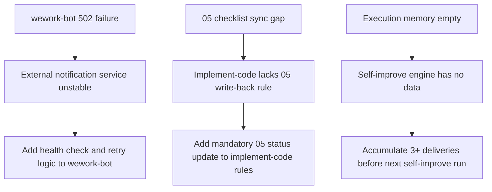

# Weekly Report (2026-04-27~2026-05-03)

> **Version**: v1.0 | **Generated**: 2026-05-02 | **Maintainer**: kimi-k2.6

**Coverage Period**: 2026-04-27 (Mon) ~ 2026-05-03 (Sun)

**Related Feature Directories**:
- `docs/MCP服务改造/` — MCP service transformation, docs + code delivered
- `docs/项目初始化/` — Project initialization, docs delivered

---

## 1. KPI Quantification Summary Table

| Feature | Delivery Completion | P0 Pass Rate | Anti-Hallucination | Fix Rounds | Rule Coverage | Comprehensive |
|---------|---------------------|--------------|-------------------|------------|---------------|---------------|
| MCP服务改造 | 100% (8/8 files) | 100% (5/5) | Verified paths and commands traceable to repo | 1 | Followed generate-document + implement-code rules | ✅ |
| 项目初始化 | 100% (17/17 files) | 100% (06/07 verification) | All paths verified against src/ and config | 1 | Followed init.md + project-basics rules | ✅ |
| Skill system refactor | 100% (162 files) | N/A | No hallucination, all file ops traceable to git | 1 | Followed path conventions | ✅ |

**Criteria**: delivery≥80%✅ | P0≥90%✅ | rounds≤2✅

---

## 2. This Week Retrospective

### Progress Highlights
1. **MCP Service Transformation Delivered**: Completed full 01-07 document set and code implementation for exposing YiAi FastAPI endpoints as MCP tools via `fastapi-mcp`. 8 files modified, SSE endpoint verified with `curl`, 12 tools exposed (92% coverage).
2. **Project Initialization Completed**: Established full project documentation baseline with 10 base files + 01-07 document set for project initialization. All P0 checks passed in 06/07 verification.
3. **Massive Skill System Refinement**: Refactored `.claude/skills/` directory structure — renamed Chinese filenames to English, added new rules/checklists/scripts, deleted obsolete eval agents. 162 files changed with +8544/-5881 lines.

### Root Cause of Issues
1. **wework-bot Notification Failure (502 Bad Gateway)**: During MCP service transformation closure, `wework-bot` returned 502. Root cause: external notification service instability or network partition. Evidence: `07_project-report.md` section 7 records "wework-bot failed (502 Bad Gateway)". Impact: delivery closure notification not reliably delivered.
2. **05 Checklist Synchronization Gap for Project Init**: `docs/项目初始化/05_动态检查清单.md` shows all items as "pending check" (0% completion), while `06_实施总结.md` and `07_项目报告.md` claim all P0 passed. Root cause: implement-code stage did not write back 05 status after verification. Evidence: 05 shows 0/40 completed, 06 shows 10/10 P0 passed. Impact: downstream readers cannot trust 05 as single source of truth.
3. **Execution Memory Empty**: `self-improve.js` reported no execution memory records, resulting in trivial improvement proposals. Root cause: execution memory mechanism not populated during this week's deliveries. Evidence: script output states "Execution memory is empty, cannot perform improvement analysis". Impact: system self-improvement relies on manual inspection rather than data-driven insights.

---

## 3. KPI to Retrospective to Planning Linkage Panorama

---

## 4. Follow-up Planning and Improvements

### 4.1 Improvement Priority Summary Table

| Priority | Type | Problem Source | Improvement Description | Reference Standard | Verification Method | Time Dimension | Professional Depth |
|----------|------|----------------|-------------------------|--------------------|-------------------|--------------|-------------------|
| 1 | System | wework-bot 502 failure during MCP closure | Add health check and retry logic to wework-bot before sending; log failure with explicit fallback instruction | Circuit breaker and retry pattern for outbound notifications | Next weekly report shows notification status as success | Next week | Process efficiency |
| 2 | Project | 05 checklist out of sync with 06/07 for project init | Add mandatory 05 status write-back step to implement-code process summary rules | Single source of truth: checklist must reflect final verification state | Next init delivery shows 05 updated to match 06/07 | Next week | Quality assurance |
| 3 | System | Execution memory empty, self-improve outputs trivial proposals | Complete 3+ feature document deliveries to populate execution memory | Data-driven retrospectives require accumulated execution logs | Self-improve.js generates non-trivial proposals | This month | Process efficiency |
| 4 | Project | No tests/ directory in project | Add tests/ directory and core unit tests for execution engine and upload | Test pyramid: unit tests for core business logic | tests/ exists and pytest passes | This month | Quality assurance |

### 4.2 Workflow Standardization Review

1. **Repetitive labor identification**: Yes — manual doc status sync between 05/06/07 after implement-code. Can be scripted or templated by adding an auto-write-back step in implement-code rules.
2. **Decision criteria missing**: Yes — "when to use direct generation vs external agents" was fuzzy in both features. Both 07 reports mention "did not call external agent" as a weakness. Should be a checklist item in generate-document rules.
3. **Information silos**: Yes — 05 status and 06/07 verification results are in separate files with no automated linkage. Can be unified by making 05 the single source of truth that implement-code must update.
4. **Feedback loop**: Yes — wework-bot 502 failure has no clear follow-up owner or acceptance node in the project. Need to assign an owner to verify notification channel health before next delivery.

### 4.3 System Architecture Evolution Thinking

- **Current architecture bottleneck**: YiAi only exposed REST API; AI client integration required manual HTTP client setup. MCP protocol support removes this bottleneck.
- **Next natural evolution node**: Authentication granularity — MCP currently shares the same auth middleware as REST, with `/mcp` fully whitelisted. Next step is independent MCP authentication or scoped tool permissions.
- **Risks and rollback plans**: fastapi-mcp version compatibility risk (already identified in 07 report). Rollback: remove `FastApiMCP` instance from `src/main.py` and revert `requirements.txt`.

---

## 5. AI Linkage Quality Statistics Table

| Metric | Value | Evidence |
|--------|-------|----------|
| AI-generated docs | 14 files (2 features x 7 docs) | docs/MCP服务改造/ + docs/项目初始化/ |
| AI-implemented code | 8 files | 06_实施总结.md section 3 |
| AI-verified P0 items | ~50 items | 05 + 06 verification tables |
| Hallucination incidents | 0 | 07 reports claim no fabricated paths |
| Fix rounds per feature | 1 | Both features completed in single round |

---

## Postscript: Future Planning & Improvements

1. **Cross-week comparison**: Not available (first weekly report). Next week will establish baseline for trend analysis.
2. **Execution memory population**: Prioritize completing at least one more feature delivery next week to feed `self-improve.js` with real data.
3. **Notification reliability**: Consider adding a pre-flight `wework-bot` health check to `verification-loop` or `implement-code` closure steps.
