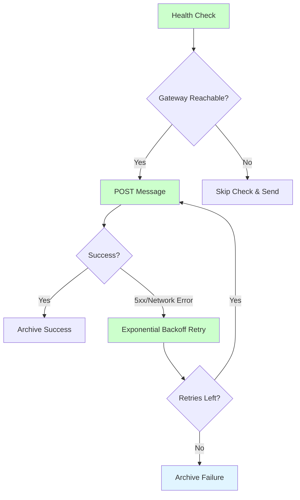
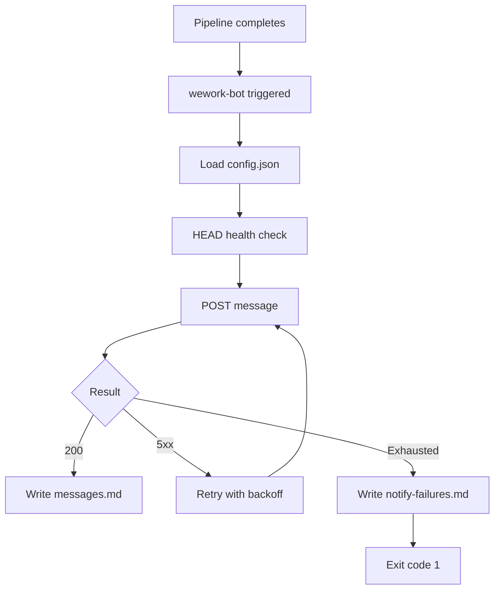
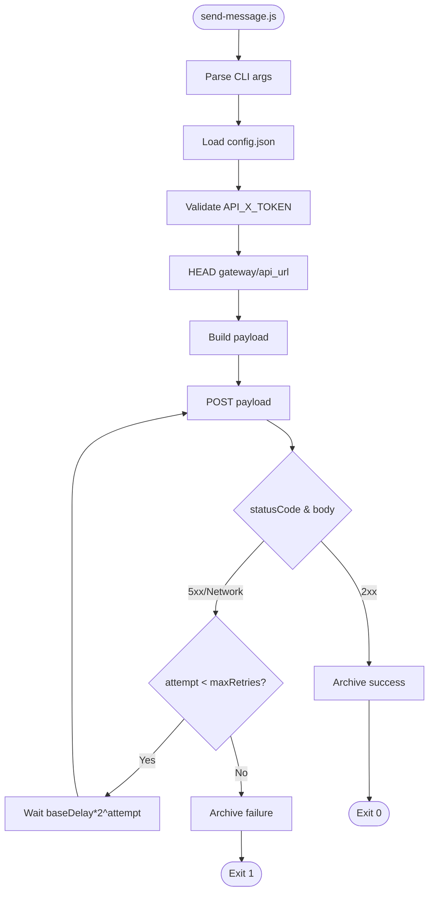
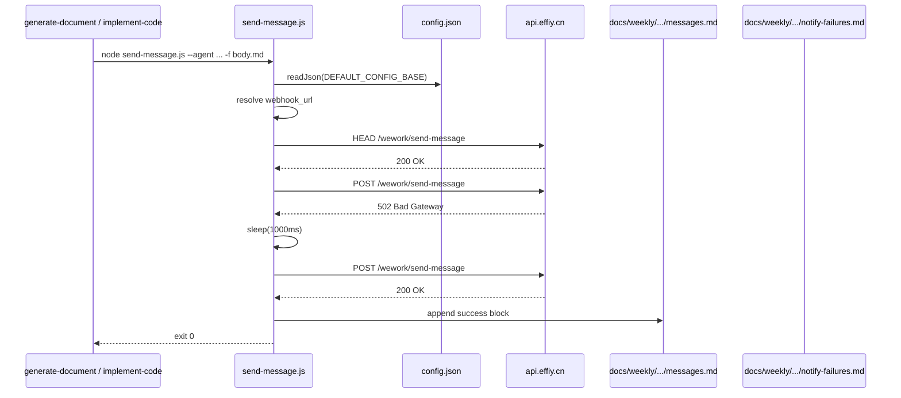

# wework-bot-reliability-improvement — Requirement Tasks

> **Document Version**: v1.0 | **Last Updated**: 2026-05-02 | **Maintainer**: kimi-k2.6
>
> **Related Documents**: [Requirement Document](./01_requirement-document.md) | [Design Document](./03_design-document.md) | [Usage Document](./04_usage-document.md)

[Feature Overview](#feature-overview) | [Feature Analysis](#feature-analysis) | [Feature Details](#feature-details) | [Acceptance Criteria](#acceptance-criteria) | [Usage Scenario Examples](#usage-scenario-examples)

---

## Feature Overview

The `wework-bot` notification skill currently performs a single-shot HTTPS POST to the gateway API without any health check or retry logic. On 2026-04-30, a `502 Bad Gateway` error caused a pipeline closure notification to be silently dropped. This feature hardens the sender by adding a pre-flight health check, exponential-backoff retry (up to 3 attempts), and structured failure archiving. The change is localized to the Node.js sender script and its JSON configuration, with zero impact on message format or upstream skill contracts.

- 🎯 **Goal**: Eliminate silent notification drops due to transient gateway failures
- ⚡ **Impact**: All `generate-document` and `implement-code` closures become more reliable
- 📖 **Clarity**: Retry behavior and failure logs are explicit and auditable

---

## Feature Analysis

### Feature Decomposition Diagram

### User Flow Diagram

### Feature Flow Diagram

### Sequence Diagram

---

## User Story Table

| Priority | User Story | Main Operation Scenarios |
|----------|------------|-------------------------|
| 🔴 P0 | As a DevOps operator, I want wework-bot to perform a lightweight health check before sending a notification and retry up to N times on transient failures, so that pipeline closure notifications are reliably delivered or explicitly logged as failed. | 1. Health check passes, message sends successfully on first attempt 2. Health check fails, retry succeeds within max attempts 3. All retries exhausted, failure is logged with explicit fallback instruction |

---

## Main Operation Scenario Definitions

### Scenario 1: Healthy gateway, single attempt success

- **Scenario description**: The notification gateway is healthy and responds immediately.
- **Pre-conditions**: `API_X_TOKEN` is set; `config.json` is valid; gateway returns 200.
- **Operation steps**:
  1. Pipeline invokes `send-message.js` with `--agent` and `--content-file`
  2. Script loads configuration and resolves webhook URL
  3. Script performs HEAD health check; receives 200 within timeout
  4. Script POSTs message payload
  5. Gateway returns HTTP 200 with `success: true`
- **Expected result**: Message delivered; success archived to `messages.md`; script exits 0.
- **Verification focus points**: Health check latency < 2s; archive contains timestamp and agent.
- **Related design document chapters**: [Architecture Design](./03_design-document.md#architecture-design), [Implementation Details](./03_design-document.md#implementation-details)

### Scenario 2: Gateway 502, retry succeeds

- **Scenario description**: Gateway experiences transient 502 during peak load.
- **Pre-conditions**: Gateway intermittently returns 502; retry config allows ≥1 retry.
- **Operation steps**:
  1. Script performs health check (may pass or fail)
  2. Script POSTs payload; receives 502
  3. Script evaluates error as retryable (5xx)
  4. Script waits `baseDelay * 2^attempt` ms
  5. Script retries POST; receives 200
- **Expected result**: Message delivered on retry; success archived; console shows retry count.
- **Verification focus points**: Retry delay matches configured backoff; no duplicate archive entries.
- **Related design document chapters**: [Implementation Details](./03_design-document.md#implementation-details)

### Scenario 3: Persistent outage, explicit failure log

- **Scenario description**: Gateway is down for an extended period.
- **Pre-conditions**: Gateway returns 502 or connection refused consistently.
- **Operation steps**:
  1. Script performs health check; receives error or timeout
  2. Script POSTs payload; fails with 502 or network error
  3. Script retries up to maxRetries; all fail
  4. Script writes structured failure block to `notify-failures.md`
  5. Script prints fallback instruction to stderr
- **Expected result**: No silent failure; explicit log exists; script exits 1.
- **Verification focus points**: `notify-failures.md` contains timestamp, HTTP status, error message, fallback instruction.
- **Related design document chapters**: [Implementation Details](./03_design-document.md#implementation-details), [Main Operation Scenario Implementation](./03_design-document.md#main-operation-scenario-implementation)

---

## Impact Analysis

### 1. Search Terms and Change Point List

| Search Term | Matched File | Line | Context | Change Required |
|-------------|--------------|------|---------|-----------------|
| `wework-bot/scripts/send-message.js` | `.claude/skills/wework-bot/scripts/send-message.js` | 1-469 | Main sender logic | Add health check, retry loop, failure archive |
| `config.json` | `.claude/skills/wework-bot/config.json` | 1-26 | Robot/webhook/agent config | Add `retry` section (maxRetries, baseDelay) |
| `API_X_TOKEN` | `.claude/skills/wework-bot/scripts/send-message.js` | 23 | Env var read | No change (remains required) |
| `502 Bad Gateway` | `docs/MCP服务改造/06_实施总结.md` | 188 | Evidence of prior failure | Reference only (no code change) |
| `import-docs` → `wework-bot` | `.claude/skills/generate-document/rules/workflow.md` | 109 | Mandatory sequence | No change (sequence preserved) |
| `wework-bot block notification` | `.claude/skills/implement-code/rules/orchestration.md` | 121 | Fallback on send failure | No change (fallback record still applies) |
| `writeMessageArchive` | `.claude/skills/wework-bot/scripts/send-message.js` | 339-375 | Success archive function | Add `writeFailureArchive` counterpart |
| `key-notes.md` | `.claude/skills/wework-bot/scripts/send-message.js` | 445-463 | Key node logging on success | Consider logging on final failure too |

### 2. Change Point Impact Chain

| Change Point | Direct Impact | Transitive Impact | Disposition |
|--------------|---------------|-------------------|-------------|
| `send-message.js` add retry loop | Exit behavior changes: may delay up to ~7s; new `notify-failures.md` output | All calling skills (`generate-document`, `implement-code`, `import-docs`, `weekly`) experience more reliable notifications; orchestration timeout may need review | Modify sender; verify downstream timeouts |
| `config.json` add `retry` defaults | Backward compatible if defaults present | All agents using `general` robot inherit new defaults | Append `retry` object with sensible defaults |
| New `notify-failures.md` archive | New file type in `docs/weekly/<week>/` | Weekly report generation may reference failure count | Create directory and file on first failure |

### 3. Dependency Closure Summary

- **Upstream**: `message-pusher` agent and skill orchestration are unchanged; they still invoke `send-message.js` with the same CLI flags.
- **Downstream**: `import-docs` sync and `wework-bot` notification order is preserved (`workflow.md` §7).
- **Cross-cutting**: No database, no API routes, no Python dependencies affected.

### 4. Uncovered Risks

| Risk | Likelihood | Impact | Mitigation |
|------|------------|--------|------------|
| Retry delay exceeds orchestration timeout | Low | Medium | Keep default maxRetries=3, baseDelay=1000ms; total extra delay < 8s |
| HEAD health check blocked by gateway while POST works | Low | Low | Health check failure is non-blocking; script proceeds to POST anyway |
| `notify-failures.md` grows unbounded | Low | Low | Same mitigation as `messages.md` (manual rotation); out of scope for this feature |

**Change scope summary**: directly modify 2 / verify compatibility 4 / trace transitive 3 / need manual review 0.

---

## Feature Details

### Health Check Before Send

- **Feature description**: Before POSTing the message payload, send a lightweight HEAD request to the gateway API URL to confirm reachability.
- **Value**: Detects gateway outages early; triggers retry-aware path.
- **Pain point solved**: Prevents wasting a full payload attempt on a clearly dead gateway.

### Exponential Backoff Retry

- **Feature description**: On HTTP 5xx or specific network errors, wait `baseDelay * 2^attempt` ms and retry the POST.
- **Value**: Recovers from transient network partitions and gateway instability.
- **Pain point solved**: Single 502 or brief outage no longer drops notifications permanently.

### Structured Failure Log

- **Feature description**: When all retries are exhausted, append a structured markdown block to `docs/weekly/<week>/notify-failures.md`.
- **Value**: Creates an auditable record and explicit next-step instruction.
- **Pain point solved**: Operators no longer have to guess whether a notification was sent.

---

## Acceptance Criteria

### P0 — Core

1. `send-message.js` performs a HEAD health check before the main POST
2. Retry with exponential backoff (max 3 attempts) on 5xx / network errors
3. Failure after all retries produces a structured log with timestamp, error code, and fallback instruction
4. Existing success archiving behavior remains unchanged

### P1 — Important

5. Retry configuration externalized to `config.json`
6. CLI flag `--skip-health-check` for emergency manual sends

### P2 — Nice-to-have

7. Circuit breaker: after 3 consecutive failures within 5 minutes, skip health checks for 60 seconds

---

## Usage Scenario Examples

### Scenario 1: Healthy gateway, single attempt success

- **Background**: Pipeline completes normally; gateway is healthy.
- **Operation**: `import-docs` succeeds → `wework-bot` sends completion notification.
- **Result**: Health check returns 200 within 500ms; message POST succeeds; archive written to `messages.md`.
- 📋 **Verification**: `messages.md` contains the new entry.
- 🎨 **UX**: Operator sees single success line in console.

### Scenario 2: Gateway 502, retry succeeds

- **Background**: Gateway experiences a transient 502 during peak load.
- **Operation**: `wework-bot` health check detects latency; first POST receives 502.
- **Result**: Script waits 1000ms, retries; second POST succeeds with 200.
- 📋 **Verification**: Console output shows retry count; `messages.md` contains final success.
- 🎨 **UX**: Operator sees "Retry 1/3 ... Success" in console.

### Scenario 3: Persistent outage, explicit failure log

- **Background**: Gateway is down for >10 seconds.
- **Operation**: Three POST attempts all fail with 502.
- **Result**: After third failure, script exits with code 1 and writes entry to `notify-failures.md`.
- 📋 **Verification**: `notify-failures.md` contains structured failure record with fallback instruction.
- 🎨 **UX**: Operator sees clear failure summary and path to failure log.

## Postscript: Future Planning & Improvements

- Evaluate adding jitter to backoff to avoid thundering herd.
- Consider webhook-level failover (secondary robot) for P1 enhancement.
