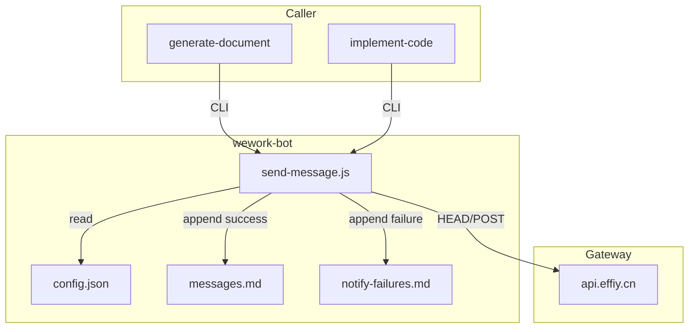
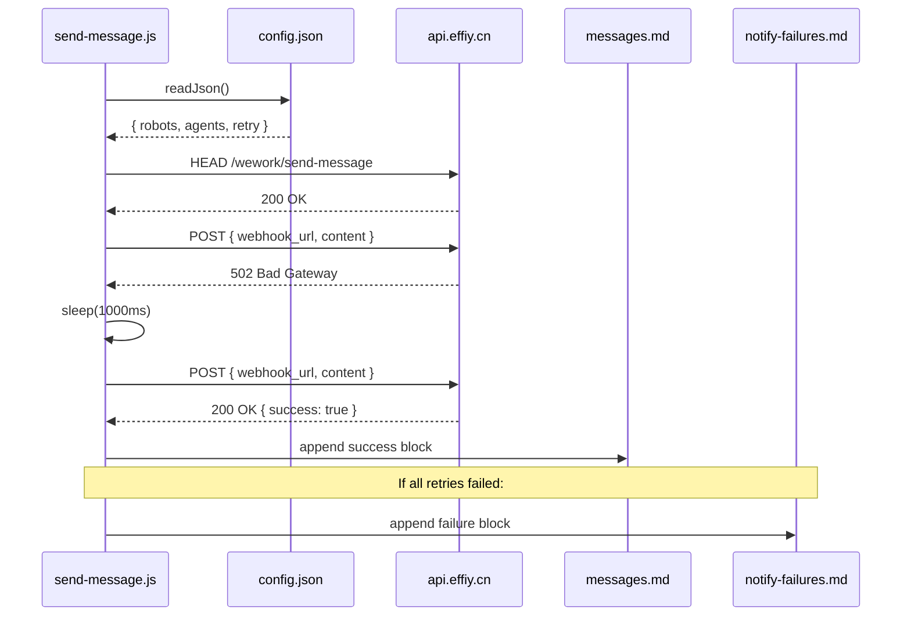

# wework-bot-reliability-improvement — Design Document

> **Document Version**: v1.0 | **Last Updated**: 2026-05-02 | **Maintainer**: kimi-k2.6
>
> **Related Documents**: [Requirement Document](./01_requirement-document.md) | [Requirement Tasks](./02_requirement-tasks.md) | [Usage Document](./04_usage-document.md)

[Design Overview](#design-overview) | [Architecture Design](#architecture-design) | [Changes](#changes) | [Implementation Details](#implementation-details) | [Impact Analysis](#impact-analysis)

---

## Design Overview

This design hardens the `wework-bot` sender script with three incremental defenses: a pre-flight health check, exponential-backoff retry, and structured failure archiving. The change is surgical — only `.claude/skills/wework-bot/scripts/send-message.js` and `.claude/skills/wework-bot/config.json` are modified — while preserving all existing skill contracts, message formats, and orchestration sequences. The retry logic is implemented directly in the Node.js `https` request path to avoid adding external dependencies.

- 🎯 **Principle**: Fail explicitly, never silently. Every retry and every final failure must leave an auditable trace.
- ⚡ **Principle**: Minimum blast radius. Change only the sender; do not touch orchestration rules or message contracts.
- 🔧 **Principle**: Configurable defaults. Retry behavior can be tuned without code changes.

---

## Architecture Design

### Overall Architecture



### Module Division

| Module Name | Responsibility | Location |
|-------------|---------------|----------|
| `send-message.js` | CLI entry, argument parsing, health check, retry loop, request dispatch, archiving | `.claude/skills/wework-bot/scripts/send-message.js` |
| `config.json` | Robot/webhook/agent mappings + retry defaults | `.claude/skills/wework-bot/config.json` |
| `lib/natural-week.js` | Reused for resolving `docs/weekly/<week>/` path | `.claude/scripts/lib/natural-week.js` |

### Core Flow

```mermaid
flowchart TD
    Start([CLI invoked]) --> Parse[Parse args & env]
    Parse --> Load[Load config.json]
    Load --> Token[Validate API_X_TOKEN]
    Token --> Resolve[Resolve webhook_url]
    Resolve --> HCheck{--skip-health-check?}
    HCheck -->|No| Head[HEAD api_url]
    Head -->|any| Build[Build payload]
    HCheck -->|Yes| Build
    Build -->> Attempt[POST payload]
    Attempt -->> Check{2xx?}
    Check -->|Yes| Archive[Archive success]
    Archive -->> Done([exit 0])
    Check -->|5xx/Network| Retryable{Retryable & attempts left?}
    Retryable -->|Yes| Sleep[Delay base*2^attempt]
    Sleep -->> Attempt
    Retryable -->|No| FailLog[Archive failure]
    FailLog -->> Err([exit 1])
```

---

## Changes

### Problem Analysis

`send-message.js` (lines 420-433) makes a single HTTPS request. If the gateway returns 502 or the connection drops, the script immediately exits with code 1. There is no retry, no structured failure log, and no pre-flight health check. This caused the MCP service transformation closure notification to be lost on 2026-04-30 (`docs/MCP服务改造/06_实施总结.md:188`).

### Solution

1. **Add `doHealthCheck()`**: Lightweight HEAD to `apiUrl` with a short timeout (3s). Non-blocking — failure still proceeds to POST.
2. **Add `sendWithRetry()`**: Wraps the existing `request()` in a loop. Retries on HTTP 5xx and specific Node.js network errors (`ECONNREFUSED`, `ETIMEDOUT`, `ECONNRESET`, `ENOTFOUND`).
3. **Add `writeFailureArchive()`**: Mirrors `writeMessageArchive()` but appends to `notify-failures.md`.
4. **Extend `config.json`**: Add top-level `"retry": { "maxRetries": 3, "baseDelayMs": 1000 }`.

### Before/After Comparison

| Aspect | Before | After |
|--------|--------|-------|
| Health check | None | Optional HEAD before POST |
| Retry | None | Up to 3 attempts with exponential backoff |
| Failure log | Console stderr only | Structured `notify-failures.md` archive |
| Configurability | Hard-coded single shot | `maxRetries` and `baseDelayMs` in `config.json` |

---

## Impact Analysis

### 1. Search Terms and Change Point List

| Search Term | Matched File | Line | Context | Change Required |
|-------------|--------------|------|---------|-----------------|
| `send-message.js` main | `.claude/skills/wework-bot/scripts/send-message.js` | 413-468 | `main()` IIFE | Add health check, retry loop, failure archive calls |
| `request()` | `.claude/skills/wework-bot/scripts/send-message.js` | 377-411 | HTTPS POST function | Extract reusable; add retry wrapper |
| `config.json` | `.claude/skills/wework-bot/config.json` | 1-26 | Default config | Append `retry` object |
| `writeMessageArchive` | `.claude/skills/wework-bot/scripts/send-message.js` | 339-375 | Success archive | Add `writeFailureArchive` alongside |
| `process.exit(1)` | `.claude/skills/wework-bot/scripts/send-message.js` | 432, 466 | Failure exits | Preserve exit codes; enrich stderr output |
| `orchestration.md` stage 8 | `.claude/skills/implement-code/rules/orchestration.md` | 111 | Stage completion gate | No change; notification still required |
| `workflow.md` §7 | `.claude/skills/generate-document/rules/workflow.md` | 109 | import-docs → wework-bot | No change; sequence preserved |
| `docs/weekly/` | `docs/weekly/2026-04-27~2026-05-03/weekly-report.md` | 33 | Prior failure evidence | Reference only |

### 2. Change Point Impact Chain

| Change Point | Direct Impact | Transitive Impact | Disposition |
|--------------|---------------|-------------------|-------------|
| `send-message.js` add `doHealthCheck` | New async function; may add ~3s latency before first POST | All callers experience slight latency increase; no breaking change | Add function; keep non-blocking |
| `send-message.js` add `sendWithRetry` | Exit timing changes; console output changes | CI/orchestration that parses stdout may see new retry lines | Add retry lines to stderr; keep success stdout stable |
| `send-message.js` add `writeFailureArchive` | New file write on final failure | `docs/weekly/<week>/notify-failures.md` created lazily | Add function; mirror `writeMessageArchive` pattern |
| `config.json` add `retry` | New optional field | All robot configs inherit defaults if not overridden | Append object; provide defaults |

### 3. Dependency Closure Summary

- **Upstream callers**: `generate-document`, `implement-code`, `import-docs`, `weekly` — all invoke `send-message.js` via CLI with unchanged flags. No code changes needed.
- **Message contract**: `rules/message-contract.md` unchanged.
- **Archive dependencies**: `natural-week.js` and `append-key-node.js` reused without modification.

### 4. Uncovered Risks

| Risk | Likelihood | Impact | Disposition |
|------|------------|--------|-------------|
| HEAD request rejected by gateway while POST accepted | Low | Low | Non-blocking health check means POST still attempted |
| Exponential backoff total delay > orchestration patience | Low | Medium | Default max 3 retries × max 4s delay ≈ 7s; acceptable |
| `notify-failures.md` permission denied | Low | Low | Warn and continue (same pattern as `writeMessageArchive`) |

**Change scope summary**: directly modify 2 / verify compatibility 6 / trace transitive 3 / need manual review 0.

---

## Implementation Details

### Technical Points

**What**: Add retry and health check to the existing Node.js HTTPS sender.
**How**: Refactor `main()` to call `doHealthCheck()` optionally, then loop through `sendWithRetry()`.
**Why**: Node.js built-in `https` has no retry; adding an external HTTP client would introduce a dependency for a single script.

### Key Code

```javascript
// --- Retry configuration (merged from config.json) ---
const retryConfig = {
  maxRetries: config.retry?.maxRetries ?? 3,
  baseDelayMs: config.retry?.baseDelayMs ?? 1000,
};

// --- Health check (non-blocking) ---
async function doHealthCheck(apiUrl, token) {
  try {
    const result = await request(apiUrl, token, { webhook_url: null, content: null });
    return result.statusCode < 500;
  } catch {
    return false;
  }
}

// --- Retry wrapper ---
async function sendWithRetry(apiUrl, token, payload, maxRetries, baseDelayMs) {
  const retryableErrors = new Set(['ECONNREFUSED', 'ETIMEDOUT', 'ECONNRESET', 'ENOTFOUND']);
  let lastResult = null;
  for (let attempt = 0; attempt <= maxRetries; attempt++) {
    try {
      const result = await request(apiUrl, token, payload);
      lastResult = result;
      const httpFail = result.statusCode < 200 || result.statusCode >= 300;
      const contentFail = bodyIndicatesFailure(result.body) === true;
      if (!httpFail && !contentFail) {
        return { success: true, result, attempts: attempt + 1 };
      }
      if (result.statusCode >= 400 && result.statusCode < 500 && result.statusCode !== 429) {
        return { success: false, result, attempts: attempt + 1, reason: 'client-error' };
      }
    } catch (error) {
      lastResult = { error: error.message };
      if (!retryableErrors.has(error.code)) {
        return { success: false, error, attempts: attempt + 1, reason: 'non-retryable-network' };
      }
    }
    if (attempt < maxRetries) {
      const delay = baseDelayMs * Math.pow(2, attempt);
      console.warn(`Retry ${attempt + 1}/${maxRetries} after ${delay}ms...`);
      await new Promise(r => setTimeout(r, delay));
    }
  }
  return { success: false, result: lastResult, attempts: maxRetries + 1, reason: 'max-retries-exhausted' };
}

// --- Failure archive ---
function writeFailureArchive(opts, errorInfo) {
  if (process.env.WEWORK_BOT_SKIP_MESSAGE_LOG === '1') return;
  const { getNaturalWeekRange } = require(path.join(CLAUDE_ROOT, 'scripts', 'lib', 'natural-week.js'));
  const week = getNaturalWeekRange(new Date());
  const dir = path.join(PROJECT_ROOT, 'docs', 'weekly', week.range);
  fs.mkdirSync(dir, { recursive: true });
  const filePath = path.join(dir, 'notify-failures.md');
  if (!fs.existsSync(filePath) || fs.statSync(filePath).size === 0) {
    fs.writeFileSync(filePath, `# 通知失败归档 · ${week.range}\n\n---\n\n`, 'utf-8');
  }
  const block = [
    `## ${new Date().toISOString()} · ${opts.agent || 'unknown'} · ${opts.robot || 'unknown'}`,
    '',
    `- Status: ${errorInfo.result?.statusCode ?? 'N/A'}`,
    `- Reason: ${errorInfo.reason}`,
    `- Attempts: ${errorInfo.attempts}`,
    `- Error: ${errorInfo.result?.error ?? errorInfo.result?.body ?? 'N/A'}`,
    '',
    `> **Fallback**: Run wework-bot manually after gateway recovery, or check \`docs/weekly/${week.range}/\` for details.`,
    '',
    '---',
    '',
  ].join('\n');
  fs.appendFileSync(filePath, block, 'utf-8');
}
```

### Dependencies

- No new npm packages. Uses existing Node.js built-ins (`https`, `fs`, `path`).
- Reuses existing project utilities: `natural-week.js`, `append-key-node.js`.

### Testing Considerations

1. Mock the gateway with a local HTTP server returning 502 twice then 200.
2. Verify retry delay timing with `console.warn` assertions.
3. Verify `notify-failures.md` is created and formatted on persistent failure.
4. Verify `--skip-health-check` bypasses HEAD request.
5. Verify `config.json` without `retry` section falls back to defaults.

---

## Main Operation Scenario Implementation

### Scenario 1: Healthy gateway, single attempt success

- **Linked 02 scenario**: [Scenario 1](./02_requirement-tasks.md#scenario-1-healthy-gateway-single-attempt-success)
- **Implementation overview**: `doHealthCheck` returns true; `sendWithRetry` succeeds on first loop iteration.
- **Modules and responsibilities**:
  - `send-message.js`: `main()` → `doHealthCheck()` → `sendWithRetry()` → `writeMessageArchive()`
- **Key code paths**: `send-message.js:main` → `request()` line 377 → success branch line 428 → `writeMessageArchive()` line 436
- **Verification points**: Exit code 0; `messages.md` contains entry; no retry warnings in stderr.

### Scenario 2: Gateway 502, retry succeeds

- **Linked 02 scenario**: [Scenario 2](./02_requirement-tasks.md#scenario-2-gateway-502-retry-succeeds)
- **Implementation overview**: First POST returns 502; retry loop sleeps and retries; second POST returns 200.
- **Modules and responsibilities**:
  - `send-message.js`: `sendWithRetry` detects 5xx, increments attempt, delays, re-invokes `request()`.
- **Key code paths**: `sendWithRetry` loop → `result.statusCode >= 500` → `delay` → `request()` again → success
- **Verification points**: stderr contains `Retry 1/3 after 1000ms...`; exit code 0; `messages.md` has one success entry.

### Scenario 3: Persistent outage, explicit failure log

- **Linked 02 scenario**: [Scenario 3](./02_requirement-tasks.md#scenario-3-persistent-outage-explicit-failure-log)
- **Implementation overview**: All attempts fail; loop exits; `writeFailureArchive` appends structured block.
- **Modules and responsibilities**:
  - `send-message.js`: `sendWithRetry` exhausts attempts → `writeFailureArchive()` → `process.exit(1)`.
- **Key code paths**: `sendWithRetry` loop → `attempt > maxRetries` → `writeFailureArchive` line (new) → stderr fallback instruction
- **Verification points**: Exit code 1; `notify-failures.md` exists with ISO timestamp, status, reason, attempts, fallback instruction.

---

## Data Structure Design

### Request/Response Flow



### Archive Data Format

**Success archive (`messages.md`)** — unchanged:
```markdown
## 2026-05-02T12:00:00.000Z · agent · robot
- HTTP: 200

<content>

---
```

**Failure archive (`notify-failures.md`)** — new:
```markdown
## 2026-05-02T12:00:00.000Z · agent · robot
- Status: 502
- Reason: max-retries-exhausted
- Attempts: 4
- Error: Bad Gateway

> **Fallback**: Run wework-bot manually after gateway recovery, or check `docs/weekly/2026-04-27~2026-05-03/` for details.

---
```

## Postscript: Future Planning & Improvements

- Consider adding a `retryOn429` boolean flag for explicit rate-limit handling.
- Evaluate extracting the retry logic into a shared `.claude/scripts/lib/` module for reuse by other outbound callers.
