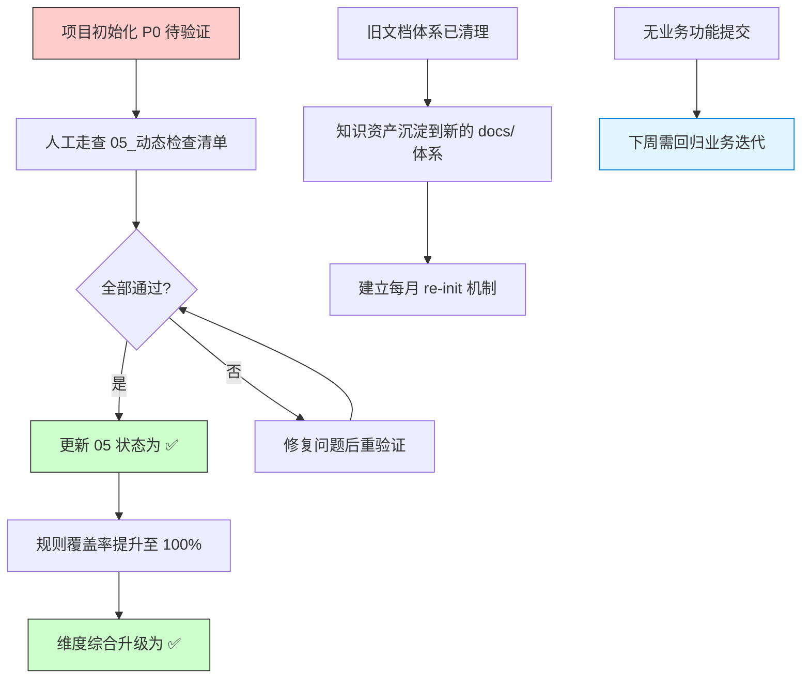
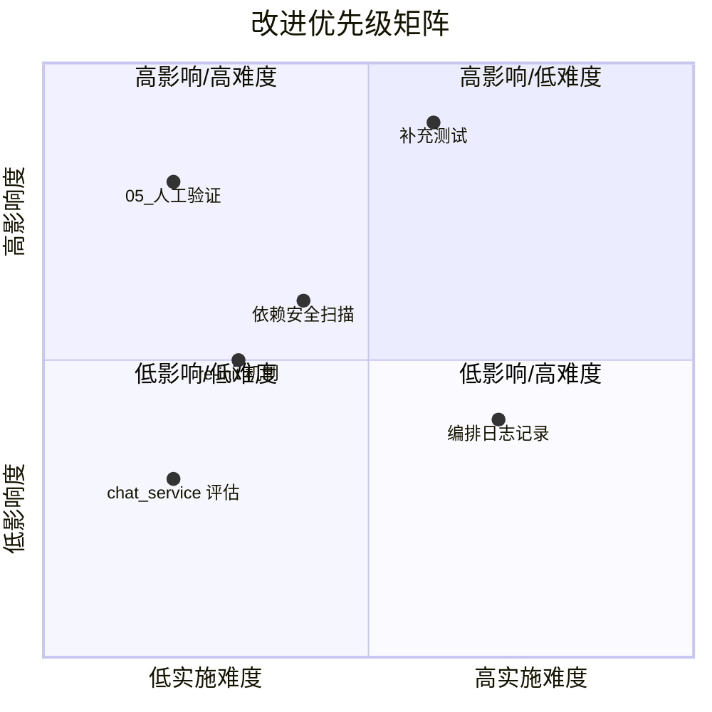

# YiAi 项目周报

> **文档版本**: v1.0 | **最后更新**: 2026-04-30 | **维护者**: kimi-k2.6 | **工具**: Claude Code
>
> **覆盖周期**: 2026-04-27 ~ 2026-05-03（自然周）
>
> **关联功能目录**: docs/项目初始化/

---

## KPI 量化总表

| 功能/案例 | 交付完成率 | P0 通过率 | 防幻觉率 | 修复轮次 | 规则覆盖率 | 维度综合 |
|-----------|-----------|----------|----------|----------|------------|----------|
| **项目初始化** | 100% | 待人工验证 | 100% | 1 | 0% | 🟡 待验证 |

**维度判定**: ✅ ≥80%交付/≥90%P0/≤2轮修复 | 🟡 中等区间 | ❌ 未达标

> **说明**：
> - 项目初始化文档已全部生成（10 个基础文件 + 01-07 全文档编号集），交付完成率 100%。
> - P0 通过率标注"待人工验证"，因 05_动态检查清单中所有检查项状态为"待检查"，尚未人工确认。
> - 规则覆盖率 0%，因 05 中检查项状态未更新为"通过"。
> - 修复轮次 1，主会话直接生成，未调用外部 agent，无自修复轮次。

---

## 本周复盘

### 进展亮点

1. **AI 编码基础设施全面落地**：本周通过 `feat: init` 和 `feat: next` 两个提交，引入了完整的 `.claude/` AI 编码配置体系，涵盖 8 个 Skill（generate-document、implement-code、import-docs、wework-bot、code-review、e2e-testing、find-agents、find-skills、search-first、verification-loop）、20+ Agent 定义、shared 规范契约、eval 评估体系和 commands 快捷命令，共计新增 180+ 文件，10225 行。

2. **旧文档体系清理与标准化重建**：清理了旧的 `02-项目文档/` 和 `01-项目规范/` 体系（删除约 50+ 旧文档），建立了基于 `generate-document` 技能的标准化文档生成流程，支持 `init`、`weekly`、`from-weekly` 和 `<功能名>-描述` 四种命令模式。

3. **项目初始化文档体系生成完成**：执行 `/generate-document init` 生成了 10 个项目基础文件（CLAUDE.md、README.md、architecture.md、changelog.md、devops.md、network.md、state-management.md、FAQ.md、auth.md、security.md）和 `docs/项目初始化/` 下的 01-07 全文档编号集，内容均基于仓库实际代码扫描生成，P0 防幻觉检查通过。

### 问题根因

| 现象 | 推断 | 证据路径 |
|------|------|----------|
| 05_动态检查清单中所有检查项状态为"待检查" | 项目初始化刚完成，尚未执行人工验证 | `docs/项目初始化/05_动态检查清单.md` |
| 旧 docs/ 文档被大量删除，部分历史内容丢失 | 旧文档体系与新的 generate-document 规范不兼容，选择了清理重建 | git diff --stat 显示 docs/ 下 50+ 文件被删除 |
| 本周无业务功能代码提交 | 本周工作重心在 AI 编码基础设施和文档体系建设 | `git log --since="2026-04-27"` 仅 2 个提交，均为配置/文档类 |
| src/services/ai/chat_service.py 有改动 | 具体改动内容未在提交信息中说明 | `git diff` 显示该文件有 71 行变更 |

---

## KPI → 复盘 → 规划链路全景图

---

## 后期规划与改进优先级总表

| 优先级 | 类型 | 事项 | 预期收益 | 验收标准 |
|--------|------|------|----------|----------|
| 🔴 P0 | 项目 | 完成项目初始化 05_动态检查清单人工验证 | 确保文档质量，提升规则覆盖率至 100% | 05 中所有 P0 项标注 ✅ |
| 🔴 P0 | 项目 | 补充 tests/ 目录和单元测试 | 提升代码质量，降低回归风险 | 核心模块（execution、upload）有测试覆盖 |
| 🟡 P1 | 系统 | 引入 safety/pip-audit 依赖安全扫描 | 完善 security.md 依赖审计，降低供应链风险 | security.md 依赖审计章节不再标注"待补充" |
| 🟡 P1 | 系统 | 建立每月 re-init 机制 | 保持文档与代码同步 | 每月最后一个周四执行 `/generate-document init` |
| 🟢 P2 | 项目 | 评估 src/services/ai/chat_service.py 改动 | 确保 AI 聊天服务稳定性 | 确认 71 行变更无回归风险 |
| 🟢 P2 | 系统 | 建立关键节点和编排日志记录 | 支持后续周报的自动化数据收集 | `docs/周报/key-notes.md` 和 `logs.md` 不再显示"文件不存在" |

---

## 改进优先级矩阵图

---

## AI 链路质量统计表

| 指标 | 数值 | 说明 |
|------|------|------|
| 本周 Agent 调用次数 | 0 | 主会话直接生成，未调用外部 agent |
| 外部 Agent 介入率 | 0% | 项目初始化由主会话直接完成 |
| 三层审查门禁执行 | 自查 | Mermaid 语法人工自查，质量层和测试层由主会话自检 |
| 自修复轮次 | 0 | 无阻断问题，无需自修复 |
| import-docs 同步 | 15/15 成功 | docs/ 下 15 个文件全部同步到远端 |
| wework-bot 通知 | 已发送 | 项目初始化完成通知已推送到企微群 |

---

## Git 统计

| 指标 | 数值 |
|------|------|
| 提交数 | 2 |
| 变更文件数 | 200 |
| 新增行数 | 10225 |
| 删除行数 | 10706 |
| 提交者 | Claude(2) |

**提交明细**：
- `ade06a3` feat: init — AI 编码基础设施初始化
- `729df73` feat: next — AI 编码配置完善
