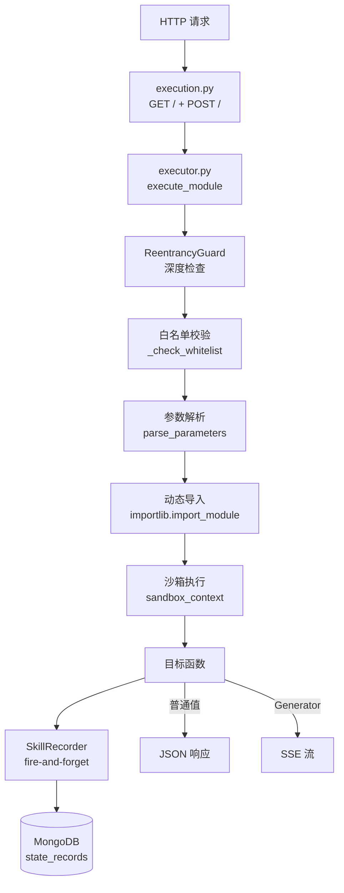
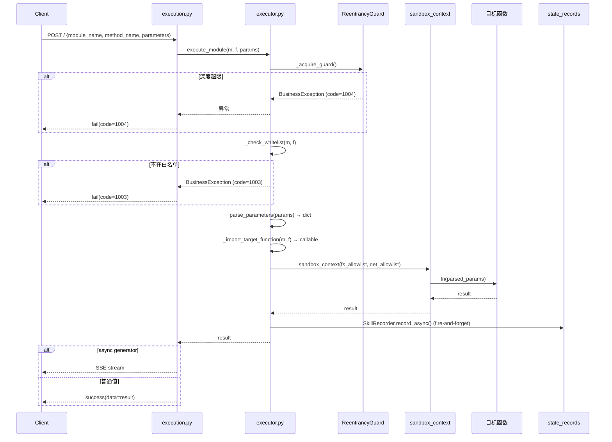

# Dynamic Execution API — 架构蓝图

> | v1.0 | 2026-05-13 | deepseek-v4-pro | 🌿 feat/YiAi-doc-from-code |

## 模块全景



## 文件清单

| 文件 | 角色 | 行数 |
|------|------|------|
| `src/api/routes/execution.py` | HTTP 路由层，参数提取，流式分发 | 87 |
| `src/services/execution/executor.py` | 核心执行引擎，白名单/沙箱/守卫/录制 | 254 |
| `src/core/observer/guard.py` | 重入深度计数器 (ContextVar) | 57 |
| `src/core/observer/sandbox.py` | 文件系统访问控制 + open() 替换 | 85 |
| `src/services/state/skill_recorder.py` | 技能执行记录器 (fire-and-forget) | 67 |
| `src/models/schemas.py` (L9-27) | ExecuteRequest / SkillExecutionRecord 模型 | — |

## 调用链（以 POST / 为例）



## 关键设计决策

### 1. 白名单机制

白名单以 `module_path:function_name` 格式存储在 `settings.module_allowlist`。`"*"` 通配表示全部放行。生产环境建议精确指定。

```
# config.yaml
module_allowlist:
  - "services.ai.chat_service:chat"
  - "services.rss.rss_scheduler:get_scheduler_status_info"
```

### 2. 沙箱隔离

通过 `contextmanager` 临时替换 `builtins.open`，在执行目标函数期间拦截文件访问。执行完毕后自动恢复原始 `open()`。

- 启用条件：`observer_sandbox_enabled: true`
- 白名单路径：`observer_sandbox_fs_allowlist`
- 违规行为：抛出 `SandboxViolation`，被 executor 捕获转为 `BusinessException`

### 3. 重入守卫

基于 `contextvars.ContextVar` 的异步安全深度计数器。每次 `execute_module` 调用 depth+1，超出 `max_depth`（默认 3）拒绝执行。

- 目的：防止模块 A → execute_module → 模块 B → execute_module → ... 无限递归

### 4. 流式分发策略

| 检测顺序 | 类型 | 处理 |
|---------|------|------|
| 1 | `isasyncgen(result)` 或 `__aiter__` | `StreamingResponse` + SSE |
| 2 | `isinstance(result, GeneratorType)` | `StreamingResponse` + SSE |
| 3 | 其他 | `success(data=result)` |

### 5. 执行录制

每次执行通过 `SkillRecorder.record_async()` 以 fire-and-forget 方式写入 MongoDB `state_records` 集合。录制失败不阻断主流程。

---

```
← [01-API参考手册](./01-API参考手册.md) · ↑ [接口文档索引](../) · → [03-安全白皮书](./03-安全白皮书.md)
```
