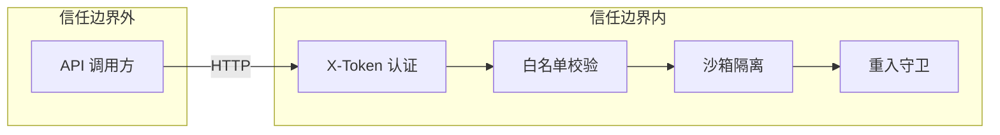

# Dynamic Execution API — 安全白皮书

> | v1.0 | 2026-05-13 | deepseek-v4-pro | 🌿 feat/YiAi-doc-from-code |

## 威胁模型



**信任边界**：HTTP 请求进入 → X-Token 认证是第一道防线。认证通过后，执行引擎内部的三层防护依次生效。

## 威胁枚举与缓解

| T# | 威胁 | 严重度 | 缓解 | 证据 |
|----|------|--------|------|------|
| T1 | 未认证调用执行任意模块 | 🔴 P0 | X-Token 认证中间件；`/` 路径不在白名单跳过列表中 | `src/core/middleware.py` |
| T2 | 白名单绕过（模块注入） | 🔴 P0 | `_check_whitelist` 精确匹配 `module:function`；空值拒绝 | `executor.py:178-184` |
| T3 | 路径遍历读/写任意文件 | 🔴 P0 | 沙箱 `sandbox_context` 替换 `builtins.open`，仅允许 fs_allowlist 内路径 | `sandbox.py:75-84` |
| T4 | 模块递归爆炸 | 🔴 P0 | `ReentrancyGuard` 基于 ContextVar，max_depth=3 | `guard.py:28-39` |
| T5 | 子进程逃逸 | 🟡 P1 | `run_script` 使用 `asyncio.create_subprocess_exec`，不经过 shell，限制 timeout | `executor.py:74-137` |
| T6 | 参数注入导致信息泄露 | 🟡 P1 | JSON 解析限制为 dict；`EXEC_LOG_TRUNCATION=500` 截断日志 | `executor.py:19, 64-72` |
| T7 | 执行录制污染数据库 | 🟢 P2 | `SkillRecorder` fire-and-forget，失败静默，不阻断主流程 | `skill_recorder.py:38-39` |

## 安全配置速查

| 配置项 | 类型 | 默认值 | 建议 |
|--------|------|--------|------|
| `middleware.auth.enabled` | bool | true | 生产必须开启 |
| `module_allowlist` | list | `["*"]` | 生产应精确指定每个 module:function |
| `observer.sandbox_enabled` | bool | false | 生产建议开启 |
| `observer.sandbox_fs_allowlist` | string | `""` | 生产限制为必要目录 |
| `observer.sandbox_network_allowlist` | string | `""` | 生产限制为必要主机 |
| `observer.guard_enabled` | bool | true | 保持开启 |
| `observer.guard_max_depth` | int | 3 | 按实际调用链深度调整 |

## 白名单安全等级

| 模式 | module_allowlist 值 | 风险 | 场景 |
|------|---------------------|------|------|
| 通配 | `["*"]` | 任意模块可被调用 | 开发/测试 |
| 精确 | `["pkg.mod:func", ...]` | 仅指定函数可调用 | 生产 |
| 关闭 | `[]` | 所有调用被拒绝 | 维护窗口 |

## 沙箱限制

- 沙箱仅替换 `builtins.open`，不限制 `import`、`eval`、`exec`、`subprocess` 等
- `run_script` 路径通过白名单 `subprocess` 执行外部 Python 脚本，不在 `sandbox_context` 范围内
- 如果目标函数内部使用 `os.system` 或未受限的 `subprocess`，沙箱无法拦截

**建议**：仅将受信任的模块函数加入白名单；对用户可配置的执行逻辑增加代码审查。

---

```
← [02-接口架构蓝图](./02-接口架构蓝图.md) · ↑ [接口文档索引](../) · → [04-集成手册](./04-集成手册.md)
```
