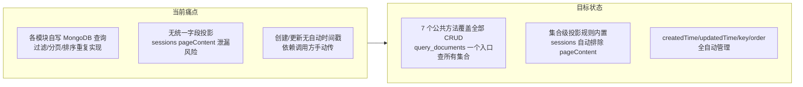
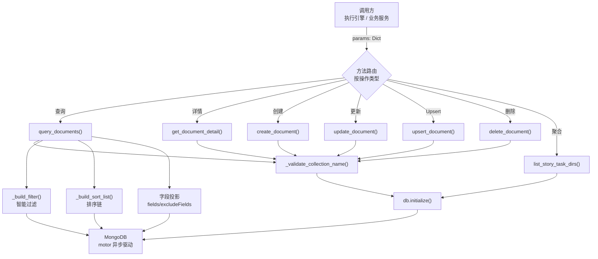
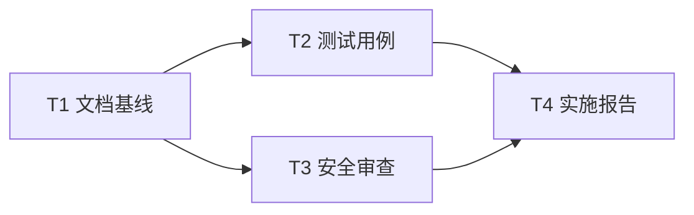

> | v1.0 | 2026-05-17 | deepseek-v4-pro | /rui doc --from-code | 🌿 feat/YiAi-rui-story | 📎 [CLAUDE.md](../../../../CLAUDE.md) |

> **导航**: [02-用户使用场景 →](./02-用户使用场景.md)

## 角色公式速查

| 角色 | 公式 |
|------|------|
| PM | `作为 [角色] 我想要 [动作] 以便 [价值]` |
| Tester | `Given [前置] When [操作] Then [预期]` |
| Coder | `模块 → 接口 → 数据流` |
| Security | `威胁 → 信任边界 → 缓解` |

---

### 需求概述

通用 MongoDB 数据服务层是 YiAi 的数据访问中枢，为所有业务模块提供集合无关的统一 CRUD 接口。支持复杂过滤（正则模糊搜索、日期范围、数值范围、列表查询）、分页、排序、字段投影，并内置 RSS 去重校验、sessions pageContent 排除等集合级适配逻辑。通过执行引擎动态调度或服务间直接调用两种方式暴露能力。

### 主要价值

- 🔗 **统一入口**：单一服务层封装所有 MongoDB CRUD，消除业务模块重复实现数据访问逻辑
- 🧠 **智能过滤**：参数类型自动推断过滤策略（字符串→正则模糊搜索、列表→$in/$gte/$lt、日期→多格式日期匹配）
- 🔧 **集合适配**：内置 sessions 集合 pageContent 排除、rss 集合 link 唯一性校验、apis 集合时间戳排序
- 📊 **聚合查询**：`list_story_task_dirs` 通过 MongoDB aggregation pipeline 提供故事任务目录去重清单
- ⏱️ **自动元数据**：创建时自动注入 key(UUID)/createdTime/updatedTime/order；更新时自动刷新 updatedTime

### 效果示意

---

## Story 1：通用 MongoDB 数据服务层

### §1 Story（pm）

| 字段 | 内容 |
|------|------|
| 作为 | 业务模块开发者（RSS 调度器、状态服务、API 路由） |
| 我想要 | 通过统一的服务层对任意 MongoDB 集合执行 CRUD 操作 |
| 以便 | 不重复实现过滤、分页、排序、投影逻辑，降低代码重复和安全风险 |
| 优先级 | P0 |
| 范围边界 | 7 个公共 CRUD 方法 + 7 个私有过滤/排序辅助函数；通过执行引擎或直接导入调用 |
| 依赖 | `core/database`（MongoDB 单例）、`core/config`（集合名/分页配置）、`core/utils`（时间/日期/数值工具） |
| 子项目 | YiAi |
| 范围外 | 集合/索引创建管理、ORM 映射层、GraphQL 接口、变更流 |

### §1.1 User Operations（tester）

| # | 操作 | 触发条件 | 操作步骤 | 预期结果 |
|---|------|---------|---------|---------|
| 1 | 查询文档列表 | 业务模块需获取某集合数据 | `query_documents({cname, pageNum, pageSize, orderBy, orderType, filter...})` | 返回 `{list, total, pageNum, pageSize, totalPages}` |
| 2 | 获取单文档详情 | 按 key 查看某条记录 | `get_document_detail({cname, id})` | 返回完整文档（不含 _id） |
| 3 | 创建文档 | 新增业务数据 | `create_document({cname, data:{...}})` 或 `create_document({cname, field1, field2...})` | 返回 `{key: <uuid>}`，自动注入时间戳和排序值 |
| 4 | 更新文档 | 修改已有数据 | `update_document({cname, data:{key, field1...}})` | 返回 `{key, updated:true}`，自动刷新 updatedTime |
| 5 | Upsert 文档 | 存在则更新、不存在则创建 | `upsert_document({cname, filter:{...}, update:{...}})` | 返回 `{matched_count, modified_count, upserted_id}` |
| 6 | 删除文档 | 移除过期/无效数据 | `delete_document({cname, key})` | 返回 `{key, deleted:true}` |
| 7 | 故事任务目录查询 | 查看所有活跃故事任务 | `list_story_task_dirs({project_name?})` | 返回去重目录列表含会话数和最近时间 |

### §2 Requirements（pm）

**功能点**：

| FP# | 描述 | 输入 | 输出 | 错误行为 | 优先级 |
|-----|------|------|------|---------|--------|
| FP1 | 集合名校验与路由 | `collection_name`/`cname` | 定位 MongoDB 集合 | ValueError: 必须提供集合名称 | P0 |
| FP2 | 多条件查询过滤 | `query_params`（key/value 对） | MongoDB filter dict | — | P0 |
| FP3 | 分页查询 | `pageNum`, `pageSize` | `{list, total, pageNum, pageSize, totalPages}` | ValueError: 分页参数必须是有效整数 | P0 |
| FP4 | 排序链 | `orderBy`, `orderType` | sort list | — | P1 |
| FP5 | 字段投影 | `fields`/`excludeFields` | MongoDB projection | — | P1 |
| FP6 | 文档创建 | `data` + `cname` | `{key: <uuid>}` | ValueError: link 重复/唯一性冲突 | P0 |
| FP7 | 文档更新 | `data` 含 `key` | `{key, updated:true}` | ValueError: key 不存在 | P0 |
| FP8 | 文档 Upsert | `filter` + `update` | `{matched_count, modified_count, upserted_id}` | ValueError: 缺少必要参数 | P1 |
| FP9 | 文档删除 | `key` + `cname` | `{key, deleted:true}` | ValueError: 未找到数据 | P0 |
| FP10 | 单文档详情 | `id`(key) + `cname` | 完整文档 | ValueError: 未找到数据 | P1 |
| FP11 | 故事任务目录聚合 | `project_name?` + 分页 | `{list: [{project_name, story_name, dir_path, session_count, latest_time}], total}` | — | P1 |

**业务规则**：

| R# | 描述 | 校验方式 | 证据级别 |
|----|------|---------|---------|
| R1 | `key` 字段使用精确匹配（非正则） | `_build_filter()` 检查 `key == 'key'` | [B] data_service.py:138-139 |
| R2 | sessions 集合始终排除 `pageContent` | `query_documents`/`get_document_detail` 检查 `collection_name == 'sessions'` | [B] data_service.py:230,240-241,282-283 |
| R3 | RSS 集合 link 字段唯一 | `create_document` 先查 `link` 再插入 | [B] data_service.py:310-315 |
| R4 | 字符串参数默认模糊匹配 | `_handle_string_search_filter` 构建 `re.compile(..., re.IGNORECASE)` | [B] data_service.py:127 |
| R5 | 创建自动注入 key/UUID + createdTime + updatedTime + order | `create_document` 固定注入 4 个系统字段 | [B] data_service.py:318-323 |
| R6 | 更新自动刷新 updatedTime，保护 key/createdTime/_id | `update_document` 移除保护字段 + 注入 updatedTime | [B] data_service.py:376-386 |
| R7 | 默认分页：pageSize=2000，上限 8000 | `query_documents` 参数解析 `max(1, min(8000, ...))` | [B] data_service.py:213 |
| R8 | 默认排序链：主排序 → updatedTime desc → createdTime desc | `_build_sort_list` 追加 fallback 排序字段 | [B] data_service.py:163-167 |
| R9 | order 字段自增（当前集合 max order + 1） | `create_document` 查询最大 order 值 + 1 | [B] data_service.py:328-336 |
| R10 | sessions 更新时 messages=[] 被丢弃 | `update_document` 检查空数组 | [B] data_service.py:383-384 |
| R11 | isoDate 逗号分隔支持日期范围 | `_handle_iso_date_filter` 分割逗号并构建范围过滤 | [B] data_service.py:68-76 |

**数据约束**：

| 约束 | 类型 | 范围/格式 | 来源 |
|------|------|----------|------|
| collection_name/cname | str | 非空字符串 | [B] data_service.py:16-19 |
| key (文档标识) | str | UUID v4 | [B] data_service.py:321 |
| createdTime | str | `%Y-%m-%d %H:%M:%S` 格式 | [B] core/utils.py |
| updatedTime | str | `%Y-%m-%d %H:%M:%S` 格式，每次更新刷新 | [B] core/utils.py |
| order | int | 自增序号，从当前集合最大 order+1 开始 | [B] data_service.py:328-336 |
| pageNum | int | ≥1，默认 1 | [B] data_service.py:212 |
| pageSize | int | 1–8000，默认 2000 | [B] data_service.py:213 |
| sort_order | int | 1 (asc) 或 -1 (desc) | [B] data_service.py:218 |

### §3 Design（coder + security）

| 决策领域 | 选定方案 | 选择理由 | 详见 |
|---------|---------|---------|------|
| 调用方式 | 通过执行引擎动态调度 + 服务间直接 import | 复用白名单/沙箱安全层，同时允许内部高效调用 | 03-后端技术评审 §1 |
| 过滤策略 | 参数类型自动推断（4 级决策链） | key 精确→isoDate 特殊→iterable 范围/列表→string 正则 | 03-后端技术评审 §2 |
| 字段投影 | fields 白名单 / excludeFields 黑名单双模式 | 灵活控制返回字段，sessions 默认排除 pageContent | 03-后端技术评审 §2 |
| 错误处理 | ValueError + BusinessException 双轨 | 参数校验用 ValueError，业务逻辑用 BusinessException | 03-后端技术评审 §4 |
| 排序回退链 | 主排序 → updatedTime desc → createdTime desc | 确保分页结果稳定可预测 | 03-后端技术评审 §2 |
| 连接管理 | MongoDB 单例懒初始化 | 每次方法调用 `await db.initialize()`，内部幂等 | 03-后端技术评审 §3 |

### §4 Tasks（pm + 全员）

| ID | 描述 | 工作量 | 依赖 | 交付物 | Agent | 门禁 | 交接下游 |
|----|------|--------|------|--------|-------|------|---------|
| T1 | 文档基线生成 | M | — | 01/02/03/05 | pm + coder | 无 | T2 |
| T2 | 测试用例编写 | M | T1 | tests/test_data_service.py | tester | Gate A | T3 |
| T3 | 安全审查 | S | T1 | 安全审查报告 | security | P0 清零 | T4 |
| T4 | 实施报告 | S | T2,T3 | 06/08/09 | coder | Gate B | 交付 |

### §5 AC（tester）

| AC# | Given | When | Then | 门禁 |
|-----|-------|------|------|------|
| AC1 | sessions 集合存在 | `query_documents({cname:"sessions", pageSize:10})` | 返回 ≤10 条文档，不含 pageContent 字段，含 key 字段 | Gate A |
| AC2 | 传入合法 data | `create_document({cname:"sessions", data:{title:"test"}})` | 返回 `{key: <uuid>}`，文档含 key/createdTime/updatedTime/order | Gate A |
| AC3 | 已知文档 key | `update_document({cname:"sessions", data:{key:<k>, title:"updated"}})` | 返回 `{key, updated:true}`，updatedTime 刷新，createdTime/key 不变 | Gate A |
| AC4 | 已知文档 key | `delete_document({cname:"sessions", key:<k>})` | 返回 `{key, deleted:true}`，文档从集合中消失 | Gate A |
| AC5 | RSS 集合已存在 link | `create_document({cname:"rss", data:{link:"http://dup"}})` 再次 | 第二次返回 ValueError: link 已存在 | Gate A |
| AC6 | 不存在的 key | `get_document_detail({cname:"sessions", id:"nonexistent"})` | ValueError: 未找到数据 | Gate A |
| AC7 | filter + update 均为合法 dict | `upsert_document({cname:"sessions", filter:{key:"x"}, update:{$set:{a:1}}})` | 返回 upsert 结果，含 matched/modified/upserted_id | Gate B |
| AC8 | sessions 集合有 projectName+storyName 文档 | `list_story_task_dirs({project_name:"YiAi"})` | 返回去重目录列表，含 session_count 和 latest_time | Gate B |
| AC9 | 字符串过滤参数 | `query_documents({cname:"sessions", title:"搜索词"})` | 返回 title 含"搜索词"的文档（不区分大小写） | Gate B |
| AC10 | isoDate 范围过滤 | `query_documents({cname:"rss", isoDate:"2026-01-01,2026-01-31"})` | 返回 isoDate/pubDate/published 在 1 月范围内的文档 | Gate B |
