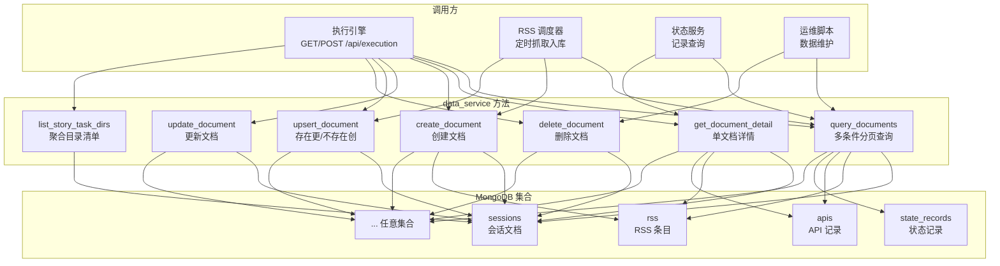
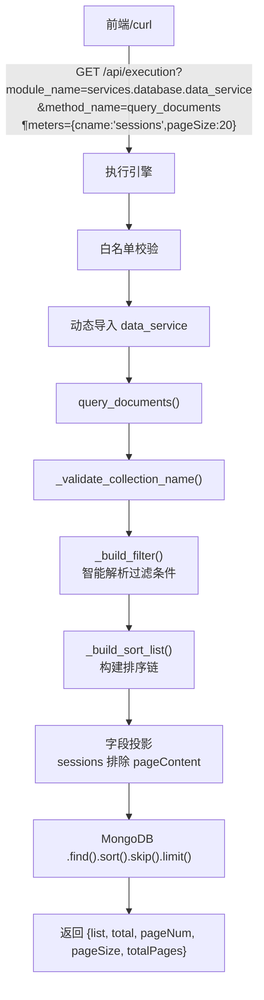
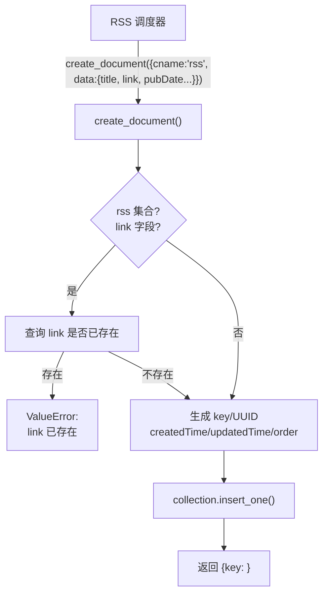
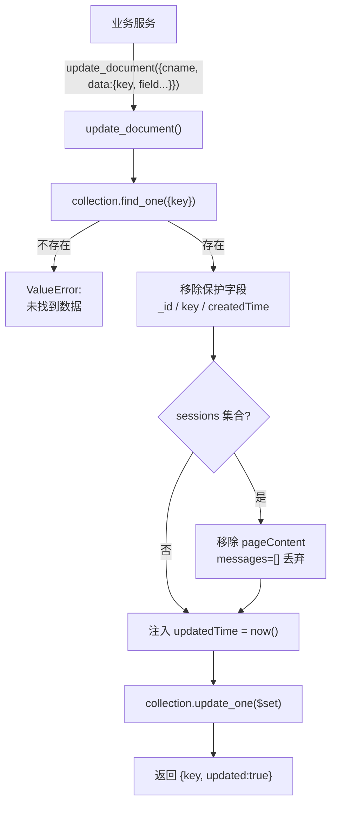
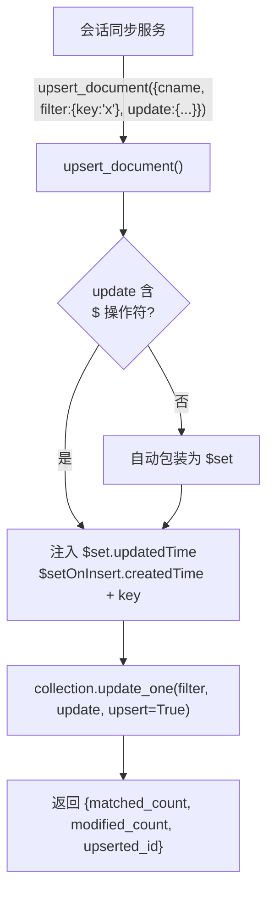
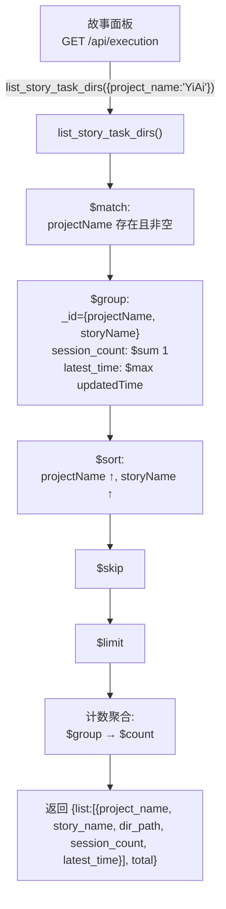

> | v1.0 | 2026-05-17 | deepseek-v4-pro | /rui doc --from-code | 🌿 feat/YiAi-rui-story | 📎 [CLAUDE.md](../../../../CLAUDE.md) |

> **导航**: [← 01-故事任务](./01-故事任务.md) · [03-后端技术评审 →](./03-后端技术评审.md)

## §1 场景全景



## §2 场景详述

### 场景 1：业务模块分页查询数据

| 字段 | 内容 |
|------|------|
| 角色 | 前端页面 / 数据分析人员 |
| 触发条件 | 需要浏览某集合的文档列表 |
| 核心目标 | 通过执行引擎调用 query_documents，获取分页过滤排序后的数据 |



| # | 步骤 | 输入 | 系统响应 | 异常分支 |
|---|------|------|---------|---------|
| 1 | 构造查询 | `cname`, `pageNum`, `pageSize`, 过滤参数 | — | cname 为空→ValueError |
| 2 | 解析过滤 | 各参数按类型匹配过滤策略 | filter_dict 构建 | — |
| 3 | 数据库查询 | filter + sort + skip + limit | 文档列表 | 连接失败→异常 |
| 4 | 返回结果 | — | `{list:[...], total:N, pageNum, pageSize, totalPages}` | — |

### 场景 2：RSS 数据去重创建

| 字段 | 内容 |
|------|------|
| 角色 | RSS 调度器 |
| 触发条件 | 定时拉取外部 RSS 源，新条目需入库 |
| 核心目标 | 通过 create_document 创建 RSS 文档，link 重复时自动拦截 |



| # | 步骤 | 输入 | 系统响应 | 异常分支 |
|---|------|------|---------|---------|
| 1 | 构造创建请求 | `cname="rss"`, `data={title, link, ...}` | — | cname 为空→ValueError |
| 2 | link 去重检查 | `link` 值 | 查询集合 | link 已存在→ValueError |
| 3 | 注入元数据 | — | key/UUID + createdTime + updatedTime + order | order 查询失败→默认 1 |
| 4 | 执行插入 | 完整文档 | insert_one | 并发冲突→ValueError |
| 5 | 返回结果 | — | `{key: <uuid>}` | — |

### 场景 3：文档更新（保护不可变字段）

| 字段 | 内容 |
|------|------|
| 角色 | 业务模块（状态服务） |
| 触发条件 | 需要修改某文档的部分字段 |
| 核心目标 | update_document 按 key 定位文档，保护 _id/key/createdTime，自动刷新 updatedTime |



| # | 步骤 | 输入 | 系统响应 | 异常分支 |
|---|------|------|---------|---------|
| 1 | 构造更新 | `cname`, `data` 含 `key` | — | key 缺失→ValueError |
| 2 | 存在性检查 | `key` | find_one | 不存在→ValueError |
| 3 | 字段保护 | — | 剥离 _id/key/createdTime/pageContent | — |
| 4 | 时间刷新 | — | updatedTime = get_current_time() | — |
| 5 | 执行更新 | `$set` 操作 | update_one | — |
| 6 | 返回结果 | — | `{key, updated:true}` | — |

### 场景 4：Upsert（存在则更新、不存在则创建）

| 字段 | 内容 |
|------|------|
| 角色 | 业务模块（会话同步） |
| 触发条件 | 不确定文档是否存在，需要幂等写入 |
| 核心目标 | 通过 upsert_document 实现 filter 匹配则更新、不匹配则创建 |



| # | 步骤 | 输入 | 系统响应 | 异常分支 |
|---|------|------|---------|---------|
| 1 | 构造 upsert | `cname`, `filter`, `update` | 参数校验 | 缺必要参数→ValueError |
| 2 | 操作符检查 | update dict | 无 `$` 前缀时包装为 `$set` | — |
| 3 | 系统字段注入 | — | `$set.updatedTime` + `$setOnInsert.{createdTime,key}` | — |
| 4 | 执行 upsert | filter + update | update_one(upsert=True) | — |
| 5 | 返回结果 | — | `{matched_count, modified_count, upserted_id}` | — |

### 场景 5：故事任务目录聚合查询

| 字段 | 内容 |
|------|------|
| 角色 | 项目管理者 / 故事面板 |
| 触发条件 | 需要查看当前所有活跃的故事任务目录 |
| 核心目标 | 通过 `list_story_task_dirs` 一键获取按 projectName/storyName 去重的目录清单 |



| # | 步骤 | 输入 | 系统响应 | 异常分支 |
|---|------|------|---------|---------|
| 1 | 构造查询 | `project_name?` + 分页 | — | — |
| 2 | 聚合管道 | `$match` → `$group` → `$sort` → `$skip` → `$limit` | 去重目录列表 | MongoDB 异常→传播 |
| 3 | 计数 | 轻量 count aggregation | total 值 | — |
| 4 | 返回结果 | — | `{list:[...], total, pageNum, pageSize, totalPages}` | — |

**响应示例**：
```json
{
  "code": 0,
  "data": {
    "list": [
      {
        "project_name": "YiAi",
        "story_name": "data-service",
        "dir_path": "docs/故事任务面板/YiAi/data-service",
        "session_count": 2,
        "latest_time": "2026-05-17 12:00:00"
      }
    ],
    "total": 1,
    "pageNum": 1,
    "pageSize": 2000,
    "totalPages": 1
  }
}
```

## §3 场景覆盖矩阵

| 场景 | FP1 集合路由 | FP2 过滤 | FP3 分页 | FP4 排序 | FP5 投影 | FP6 创建 | FP7 更新 | FP8 Upsert | FP9 删除 | FP10 详情 | FP11 聚合 | 备注 |
|------|------------|---------|---------|---------|---------|---------|---------|-----------|---------|----------|----------|------|
| 1-分页查询 | ✓ | ✓ | ✓ | ✓ | ✓ | — | — | — | — | — | — | 最常用路径 |
| 2-RSS去重创建 | ✓ | — | — | — | — | ✓ | — | — | — | — | — | 唯一性校验 |
| 3-保护更新 | ✓ | — | — | — | — | — | ✓ | — | — | — | — | 字段保护路径 |
| 4-Upsert | ✓ | — | — | — | — | — | — | ✓ | — | — | — | 幂等写入 |
| 5-目录聚合 | ✓ | — | ✓ | ✓ | — | — | — | — | — | — | ✓ | 聚合管道路径 |

## §4 评审清单

| # | 检查项 | 状态 |
|---|--------|------|
| 1 | 场景 ≥ 2 | ✓ (5 场景) |
| 2 | 每场景有流程图 | ✓ |
| 3 | FP 全覆盖 | ✓ (FP1–5 查询场景 + FP6 创建 + FP7 更新 + FP8 Upsert + FP11 聚合) |
| 4 | 异常分支明确 | ✓ (每场景含异常分支) |
