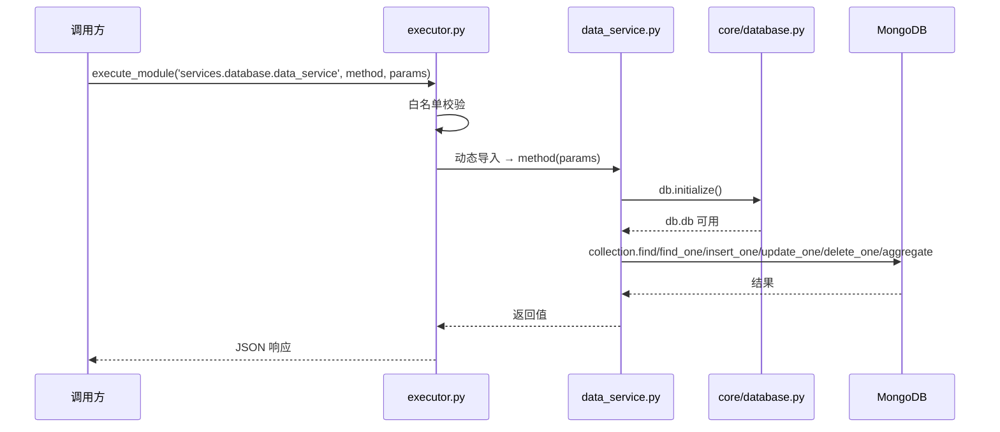
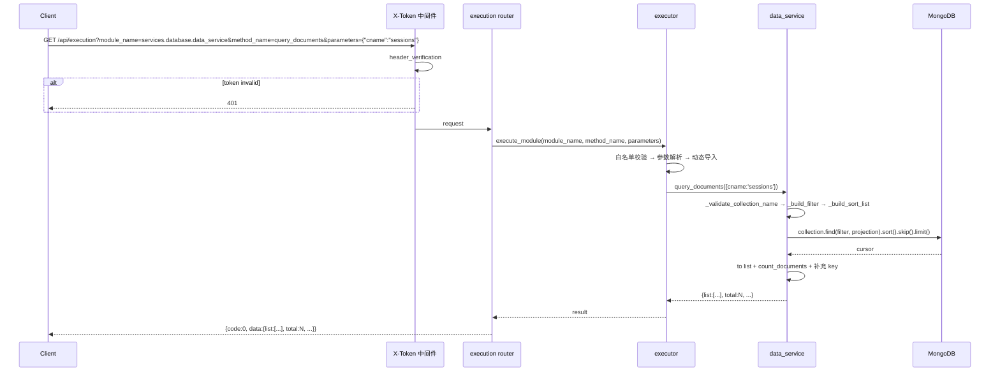
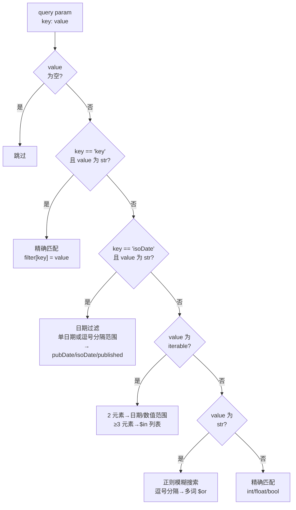

> | v1.0 | 2026-05-17 | deepseek-v4-pro | /rui doc --from-code | 🌿 feat/YiAi-rui-story | 📎 [CLAUDE.md](../../../../CLAUDE.md) |

> **导航**: [← 02-用户使用场景](./02-用户使用场景.md) · [05-测试用例评审 →](./05-测试用例评审.md)

## §1 服务架构

### 1.1 服务/进程

| 变更类型 | 模块/文件 | 职责 |
|---------|----------|------|
| 已有 | `src/services/database/data_service.py` | 核心数据服务层：7 个公共 CRUD 方法 + 7 个私有过滤/排序辅助函数 |
| 已有 | `src/core/database.py` | MongoDB 单例：连接池管理、索引确保、基础 CRUD 包装 |
| 已有 | `src/core/config.py` | 配置源：集合名常量、分页默认值、MongoDB 连接参数 |
| 已有 | `src/core/utils.py` | 工具函数：`get_current_time()`、`is_valid_date()`、`is_number()` |
| 已有 | `src/api/routes/execution.py` | HTTP 路由层：通过执行引擎动态调度 data_service 方法 |
| 已有 | `src/services/execution/executor.py` | 执行引擎：白名单校验后动态导入并调用 data_service |

### 1.2 通信通道

| 通道 | 方向 | 协议 | Payload | 错误处理 |
|------|------|------|---------|---------|
| HTTP → 执行引擎 | Client→Server | HTTP/1.1 | GET Query / POST JSON Body | 400/403/500 |
| 执行引擎 → data_service | 进程内调用 | Python async | `Dict[str, Any]` params | BusinessException |
| data_service → database | 进程内调用 | Python async | collection + filter/projection | 异常传播 |
| database → MongoDB | motor async | MongoDB Wire | BSON document | 连接失败→异常传播 |

## §2 API 接口

### 2.1 接口清单

data_service 无独立路由，所有方法通过执行引擎暴露：

| 方法 | 调用路径 | 参数 | 返回值 | 错误 |
|------|---------|------|--------|------|
| query_documents | `GET/POST /api/execution` → `services.database.data_service:query_documents` | `cname`, `pageNum?`, `pageSize?`, `orderBy?`, `orderType?`, `fields?`/`excludeFields?`, 过滤参数 | `{list, total, pageNum, pageSize, totalPages}` | ValueError: cname 缺失/分页非法 |
| get_document_detail | 同上 → `:get_document_detail` | `cname`, `id` | 完整文档 | ValueError: 未找到 |
| create_document | 同上 → `:create_document` | `cname`, `data` | `{key}` | ValueError: link 重复/唯一性冲突 |
| update_document | 同上 → `:update_document` | `cname`, `data`(含 `key`) | `{key, updated:true}` | ValueError: key 不存在 |
| upsert_document | 同上 → `:upsert_document` | `cname`, `filter`, `update` | `{matched_count, modified_count, upserted_id}` | ValueError: 缺少必要参数 |
| delete_document | 同上 → `:delete_document` | `cname`, `key` | `{key, deleted:true}` | ValueError: 未找到 |
| list_story_task_dirs | 同上 → `:list_story_task_dirs` | `project_name?`, `pageNum?`, `pageSize?` | `{list, total, pageNum, pageSize, totalPages}` | — |

### 2.2 请求流程

### 2.3 服务实现

| 服务/模块 | 依赖 | 文件路径 | 核心方法 |
|----------|------|---------|---------|
| DataService | `core.database.db`, `core.config.settings`, `core.utils` | `src/services/database/data_service.py` | `query_documents()`, `get_document_detail()`, `create_document()`, `update_document()`, `upsert_document()`, `delete_document()`, `list_story_task_dirs()` |
| MongoDB | `motor.motor_asyncio` | `src/core/database.py` | `initialize()`, `close()`, `insert_one()`, `insert_many()`, `find_one()` |
| ExecutionRouter | `executor.execute_module` | `src/api/routes/execution.py` | `execute_module_via_get()`, `execute_module_via_post()` |
| Executor | `config.settings`, `error_codes`, `observer`, `skill_recorder` | `src/services/execution/executor.py` | `execute_module()`, `parse_parameters()` |

## §3 数据模型

### 3.1 存储结构

| Key/表/集合 | 类型 | 默认值 | 读频率 | 写频率 | 说明 |
|------------|------|--------|--------|--------|------|
| `sessions` | MongoDB collection | — | 高 | 高 | 会话文档：projectName+storyName 标识故事任务归属；data_service 自动排除 pageContent |
| `rss` | MongoDB collection | — | 中 | 中 | RSS 条目：link 唯一索引，pubDate/isoDate 复合日期格式 |
| `apis` | MongoDB collection | — | 中 | 中 | API 记录：默认按 timestamp 排序 |
| `state_records` | MongoDB collection | — | 中 | 中 | 状态记录：结构化状态存储 |
| `chat_records` | MongoDB collection | — | 低 | 低 | 聊天记录 |
| `seeds` | MongoDB collection | — | 低 | 低 | 种子数据 |
| `oss_file_tags` | MongoDB collection | — | 低 | 低 | OSS 文件标签 |
| `oss_file_info` | MongoDB collection | — | 低 | 低 | OSS 文件信息 |

data_service 本身**无 schema 定义**——它是集合无关的通用数据访问层，不维护集合 schema 或索引。索引管理由 `core/database.py:_ensure_indexes` 负责。

### 3.2 系统字段

| 字段 | 类型 | 注入时机 | 说明 |
|------|------|---------|------|
| `key` | str (UUID) | create / upsert($setOnInsert) | 文档唯一业务标识，替代 _id 对调用方暴露 |
| `createdTime` | str (`%Y-%m-%d %H:%M:%S`) | create / upsert($setOnInsert) | 创建时间戳，创建后不可变 |
| `updatedTime` | str (`%Y-%m-%d %H:%M:%S`) | create / update / upsert | 更新时间戳，每次写操作自动刷新 |
| `order` | int | create | 自增排序序号（集合当前最大 order + 1） |

### 3.3 过滤策略决策链

### 3.4 数据迁移

| 版本 | 变更 | 迁移策略 |
|------|------|---------|
| — | 无迁移需求 | 系统字段由 data_service 自动管理，无 schema 变更计划 |

## §4 安全约束

| # | 威胁 | 信任边界 | 缓解措施 | 优先级 |
|---|------|---------|---------|--------|
| 1 | 未授权集合访问 | 调用方 → data_service | 执行引擎白名单 `module_allowlist` 控制可调用的方法；无独立路由 | P0 |
| 2 | NoSQL 注入（正则 ReDoS） | 用户输入 → 过滤参数 | `re.escape(value)` 转义所有正则特殊字符 | P0 |
| 3 | 敏感字段泄漏 | 调用方 → 查询结果 | sessions 自动排除 `pageContent`；`_id` 始终排除；fields/excludeFields 投影控制 | P1 |
| 4 | 数据覆盖（并发写） | 写操作 → MongoDB | `update_one` 原子操作；`upsert` 使用 MongoDB 原子 upsert | P1 |
| 5 | 唯一性绕过 | 并发 create → RSS link | link 唯一索引 + 应用层预检查双重保护 | P0 |
| 6 | 分页越界 | 用户输入 → pageNum/pageSize | pageNum ≥ 1，pageSize 1–8000 硬限制 | P2 |
| 7 | 不可变字段被覆盖 | update → 保护字段 | `update_document` 显式移除 `_id`/`key`/`createdTime` | P0 |
| 8 | 路径遍历（集合名注入） | 调用方 → collection_name | `_validate_collection_name` 检查非空；MongoDB collection name 天然无路径语义 | P2 |

## §5 性能与限制

| 维度 | 约束 | 应对 |
|------|------|------|
| 查询复杂度 | `_build_filter` O(n) 遍历参数，每参数最多构建 1 个正则 | 参数量通常 < 10，无性能风险 |
| 分页深度 | skip + limit，无 cursor 分页 | pageSize 上限 8000，深分页场景建议用 key 范围查询替代 |
| 大集合 count | `count_documents` 全表扫描 | MongoDB 原生操作，数据量大时考虑预计算 |
| 连接管理 | 每次方法调用 `db.initialize()`，内部幂等 | 首调用建立连接池，后续返回已有实例 |
| 正则查询 | `re.compile(..., re.IGNORECASE)` 无索引利用 | 建议调用方优先使用精确匹配（key/int/bool） |
| 聚合管道 | `$match` → `$group` → `$sort` → `$skip` → `$limit` 两次（数据+计数） | sessions 集合数据量可控，暂无物化视图需求 |
| 并发创建 | order 查询 + 插入非原子 | `max_order+1` 在并发下可能重复；order 非关键字段，后续可改用 `$inc` 计数器 |

## §6 评审清单

| # | 检查项 | 状态 |
|---|--------|------|
| 1 | 权限最小化：通过执行引擎白名单控制方法访问 | ✓ |
| 2 | 通信对齐：执行引擎 → data_service → database → MongoDB | ✓ |
| 3 | 存储兼容：无 schema 定义，通用数据访问层 | ✓ |
| 4 | API 鉴权：依赖执行引擎 X-Token 中间件 | ✓ |
| 5 | 无硬编码密钥：所有配置来自 config.yaml | ✓ |
| 6 | 无误用长连接：MongoDB 连接池管理 | ✓ |
| 7 | 输入校验完整：集合名校验 + 分页范围硬限制 + re.escape 转义 | ✓ |
| 8 | 敏感字段保护：sessions.pageContent 自动排除 + _id 排除 + key 保证返回 | ✓ |
