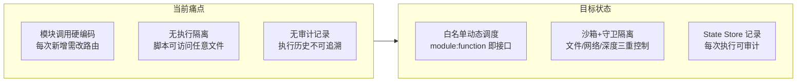
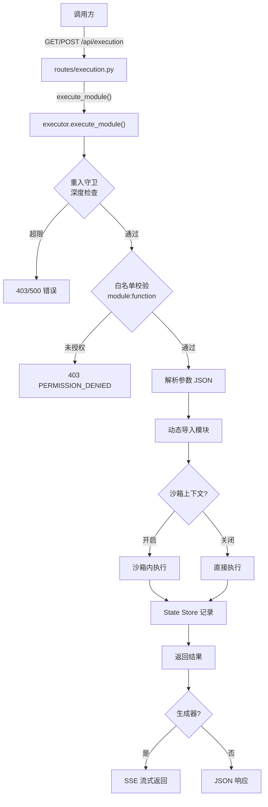
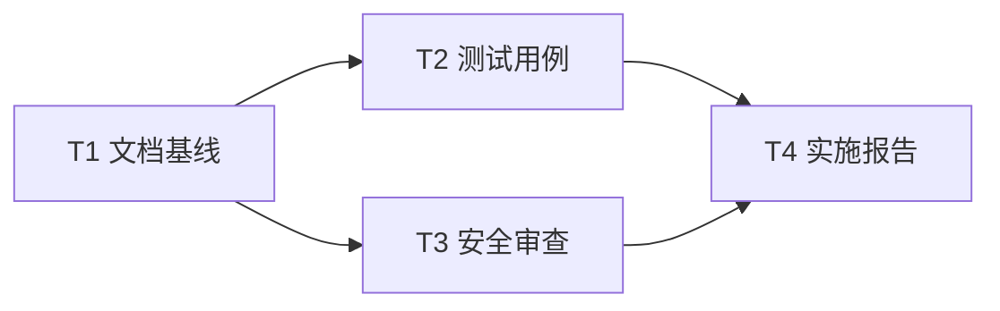

> | v1.0 | 2026-05-17 | deepseek-v4-pro | /rui doc --from-code | 🌿 feat/YiAi-execution-executor-doc | 📎 [CLAUDE.md](../../../../CLAUDE.md) |

> **导航**: [02-用户使用场景 →](./02-用户使用场景.md)

## 角色公式速查

| 角色 | 公式 |
|------|------|
| PM | `作为 [角色] 我想要 [动作] 以便 [价值]` |
| Tester | `Given [前置] When [操作] Then [预期]` |
| Coder | `模块 → 接口 → 数据流` |
| Security | `威胁 → 信任边界 → 缓解` |

---

### 需求概述

受控模块执行引擎是 YiAi 的动态代码调度中枢：外部调用者通过 API 传入 `module_path:function_name` + JSON 参数，执行器校验白名单后动态导入目标函数，在 Observer 沙箱中运行并记录结果到 State Store。支持同步/异步/生成器三种函数类型，SSE 流式返回异步生成器结果。

### 主要价值

- 🔐 **安全执行**：白名单校验 + 沙箱文件系统/网络隔离 + 重入深度限制，防止未授权代码执行
- 🔌 **动态扩展**：无需重启服务即可调度任意已注册模块，降低运维成本
- 📊 **可观测性**：每次执行自动记录到 State Store（耗时/参数/结果/错误），支持审计追溯
- ⚡ **流式响应**：生成器/异步生成器结果通过 SSE 实时推送到客户端
- 🛡️ **退化友好**：Observer 组件不可用时跳过沙箱/守卫/记录器，不阻断核心执行路径

### 效果示意

---

## Story 1：受控模块执行引擎

### §1 Story（pm）

| 字段 | 内容 |
|------|------|
| 作为 | API 调用方（内部服务/脚本/前端） |
| 我想要 | 通过标准化接口动态调用任意已注册模块 |
| 以便 | 无需为每个模块单独开发路由，降低交付周期 |
| 优先级 | P0 |
| 范围边界 | 白名单内模块/函数的动态调度、沙箱隔离、结果记录 |
| 依赖 | `core/config`（白名单配置）、`core/observer`（沙箱+守卫）、`services/state`（记录器） |
| 子项目 | YiAi |
| 范围外 | 白名单管理 UI、模块热加载、分布式执行 |

### §1.1 User Operations（tester）

| # | 操作 | 触发条件 | 操作步骤 | 预期结果 |
|---|------|---------|---------|---------|
| 1 | GET 执行模块 | 开发/调试时快速调用 | GET `/api/execution?module_name=X&method_name=Y&parameters={}` | 返回目标函数执行结果 JSON |
| 2 | POST 执行模块 | 生产环境结构化调用 | POST `/api/execution` body=`{module_name, method_name, parameters}` | 返回目标函数执行结果 JSON |
| 3 | SSE 流式执行 | 调用异步生成器函数 | POST `/api/execution` → 目标函数为 async generator | 返回 text/event-stream，逐条推送结果 |
| 4 | 未授权模块调用 | 调用不在白名单的模块 | 任意执行请求 | 返回 403 PERMISSION_DENIED |
| 5 | 重入深度超限 | 模块 A 调用模块 B 调用模块 A... | 递归调用超过 max_depth | 返回 500 Reentrancy depth exceeds limit |

### §2 Requirements（pm）

**功能点**：

| FP# | 描述 | 输入 | 输出 | 错误行为 | 优先级 |
|-----|------|------|------|---------|--------|
| FP1 | 白名单校验 | `module_path`, `function_name` | 通过/拒绝 | 403 PERMISSION_DENIED | P0 |
| FP2 | 参数解析 | JSON 字符串或 dict | `Dict[str, Any]` | 400 INVALID_PARAMS | P0 |
| FP3 | 动态导入 | `module_path`, `function_name` | callable | 400 Module or function not found | P0 |
| FP4 | 沙箱执行 | callable + params | 函数返回值 | 沙箱违规抛 SandboxViolation | P1 |
| FP5 | 重入守卫 | — | 深度 token | 500 Reentrancy depth exceeds limit | P0 |
| FP6 | 脚本执行 | `script_path`, `timeout` | `{success, stdout, stderr, returncode}` | 超时 kill 进程 | P1 |
| FP7 | 执行记录 | 执行上下文 | State Store 写入 | 记录失败不抛异常 | P1 |
| FP8 | SSE 流式 | async generator | text/event-stream | — | P1 |

**业务规则**：

| R# | 描述 | 校验方式 | 证据级别 |
|----|------|---------|---------|
| R1 | 白名单含 `*` 时放行所有模块 | `_check_whitelist()` 检查 `"*" in EXEC_ALLOWLIST` | [B] executor.py:182 |
| R2 | 沙箱默认关闭 | `settings.observer_sandbox_enabled` 默认 False | [B] config.py:129 |
| R3 | 守卫默认开启，max_depth=3 | `settings.observer_guard_enabled` 默认 True | [B] config.py:133-134 |
| R4 | 参数/结果截断 500 字符记录 | `EXEC_LOG_TRUNCATION = 500` | [B] executor.py:19 |
| R5 | Record 采用 fire-and-forget 模式 | `record_async()` 使用 `asyncio.create_task` | [B] skill_recorder.py:49-53 |

**数据约束**：

| 约束 | 类型 | 范围/格式 | 来源 |
|------|------|----------|------|
| module_path | str | Python 模块路径如 `services.ai.chat_service` | [B] executor.py:178 |
| function_name | str | 模块内可调用对象名 | [B] executor.py:178 |
| parameters | dict\|str | JSON object 字符串或 dict | [B] executor.py:51 |
| timeout | int | 默认 300 秒 | [B] executor.py:74 |
| module_allowlist | str\|list | 逗号分隔或 YAML 列表，默认 `["*"]` | [B] config.py:112 |

### §3 Design（coder + security）

| 决策领域 | 选定方案 | 选择理由 | 详见 |
|---------|---------|---------|------|
| 执行模型 | 动态导入 + 直接调用 | 无需注册表，Python 原生 importlib | 03-后端技术评审 §1 |
| 安全隔离 | ContextVar 深度守卫 + 可选沙箱 patch open() | 轻量无进程开销 | 03-后端技术评审 §4 |
| 参数传递 | JSON string 或 dict 双模式 | 兼容 GET query string 和 POST body | 03-后端技术评审 §2 |
| 结果记录 | Fire-and-forget asyncio.create_task | 不阻塞主执行路径 | 03-后端技术评审 §3 |
| 流式输出 | SSE (text/event-stream) | 标准协议，前端 EventSource 兼容 | 03-后端技术评审 §2 |
| 脚本执行 | asyncio.create_subprocess_exec | 异步非阻塞，支持超时 kill | 03-后端技术评审 §1 |

### §4 Tasks（pm + 全员）

| ID | 描述 | 工作量 | 依赖 | 交付物 | Agent | 门禁 | 交接下游 |
|----|------|--------|------|--------|-------|------|---------|
| T1 | 文档基线生成 | M | — | 01/02/03/05 | pm + coder | 无 | T2 |
| T2 | 测试用例编写 | M | T1 | tests/test_executor.py | tester | Gate A | T3 |
| T3 | 安全审查 | S | T1 | 安全审查报告 | security | P0 清零 | T4 |
| T4 | 实施报告 | S | T2,T3 | 06/08/09 | coder | Gate B | 交付 |

### §5 AC（tester）

| AC# | Given | When | Then | 门禁 |
|-----|-------|------|------|------|
| AC1 | 白名单含 `services.test:echo` | POST `{module_name:"services.test", method_name:"echo", parameters:{}}` | 返回 echo 函数结果，200 | Gate A |
| AC2 | 白名单不含目标模块 | POST 未授权 module:function | 返回 403 PERMISSION_DENIED | Gate A |
| AC3 | 参数为非法 JSON | POST `parameters:"not json"` | 返回 400 INVALID_PARAMS | Gate A |
| AC4 | 模块不存在 | POST `module_name:"no.such.module"` | 返回 400 Module or function not found | Gate A |
| AC5 | 深度守卫 max_depth=3 | 递归调用第 4 层 | 返回 500 Reentrancy depth exceeds limit | Gate A |
| AC6 | 沙箱 fs_allowlist=["/safe"] | 模块尝试 open("/etc/passwd") | 抛出 SandboxViolation | Gate B |
| AC7 | 异步生成器函数 | POST 调用 async generator | 返回 SSE 流，含 `done: true` 结束信号 | Gate B |
| AC8 | State Store 开启 | 任意执行完成 | State Store 中存在执行记录 | Gate B |
