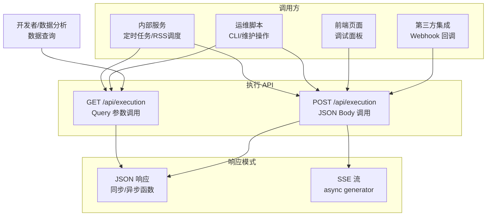
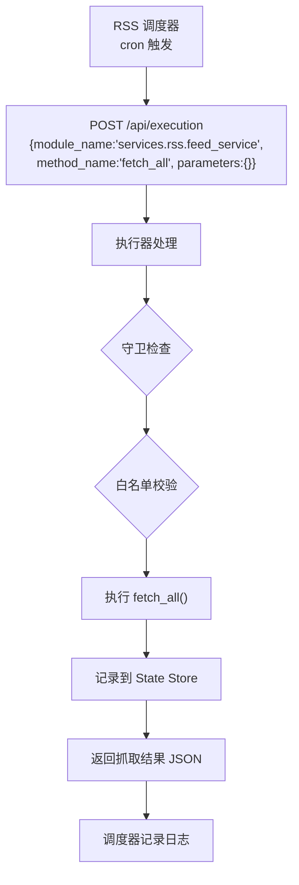
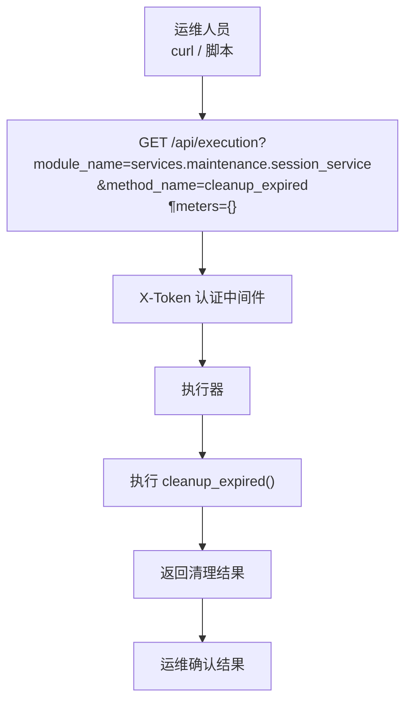
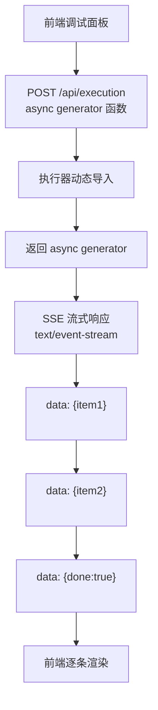
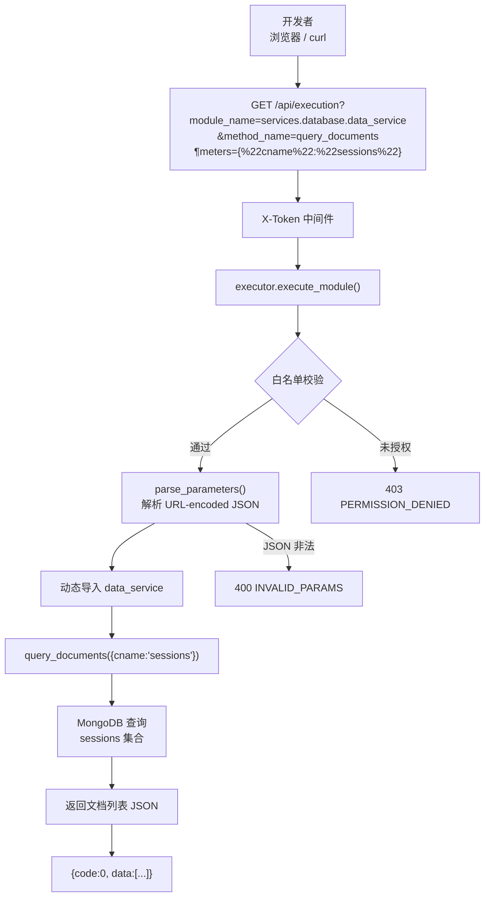
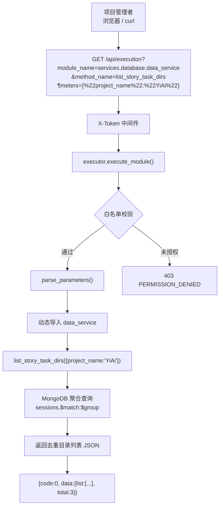

> | v1.2 | 2026-05-17 | deepseek-v4-pro | /rui update (T2: +list_story_task_dirs) | 🌿 feat/YiAi-execution-executor-doc | 📎 [CLAUDE.md](../../../../CLAUDE.md) |

> **导航**: [← 01-故事任务](./01-故事任务.md) · [03-后端技术评审 →](./03-后端技术评审.md)

## §1 场景全景



## §2 场景详述

### 场景 1：内部服务定时调用

| 字段 | 内容 |
|------|------|
| 角色 | 内部定时任务（RSS 调度器） |
| 触发条件 | 定时触发，需拉取外部 RSS 源 |
| 核心目标 | 动态调用 RSS 抓取模块，获取最新内容 |



| # | 步骤 | 输入 | 系统响应 | 异常分支 |
|---|------|------|---------|---------|
| 1 | 构造请求 | `module_name`, `method_name`, `parameters` | — | 参数格式校验失败→400 |
| 2 | 发送 POST | JSON body | 白名单校验 | 模块未注册→403 |
| 3 | 执行模块 | 目标函数接收 parameters | 函数执行 | 模块导入失败→400 |
| 4 | 接收结果 | — | JSON `{code:0, data:...}` | 执行异常→500 |

### 场景 2：运维脚本直接调用

| 字段 | 内容 |
|------|------|
| 角色 | 运维人员 |
| 触发条件 | 手动运维操作（清理缓存/检查健康） |
| 核心目标 | 通过 GET 请求快速触发维护操作 |



| # | 步骤 | 输入 | 系统响应 | 异常分支 |
|---|------|------|---------|---------|
| 1 | 构造 GET | Query 参数 | X-Token 认证 | Token 无效→401 |
| 2 | 白名单校验 | `module_name:method_name` | 放行/拒绝 | 未授权→403 |
| 3 | 执行函数 | parameters 解析 | 函数返回 | 超时/异常→500 |
| 4 | 返回结果 | — | JSON `{code:0, data:...}` | — |

### 场景 3：前端调试面板 SSE 流式调用

| 字段 | 内容 |
|------|------|
| 角色 | 前端开发者 |
| 触发条件 | 调试面板中选择模块并点击执行 |
| 核心目标 | 实时流式查看异步生成器输出 |



| # | 步骤 | 输入 | 系统响应 | 异常分支 |
|---|------|------|---------|---------|
| 1 | 选择模块执行 | `module_name`, `method_name`, `parameters` | 返回 SSE 流 | — |
| 2 | 流式接收 | EventSource 监听 | 逐条 data 推送 | 连接中断→前端重连 |
| 3 | 流结束 | — | `{"done":true}` 信号 | — |

### 场景 4：第三方 Webhook 回调

| 字段 | 内容 |
|------|------|
| 角色 | 企业微信机器人 |
| 触发条件 | 收到企业微信消息回调 |
| 核心目标 | 动态路由到消息处理模块 |

| # | 步骤 | 输入 | 系统响应 | 异常分支 |
|---|------|------|---------|---------|
| 1 | Webhook 接收 | 企业微信 XML/JSON | 解析消息类型 | 格式不支持→400 |
| 2 | 构造执行请求 | `module_name`, `method_name`, `parameters` | 白名单校验 | 未注册→403 |
| 3 | 执行业务逻辑 | 消息内容 | 处理并返回回复 | 处理失败→500 |
| 4 | 返回回复 | — | 企业微信消息回复 | — |

### 场景 5：数据查询直调（GET 示例）

| 字段 | 内容 |
|------|------|
| 角色 | 开发者 / 数据分析人员 |
| 触发条件 | 需要快速查询 MongoDB 中指定集合的文档 |
| 核心目标 | 通过浏览器地址栏或 curl 直接 GET 查询，无需构造 POST body |



**实际请求 URL**：
```
GET /api/execution?module_name=services.database.data_service&method_name=query_documents&parameters=%7B%22cname%22%3A%22sessions%22%7D
```

**参数解码**：`parameters` URL-decode → `{"cname":"sessions"}`，传入 `query_documents(params: Dict[str, Any])` 作为 `params` 实参。

| # | 步骤 | 输入 | 系统响应 | 异常分支 |
|---|------|------|---------|---------|
| 1 | 构造 GET URL | `module_name`, `method_name`, URL-encoded `parameters` | — | URL 编码错误→参数解析失败→400 |
| 2 | 白名单校验 | `services.database.data_service:query_documents` | 匹配 EXEC_ALLOWLIST | 未注册→403 |
| 3 | 参数解析 | `%7B%22cname%22%3A%22sessions%22%7D` → `{"cname":"sessions"}` | 解析为 dict | 非法 JSON→400 |
| 4 | 动态导入 | `services.database.data_service` → `query_documents` | 获取 callable | 模块/函数不存在→400 |
| 5 | 执行查询 | `query_documents({"cname":"sessions"})` | MongoDB 查询 sessions 集合 | 查询异常→500 |
| 6 | 返回结果 | — | `{code:0, data:[<documents>]}` | — |

### 场景 6：故事任务目录查询（聚合管道）

| 字段 | 内容 |
|------|------|
| 角色 | 项目管理者 / 开发者 |
| 触发条件 | 需要查看当前所有活跃的故事任务目录 |
| 核心目标 | 通过 GET 执行 `list_story_task_dirs` 一键获取去重的故事任务目录清单（含会话数、最近活跃时间） |



**实际请求 URL**：
```
GET /api/execution?module_name=services.database.data_service&method_name=list_story_task_dirs&parameters=%7B%22project_name%22%3A%22YiAi%22%7D
```

| # | 步骤 | 输入 | 系统响应 | 异常分支 |
|---|------|------|---------|---------|
| 1 | 构造 GET URL | `module_name`, `method_name`, URL-encoded `parameters` | — | URL 编码错误→参数解析失败→400 |
| 2 | 白名单校验 | `services.database.data_service:list_story_task_dirs` | 匹配 EXEC_ALLOWLIST | 未注册→403 |
| 3 | 参数解析 | `%7B%22project_name%22%3A%22YiAi%22%7D` → `{"project_name":"YiAi"}` | 解析为 dict | 非法 JSON→400 |
| 4 | 动态导入 | `services.database.data_service` → `list_story_task_dirs` | 获取 callable | 模块/函数不存在→400 |
| 5 | 执行聚合 | 按 projectName 过滤→$group 去重→$sort 排序 | MongoDB aggregation pipeline | 查询异常→500 |
| 6 | 返回结果 | — | `{code:0, data:{list:[{project_name, story_name, dir_path, session_count, latest_time}], total}}` | — |

**响应示例**：
```json
{
  "code": 0,
  "data": {
    "list": [
      {
        "project_name": "YiAi",
        "story_name": "execution-executor-doc",
        "dir_path": "docs/故事任务面板/YiAi/execution-executor-doc",
        "session_count": 3,
        "latest_time": "2026-05-17 10:30:00"
      }
    ],
    "total": 1,
    "pageNum": 1,
    "pageSize": 2000,
    "totalPages": 1
  }
}
```

## §3 场景覆盖矩阵

| 场景 | FP1 白名单 | FP2 参数 | FP3 导入 | FP4 沙箱 | FP5 守卫 | FP7 记录 | FP8 SSE | 备注 |
|------|-----------|---------|---------|---------|---------|---------|--------|------|
| 1-定时调用 | ✓ | ✓ | ✓ | — | ✓ | ✓ | — | 正常路径 |
| 2-运维脚本 | ✓ | ✓ | ✓ | — | ✓ | ✓ | — | 正常路径 |
| 3-SSE流式 | ✓ | ✓ | ✓ | — | ✓ | ✓ | ✓ | 流式路径 |
| 4-Webhook | ✓ | ✓ | ✓ | — | ✓ | ✓ | — | 集成路径 |
| 5-数据查询 | ✓ | ✓ | ✓ | — | ✓ | ✓ | — | GET 直调路径 |
| 6-目录查询 | ✓ | ✓ | ✓ | — | ✓ | ✓ | — | 聚合管道路径 |

## §4 评审清单

| # | 检查项 | 状态 |
|---|--------|------|
| 1 | 场景 ≥ 2 | ✓ (6 场景) |
| 2 | 每场景有流程图 | ✓ |
| 3 | FP 全覆盖 | ✓ (FP1/2/3/5/7/8 已覆盖) |
| 4 | 异常分支明确 | ✓ (每场景含异常分支) |
