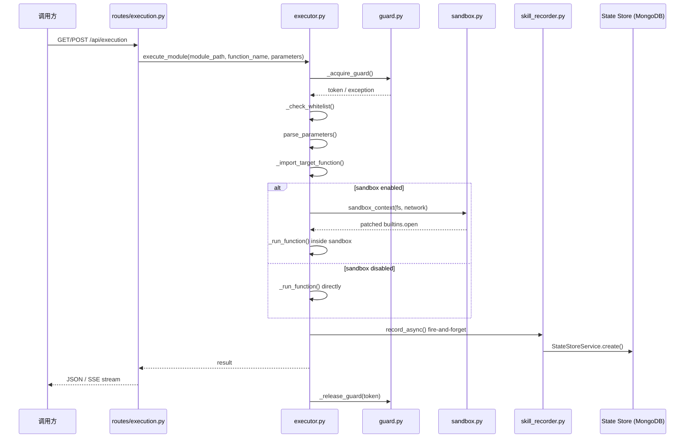
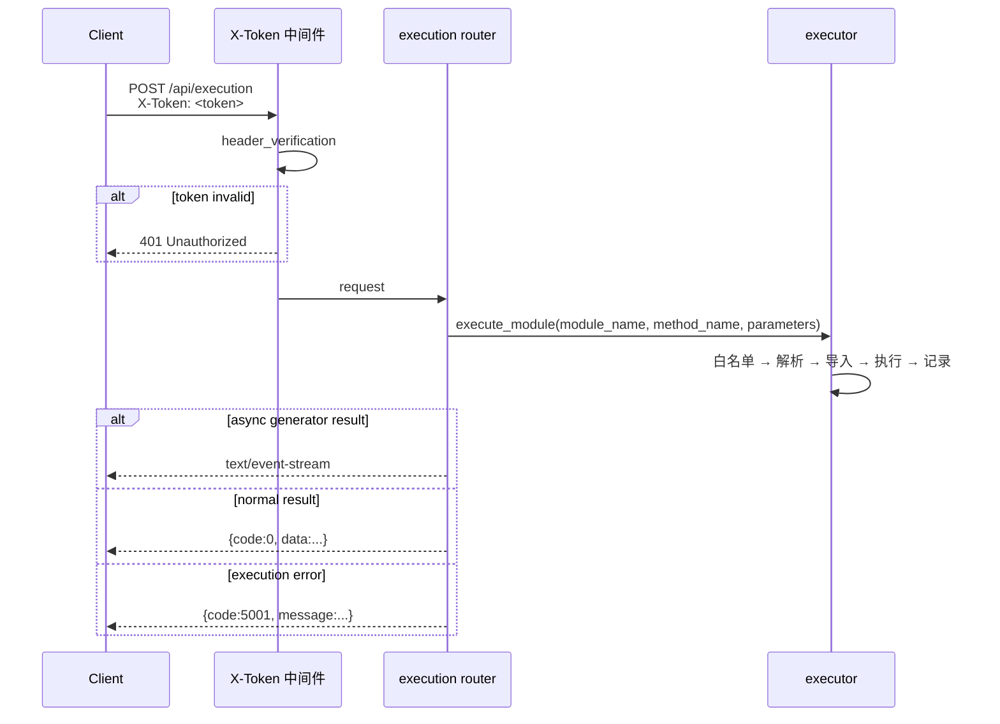

> | v1.1 | 2026-05-17 | deepseek-v4-pro | /rui update (T2: +list_story_task_dirs) | 🌿 feat/YiAi-execution-executor-doc | 📎 [CLAUDE.md](../../../../CLAUDE.md) |

> **导航**: [← 02-用户使用场景](./02-用户使用场景.md) · [05-测试用例评审 →](./05-测试用例评审.md)

## §1 服务架构

### 1.1 服务/进程

| 变更类型 | 模块/文件 | 职责 |
|---------|----------|------|
| 已有 | `src/api/routes/execution.py` | HTTP 路由层：GET/POST 入口，SSE 流封装 |
| 已有 | `src/services/execution/executor.py` | 核心执行器：白名单校验、动态导入、沙箱执行、结果记录 |
| 已有 | `src/core/observer/guard.py` | 重入守卫：ContextVar 深度计数器 |
| 已有 | `src/core/observer/sandbox.py` | 沙箱：文件系统 open() patch + 网络 allowlist |
| 已有 | `src/services/state/skill_recorder.py` | 执行记录器：fire-and-forget 写入 State Store |

### 1.2 通信通道

| 通道 | 方向 | 协议 | Payload | 错误处理 |
|------|------|------|---------|---------|
| HTTP → Router | Client→Server | HTTP/1.1 | GET Query / POST JSON Body | 400/403/500 |
| Router → Executor | 进程内调用 | Python async | `ExecuteRequest` fields | BusinessException |
| Executor → Guard | 进程内调用 | ContextVar | int depth | ReentrancyExceeded |
| Executor → Sandbox | 上下文管理器 | monkey-patch | builtins.open | SandboxViolation |
| Executor → Recorder | 进程内 fire-and-forget | asyncio.create_task | SkillExecutionRecord | 吞异常不抛 |
| Recorder → MongoDB | motor async | MongoDB Wire | document insert | 吞异常不抛 |

## §2 API 接口

### 2.1 接口清单

| 接口 | 方法 | 路径 | 请求体 | 响应体 | 错误码 |
|------|------|------|--------|--------|--------|
| execute_module_get | GET | `/api/execution` | Query: `module_name`, `method_name`, `parameters` | `{code:0, data:<result>}` | 400/403/500 |
| execute_module_post | POST | `/api/execution` | `ExecuteRequest{module_name, method_name, parameters}` | `{code:0, data:<result>}` 或 SSE 流 | 400/403/500 |

### 2.2 请求流程

### 2.3 服务实现

| 服务/模块 | 依赖 | 文件路径 | 核心方法 |
|----------|------|---------|---------|
| ExecutionRouter | `executor.execute_module` | `src/api/routes/execution.py` | `execute_module_via_get()`, `execute_module_via_post()` |
| Executor | `config.settings`, `error_codes`, `observer`, `skill_recorder` | `src/services/execution/executor.py` | `execute_module()`, `run_script()`, `parse_parameters()` |
| ReentrancyGuard | `contextvars` | `src/core/observer/guard.py` | `guard()`, `guard_sync()` |
| SandboxMiddleware | `builtins.open` | `src/core/observer/sandbox.py` | `sandbox_context()`, `_check_path()` |
| SkillRecorder | `StateStoreService` | `src/services/state/skill_recorder.py` | `record()`, `record_async()` |
| DataService | `core.database`, `core.config` | `src/services/database/data_service.py` | `query_documents()`, `create_document()`, `update_document()`, `upsert_document()`, `delete_document()`, `get_document_detail()`, `list_story_task_dirs()` |

## §3 数据模型

### 3.1 存储结构

| Key/表/集合 | 类型 | 默认值 | 读频率 | 写频率 | 说明 |
|------------|------|--------|--------|--------|------|
| `SkillExecutionRecord` (MongoDB collection) | document | — | 低 | 每次执行 1 次 | 执行记录：skill_name, status, duration_ms, input_summary, output_summary, error_message |
| `sessions` (MongoDB collection) | document | — | 按需 | 按需 | 会话文档：projectName + storyName 字段标识故事任务归属；`list_story_task_dirs()` 通过 `$match` + `$group` 聚合去重提取目录清单 |
| `_reentrancy_depth` (ContextVar) | int | 0 | 每次调用 | 每次调用 | 请求级深度计数器，自动重置 |
| `module_allowlist` (YAML config) | str/list | `["*"]` | 启动时 | 手动 | 白名单配置，`*` 表示全放行 |
| `observer_guard_max_depth` (YAML config) | int | 3 | 启动时 | 手动 | 最大重入深度 |

### 3.2 数据迁移

| 版本 | 变更 | 迁移策略 |
|------|------|---------|
| — | 无迁移需求 | 执行记录为 append-only 日志，无 schema 变更计划 |

## §4 安全约束

| # | 威胁 | 信任边界 | 缓解措施 | 优先级 |
|---|------|---------|---------|--------|
| 1 | 未授权模块执行 | 调用方 → 执行器 | 白名单 `EXEC_ALLOWLIST` 校验，`module_path:function_name` 精确匹配 | P0 |
| 2 | 文件系统越权 | 目标函数 → 文件系统 | `SandboxMiddleware._check_path()` + fs_allowlist resolve 校验 | P0 |
| 3 | 网络越权访问 | 目标函数 → 网络 | `SandboxMiddleware.check_network()` host allowlist | P1 |
| 4 | 递归调用栈溢出 | 模块间调用 | ContextVar 深度计数 + `max_depth=3` 硬限制 | P0 |
| 5 | 参数注入 | 调用方 → JSON parser | `json.loads()` + dict 类型校验，非法 JSON 返回 400 | P1 |
| 6 | 脚本执行超时 | subprocess → OS | `asyncio.wait_for(process.communicate(), timeout=300)` + kill | P1 |
| 7 | Token 泄漏 | 调用方 → API | X-Token 中间件全局认证 | P0 |
| 8 | 日志敏感信息泄漏 | 执行器 → 日志 | `EXEC_LOG_TRUNCATION=500` 截断参数/结果 | P2 |

## §5 性能与限制

| 维度 | 约束 | 应对 |
|------|------|------|
| 执行超时 | 脚本默认 300s，模块无硬超时 | 脚本用 `asyncio.wait_for`；模块执行依赖调用方超时 |
| 并发限制 | 无内置并发控制 | 依赖 FastAPI worker 数 + 重入深度守卫间接限制 |
| 内存占用 | 生成器结果驻留内存 | SSE 流式逐条推送，不缓存全量 |
| 执行记录 | Fire-and-forget 异步写入 | 不阻塞主路径，失败仅 log 不告警 |
| 动态导入 | importlib 每次重新导入 | 利用 Python 模块缓存，首次后命中 sys.modules |
| 沙箱开销 | open() monkey-patch | 仅在 `sandbox_enabled=true` 时激活，默认关闭 |

## §6 评审清单

| # | 检查项 | 状态 |
|---|--------|------|
| 1 | 权限最小化：白名单精确匹配 | ✓ `"*"` 全放行可收紧 |
| 2 | 通信对齐：HTTP 入 → Python 内 → MongoDB 出 | ✓ |
| 3 | 存储兼容：append-only 文档，无 schema 风险 | ✓ |
| 4 | API 鉴权：X-Token 中间件全局覆盖 | ✓ |
| 5 | 无硬编码密钥：token 来自 config.yaml | ✓ |
| 6 | 无误用长连接：SSE 短连接模式 | ✓ |
| 7 | 输入校验完整：JSON parse + dict type check + whitelist match | ✓ |
