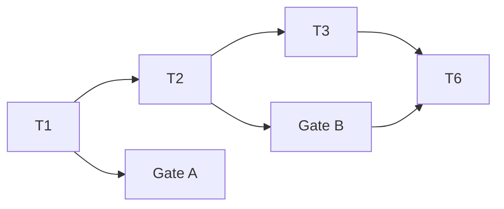

# 文件管理 API

> | v1.0 | 2026-05-13 | deepseek-v4-pro | 🌿 feat/YiAi-file-management | ⏱️ 12:41–13:30 | 📎 [CLAUDE.md](../../../CLAUDE.md) |

> **证据标准**: A=已验证(附路径) · B=可推导(附规则) · C=未验证(标注 `> 待补充`) · D=禁止(视为幻觉)

> **技术评审**: 详见 [02-后端技术评审.md](./02-后端技术评审.md) · [04-测试用例评审.md](./04-测试用例评审.md)

> **角色公式**:
> - **PM**: 作为 [角色] 我想要 [动作] 以便 [价值] — 定义故事边界
> - **Tester**: Given [前置] When [操作] Then [预期] — 验收标准可独立验证
> - **Coder**: 模块 → 接口 → 数据流 — 设计先拆模块再定契约
> - **Security**: 威胁 → 信任边界 → 缓解 — 每个威胁有明确对策

---

## Story 1: 文件管理 API

### §1 Story（pm 定义）

| 字段 | 详情 |
|-------|--------|
| 作为 | API 调用方（前端应用 / 外部服务） |
| 我想要 | 通过 HTTP API 上传、读取、写入、删除、重命名文件和文件夹 |
| 以便 | 管理静态资源存储，支持图片上传到 OSS，本地文件系统 CRUD 操作 |
| 优先级 | 🔴 P0 |
| 范围边界 | static/ 目录下的文件/文件夹操作；图片 Base64 上传到 OSS（本地回退）；路径安全校验 |
| 依赖 | — |
| 子项目 | YiAi |

**范围外**: 用户认证（由中间件层处理）、文件版本管理、批量操作、文件分享链接

---

### §1.1 User Operations（tester 描述）

| # | 操作 | 触发条件 | 操作步骤 | 预期结果 |
|---|-----------|---------|-------------|-----------------|
| U1 | 上传图片到 OSS | 前端提交 Base64 图片 | 1. POST /upload-image-to-oss 携带 data_url + filename → 2. 服务端解码 Base64 → 3. 上传 OSS（失败回退本地） | 返回图片 URL |
| U2 | 读取文件 | 需要获取文件内容 | 1. POST /read-file 携带 target_file → 2. 路径验证 → 3. 按类型返回文本/Base64/URL | 返回 content + type |
| U3 | 写入文件 | 需要保存内容 | 1. POST /write-file 携带 target_file + content → 2. 路径验证 → 3. 写入磁盘 | 返回保存确认 |
| U4 | 删除文件/文件夹 | 清理不需要的资源 | 1. POST /delete-file 或 /delete-folder → 2. 路径验证 → 3. 删除 | 返回删除确认 |
| U5 | 重命名文件/文件夹 | 重组文件结构 | 1. POST /rename-file 或 /rename-folder → 2. 双路径验证 → 3. rename | 返回重命名确认 |
| U6 | 通用上传 | 上传任意文件 | 1. POST /upload 携带 filename + content → 2. 写入目标目录 | 返回文件相对路径 |

> tester 从 AC 推导用户可见的操作路径，每个故事至少描述一条主操作流。

---

### §2 Requirements（pm 描述）

#### 功能点

| FP# | 描述 | 输入 | 输出 | 错误行为 | 优先级 |
|-----|-------------|-------|--------|---------------|----------|
| FP1 | 图片上传 OSS | data_url(Base64/DataURL), filename, directory | {url, filename, object_name} | Base64 解码失败 → 400; OSS 不可用 → 回退本地存储 | 🔴 |
| FP2 | 读取文件 | target_file(含扩展名) | {content, type:text/url/base64} | 路径不含扩展名 → 400; 文件不存在 → 400; 非文件路径 → 400 | 🔴 |
| FP3 | 写入文件 | target_file, content, is_base64 | {message, path} | 路径越界 → 400; 写入失败 → 500 | 🔴 |
| FP4 | 删除文件 | target_file | {message, path} | 路径越界 → 400; 不是文件 → 400; 删除失败 → 500 | 🔴 |
| FP5 | 删除文件夹 | target_dir | {message, path} | 路径越界 → 400; 不是目录 → 400; 删除失败 → 500 | 🔴 |
| FP6 | 重命名文件 | old_path, new_path | {message, old_path, new_path} | 源不存在 → 400; 类型不匹配 → 400; rename 失败 → 500 | 🔴 |
| FP7 | 重命名文件夹 | old_dir, new_dir | {message, old_path, new_path} | 同 FP6 但针对目录 | 🟡 |
| FP8 | 通用文件上传 | filename, content, is_base64, target_dir | {url: 相对路径} | 目录越界 → 400; 保存失败 → 500 | 🔴 |

#### 业务规则

| 规则# | 描述 | 校验方式 | 证据级别 |
|-------|-------------|-------------|----------|
| R1 | 所有路径操作必须在 static_base_dir 内 | 后端校验: os.path.commonpath 比对 | A |
| R2 | 路径拒绝 `..`、绝对路径、`/` 开头 | 后端校验: _validate_path + _resolve_static_path | A |
| R3 | 文件名空格替换为 `_` | 后端规范化: _normalize_no_spaces | A |
| R4 | 图片文件读取返回 URL 而非 Base64 | 后端判断: _is_image_file | A |
| R5 | 非文本文件读取回退为 Base64 编码 | 后端: UnicodeDecodeError → base64 | A |
| R6 | OSS 上传失败自动回退本地存储 | 后端: try OSS → except → local | A |

#### 数据约束

| 约束 | 类型 | 范围/格式 | 来源 |
|------------|------|-------------|--------|
| target_file | string | 相对路径，含扩展名，不含 `..` | FP2-FP4 |
| target_dir | string | 相对路径，不含 `..` | FP5, FP8 |
| filename | string | 含扩展名，空格→`_` | FP1, FP8 |
| content | string | 文本或 Base64 编码 | FP3, FP8 |
| data_url | string | DataURL 或纯 Base64 | FP1 |
| old_path / new_path | string | 相对路径，不含 `..` | FP6-FP7 |

---

### §3 Design（coder + security 描述）

#### 设计概述

文件管理模块采用「路径沙箱」模式——所有文件操作先规范化路径（去空格、防越界），再通过 realpath + commonpath 双重验证确保操作限制在 `static_base_dir` 内。图片上传采用 OSS 优先 + 本地回退策略。读取文件按扩展名智能选择返回格式（图片→URL，文本→内容，二进制→Base64）。

#### 设计决策

> **Coder 公式**: 模块 → 接口 → 数据流。[02] 按此公式展开设计细节。

| 决策领域 | 选定方案 | 选择理由 | 详见 |
|---------|---------|---------|------|
| 路径安全 | realpath + commonpath 双重验证 | 防止编码绕过（如 UTF-8 规范化差异），比字符串匹配更可靠 | [02 §4](./02-后端技术评审.md) |
| 存储策略 | OSS 优先 + 本地回退 | 保证在 OSS 未配置或不可用时服务不中断 | [02 §1](./02-后端技术评审.md) |
| 文件读取 | 按扩展名智能选择格式 | 避免大图片 Base64 传输浪费带宽，直接返回 URL | [02 §2](./02-后端技术评审.md) |
| 路由注册 | 双路径（/operation + /prefix/operation） | 兼容旧版调用方和新版前缀规范 | [02 §2](./02-后端技术评审.md) |

---

### §4 Tasks（pm + coder + security + reporter 拆解）

| ID | 描述 | 工作量 | 依赖 | 交付物 | Agent | 门禁 |
|----|-------------|--------|---------|-------------|-------|------|
| T1 | pm: 故事拆解/协调/验收 | S | — | 01-故事任务.md | pm | — |
| T2 | coder: upload.py 全部端点实现 | L | T1 | src/api/routes/upload.py | coder | — |
| T3 | security: 路径安全审查 | S | T2 | 02 §4 安全约束 | security | — |
| T4 | tester: 测试方案(Gate A) | M | T1 | 04-测试用例评审.md | tester | Gate A |
| T5 | tester: 冒烟验证(Gate B) | M | T2 | 07-测试用例报告.md | tester | Gate B |
| T6 | reporter: 实施报告 | S | T2,T3 | 05-后端实施报告.md | reporter | — |

**任务依赖图**:

---

### §5 Acceptance Criteria（tester 定义）

> **Tester 公式**: Given → When → Then。每个 AC 必须可独立验证。

| AC# | Given (前置条件) | When (操作/触发) | Then (预期结果) | 门禁 |
|-----|-----------------|-----------------|----------------|------|
| AC1 | static/ 目录存在且可写 | `POST /upload-image-to-oss` 携带有效 Base64 图片 | 返回 code=0, data.url 非空 | Gate A |
| AC2 | static/ 目录存在且可写 | `POST /upload-image-to-oss` 携带无效 Base64 | 返回 code=1002, message="Base64 解码失败" | Gate A |
| AC3 | static/test.txt 存在且有内容 | `POST /read-file {"target_file":"test.txt"}` | 返回 code=0, data.content=文件内容, type="text" | Gate A |
| AC4 | static/ 无 nonexist.xyz | `POST /read-file {"target_file":"nonexist.xyz"}` | 返回 code=1002, message 含"文件不存在" | Gate A |
| AC5 | static/ 目录可写 | `POST /write-file {"target_file":"new.txt", "content":"hello"}` | 返回 code=0, data.message="保存成功" | Gate B |
| AC6 | static/ 目录可写 | `POST /delete-file {"target_file":"new.txt"}` | 返回 code=0, data.message="删除成功" | Gate B |
| AC7 | static/ 目录可写 | `POST /rename-file {"old_path":"a.txt", "new_path":"b.txt"}` | 返回 code=0, data.message="重命名成功" | Gate B |
| AC8 | 请求包含 `../` | `POST /read-file {"target_file":"../etc/passwd"}` | 返回 code=1002, message 含"非法路径" | Gate B |
| AC9 | 请求以 `/` 开头 | `POST /read-file {"target_file":"/etc/passwd"}` | 返回 code=1002, message 含"非法路径" | Gate B |
