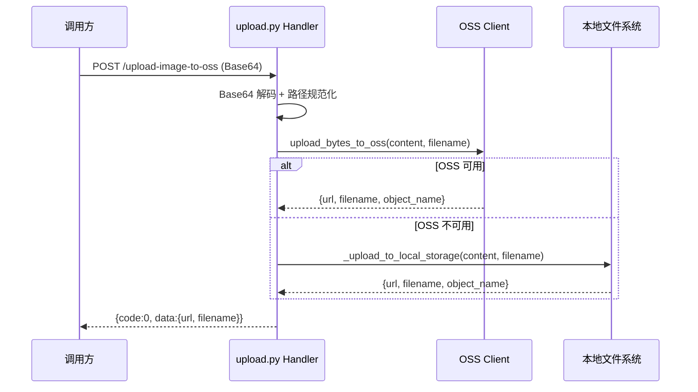
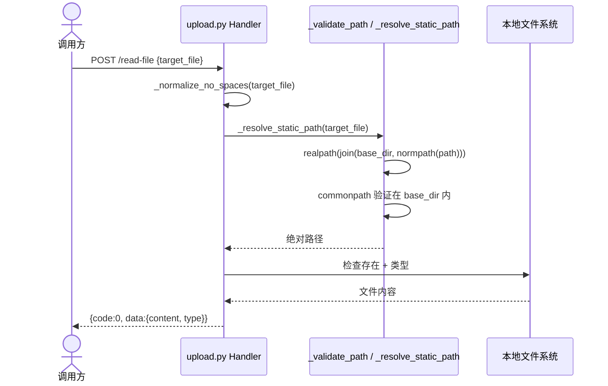

# 后端技术评审: 文件管理 API

> | v1.0 | 2026-05-13 | deepseek-v4-pro | 🌿 feat/YiAi-file-management |
> 关联: [01-故事任务.md](./01-故事任务.md)

> **Coder 公式**: 模块 → 接口 → 数据流。先拆模块，再定接口契约，最后追踪数据流向。
> **Security 公式**: 威胁 → 信任边界 → 缓解。识别风险、划定边界、给出对策。

---

## 1. 服务架构

### 1.1 服务/进程

| 变更类型 | 模块/文件 | 职责 |
|----------|----------|------|
| 现有 | `src/api/routes/upload.py` | 8 个文件操作端点：图片上传/文件读写/删除/重命名/通用上传 |
| 现有 | `src/services/storage/oss_client.py` | OSS 上传/删除/标签/信息维护/列表查询 |
| 现有 | `src/core/config.py` | 提供 static_base_dir、static_base_url、OSS 配置 |
| 现有 | `src/models/schemas.py` | 7 个请求模型：FileUploadRequest, ImageUploadToOssRequest, FileReadRequest 等 |

> 文件管理 API 是无状态 HTTP 服务，每次请求独立验证路径和权限。文件系统作为持久层，无长连接依赖。

### 1.2 通信通道设计

| 通道 | 方向 | 协议/方式 | Payload 结构 | 错误处理 |
|------|------|---------|-------------|---------|
| API → 文件系统 | 内部 | os 文件操作 | 二进制/文本 | BusinessException + 500 |
| API → OSS | 内部 | oss2 SDK (HTTPS) | bytes + filename | 回退本地存储 |

---

## 2. API 接口设计

### 2.1 接口清单

| 接口 | 方法 | 路径 | 请求体 | 响应体 | 错误码 |
|------|------|------|--------|--------|--------|
| 上传图片到OSS | POST | `/upload-image-to-oss` | `{data_url, filename, directory}` | `{url, filename, object_name}` | 1002, 5001 |
| 上传图片到OSS(alt) | POST | `/upload/upload-image-to-oss` | 同上 | 同上 | 同上 |
| 读取文件 | POST | `/read-file` | `{target_file}` | `{content, type}` | 1002, 5001 |
| 写入文件 | POST | `/write-file` | `{target_file, content, is_base64}` | `{message, path}` | 1002, 5001 |
| 删除文件 | POST | `/delete-file` | `{target_file}` | `{message, path}` | 1002, 1007 |
| 删除文件夹 | POST | `/delete-folder` | `{target_dir}` | `{message, path}` | 1002, 1007 |
| 重命名文件 | POST | `/rename-file` | `{old_path, new_path}` | `{message, old_path, new_path}` | 1002, 5001 |
| 重命名文件夹 | POST | `/rename-folder` | `{old_dir, new_dir}` | `{message, old_path, new_path}` | 1002, 5001 |
| 通用上传 | POST | `/upload` | `{filename, content, is_base64, target_dir}` | `{url}` | 1002, 5001 |

### 2.2 请求流程

> **Coder 公式**: 每个接口标注 输入 → 处理 → 输出。处理链路中标注各层职责。

### 2.3 服务实现

| 服务/模块 | 依赖 | 文件路径 | 核心方法 |
|----------|------|---------|---------|
| upload router | oss_client, config | `src/api/routes/upload.py` | upload_image_to_oss, read_file, write_file, delete_file, delete_folder, rename_file, rename_folder, upload_file |
| OSS client | oss2, config, db | `src/services/storage/oss_client.py` | upload_bytes_to_oss, delete_oss_file, set_file_tags, get_file_tags, list_files |
| 路径安全工具 | os, config | `src/api/routes/upload.py` | _validate_path, _resolve_static_path, _safe_rename, _normalize_no_spaces |

---

## 3. 数据模型

### 3.1 存储结构

| Key / 表 / 集合 | 类型 | 默认值 | 读频率 | 写频率 | 说明 |
|-----|------|--------|--------|--------|------|
| `static/` 目录 | 文件系统 | 项目根 ./static | 高 | 中 | 静态文件根目录，所有文件操作限定在此 |
| `static/{dir}/{filename}` | 文件 | — | 高 | 中 | 按目录组织的用户文件 |
| OSS `oss_file_tags` | MongoDB 集合 | — | 低 | 低 | OSS 文件标签映射（object_name → tags） |
| OSS `oss_file_info` | MongoDB 集合 | — | 低 | 低 | OSS 文件元信息（title, description） |

> 本地文件无容量上限（依赖磁盘配额）。OSS 文件大小限制由 `oss_max_file_size_mb` 配置控制（默认 50MB）。

### 3.2 数据迁移

| 版本 | 变更 | 迁移策略 |
|------|------|---------|
| v1.0 | 初始版本 | 无需迁移 |

---

## 4. 安全约束

> **Security 公式**: 威胁 → 信任边界 → 缓解

| # | 威胁 | 信任边界 | 缓解措施 | 优先级 |
|---|------|---------|---------|--------|
| 1 | 路径穿越攻击（`../`, `/etc/passwd`） | 用户输入 target_file/target_dir | `_validate_path` 拒绝 `..` 和绝对路径 + `_resolve_static_path` 用 realpath+commonpath 双重验证 | P0 |
| 2 | Base64 炸弹（超大解码后文件） | 用户输入 data_url/content | OSS 路径: `oss_max_file_size` 限制; 本地路径: 依赖磁盘配额（未强制大小限制） | P1 |
| 3 | 任意文件覆盖（写入已存在文件） | 用户输入 target_file | 现有实现直接覆盖，无冲突检测（依赖调用方自行管理文件名） | P2 |
| 4 | 符号链接逃逸 | 文件系统 | realpath 解析符号链接后 commonpath 验证，可防御 | P1 |
| 5 | 目录遍历读取敏感文件 | 用户输入 target_file | `_resolve_static_path` 强制所有路径在 static_base_dir 内 | P0 |

---

## 5. 性能与限制

| 维度 | 约束 | 应对 |
|------|------|------|
| OSS 文件大小 | `oss_max_file_size_mb`（默认 50MB） | 上传前校验 content 大小，超限拒绝 |
| OSS 上传失败 | 网络不可达 / 凭证错误 | 自动回退本地存储，日志 warning |
| 本地存储容量 | 无限制，依赖磁盘 | 通过 maintenance 模块定期清理未引用图片 |
| 文件读取 | 无大小限制 | 大文件 Base64 编码可能 OOM（图片返回 URL 规避） |
| 并发写入 | 无锁保护 | 同名文件最后写入生效，调用方自行协调 |

---

## 6. 评审清单

| # | 检查项 | 结果 |
|---|--------|------|
| 1 | 权限/配置已最小化，无多余权限 | ✅ |
| 2 | 通信通道已对齐发送/接收方，错误处理完整 | ✅ OSS 回退本地 |
| 3 | 存储结构向后兼容，迁移策略已覆盖 | ✅ 初始版本 |
| 4 | API 请求统一管理，认证/鉴权已覆盖 | ✅ 中间件层处理 |
| 5 | 无硬编码密钥或敏感信息 | ✅ 全部从 Settings 读取 |
| 6 | 后台服务无不当的长连接/定时器依赖 | ✅ 无状态 |
| 7 | 输入校验覆盖所有信任边界 | ✅ realpath+commonpath 双重验证 |
