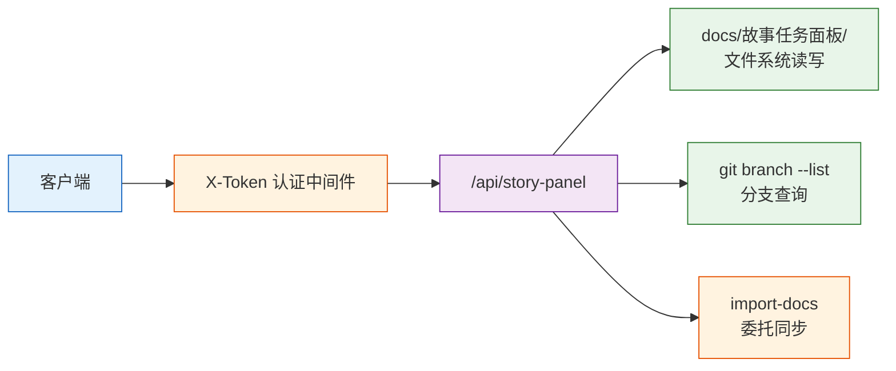
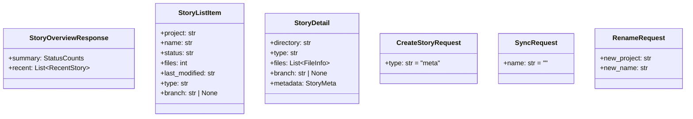

# 后端技术评审：rui-story API

## 概述

为 `/rui-story` 技能设计 RESTful API，供客户端（Web/移动端）通过 HTTP 调用故事面板管理功能。API 层直接操作 `docs/故事任务面板/` 文件系统，复用现有状态判定逻辑。

- **路由前缀**：`/api/story-panel`
- **认证**：通过 X-Token 中间件（现有 `header_verification_middleware`）
- **响应格式**：StandardResponse（`{code, message, data}`）

## API 架构



## 端点清单

| # | 方法 | 路径 | 说明 | 对应命令 |
|---|------|------|------|---------|
| 1 | GET | `/api/story-panel/overview` | 状态概览 | `/rui-story` |
| 2 | GET | `/api/story-panel/stories` | 进度全景 | `/rui-story list` |
| 3 | GET | `/api/story-panel/stories/{project}/{name}` | 单故事详情 | `/rui-story show` |
| 4 | POST | `/api/story-panel/stories/{project}/{name}` | 创建故事 | `/rui-story create` |
| 5 | DELETE | `/api/story-panel/stories/{project}/{name}` | 删除故事 | `/rui-story delete` |
| 6 | POST | `/api/story-panel/stories/sync` | 文档同步 | `/rui-story sync` |
| 7 | PUT | `/api/story-panel/stories/{project}/{name}/rename` | 重命名 | `/rui-story rename` |

## 端点详设

### 1. GET /api/story-panel/overview

**请求**：无参数

**响应**：
```json
{
  "code": 0,
  "message": "success",
  "data": {
    "summary": {
      "code_done": 2,
      "code_in_progress": 1,
      "docs_done": 3,
      "docs_in_progress": 0,
      "not_started": 1,
      "blocked": 0,
      "total": 7
    },
    "recent": [
      { "project": "YiAi", "name": "execution-executor-doc", "status": "code_done", "modified": "2026-05-17T10:30:00" }
    ]
  }
}
```

**实现要点**：扫描 `docs/故事任务面板/`，逐目录判定状态后聚合。状态判定复用 SKILL.md §状态判定 逻辑。

### 2. GET /api/story-panel/stories

**请求**：无参数

**响应**：`data.stories[]` 数组，每项含 `project` / `name` / `status` / `files` / `last_modified` / `type` / `branch`。

**实现要点**：按最后修改时间降序排列。文件数仅统计 `.md`。分支通过 `git branch --list` 查询。

### 3. GET /api/story-panel/stories/{project}/{name}

**请求**：路径参数 `project`（PascalCase）、`name`（kebab-case）

**响应**：`data` 含 `directory` / `type` / `files[]` / `branch` / `metadata`（status / stage / block_reason）。

**错误**：404 — 故事目录不存在。

### 4. POST /api/story-panel/stories/{project}/{name}

**请求**：
```json
{
  "type": "backend"
}
```

**响应**：201 — `{created, directory}`

**规则**：
- 校验命名格式（PascalCase + kebab-case）
- 目标已存在 → 409 拒绝
- 仅创建目录 + `.memory/story-type.json`，不创建文档
- `type` 默认 `meta`

### 5. DELETE /api/story-panel/stories/{project}/{name}

**请求**：无 body

**响应**：`{deleted, directory}`

**规则**：
- 目录不存在 → 404
- 检查 git 分支，存在时返回警告（不删分支）
- 删除后若 Project 目录为空一并清理

### 6. POST /api/story-panel/stories/sync

**请求**：
```json
{
  "name": "YiAi-execution-executor-doc"
}
```
`name` 为空时同步全量 `docs/故事任务面板/`。

**实现**：委托 `node skills/import-docs/sync.mjs`（child_process）。

### 7. PUT /api/story-panel/stories/{project}/{name}/rename

**请求**：
```json
{
  "new_project": "YiAi",
  "new_name": "new-story-name"
}
```

**规则**：
- old 目录不存在 → 404
- new 目录已存在 → 409
- 仅重命名目录（mv），警告 git 分支

## 请求/响应模型



## 安全面

| 层面 | 措施 |
|------|------|
| 认证 | X-Token 中间件，复用现有 header_verification_middleware |
| 路径遍历 | 校验 project/name 仅含 `[A-Za-z0-9_-]`，拒绝 `..` |
| 操作边界 | 读写仅限 `docs/故事任务面板/`，不触及源码或 git 分支 |
| 命令注入 | sync 端点的 name 参数校验后直接拼接路径，不经过 shell |
| 输入校验 | 使用 Pydantic 模型校验所有请求体 |

## 文件清单

| 文件 | 说明 |
|------|------|
| `src/api/routes/story_panel.py` | API 路由（新增） |
| `src/models/schemas.py` | 新增请求/响应模型（修改） |
| `src/main.py` | 注册新路由（修改） |
