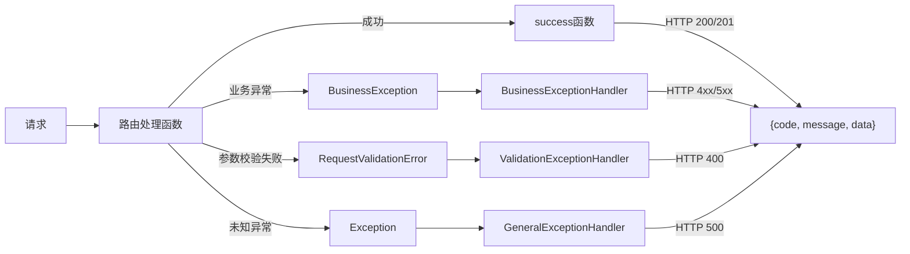

# YiAi-03-后端技术评审

## 架构设计

### 响应信封统一

所有 API 端点（除 SSE 流式接口外）必须返回统一的三段式信封：

```json
{
  "code": 0,
  "message": "success",
  "data": {}
}
```



### 错误码重编号方案

```
变更前:
  DATA_STORE_FAIL   = 1005 (HTTP 500)  ← 1xxx 范围错位
  DATA_UPDATE_FAIL  = 1006 (HTTP 500)  ← 1xxx 范围错位
  DATA_DESTROY_FAIL = 1007 (HTTP 500)  ← 1xxx 范围错位

变更后:
  DATA_STORE_FAIL   = 5002 (HTTP 500)
  DATA_UPDATE_FAIL  = 5003 (HTTP 500)
  DATA_DESTROY_FAIL = 5004 (HTTP 500)
```

完整错误码表：

| 业务码 | 标识 | HTTP | 分类 |
|--------|------|------|------|
| 0 | OK | 200 | 成功 |
| 1000 | INVALID_REQUEST | 400 | 客户端 |
| 1001 | BUSINESS_ERROR | 400 | 客户端 |
| 1002 | INVALID_PARAMS | 400 | 客户端 |
| 1003 | RATE_LIMITED | 429 | 客户端 |
| 1004 | DATA_NOT_FOUND | 404 | 客户端 |
| 1008 | PERMISSION_DENIED | 403 | 客户端 |
| 1009 | UNAUTHORIZED | 401 | 客户端 |
| 5000 | SERVER_ERROR | 500 | 服务端 |
| 5001 | INTERNAL_ERROR | 500 | 服务端 |
| 5002 | DATA_STORE_FAIL | 500 | 服务端 |
| 5003 | DATA_UPDATE_FAIL | 500 | 服务端 |
| 5004 | DATA_DESTROY_FAIL | 500 | 服务端 |

### `success()` 改造：支持自定义 HTTP 状态码

```python
def success(
    data=None,
    message: str = "success",
    pagination: dict = None,
    http_code: int = 200  # 新增参数
) -> Response:
    return JSONResponse(
        status_code=http_code,
        content=jsonable_encoder({
            "code": ErrorCode.OK.business,
            "message": message,
            "data": data
        })
    )
```

### 变更详设

#### 1. `src/core/error_codes.py`

- `DATA_STORE_FAIL`：1005 → 5002
- `DATA_UPDATE_FAIL`：1006 → 5003
- `DATA_DESTROY_FAIL`：1007 → 5004

#### 2. `src/core/response.py`

- `success()` 增加 `http_code` 参数，默认 200

#### 3. `src/api/routes/observer_health.py`

```python
# Before
return ObserverHealth(...)

# After
return success(data=ObserverHealth(...).model_dump())
```

移除路由装饰器上的 `response_model=ObserverHealth`（因为实际返回的是信封结构，不再是裸模型）。

#### 4. `src/api/routes/state.py`

```python
# Before
@router.post("/records", status_code=201, ...)
async def create_record(record: StateRecord):
    ...
    return success(data=result)

# After
@router.post("/records", ...)
async def create_record(record: StateRecord):
    ...
    return success(data=result, http_code=201)
```

#### 5. `src/api/routes/upload.py`

错误码审计修正：

| 位置 | 当前 | 修正 |
|------|------|------|
| `_validate_path` | `INVALID_PARAMS` | 保持（路径格式错误，语义正确） |
| `read_file` 文件不存在 | `INVALID_PARAMS` | `DATA_NOT_FOUND` |
| `read_file` 不是文件 | `INVALID_PARAMS` | `DATA_NOT_FOUND` |
| `read_file` I/O 失败 | `INTERNAL_ERROR` | 保持（读写失败非特定存储操作） |
| `write_file` I/O 失败 | `INTERNAL_ERROR` | `DATA_STORE_FAIL` |
| `delete_file` 不存在 | `success()` | `raise BusinessException(DATA_NOT_FOUND)` |
| `delete_file` 不是文件 | `INVALID_PARAMS` | 保持（参数语义正确） |
| `delete_file` I/O 失败 | `DATA_DESTROY_FAIL` | 保持 |
| `delete_folder` 不存在 | `success()` | `raise BusinessException(DATA_NOT_FOUND)` |
| `delete_folder` 不是目录 | `INVALID_PARAMS` | 保持 |
| `rename_file` I/O 失败 | `INTERNAL_ERROR` | `DATA_UPDATE_FAIL` |
| `rename_folder` I/O 失败 | `INTERNAL_ERROR` | `DATA_UPDATE_FAIL` |
| `upload_file` I/O 失败 | `INTERNAL_ERROR` | `DATA_STORE_FAIL` |
| `_safe_rename` 源不存在 | `INVALID_PARAMS` | `DATA_NOT_FOUND` |

#### 6. `src/api/routes/story_panel.py`

替换 `HTTPException` 为 `BusinessException`：

```python
# Before
raise HTTPException(status_code=422, detail=...)
raise HTTPException(status_code=400, detail=...)

# After
raise BusinessException(ErrorCode.INVALID_PARAMS, message=...)
```

注意：`_validate_name` 中的两种校验（路径非法 / 格式不合法）都映射到 `INVALID_PARAMS`（语义正确）。

### 不变式

- 所有 API 响应体顶层始终包含 `code`、`message`、`data` 三个字段
- `code === 0` 当且仅当请求成功处理
- 1xxx 范围仅用于客户端可修正的错误
- 5xxx 范围仅用于服务端错误
- 所有业务错误通过 `BusinessException` 抛出，不直接使用 `HTTPException`
