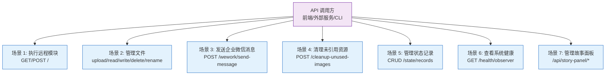
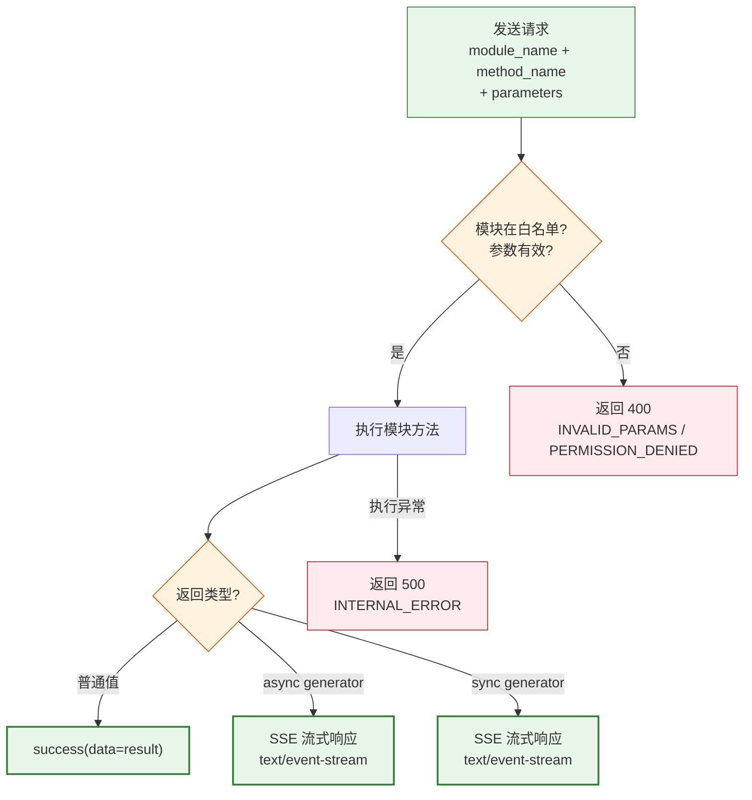
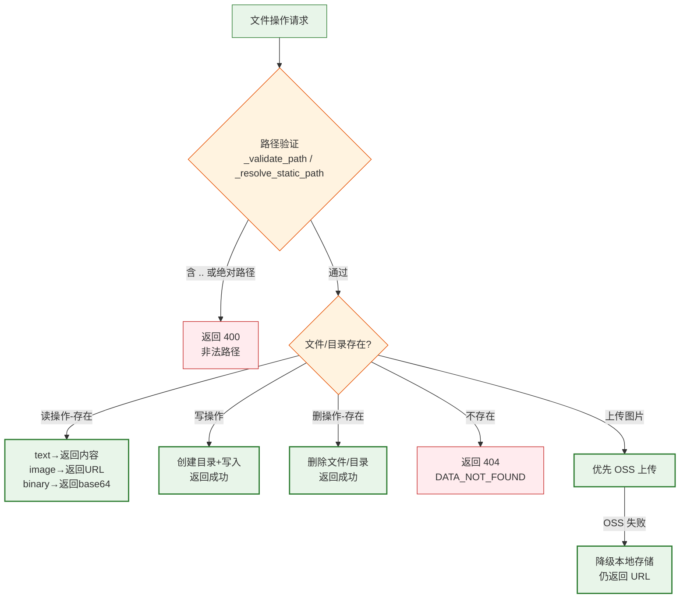
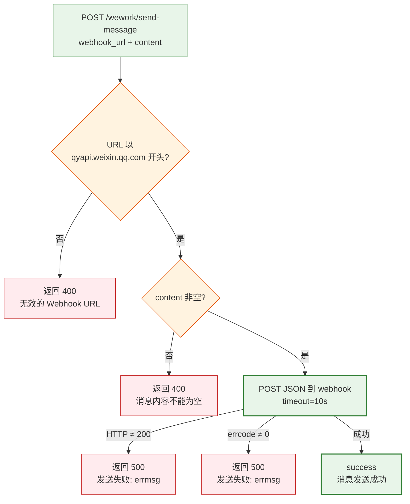
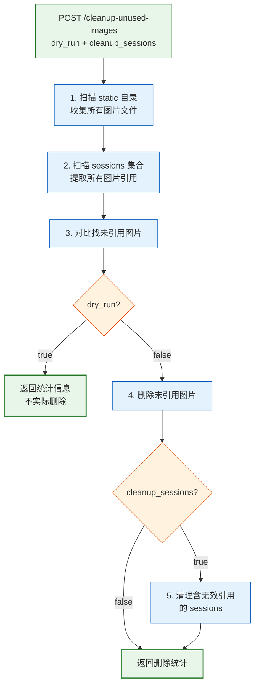
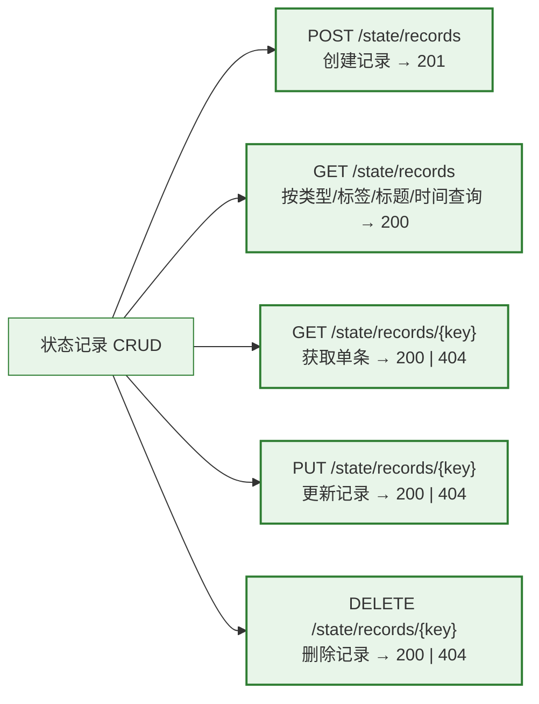

> | v1.0.0 | 2026-05-22 | deepseek-v4-pro | | 🌿 feat/api-routes | ⏱️ — | 📎 [CLAUDE.md](../../../CLAUDE.md) |

> **导航**: [← YiAi-故事任务](./YiAi-故事任务.md) · [YiAi-技术评审 →](./YiAi-技术评审.md)

> **来源引用**: `/rui doc --from-code api-routes` — 从 `src/api/routes/` 7 个文件反推用户场景，证据 Level B + 源码路径。

---

## §0 基线声明

> **用户空间基线**: 本文档从 API 调用方视角描述 7 大功能域的用户交互场景。所有技术方案和测试用例必须覆盖本文档的每个场景。

---

### 主要价值

- 🎯 从 API 调用方视角完整描述 7 个功能域的交互场景：模块执行、文件管理、消息推送、维护清理、状态查询、健康检查、面板管理
- 🔒 覆盖关键异常路径：路径遍历拦截、OSS 降级、认证失败、URL 校验失败
- ⚡ 每场景含 mermaid 流程图，清晰展示正常路径 → 空状态 → 错误恢复的完整用户旅程
- 📊 场景覆盖矩阵对齐故事任务全部 13 个 FP#，为测试设计提供完整基线

---

## §1 场景全景

---

## §2 场景详述

### 场景 1: 执行远程模块

| 字段 | 内容 |
|------|------|
| 角色 | 外部服务或开发者，需要远程调用 YiAi 注册的模块方法 |
| 触发条件 | 发送 GET 或 POST 请求到 `/` 端点 |
| 核心目标 | 指定模块名和方法名，获取执行结果（JSON 或 SSE 实时流） |

---

### 场景 2: 管理文件

| 字段 | 内容 |
|------|------|
| 角色 | 前端应用或内容管理系统 |
| 触发条件 | 需要上传图片、读写文件、删除或重命名文件 |
| 核心目标 | 安全地操作 static 目录下的文件，路径遍历攻击被拦截 |

---

### 场景 3: 发送企业微信消息

---

### 场景 4: 清理未引用资源

| 字段 | 内容 |
|------|------|
| 角色 | 运维人员定期执行清理 |
| 触发条件 | POST `/cleanup-unused-images` |
| 核心目标 | 扫描 static 目录图片，与 sessions 引用比对，清理未引用图片（dry-run 预览优先） |

---

### 场景 5: 管理状态记录

---

### 场景 6: 查看系统健康

| 字段 | 内容 |
|------|------|
| 角色 | 运维监控系统 |
| 触发条件 | GET `/health/observer` |
| 核心目标 | 获取 Observer 四组件（限流/采样/沙箱/守卫）的运行时启用状态和指标 |

---

### 场景 7: 管理故事面板

| 字段 | 内容 |
|------|------|
| 角色 | 项目管理者 |
| 触发条件 | 访问 `/api/story-panel/*` 端点 |
| 核心目标 | 查看所有故事的进度状态、同步远端文档、获取 API 帮助 |

---

## §3 场景覆盖矩阵

| 场景 | FP# | AC# | 覆盖状态 |
|------|-----|-----|---------|
| 场景 1: 模块执行 | FP1 | AC1 | 待覆盖 |
| 场景 2: 文件管理 | FP2–FP8 | AC2, AC3, AC4 | 待覆盖 |
| 场景 3: 企业微信 | FP9 | AC5, AC6 | 待覆盖 |
| 场景 4: 资源清理 | FP10 | — | 待覆盖 |
| 场景 5: 状态记录 | FP11 | AC7, AC8 | 待覆盖 |
| 场景 6: 健康检查 | FP12 | — | 待覆盖 |
| 场景 7: 面板管理 | FP13 | — | 待覆盖 |

---

## §4 评审清单

| # | 检查项 | 状态 |
|---|--------|:--:|
| 1 | 场景 ≥ 2 | ✅ 7 场景 |
| 2 | 每场景有图 | ✅ |
| 3 | FP 全覆盖 | ✅ 13/13 |
| 4 | 异常分支明确 | ✅ |
| 5 | 无技术术语 | ✅ |
| 6 | 含空状态与错误恢复 | ✅ |

---

## §5 体验基线

| 角色 | 核心旅程 | 情感目标 | 成功感知 | 关联场景 |
|------|---------|---------|---------|---------|
| 外部服务 | 远程调用模块 → 获得 JSON 结果或 SSE 流 | 高效可靠 | 收到 success(data=...) 或实时流数据 | 场景 1 |
| 前端应用 | 上传图片 → 获得可访问 URL | 简单直接 | 图片 URL 可直接用于展示 | 场景 2 |
| DevOps | 发企业微信通知 → 团队收到告警 | 实时可靠 | 企业微信收到消息 | 场景 3 |
| 运维 | 定期清理 → 磁盘空间释放 | 安全可控 | 看到 dry-run 预览无误后执行 | 场景 4 |
| 开发者 | CRUD 状态 → 数据持久化 | 简单一致 | 数据读写与预期一致 | 场景 5 |

---

> **变更记录**
>
> | 日期 | 变更 | 触发 | 证据 |
> |------|------|------|------|
> | 2026-05-22 | 初始生成 | `/rui doc --from-code api-routes` | 7 个路由文件源码分析 |
