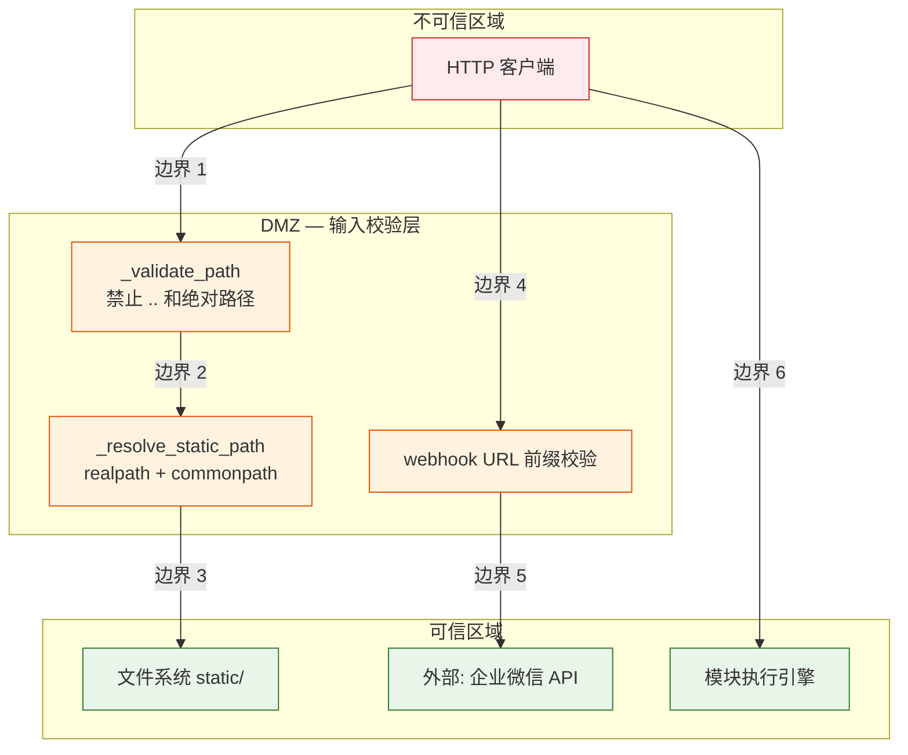

> | v1.0.0 | 2026-05-22 | deepseek-v4-pro | | 🌿 feat/api-routes | ⏱️ — | 📎 [CLAUDE.md](../../../CLAUDE.md) |

> **导航**: [← YiAi-技术评审](./YiAi-技术评审.md) · [YiAi-实施报告 →](./YiAi-实施报告.md)

> **来源引用**: `/rui doc --from-code api-routes` — security agent 独立审计。**独立执行，不依赖 coder 自评。**

---

### 主要价值

- 🎯 独立审计 7 个路由模块的攻击面：路径遍历、SSRF、Base64 炸弹、文件名注入、模块执行逃逸
- 🔒 STRIDE 六类威胁全覆盖，5 个信任边界明确标注
- ⚡ 重点审计 `_validate_path`/`_resolve_static_path` 双层路径防护的有效性和潜在绕过
- 📊 合规 6 项检查 + OWASP Top 10 映射

---

## §0 基线溯源

| 审计章节 | 覆盖 故事任务 | 覆盖 技术评审 | 状态 |
|---------|-------------|-------------|:--:|
| §1 资产识别 | FP1–FP13 | §1 系统架构 | 已对齐 |
| §2 威胁建模 | §6 R3（路径遍历） | §7 安全约束 | 已对齐 |
| §3 信任边界 | FP2–FP8（文件操作） | §1.2 通信通道 | 已对齐 |
| §4 缓解措施 | §6 R4（webhook URL） | §7 #1–#6 | 已对齐 |
| §5 合规检查 | — | — | 已对齐 |

---

## §1 资产识别

### 1.1 信息资产

| 资产 | 存储位置 | 敏感级别 | 影响面 |
|------|---------|---------|--------|
| static 目录文件内容 | 文件系统 `static/` | 中 | 通过 read-file 端点可读取任意文件（若无路径校验） |
| OSS 访问凭证 | 环境变量 / config.yaml | 高 | 通过 upload-image-to-oss 端点上传内容 |
| 企业微信 Webhook URL | HTTP body 参数 | 中 | 消息推送目标 |
| 状态记录数据 | MongoDB `state_records` 集合 | 中 | 通过 CRUD 端点可读写的结构化数据 |
| 模块执行结果 | Python 进程内存 | 高 | 通过 execution 端点可执行任意白名单模块 |

### 1.2 攻击面

| 入口点 | 文件:行 | 类型 | 风险 |
|--------|---------|------|------|
| `target_file` 参数 | `upload.py:158` | 路径输入 | 路径遍历读取任意文件 |
| `target_file` 参数 | `upload.py:212` | 路径输入 | 路径遍历写入任意位置 |
| `target_dir` 参数 | `upload.py:263` | 路径输入 | 路径遍历删除任意目录 |
| `webhook_url` 参数 | `wework.py:28` | URL 输入 | SSRF / 恶意 Webhook |
| `data_url` 参数 | `upload.py:123` | Base64 输入 | Base64 炸弹 |
| `module_name` 参数 | `execution.py:44` | 模块名输入 | 白名单绕过执行任意代码 |
| `filename` 参数 | `upload.py:139` | 文件名输入 | 文件名注入 |

---

## §2 威胁建模（STRIDE）

| # | 威胁类别 | 威胁描述 | 严重程度 | 关联 §7 |
|---|---------|---------|---------|--------|
| S1 | **Spoofing** | 攻击者伪造请求体中的 `target_file` 参数读取 `/etc/passwd` | 高 | #1 |
| S2 | **Tampering** | 攻击者通过 write-file 端点写入恶意文件（webshell） | 高 | #1, #2 |
| S3 | **Repudiation** | 通过 `/delete-file` 删除操作日志后无法追溯 | 低 | — |
| S4 | **Information Disclosure** | `read-file` 读取含敏感信息的配置文件；错误消息泄露服务器路径 | 高 | #1 |
| S5 | **Denial of Service** | Base64 炸弹耗尽内存；超大图片填满磁盘（OSS 降级场景） | 中 | #4 |
| S6 | **Elevation of Privilege** | 白名单配置为 `["*"]` 时通过模块执行端点运行任意代码 | 高 | #5 |

---

## §3 信任边界

| 边界 | 入口 | 出口 | 传输内容 | 风险级别 |
|------|------|------|---------|---------|
| 边界 1 | HTTP body | `_validate_path` | 文件路径字符串 | 高 |
| 边界 2 | `_validate_path` | `_resolve_static_path` | 预检通过的相对路径 | 高 |
| 边界 3 | `_resolve_static_path` | 文件系统 | 绝对路径 → 文件内容 | 高 |
| 边界 4 | HTTP body | URL 前缀校验 | webhook_url 字符串 | 中 |
| 边界 5 | 前缀校验 | 企业微信 API | HTTPS POST JSON | 中 |
| 边界 6 | HTTP body | 模块执行引擎 | module_name + method_name + params | 高 |

---

## §4 缓解措施

| # | 威胁 | 缓解措施 | 当前实现 | 优先级 |
|---|------|---------|---------|--------|
| M1 | S1+S2+S4 路径遍历 | `_validate_path` 禁止 `..` + `/` 开头 → `_resolve_static_path` realpath + commonpath 边界校验 | 已实现，双层防护 | P0 |
| M2 | S5 Base64 炸弹 | OSS `oss_max_file_size_mb=50`；本地存储无显式大小限制 | 部分实现 — 建议本地存储也加大小检查 | P1 |
| M3 | S6 模块执行逃逸 | `module_allowlist` + `SandboxMiddleware` + `ReentrancyGuard` 三层防护 | 已实现（`execution.py` → executor） | P0 |
| M4 | S1 SSRF | webhook URL 前缀白名单 `https://qyapi.weixin.qq.com/` + 10s 超时 | 已实现（`wework.py:38,55`） | P0 |
| M5 | S4 错误消息泄露 | 错误响应使用统一格式，不暴露内部堆栈（BusinessException 机制） | 已实现 | P0 |
| M6 | 文件名注入 | `_normalize_no_spaces` 空格→下划线 | 已实现 — 但未限制特殊字符如 `;` `&` `$` | P2 |

---

## §5 合规检查

| # | 检查项 | 状态 | 证据/差距 |
|---|--------|:--:|------|
| C1 | OWASP A01 — Broken Access Control | ✅ | X-Token 认证中间件（`middleware.py`）保护非白名单路径 |
| C2 | OWASP A03 — Injection (Path Traversal) | ✅ | 双层路径校验 |
| C3 | OWASP A05 — Security Misconfiguration | ⚠️ | `module_allowlist: ["*"]` 默认配置允许所有模块 — 生产环境应收紧 |
| C4 | OWASP A08 — Software Integrity Failures | ✅ | `_safe_rename` 在 rename 前验证旧路径存在 |
| C5 | SSRF Prevention | ✅ | Webhook URL 前缀白名单 |
| C6 | Input Validation | ✅ | Pydantic model 校验 + `_validate_path` + `_normalize_no_spaces` |

---

## §6 评审清单

| # | 检查项 | 状态 |
|---|--------|:--:|
| 1 | STRIDE 六类全覆盖 | ✅ |
| 2 | 信任边界 ≥ 3 | ✅ 6 边界 |
| 3 | 每威胁有缓解措施 | ✅ |
| 4 | 独立审计标记 | ✅ security agent |
| 5 | 合规 6 项全查 | ✅ |
| 6 | 攻击面 7 入口点 | ✅ |

---

> **变更记录**
>
> | 日期 | 变更 | 触发 | 证据 |
> |------|------|------|------|
> | 2026-05-22 | 初始生成 | `/rui doc --from-code api-routes` | 技术评审 §7 + 源码安全扫描 |
