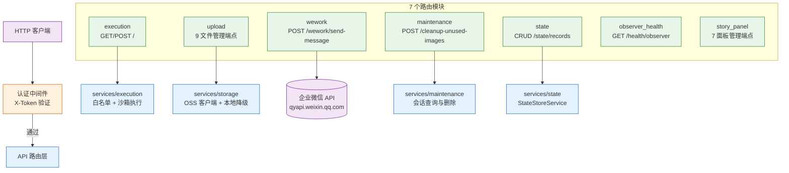
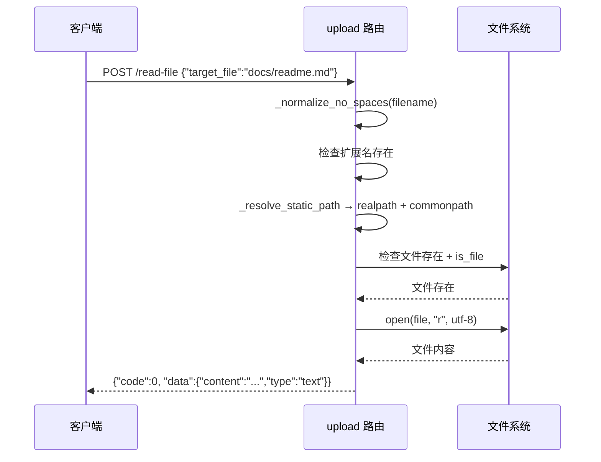

> | v1.0.0 | 2026-05-22 | deepseek-v4-pro | | 🌿 feat/api-routes | ⏱️ — | 📎 [CLAUDE.md](../../../CLAUDE.md) |

> **导航**: [← YiAi-使用场景](./YiAi-使用场景.md) · [YiAi-测试设计 →](./YiAi-测试设计.md) · [YiAi-安全审计 →](./YiAi-安全审计.md)

> **来源引用**: `/rui doc --from-code api-routes` — 从 `src/api/routes/` 7 个文件只读提取。项目类型：backend — 跳过 §4 组件、§5 交互、§6 DOM。

---

### 主要价值

- 🎯 完整记录 7 个路由模块的 22+ 个 HTTP 端点契约：方法、路径、请求体、响应体、错误码
- 🔒 重点分析文件操作的安全机制：`_validate_path` + `_resolve_static_path` 双重路径校验
- ⚡ 按后端类型裁剪章节，聚焦 API 接口、数据流、安全约束和性能限制
- 📊 每端点附源码路径作为 Level A 证据，可直接追溯

---

## §0 设计决策与任务规划

### §0.0 基线溯源

| 本设计章节 | 实现 故事任务 | 服务 使用场景 | 覆盖状态 |
|-----------|-------------|-------------|---------|
| §1 系统架构 | FP1–FP13 | 场景 1–7 | 已对齐 |
| §2 API 接口 | FP1–FP13 | 场景 1–7 | 已对齐 |
| §7 安全约束 | FP2–FP8（文件操作） | 场景 2 | 已对齐 |
| §8 性能与限制 | FP1（执行超时）, FP9（webhook 超时） | 场景 1, 3 | 已对齐 |

### §0.1 设计决策

| 决策领域 | 选定方案 | 选择理由 | 实现 FP# |
|---------|---------|---------|---------|
| 模块执行 | 白名单 + GET/POST 双入口 + SSE 流支持 | 灵活性：GET 便于调试，POST 承载复杂参数；SSE 支持实时流输出 | FP1 |
| 文件管理 | JSON 方式上传（Base64），非 multipart | 简化前端调用，统一 JSON API 风格 | FP2–FP8 |
| OSS 容错 | 上传失败自动降级本地存储 | 保证可用性，OSS 不可用时仍返回 URL | FP2 |
| 路径安全 | `_validate_path` + `_resolve_static_path` 双层防护 | 纵深防御：正则预检 → realpath 绝对路径解析 → commonpath 边界校验 | FP2–FP8 |
| 企业微信 | URL 前缀白名单 + 10s 超时 | 防止 SSRF 攻击，限制请求耗时 | FP9 |
| 清理操作 | dry_run 默认 true | 安全第一：预览确认后再实际删除 | FP10 |

---

## §1 系统架构

### 效果示意 — API 路由全链路

### 1.1 模块清单

| 模块/文件 | 行数 | 端点 | 职责 |
|----------|------|------|------|
| `src/api/routes/execution.py` | 87 | 2 (GET+POST /) | 通用模块执行，SSE 流支持 |
| `src/api/routes/upload.py` | 359 | 9 | 图片上传/文件读写/删除/重命名 |
| `src/api/routes/wework.py` | 92 | 1 | 企业微信 Webhook 消息发送 |
| `src/api/routes/maintenance.py` | 271 | 1 | 未引用图片清理 + sessions 清理 |
| `src/api/routes/state.py` | 89 | 5 (CRUD) | 状态记录增删改查 |
| `src/api/routes/observer_health.py` | 60 | 1 | Observer 运行时健康状态 |
| `src/api/routes/story_panel.py` | 463 | 7 | 故事面板查询/同步/帮助 |

---

## §2 API 接口

### 2.1 接口清单

#### 模块执行 (execution)

| 接口 | 方法 | 路径 | 请求体 | 响应体 | 错误码 |
|------|------|------|--------|--------|--------|
| 执行模块 | GET | `/` | `module_name`(str), `method_name`(str), `parameters`(str, JSON, default={}) | `success(data=result)` 或 SSE 流 | 1002, 1008, 5001 |
| 执行模块 | POST | `/` | `{"module_name":"...", "method_name":"...", "parameters":{...}}` | 同上 | 同上 |

> SSE 流格式: `data: {"data": {...}}\n\n`，流结束信号: `data: {"done": true}\n\n`（`execution.py:26-40`）

#### 文件管理 (upload)

| 接口 | 方法 | 路径 | 关键参数 | 响应 | 证据 |
|------|------|------|---------|------|------|
| 图片上传 OSS | POST | `/upload-image-to-oss` | `data_url`(base64), `filename`, `directory` | `{url, filename, object_name}` | `upload.py:120-149` |
| 文件读取 | POST | `/read-file` | `target_file`(必须含扩展名) | `{content, type:text|url|base64}` | `upload.py:151-205` |
| 文件写入 | POST | `/write-file` | `target_file`, `content`, `is_base64` | `{message, path}` | `upload.py:207-231` |
| 文件删除 | POST | `/delete-file` | `target_file` | `{message, path}` | `upload.py:233-256` |
| 删除文件夹 | POST | `/delete-folder` | `target_dir` | `{message, path}` | `upload.py:258-281` |
| 重命名文件 | POST | `/rename-file` | `old_path`, `new_path` | `{message, old_path, new_path}` | `upload.py:283-301` |
| 重命名文件夹 | POST | `/rename-folder` | `old_dir`, `new_dir` | `{message, old_path, new_path}` | `upload.py:303-321` |
| 文件上传 | POST | `/upload` | `target_dir`, `filename`, `content`, `is_base64` | `{url: 相对路径}` | `upload.py:323-358` |

**路径安全机制**:
- `_validate_path(path)`: 去除空白 → 统一 `/` → 禁止 `/` 开头 → normpath → 禁止 `..`（`upload.py:34-44`）
- `_resolve_static_path(target)`: 去除 `static/` 前缀 → 禁止 `/.../..` → `realpath` 解析 → `commonpath` 边界校验（`upload.py:46-60`）

#### 企业微信 (wework)

| 接口 | 方法 | 路径 | 请求体 | 校验 | 超时 |
|------|------|------|--------|------|------|
| 发送消息 | POST | `/wework/send-message` | `webhook_url`, `content` | URL 前缀 `https://qyapi.weixin.qq.com/` | 10s |

#### 状态记录 CRUD (state)

| 接口 | 方法 | 路径 | 参数 |
|------|------|------|------|
| 创建 | POST | `/state/records` | `StateRecord` model（`key, title, content, type, tags...`） |
| 查询列表 | GET | `/state/records` | `record_type, tags, title_contains, created_after, created_before, page_num(≥1), page_size(1-8000)` |
| 获取单条 | GET | `/state/records/{key}` | key (path param) |
| 更新 | PUT | `/state/records/{key}` | key + StateRecord model |
| 删除 | DELETE | `/state/records/{key}` | key (path param) |

#### Observer 健康 (observer_health)

| 接口 | 方法 | 路径 | 响应字段 |
|------|------|------|---------|
| 健康检查 | GET | `/health/observer` | `throttle_enabled, sampler_enabled, sandbox_enabled, guard_enabled` 等 |

#### 故事面板 (story_panel)

| 接口 | 方法 | 路径 | 说明 |
|------|------|------|------|
| 概览 | GET | `/api/story-panel/overview` | 按 6 状态聚合 + 最近 5 个活动故事 |
| 全景 | GET | `/api/story-panel/stories` | 所有故事详情（状态/文件数/类型/分支） |
| 详情 | GET | `/api/story-panel/stories/{name}` | 单故事文件清单 + 元数据 |
| 同步 | POST | `/api/story-panel/stories/sync` | `names[]` 时从远端下载覆盖；不指定时返回推荐列表 |
| 远端查询 | GET | `/api/story-panel/remote?source=local|remote|all` | 远端故事目录列表 |
| 帮助 | GET | `/api/story-panel/help` | API 端点说明 + 状态模型 |

### 2.2 请求流程 — 文件读取

---

## §7 安全约束

| # | 威胁 | 信任边界 | 缓解措施 | 优先级 |
|---|------|---------|---------|--------|
| 1 | 路径遍历读取任意文件 | HTTP body → 文件系统 | `_validate_path`(禁止..) + `_resolve_static_path`(commonpath 边界) 双层防护 | P0 |
| 2 | 未认证访问文件操作端点 | HTTP → 路由 | 依赖 `header_verification_middleware`（白名单路径可配置跳过） | P0 |
| 3 | SSRF 通过企业微信 Webhook | HTTP body → 外部 HTTP | URL 前缀白名单: `https://qyapi.weixin.qq.com/` | P0 |
| 4 | Base64 炸弹 (超大图片) | HTTP body → 内存 | OSS `oss_max_file_size_mb=50` 限制（`config.py:93`） | P1 |
| 5 | 模块执行任意代码 | HTTP params → Python 进程 | 白名单 `module_allowlist` + 沙箱 `SandboxMiddleware` | P0 |
| 6 | 文件名注入 (空格/特殊字符) | HTTP body → 文件系统 | `_normalize_no_spaces` 空格→下划线（`upload.py:31-32`） | P2 |

---

## §8 性能与限制

| 维度 | 约束 | 应对 |
|------|------|------|
| 企业微信超时 | 10s | aiohttp.ClientTimeout(total=10) |
| SSE 连接 | 长连接，受 uvicorn keep_alive 控制 | timeout_keep_alive=5 |
| 清理操作 | 最多返回 100 条未引用图片详情 | MAX_UNUSED_IMAGE_DETAILS=100 |
| 状态查询 | page_size 最大 8000 | 与 pagination_max_size 一致 |
| 文件上传 | OSS 失败后磁盘写入 | 降级策略，磁盘空间需监控 |

---

## §9 评审清单

| # | 检查项 | 状态 |
|---|--------|:--:|
| 1 | 效果示意完整 | ✅ |
| 2 | 全部端点有签名记录 | ✅ 22+ |
| 3 | 安全约束覆盖路径/认证/SSRF | ✅ |
| 4 | 章节按后端裁剪 | ✅ |
| 5 | 基线溯源完备 | ✅ |

---

> **变更记录**
>
> | 日期 | 变更 | 触发 | 证据 |
> |------|------|------|------|
> | 2026-05-22 | 初始生成 | `/rui doc --from-code api-routes` | 7 个路由文件源码分析 |
