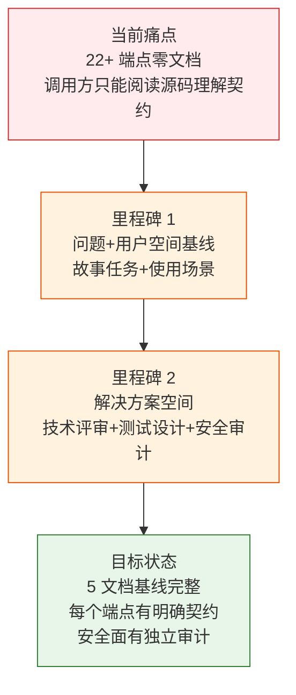
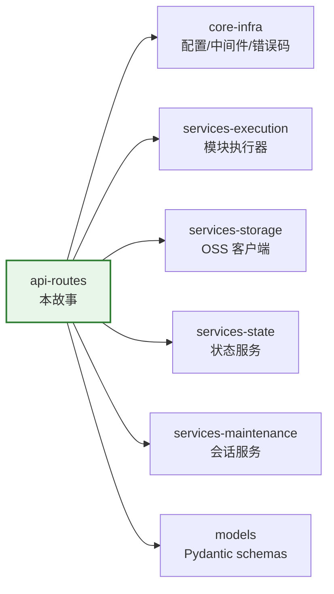

> | v1.0.0 | 2026-05-22 | deepseek-v4-pro | | 🌿 feat/api-routes | ⏱️ — | 📎 [CLAUDE.md](../../../CLAUDE.md) |

> **导航**: [YiAi-使用场景 →](./YiAi-使用场景.md)

> **来源引用**: `/rui doc --from-code api-routes` — 从 `src/api/routes/` 7 个路由文件只读反推，证据 Level B + 源码路径。

### 项目信息

| 字段 | 内容 |
|------|------|
| 项目名 | YiAi（宜 AI） |
| 故事名 | api-routes |
| 故事类型 | HTTP API 路由层文档化 |
| 项目类型 | backend |
| 分支 | feat/api-routes |
| 源码范围 | `src/api/routes/execution.py`, `upload.py`, `wework.py`, `maintenance.py`, `state.py`, `observer_health.py`, `story_panel.py` |

### 需求概述

YiAi 的 API 路由层是应用与外部世界交互的唯一入口。7 个路由模块提供了 22+ 个 HTTP 端点，覆盖通用模块执行（含 SSE 流式响应）、文件上传与管理（含路径遍历防护和 OSS 降级）、企业微信机器人消息发送、静态资源维护清理、状态记录 CRUD、Observer 健康检查以及故事任务面板管理。当前这层没有任何故事文档，API 契约仅存在于源码中。

### 主要价值

- 🎯 为 YiAi 的 22+ 个 HTTP API 端点建立完整的文档基线，每个端点的请求/响应/错误行为显式化
- 🔒 重点覆盖文件上传的安全面（路径遍历防护 `_validate_path`/`_resolve_static_path`）和企业微信 Webhook 的 URL 校验
- ⚡ 降低前端和外部调用方的集成成本：从猜测接口行为变为通过文档快速定位端点契约
- 📊 覆盖 7 个路由模块的全部端点，按用户场景（文件管理/模块执行/消息推送/状态查询/维护清理/面板管理）组织

---

## §1 Story

### Story 1: API 路由层文档化

| 字段 | 内容 |
|------|------|
| 作为 | API 调用方（前端应用、外部服务、开发者） |
| 我想要 | 有一个完整的 API 参考文档来描述每个端点的请求格式、响应格式、错误码和业务行为 |
| 以便 | 能独立完成 API 集成，理解路径安全约束和认证要求 |
| 优先级 | P0 |
| 范围边界 | 只读源码 7 个路由文件，生成 5 文档基线 |
| 依赖 | `src/api/routes/` 源码可读，关联 schemas 和 services 可访问 |

#### 范围外

- 不涉及路由实现逻辑的修改
- 不涉及 services 层的内部实现文档化（属于独立服务层故事）
- 不涉及请求/响应 schemas 的详细定义（属于 models 故事）

---

## §2 Requirements

### 功能点

| FP# | 描述 | 路由 | 方法 | 优先级 |
|-----|------|------|------|--------|
| FP1 | 通用模块执行 | `/` | GET + POST | 支持 JSON 参数，返回 JSON 或 SSE 流 | P0 |
| FP2 | 图片上传到 OSS | `/upload-image-to-oss` | POST | Base64 data URL → OSS，失败降级本地存储 | P0 |
| FP3 | 文件上传 | `/upload` | POST | Base64 或纯文本内容写入 static 目录 | P1 |
| FP4 | 文件读取 | `/read-file` | POST | 文本返回 content，图片返回 URL，二进制返回 base64 | P0 |
| FP5 | 文件写入 | `/write-file` | POST | 文本或 Base64 内容写入磁盘 | P1 |
| FP6 | 文件删除 | `/delete-file` | POST | 路径验证后删除单个文件 | P1 |
| FP7 | 文件夹删除 | `/delete-folder` | POST | 路径验证后递归删除目录 | P1 |
| FP8 | 文件/文件夹重命名 | `/rename-file`, `/rename-folder` | POST | 路径安全验证后重命名 | P1 |
| FP9 | 企业微信消息推送 | `/wework/send-message` | POST | 校验 webhook URL → 发送文本消息 | P0 |
| FP10 | 未引用图片清理 | `/cleanup-unused-images` | POST | 扫描 static 图片，比对 sessions 引用，dry-run/实际删除 | P1 |
| FP11 | 状态记录 CRUD | `/state/records` | GET/POST/PUT/DELETE | 全 CRUD + 按类型/标签/标题/时间范围查询 | P0 |
| FP12 | Observer 健康检查 | `/health/observer` | GET | 返回限流/采样/沙箱/守卫运行状态 | P1 |
| FP13 | 故事面板管理 | `/api/story-panel/*` | GET/POST | 概览/列表/详情/同步/远端查询/帮助 | P0 |

### 业务规则

| R# | 描述 | 证据 |
|----|------|------|
| R1 | 所有文件操作必须经过 `_validate_path` 路径遍历防护 | `upload.py:34-44` |
| R2 | 静态文件路径解析 `_resolve_static_path` 使用 `os.path.realpath` + `commonpath` 双重校验 | `upload.py:46-60` |
| R3 | 图片上传优先 OSS，失败降级本地存储 | `upload.py:143-149` |
| R4 | 企业微信 Webhook URL 必须以 `https://qyapi.weixin.qq.com/` 开头 | `wework.py:38` |
| R5 | 故事面板管理仅查询与同步，禁止创建内容或修改源码 | `story_panel.py:458-461` |
| R6 | 清理操作默认 dry_run=true，必须显式设为 false 才实际删除 | `maintenance.py:36` |
| R7 | 模块执行通过白名单控制可执行模块 | `execution.py:10`（调用 executor） |

### 数据约束

| 约束 | 类型 | 范围/格式 | 来源 |
|------|------|----------|------|
| 文件名 | string | 不含空格，空格替换为下划线 `_normalize_no_spaces` | `upload.py:31-32` |
| 路径 | string | 相对路径，禁止 `..` 和绝对路径 | `upload.py:34-44` |
| 故事名 | string | kebab-case `^[a-z][a-z0-9]*(-[a-z][a-z0-9]*)*$` | `story_panel.py:22` |
| 分页 | int | page_num ≥ 1, page_size 1–8000 | `state.py:43-44` |
| Webhook URL | string | `https://qyapi.weixin.qq.com/*` | `wework.py:38` |

---

## §3 成功标准

| SC# | 描述 | 度量方式 | 目标值 | 优先级 | 关联 FP# |
|-----|------|---------|--------|--------|---------|
| SC1 | 调用方能通过文档了解所有端点的请求格式和响应格式 | 技术评审中每个端点有请求/响应/错误码说明 | 22+ 端点全部覆盖 | P0 | FP1–FP13 |
| SC2 | 调用方能理解文件操作的安全约束 | 安全审计覆盖路径遍历防护机制 | STRIDE 六类全覆盖 | P0 | FP2–FP8 |
| SC3 | 调用方能独立完成状态记录 API 的增删改查操作 | 技术评审含完整 CRUD 方法签名和查询参数 | 4 操作全部覆盖 | P0 | FP11 |
| SC4 | 测试设计覆盖核心端点的正常/边界/异常场景 | 每 FP ≥ 1 条用例 | 13 FP 全覆盖 | P1 | FP1–FP13 |

---

## §4 范围边界

### 范围内

| # | 条目 | 关联 FP# |
|---|------|---------|
| 1 | 7 个路由模块的全部 22+ HTTP 端点文档化 | FP1–FP13 |
| 2 | 路径安全机制文档化（_validate_path/_resolve_static_path） | FP2–FP8 |
| 3 | SSE 流式响应机制文档化 | FP1 |

### 范围外

| # | 条目 | 替代方案 |
|---|------|---------|
| 1 | services 层内部实现 | `/rui doc --from-code services-*` |
| 2 | Pydantic schemas 详细定义 | `/rui doc --from-code models` |
| 3 | Observer 子系统内部机制 | `/rui doc --from-code core-observer` |

---

## §5 AC

| AC# | Given | When | Then | 门禁 |
|-----|-------|------|------|------|
| AC1 | 合法模块名和方法名 | POST `/` 带 JSON 参数 | 返回 success(data=执行结果)，或 SSE 流（generator 时） | Gate A |
| AC2 | Base64 图片数据 | POST `/upload-image-to-oss` | OSS 成功时返回 URL；OSS 失败时降级本地存储仍返回 URL | Gate A |
| AC3 | 有效文件路径 | POST `/read-file` | 文本返回 content+type=text；图片返回 URL+type=url | Gate A |
| AC4 | 含 `..` 的路径 | POST `/read-file` | 返回 400，code=1002（路径遍历被拦截） | Gate A |
| AC5 | 有效 webhook URL + content | POST `/wework/send-message` | 消息发送成功，返回 success | Gate A |
| AC6 | 非企业微信 URL | POST `/wework/send-message` | 返回 400（URL 校验失败） | Gate A |
| AC7 | 查询全部状态记录 | GET `/state/records` | 返回分页列表 | Gate A |
| AC8 | 不存在的 key | GET `/state/records/nonexistent` | 返回 404，code=1004 | Gate A |

---

## §6 风险与假设

| # | 风险/假设 | 类型 | 可能性 | 影响 | 缓解策略 | 关联 FP# |
|---|----------|------|--------|------|---------|---------|
| 1 | 路径遍历攻击绕过 `_validate_path` | 风险 | L | H | `_resolve_static_path` 双重校验（realpath + commonpath）作为纵深防御 | FP2–FP8 |
| 2 | OSS 不可用时图片上传全部降级本地，磁盘可能被写满 | 风险 | M | M | OSS 降级策略保底，运维需监控磁盘使用 | FP2 |
| 3 | SSE 流未正确关闭导致连接泄漏 | 风险 | L | M | `_stream_async/_stream_sync` 的 finally 块发送 done 信号 | FP1 |
| 4 | 企业微信 Webhook 被恶意利用发送垃圾消息 | 风险 | M | L | URL 前缀校验限制仅企业微信官方域名 | FP9 |

---

## §7 跨文档索引

| 本文档章节 | 基线内容 | 下游文档编号 | 预期覆盖 | 状态 |
|-----------|---------|-------------|---------|------|
| §2 FP1 | 模块执行端点 | 03-技术评审 §2 | GET/POST 签名 + SSE 流机制 | 待生成 |
| §2 FP2–FP8 | 文件管理端点 | 03-技术评审 §2 | 9 端点签名 + 路径安全 | 待生成 |
| §2 FP9 | 企业微信端点 | 03-技术评审 §2 | Webhook 发送流程 | 待生成 |
| §2 FP10 | 图片清理端点 | 03-技术评审 §2 | 清理三阶段流程 | 待生成 |
| §2 FP11 | 状态记录 CRUD | 03-技术评审 §2 | RESTful CRUD 签名 | 待生成 |
| §2 FP12 | Observer 健康 | 03-技术评审 §2 | 健康数据模型 | 待生成 |
| §2 FP13 | 故事面板 | 03-技术评审 §2 | 7 端点签名 | 待生成 |
| §5 AC4 | 路径安全 | 05-安全审计 §2–§4 | 路径遍历威胁分析 | 待生成 |

---

## §R 关联故事

---

> **变更记录**
>
> | 日期 | 变更 | 触发 | 证据 |
> |------|------|------|------|
> | 2026-05-22 | 初始生成 | `/rui doc --from-code api-routes` | `src/api/routes/*.py` 全部 7 文件只读分析 |
