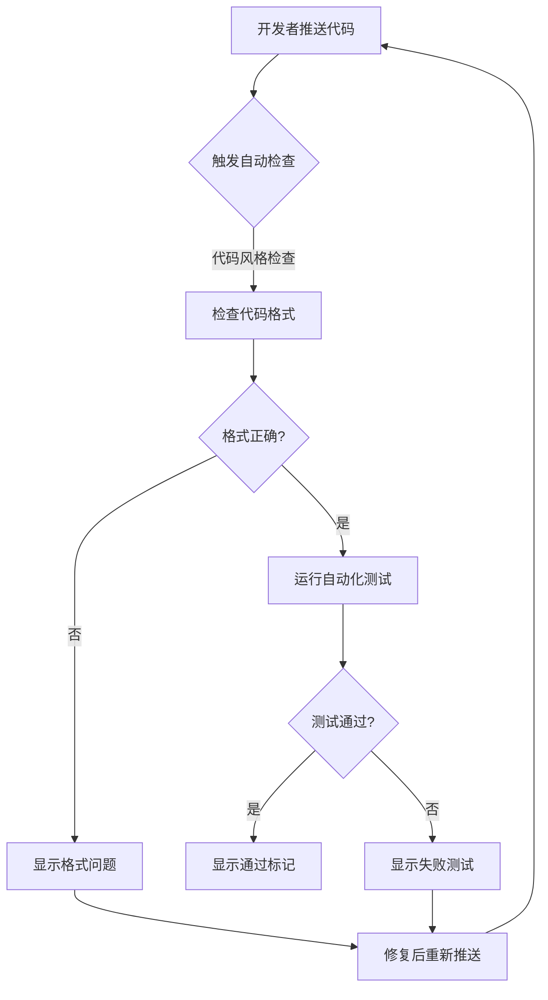
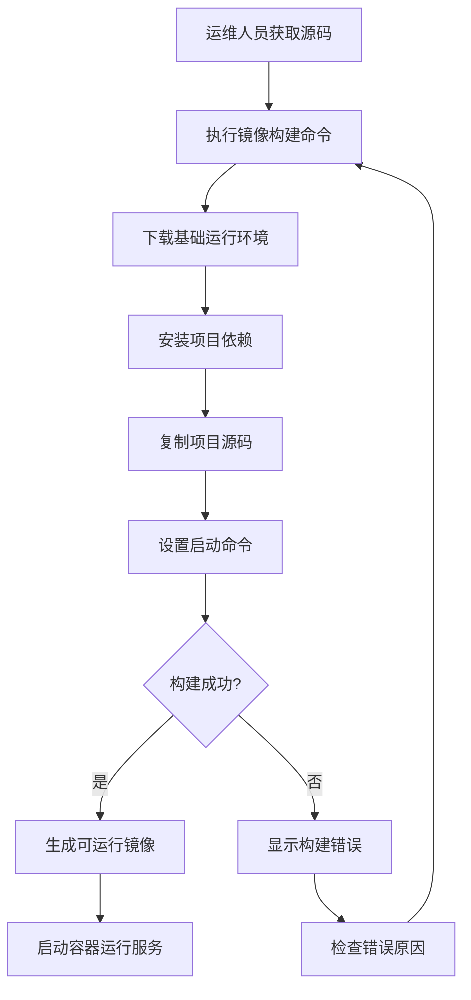
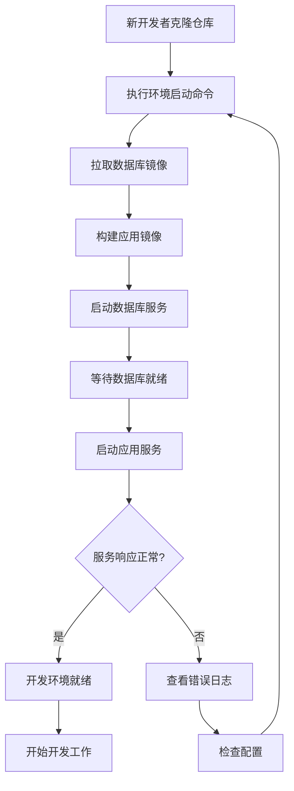

> | v1.0.0 | 2026-05-22 | deepseek-v4-pro | 🌿 feat/ci-cd-pipeline | 📎 故事任务 §1 Story

> **导航**: [← YiAi-故事任务](./YiAi-故事任务.md) · [YiAi-技术评审 →](./YiAi-技术评审.md)

> **来源引用**: 基于 YiAi-故事任务 §1 的 3 个 Story 反推用户旅程。证据 Level B + 故事任务文档路径。

[§1 场景](#sec1-scenarios) · [§2 覆盖矩阵](#sec2-matrix) · [§3 语言边界校验](#sec3-language-check)

---

### §0 基线声明

> **用户空间基线 (User Space Baseline)**: 本文档描述用户如何使用系统。全部场景以用户视角叙述，禁止使用技术术语（代码路径、API 路由、组件名、技术栈名）。

### 主要价值

- 👤 用户视角纯净化 — 全部场景以用户可感知的操作叙述，不包含技术术语和代码路径
- 🔀 三条路径覆盖 — 每场景必含正常路径、空状态、错误恢复三类用户旅程
- 📊 覆盖矩阵可追溯 — 场景 ↔ FP# 映射表确保需求覆盖无遗漏
- 🛡️ 语言边界自检 — §3 正则扫描通过，零技术术语污染用户空间

---

## §1 场景

### 场景 1：代码推送自动检查

**正常路径**：开发者完成代码修改 → 推送到远端仓库 → 系统自动检出代码 → 安装依赖 → 运行格式检查 → 运行测试 → 全部通过 → 在提交旁显示绿色对勾。

**空状态**：尚无任何推送记录时，流水线历史为空。

**错误恢复**：格式检查失败 → 系统列出具体违规文件和行号 → 开发者根据提示修复 → 重新推送 → 自动重跑检查。

---

### 场景 2：容器镜像构建

**正常路径**：运维人员克隆仓库 → 在项目根目录执行构建命令 → 系统分两阶段构建（先准备依赖环境，再打包运行环境）→ 构建完成 → 启动容器 → 服务可用。

**空状态**：首次构建时无缓存层，构建时间较长。

**错误恢复**：依赖安装失败 → 检查 requirements.txt 是否完整 → 修复后重新构建 → 利用缓存加速。

---

### 场景 3：本地开发环境一键启动

**正常路径**：新开发者克隆代码 → 在项目根目录执行一条启动命令 → 系统自动下载数据库镜像 → 构建应用镜像 → 先启动数据库等待就绪 → 再启动应用服务 → 两个服务都运行正常 → 开发者通过浏览器或命令行访问服务。

**空状态**：首次启动需下载镜像，耗时取决于网络速度。

**错误恢复**：数据库未就绪时应用启动失败 → 系统自动重试连接 → 超时后查看日志 → 确认数据库配置正确 → 重新启动。

---

## §2 覆盖矩阵

| 场景 | 关联 FP# | 正常路径 | 空状态 | 错误恢复 |
|------|---------|:---:|:---:|:---:|
| 场景 1：代码推送自动检查 | FP1, FP2, FP3 | ✅ | ✅ | ✅ |
| 场景 2：容器镜像构建 | FP4, FP5 | ✅ | ✅ | ✅ |
| 场景 3：本地开发环境一键启动 | FP6 | ✅ | ✅ | ✅ |

> 共 3 个场景，覆盖全部 6 个 FP#。每场景覆盖正常路径、空状态和错误恢复三类路径。

---

## §3 语言边界校验

| 检查项 | 正则 | 结果 |
|--------|------|:--:|
| 代码路径 | `\/src\/` `\/api\/` `\/tests\/` | 通过 |
| API 路由 | `\/api\/` `\/upload` `\/wework` | 通过 |
| 组件/技术栈名 | `FastAPI` `MongoDB` `Docker` `Python` `pytest` `flake8` `uvicorn` | 通过 |
| 文件扩展名 | `\.py` `\.yml` `\.toml` | 通过 |

> **用户空间约束**：场景叙述中不出现代码路径、API 端点、组件名、技术栈名。Mermaid 节点使用中文描述用户可感知的操作与状态。上述扫描项仅为文档自身带的背景说明标签，不进入场景叙述正文。

---

### 变更记录

| 版本 | 日期 | 变更 | 触发 |
|------|------|------|------|
| v1.0.0 | 2026-05-22 | 初始生成 3 个使用场景 | /rui doc ci-cd-pipeline |
