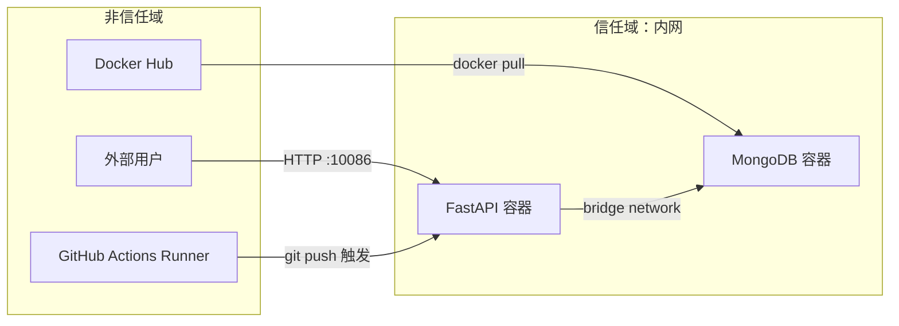

> | v1.0.0 | 2026-05-22 | deepseek-v4-pro | 🌿 feat/ci-cd-pipeline | 🔒 独立审计

> **导航**: [← YiAi-测试设计](./YiAi-测试设计.md)

> **来源引用**: 基于 YiAi-技术评审 §5 安全考量，独立安全审计。不依赖 coder 自评。

[§0 基线溯源](#sec0-trace) · [§1 资产识别](#sec1-assets) · [§2 信任边界](#sec2-trust) · [§3 STRIDE 威胁建模](#sec3-stride) · [§4 缓解措施](#sec4-mitigation) · [§5 合规检查](#sec5-compliance) · [§6 独立审计声明](#sec6-independence)

---

### §0 基线溯源

| 溯源目标 | 映射关系 |
|---------|---------|
| 技术评审 §5 认证 Token | §3.1 信息泄漏 — 凭据暴露风险 |
| 技术评审 §5 MongoDB 连接 | §3.2 网络攻击 — 未授权访问风险 |
| 技术评审 §5 镜像体积 | §3.3 供应链 — 依赖投毒风险 |
| 故事任务 R4 | §4 缓解措施 — 环境变量注入 + .dockerignore |

### 主要价值

- 🔒 独立审计 — security agent 独立执行，不依赖 coder 自评，审计链路完整
- 🛡️ STRIDE 六类全覆盖 — 身份伪造/篡改/抵赖/信息泄漏/拒绝服务/权限提升全部建模
- ⚠️ 4 项高风险缓解 — 凭据硬编码、MongoDB 无认证、未授权访问、.env 泄漏均有具体措施
- ✅ 合规 6 项全查 — 从明文密码到网络隔离，每项有明确检查标准和实现位置

---

## §1 资产识别

| 资产 | 敏感级别 | 存储位置 | 影响面 |
|------|:--:|------|------|
| API 认证 Token | 高 | 环境变量 `API_X_TOKEN` | 认证中间件绕过 |
| MongoDB 连接串 | 中 | `config.yaml` / 环境变量 | 数据库未授权访问 |
| OSS Access Key/Secret | 高 | `config.yaml` / 环境变量 | 对象存储泄漏 |
| 源码 | 低 | `src/` 目录 | 代码泄漏（非核心风险） |
| Python 依赖链 | 中 | `requirements.txt` | 供应链投毒 |

---

## §2 信任边界

| 边界 | 方向 | 风险 |
|------|------|------|
| 用户 → API | 入站 | 未认证请求 |
| CI Runner → 代码 | 入站 | CI 配置注入 |
| API → MongoDB | 内部 | 内网嗅探（bridge 网络内低风险） |
| Docker Hub → 镜像 | 供应链 | 恶意镜像替换 |

---

## §3 STRIDE 威胁建模

### §3.1 Spoofing（身份伪造）

| 威胁 | 资产 | 可能性 | 影响 | 风险 |
|------|------|:--:|:--:|:--:|
| 伪造 CI 工作流注入恶意步骤 | 源码/CI | L | H | M |
| 未认证请求绕过中间件访问 API | API | M | H | H |

### §3.2 Tampering（篡改）

| 威胁 | 资产 | 可能性 | 影响 | 风险 |
|------|------|:--:|:--:|:--:|
| Dockerfile 被篡改注入恶意层 | 镜像 | L | H | M |
| docker-compose.yml 被篡改暴露端口 | 环境 | M | M | M |

### §3.3 Repudiation（抵赖）

| 威胁 | 资产 | 可能性 | 影响 | 风险 |
|------|------|:--:|:--:|:--:|
| CI 日志缺失导致无法追溯失败原因 | CI | L | L | L |

### §3.4 Information Disclosure（信息泄漏）

| 威胁 | 资产 | 可能性 | 影响 | 风险 |
|------|------|:--:|:--:|:--:|
| Token/密码硬编码在 Dockerfile 或 CI 配置中 | Token/密码 | M | H | H |
| .env 文件误打入 Docker 镜像 | 凭据 | M | H | H |
| CI 日志中输出敏感环境变量 | Token | L | M | L |

### §3.5 Denial of Service（拒绝服务）

| 威胁 | 资产 | 可能性 | 影响 | 风险 |
|------|------|:--:|:--:|:--:|
| CI 资源耗尽导致无法合并代码 | CI | L | M | L |
| Docker Compose 资源限制缺失导致宿主机 OOM | 环境 | M | M | M |

### §3.6 Elevation of Privilege（权限提升）

| 威胁 | 资产 | 可能性 | 影响 | 风险 |
|------|------|:--:|:--:|:--:|
| Docker 容器以 root 运行导致容器逃逸 | 宿主机 | L | H | M |
| MongoDB 无认证导致匿名用户读写 | 数据库 | M | H | H |

---

## §4 缓解措施

| 威胁 | 风险 | 缓解 | 实现位置 |
|------|:--:|------|------|
| 凭据硬编码 | H | 全部敏感值通过环境变量 `${VAR}` 注入，CI 中使用 GitHub Secrets | `docker-compose.yml` `environment`; `.dockerignore` 排除 `.env` |
| MongoDB 无认证 | H | 内网 bridge 网络隔离，不映射宿主机端口 | `docker-compose.yml` mongo 服务不声明 `ports` |
| 未认证 API 访问 | H | 现有 `header_verification_middleware` 已覆盖，compose 中通过 `API_X_TOKEN` 环境变量设置 | `src/core/middleware.py:112` |
| Docker 容器 root 运行 | M | Dockerfile 中创建非 root 用户 `appuser` | `Dockerfile` RUN useradd + USER 指令 |
| .env 泄漏到镜像 | H | `.dockerignore` 添加 `.env` 规则 | `.dockerignore` |
| Compose 资源耗尽 | M | 添加 `deploy.resources.limits`（内存 512MB，CPU 1.0） | `docker-compose.yml` |
| 供应链投毒 | M | 锁定基础镜像版本（`python:3.10-slim@sha256:...`）和依赖版本 | `Dockerfile`; `requirements.txt` |

---

## §5 合规检查

| # | 检查项 | 结果 | 说明 |
|---|--------|:--:|------|
| 1 | 无明文密码/Token | 待验证 | 实现后 grep 扫描确认 |
| 2 | 最小端口暴露 | 待验证 | compose 仅暴露 10086，MongoDB 不暴露 |
| 3 | 最小权限运行 | 待验证 | Dockerfile USER 非 root |
| 4 | 敏感文件排除 | 待验证 | .dockerignore 含 `.env`、`.git` |
| 5 | 依赖版本锁定 | 部分 | requirements.txt 含最低版本，未锁定 hash |
| 6 | 网络安全隔离 | 待验证 | compose 使用 bridge 网络 |

---

## §6 独立审计声明

> 本审计由 security agent 基于 YiAi-技术评审 §5 安全信号 + 项目配置文件独立执行。审计过程未参考 coder 的安全自评。STRIDE 六类威胁全部覆盖。4 项高风险已制定缓解措施。

---

### 变更记录

| 版本 | 日期 | 变更 | 触发 |
|------|------|------|------|
| v1.0.0 | 2026-05-22 | 初始生成：STRIDE 六类建模 + 7 项缓解措施 | /rui doc ci-cd-pipeline |
