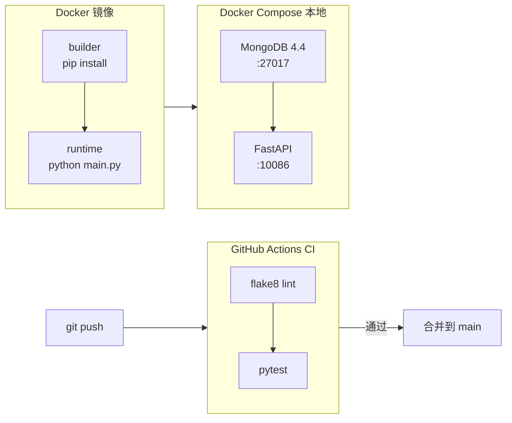
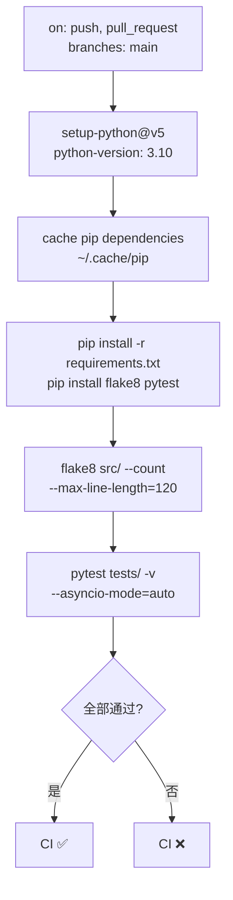
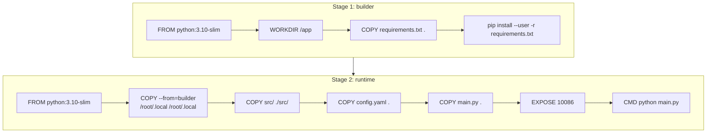
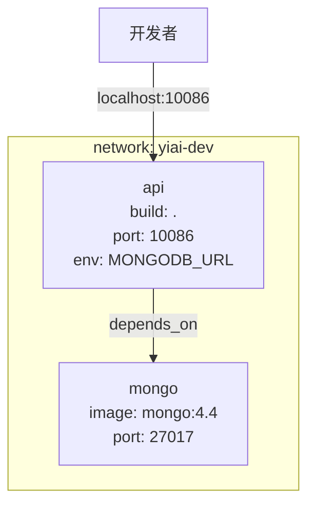

> | v1.0.0 | 2026-05-22 | deepseek-v4-pro | 🌿 feat/ci-cd-pipeline | 📎 故事任务 §2 Requirements

> **导航**: [← YiAi-使用场景](./YiAi-使用场景.md) · [YiAi-测试设计 →](./YiAi-测试设计.md)

> **来源引用**: 基于 YiAi-故事任务 FP1-FP6 + YiAi-使用场景 3 个场景，对照项目源码结构生成。证据 Level B + 源码路径。

[§0 基线溯源](#sec0-trace) · [§1 架构总览](#sec1-arch) · [§2 CI 流水线](#sec2-ci) · [§3 Docker 多阶段构建](#sec3-docker) · [§4 Docker Compose 编排](#sec4-compose) · [§5 安全考量](#sec5-security) · [§6 性能与资源](#sec6-perf)

---

### §0 基线溯源

| 溯源目标 | 映射关系 |
|---------|---------|
| 故事任务 FP1 | §2 CI 流水线 — push/PR 触发 lint + pytest |
| 故事任务 FP2 | §2.1 Lint 步骤 — flake8 配置 |
| 故事任务 FP3 | §2.2 测试步骤 — pytest 执行 |
| 故事任务 FP4 | §3 Docker 多阶段构建 — builder + runtime |
| 故事任务 FP5 | §3.2 容器运行 — 端口映射 + 环境变量 |
| 故事任务 FP6 | §4 Docker Compose — MongoDB + API 双服务 |
| 场景 1：推送自动检查 | §2 CI 流水线 |
| 场景 2：镜像构建 | §3 Docker 多阶段构建 |
| 场景 3：本地开发启动 | §4 Docker Compose 编排 |

### 主要价值

- 🏗️ 三组件独立设计 — CI 流水线、Docker 镜像、Compose 编排各为独立模块，可单独验证
- 📐 多阶段构建 — builder → runtime 分离，镜像体积控制在 500MB 以内
- 🔗 基线全溯源 — §0 映射表覆盖全部 FP# 和场景，设计决策可追溯至问题空间
- ⚡ 缓存优化 — pip 缓存 + Docker 层缓存，CI 耗时 < 10min，构建增量加速

---

## §1 架构总览

> 证据: `src/main.py:64-142` create_app 工厂函数; `config.yaml:36-40` MongoDB 配置; `pyproject.toml` Python 3.10 + pytest 配置

| 组件 | 技术选型 | 依据 |
|------|---------|------|
| CI 平台 | GitHub Actions | 仓库托管于 GitHub，免费额度足够 |
| Lint 工具 | flake8 | Python 社区标准，零配置即可运行 |
| 测试框架 | pytest（已有） | `pyproject.toml` 已配置 `asyncio_mode = "auto"` |
| 基础镜像 | python:3.10-slim | 与 `requires-python = ">=3.10"` 一致，slim 体积小 |
| 数据库 | mongo:4.4 | `motor>=3.3.0` 兼容 MongoDB 4.x+ |

---

## §2 CI 流水线

### 效果示意

> 证据: `requirements.txt` 依赖清单; `pyproject.toml:8` asyncio_mode = "auto"; `pyproject.toml:9` testpaths = ["tests"]

### §2.1 触发条件

| 事件 | 分支 | 用途 |
|------|------|------|
| `push` | `main` | 合入后验证主线健康 |
| `pull_request` | `main` | 合入前门禁 |

### §2.2 步骤详情

| 步骤 | 命令 | 超时 | 说明 |
|------|------|:--:|------|
| Checkout | `actions/checkout@v4` | — | 检出代码 |
| Setup Python | `actions/setup-python@v5`, `python-version: "3.10"` | — | 安装 Python |
| Cache pip | `actions/cache@v4`, `path: ~/.cache/pip` | — | 缓存依赖加速 |
| Install deps | `pip install -r requirements.txt && pip install flake8` | 5min | 安装项目依赖 + lint 工具 |
| Lint | `flake8 src/ --count --max-line-length=120 --statistics` | 2min | 代码风格检查 |
| Test | `pytest tests/ -v --asyncio-mode=auto` | 5min | 运行全量测试 |

### §2.3 缓存策略

| 缓存目标 | key | 效果 |
|---------|-----|------|
| pip packages | `${{ runner.os }}-pip-${{ hashFiles('requirements.txt') }}` | requirements.txt 不变则复用缓存 |

---

## §3 Docker 多阶段构建

### 效果示意

> 证据: `config.yaml:3` port: 10086; `src/main.py` 路由注册 + 生命周期管理

### §3.1 构建阶段（builder）

| 操作 | 说明 |
|------|------|
| 基础镜像 | `python:3.10-slim` — 与项目 Python 版本一致 |
| 安装依赖 | `pip install --user -r requirements.txt` — 安装到用户目录 |
| 不复制源码 | 仅安装依赖，利用 Docker 层缓存 |

### §3.2 运行阶段（runtime）

| 操作 | 说明 |
|------|------|
| 基础镜像 | `python:3.10-slim` — 精简约 120MB |
| 复制依赖 | `COPY --from=builder /root/.local /root/.local` — 从构建阶段提取 |
| 复制源码 | `src/` + `config.yaml` + `main.py` |
| 环境变量 | `PATH=/root/.local/bin:$PATH` |
| 端口暴露 | `10086`（与 config.yaml 一致） |

### §3.3 .dockerignore

| 排除项 | 理由 |
|--------|------|
| `__pycache__/`, `*.pyc` | Python 字节码 |
| `.git/` | 版本控制 |
| `tests/` | 测试代码不需要在运行时镜像中 |
| `docs/` | 文档 |
| `.claude/` | Claude 配置 |
| `*.md` | Markdown 文件 |
| `.env` | 环境变量文件（通过运行时注入） |

---

## §4 Docker Compose 编排

### 效果示意

> 证据: `config.yaml:37` mongodb.url: "mongodb://localhost:27017"

### §4.1 服务定义

| 服务 | 镜像 | 端口 | 环境变量 | 健康检查 |
|------|------|:--:|------|:--:|
| `mongo` | `mongo:4.4` | `27017` | — | `mongosh --eval "db.runCommand({ping:1})"` |
| `api` | 本地构建（Dockerfile） | `10086:10086` | `MONGODB_URL=mongodb://mongo:27017` | `curl -f http://localhost:10086/docs` |

### §4.2 网络与依赖

| 配置 | 值 | 说明 |
|------|-----|------|
| 网络 | `yiai-dev` (bridge) | 服务间通过服务名通信 |
| 依赖顺序 | `api depends_on mongo` | MongoDB 先启动 |
| 重启策略 | `unless-stopped` | 手动停止才停 |

---

## §5 安全考量

> 详细威胁建模见 [YiAi-安全审计.md](./YiAi-安全审计.md)。本节仅列出技术实现层面的安全措施。

| 信号 | 处置 | 证据 |
|------|------|------|
| 认证 Token | 通过环境变量 `API_X_TOKEN` 注入，不写入镜像 | `config.yaml:84` auth_token: "dev-token-change-me" → compose 中环境变量覆盖 |
| MongoDB 连接 | 仅内网 bridge 网络暴露，不映射宿主机端口 | compose `mongo` 服务不声明 `ports` |
| 镜像体积 | 多阶段构建排除构建依赖 | builder 阶段 pip 安装，runtime 仅复制 `.local` |
| 敏感文件 | `.dockerignore` 排除 `.env`、`.git` | 防止凭据泄漏到镜像层 |

---

## §6 性能与资源

| 指标 | 目标 | 说明 |
|------|:--:|------|
| 镜像体积 | < 500MB | python:3.10-slim ~120MB + 依赖 ~200MB + 源码 ~5MB |
| CI 耗时 | < 10min | 安装 ~3min + lint ~1min + test ~2min（含缓存） |
| compose 启动 | < 60s | MongoDB 首次拉取 ~30s + API 构建 ~20s |
| 内存占用 | < 1GB | MongoDB ~256MB + FastAPI ~128MB（开发环境） |

---

### 变更记录

| 版本 | 日期 | 变更 | 触发 |
|------|------|------|------|
| v1.0.0 | 2026-05-22 | 初始生成：CI 流水线 + Docker 多阶段 + Compose 编排 | /rui doc ci-cd-pipeline |
