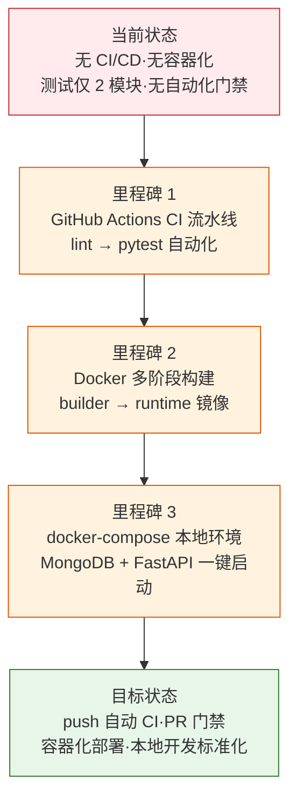

> | v1.0.0 | 2026-05-22 | deepseek-v4-pro | 🌿 feat/ci-cd-pipeline | ⏱️ — | 📎 [CLAUDE.md](../../../CLAUDE.md) |

> **导航**: [YiAi-使用场景 →](./YiAi-使用场景.md)

> **来源引用**: `/rui "设置 CI/CD 流水线" --name ci-cd-pipeline`，需求由 rui 推荐引擎 L-1 基建缺口扫描触发

[§1 Story](#sec1-story) · [§2 Requirements](#sec2-requirements) · [§3 成功标准](#sec3-success) · [§4 范围边界](#sec4-scope) · [§5 AC](#sec5-ac) · [§6 风险与假设](#sec6-risks) · [§7 跨文档索引](#sec7-index) · [§L 自改进循环](#secL-improve)

---

### §0 基线声明

> **问题空间基线 (Problem Space Baseline)**: 本文档定义"做什么(WHAT)"和"为什么(WHY)"。所有后续文档的设计、实现、验证、改进决策均必须可追溯至本文档的具体章节。

---

### 需求概述

为 YiAi FastAPI 后端服务搭建 CI/CD 流水线，补齐 L-1 基建缺口。当前项目无 GitHub Actions 工作流、无 Dockerfile、无 docker-compose.yml，测试仅覆盖 2 个模块（398 行）。需要建立自动化 lint + test 门禁、Docker 多阶段构建镜像、docker-compose 本地开发环境（MongoDB + FastAPI）。

### 效果示意

### 主要价值

- 🔧 补齐 L-1 基建缺口 — CI/CD 是项目当前最严重的基建缺失，无自动化门禁意味着每次变更无质量保障
- 🐳 标准化运行环境 — Docker 多阶段构建消除"在我机器上能跑"问题，镜像体积可控
- 🚀 本地开发一键启动 — docker-compose 集成 MongoDB + FastAPI，新开发者 clone 后一条命令即可开发
- ⚡ 自动化质量门禁 — push/PR 触发 lint + pytest，阻断不合格代码合入 main

---

## §1 Story

### Story 1: GitHub Actions CI 流水线

| 字段 | 内容 |
|------|------|
| 作为 | 项目维护者 |
| 我想要 | push 和 PR 时自动运行 lint 检查和 pytest 测试 |
| 以便 | 每次变更都有自动化的质量门禁，防止回归问题合入 main |
| 优先级 | P0 |
| 范围边界 | 仅创建 `.github/workflows/ci.yml`，不改源码 |
| 依赖 | Python 3.10+ 项目、pytest 已配置、requirements.txt 存在 |

#### 范围外

- 不涉及 CD（部署到服务器）— 部署目标尚未确定
- 不修改现有测试代码

##### §1.1 User Operations

| # | 操作 | 触发条件 | 操作步骤 | 预期结果 |
|---|------|---------|---------|---------|
| 1 | push 触发 CI | git push 到任意分支 | GitHub Actions 自动运行 lint + pytest | 通过/失败状态回显到 GitHub |
| 2 | PR 门禁 | 创建 Pull Request 到 main | CI 作为 required check 运行 | 不通过则无法合并 |

---

### Story 2: Docker 多阶段构建

| 字段 | 内容 |
|------|------|
| 作为 | 运维/部署人员 |
| 我想要 | 一份 Dockerfile 完成构建和运行两个阶段 |
| 以便 | 构建产物精简（不含编译依赖），镜像启动快速 |
| 优先级 | P0 |
| 范围边界 | 仅创建 `Dockerfile` 和 `.dockerignore` |
| 依赖 | Story 1 不阻塞，可并行 |

#### 范围外

- 不涉及 Kubernetes/Helm 等编排配置
- 不涉及 CI 中的镜像推送（Registry 未配置）

##### §1.1 User Operations

| # | 操作 | 触发条件 | 操作步骤 | 预期结果 |
|---|------|---------|---------|---------|
| 1 | 构建镜像 | 执行 `docker build -t yiai .` | 多阶段构建：安装依赖 → 复制源码 → 生成 runtime 镜像 | 镜像构建成功，体积 < 500MB |
| 2 | 运行容器 | 执行 `docker run -p 10086:10086 yiai` | 容器启动 FastAPI 服务 | 服务监听 10086 端口 |

---

### Story 3: Docker Compose 本地开发环境

| 字段 | 内容 |
|------|------|
| 作为 | 开发者 |
| 我想要 | 一条 `docker-compose up` 命令启动完整开发环境 |
| 以便 | 无需手动安装 MongoDB、配置 Python 环境，clone 即可开发 |
| 优先级 | P1 |
| 范围边界 | 仅创建 `docker-compose.yml` |
| 依赖 | Story 2（Dockerfile 存在） |

#### 范围外

- 不涉及生产部署配置
- 不配置数据持久化卷（开发环境用 tmpfs）

##### §1.1 User Operations

| # | 操作 | 触发条件 | 操作步骤 | 预期结果 |
|---|------|---------|---------|---------|
| 1 | 启动开发环境 | 执行 `docker-compose up -d` | 启动 MongoDB + FastAPI 两个服务 | 两个容器运行中，API 可访问 |
| 2 | 停止环境 | 执行 `docker-compose down` | 停止并移除容器 | 环境干净清理 |

---

### §2 Requirements

#### 功能点

| FP# | 描述 | 输入 | 输出 | 错误行为 | 优先级 |
|-----|------|------|------|---------|--------|
| FP1 | CI 工作流 — push/PR 触发 lint + pytest | git push / PR 事件 | CI 运行结果（pass/fail） | 依赖安装失败或测试失败时 CI 标红 | P0 |
| FP2 | Lint 检查 — 运行 Python 代码风格检查 | 项目源码 | flake8/ruff 检查结果 | 违反规则时 CI 失败 | P0 |
| FP3 | 测试执行 — 运行 pytest 全量测试 | tests/ 目录 | 测试通过/失败报告 | 任何测试失败时 CI 失败 | P0 |
| FP4 | Docker 构建 — 多阶段构建镜像 | Dockerfile + 源码 | 可运行的 Docker 镜像 | 构建失败时输出错误信息 | P0 |
| FP5 | Docker 运行 — 容器化启动 FastAPI | Docker 镜像 | 运行中的 API 服务 | 端口冲突或 MongoDB 不可达时报错 | P0 |
| FP6 | Compose 编排 — MongoDB + API 联合启动 | docker-compose.yml | 两个服务组成的开发环境 | 服务依赖顺序错误时重试 | P1 |

#### 业务规则

| R# | 描述 | 校验方式 | 证据级别 |
|----|------|---------|---------|
| R1 | CI 使用 Python 3.10+（与 pyproject.toml requires-python 一致） | 检查 ci.yml 中 python-version | A |
| R2 | Docker 使用多阶段构建（builder + runtime） | 检查 Dockerfile 中 FROM 指令数量 ≥ 2 | A |
| R3 | docker-compose 中 MongoDB 先于 API 启动 | 检查 depends_on 配置 | A |
| R4 | 不硬编码敏感信息（token/密码），通过环境变量注入 | 扫描配置文件无明文密码 | B |

#### 数据约束

| 约束 | 类型 | 范围/格式 | 来源 |
|------|------|----------|------|
| 分支名 | string | `feat/ci-cd-pipeline` | 分支隔离约束 |
| Python 版本 | string | `3.10` | pyproject.toml |
| 服务端口 | int | `10086` | config.yaml server.port |
| MongoDB 版本 | string | `4.4+` | motor 驱动兼容性 |

---

### §3 成功标准

| SC# | 描述 | 度量方式 | 目标值 | 优先级 | 关联 FP# |
|-----|------|---------|--------|--------|---------|
| SC1 | CI 工作流文件存在且语法正确 | GitHub Actions 校验通过 | ci.yml 存在 | P0 | FP1 |
| SC2 | Docker 镜像可成功构建 | `docker build -t yiai .` 退出码 0 | 构建成功 | P0 | FP4 |
| SC3 | docker-compose 可启动完整环境 | `docker-compose up -d` 后 API 返回 200 | 两个容器 running | P1 | FP6 |
| SC4 | lint 和 test 在 CI 中正确触发 | CI 日志含 lint + pytest 步骤输出 | 两个步骤均执行 | P0 | FP2, FP3 |

---

### §4 范围边界

#### 范围内

| # | 条目 | 关联 FP# | 边界说明 |
|---|------|---------|---------|
| 1 | `.github/workflows/ci.yml` | FP1, FP2, FP3 | GitHub Actions 工作流：Python 3.10 + 依赖安装 + flake8 + pytest |
| 2 | `Dockerfile` | FP4, FP5 | 多阶段构建：python:3.10-slim builder → runtime |
| 3 | `.dockerignore` | FP4 | 排除 `__pycache__`、`.git`、`tests/` 等非必要文件 |
| 4 | `docker-compose.yml` | FP6 | MongoDB 4.4 + FastAPI 服务，网络隔离 |

#### 范围外

| # | 条目 | 排除原因 | 替代方案 |
|---|------|---------|---------|
| 1 | CD（部署到服务器） | 部署目标未确定 | 后续 story |
| 2 | Docker Registry 推送 | Registry 凭据未配置 | 后续 story |
| 3 | Kubernetes/Helm | 过度设计，单体后端无需 K8s | — |
| 4 | 源码修改 | CI/CD 是基础设施，不改业务代码 | — |
| 5 | 测试代码新增 | 属于 test-coverage story | `/rui "扩展测试覆盖" --name test-coverage` |

---

### §5 AC

| AC# | Given | When | Then | 门禁 |
|-----|-------|------|------|------|
| AC1 | 项目有 `requirements.txt` 和 `tests/` 目录 | 创建 `.github/workflows/ci.yml` | CI 包含 lint 和 pytest 两个 job step | Gate A |
| AC2 | CI 配置完成 | git push 到远端分支 | GitHub Actions 自动触发运行 | Gate B |
| AC3 | Dockerfile 存在 | 执行 `docker build -t yiai .` | 多阶段构建成功，镜像体积 < 500MB | Gate B |
| AC4 | `.dockerignore` 存在 | 构建镜像 | `__pycache__`、`.git`、`tests/` 不会进入镜像 | Gate B |
| AC5 | docker-compose.yml 存在 | 执行 `docker-compose up -d` | MongoDB + FastAPI 两个服务启动，API 返回 200 | Gate B |
| AC6 | 敏感信息不硬编码 | 扫描全部新增文件 | 无明文 token/密码 | Gate A |

---

### §6 风险与假设

| # | 风险/假设 | 类型 | 可能性 | 影响 | 缓解/验证策略 | 关联 FP# |
|---|----------|------|--------|------|-------------|---------|
| 1 | GitHub Actions 免费额度限制可能导致 CI 运行次数受限 | 风险 | L | L | 按需触发（push/PR），不做定时任务 | FP1 |
| 2 | Docker 构建时 MongoDB 连接检查可能误报（构建阶段无 MongoDB） | 风险 | M | L | Dockerfile 中不做运行时健康检查，仅在 compose 层处理 | FP4 |
| 3 | 不同环境 Python 包版本差异导致 CI 与本地不一致 | 风险 | M | M | 使用 requirements.txt 精确版本号 | FP1 |
| 4 | GitHub 仓库存在且用户有权限配置 Actions | 假设 | — | — | CI 文件提交后自动生效 | FP1 |
| 5 | Docker 环境已安装（开发者本地或 CI runner） | 假设 | — | — | 提供 docker-compose 作为可选开发方式 | FP4, FP6 |

---

### §7 跨文档索引

| 文档 | 路径 | 关键内容 |
|------|------|---------|
| 使用场景 | [YiAi-使用场景.md](./YiAi-使用场景.md) | CI 触发/dev 环境启动/Docker 构建 3 个场景 |
| 技术评审 | [YiAi-技术评审.md](./YiAi-技术评审.md) | CI 流程设计/Docker 多阶段/Docker Compose 网络 |
| 测试设计 | [YiAi-测试设计.md](./YiAi-测试设计.md) | CI 配置验证/镜像构建验证/Compose 集成验证 |
| 安全审计 | [YiAi-安全审计.md](./YiAi-安全审计.md) | 敏感信息管理/镜像安全/网络隔离 |

---

## §L 自改进循环

| 字段 | 值 |
|------|-----|
| 提案 ID | —（首次生成） |
| D# | L-1（基建缺失检测） |
| 来源 | rui 推荐引擎 — CI/CD 完全缺失 |
| 创建时间 | 2026-05-22 |
| 状态 | open |
