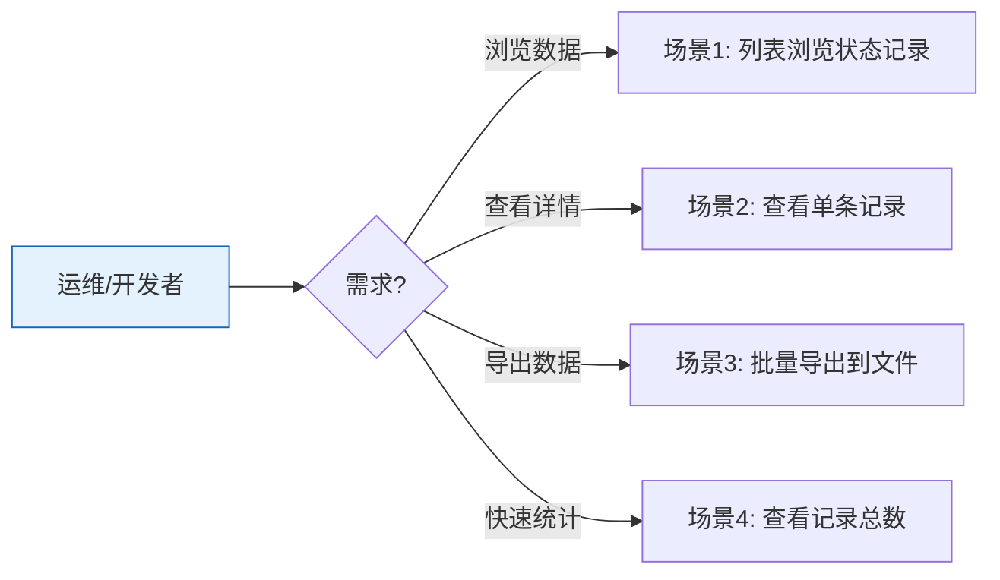

# YiAi-使用场景 — cli

> CLI 命令行工具的使用场景文档。覆盖状态查询的 4 种使用方式。
>
> **来源**：源码分析 `/rui doc --from-code cli`
> **证据等级**：B | **项目类型**：backend

---

## 效果示意

---

## 场景 1：列表浏览状态记录

### 场景描述
运维人员需要查看系统中最近的技能执行记录或状态数据，支持按类型、标签、标题关键词筛选和翻页。

### 操作步骤
1. 直接运行 `python state_query.py list` 查看最近 20 条
2. 使用 `--record-type skill_execution` 按类型过滤
3. 使用 `--tag` 参数按标签筛选
4. 使用 `--page` 翻页
5. 默认以 rich 表格形式展示

### 异常情况
- 查询无结果 → 显示空表格和 total=0

---

## 场景 2：查看单条记录

### 场景描述
根据已知的记录标识符查看完整内容，用于排查特定问题或追踪执行详情。

### 操作步骤
1. 运行 `python state_query.py get <key>`
2. 终端以 JSON 格式显示完整记录
3. 若不存在则红色提示并返回错误退出码

---

## 场景 3：批量导出到文件

### 场景描述
需要将大量状态数据导出为文件，供离线分析或备份使用。支持 JSON 和 CSV 两种格式。

### 操作步骤
1. 运行 `python state_query.py export --output data.json`
2. 系统自动以最大 page_size(8000) 查询
3. 可选 `--format csv` 导出 CSV 格式
4. 可选 `--record-type` 过滤特定类型

---

## 场景 4：查看记录总数

### 场景描述
快速了解系统中某类状态记录的总体规模，无需获取具体内容。

### 操作步骤
1. 运行 `python state_query.py stats`
2. 可选 `--record-type` 限定类型
3. 终端显示记录总数

---

### 主要价值

- 📊 **即查即用** — 单文件 CLI，无需启动服务
- 🎨 **可读输出** — rich 表格美观，json/csv 适合机器处理
- 📁 **便捷导出** — 一条命令批量导出全部数据
- 🔍 **灵活过滤** — 类型/标签/标题三维筛选

---

## 回溯链

| 来源 | 路径 |
|------|------|
| 故事任务 | `YiAi-故事任务.md` §1 Story 1 |
| 源码 | `src/cli/state_query.py` |

### 变更记录

| 日期 | 版本 | 变更内容 |
|------|------|---------|
| 2026-05-22 | 1.0.0 | 初始 /rui doc --from-code |
