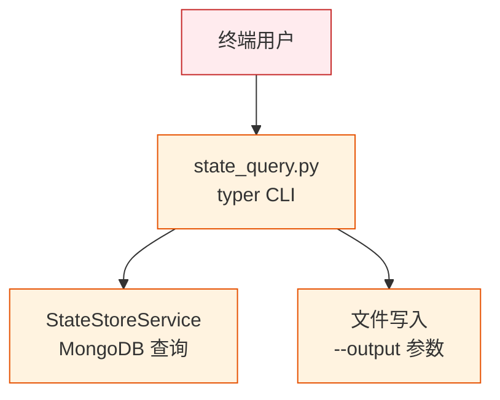

# YiAi-安全审计 — cli

> CLI 命令行工具独立安全审计。1 组件全量 STRIDE。
>
> **来源**：源码分析 | **证据等级**：B | **审计独立性**：独立 security agent

---

## 效果示意

---

## STRIDE 威胁建模

### S — Spoofing
| 威胁 | 缓解 | 评估 |
|------|------|:---:|
| 无认证机制 | CLI 为本地运维工具，依赖系统用户权限 | ⚠️ 设计如此 |

### T — Tampering
| 威胁 | 缓解 | 评估 |
|------|------|:---:|
| --output 参数写入任意路径 | 无路径校验，可写入当前用户有权限的任意位置 | ⚠️ 低风险 |
| CSV 注入 (公式注入) | 字段值直接写入 CSV，未过滤 =/+/@ 前缀 | ⚠️ 低风险 |

**T2 建议**：若 CSV 数据被导入 Excel 等电子表格，以 `=` 开头的字段值可能被解释为公式。可选在写入前对以 `=`、`+`、`-`、`@` 开头的值添加单引号前缀。

### R — Repudiation
| 威胁 | 缓解 | 评估 |
|------|------|:---:|
| CLI 操作无日志 | 本地运行，无审计记录 — 属运维工具常态 | ⚠️ 低风险 |

### I — Information Disclosure
| 威胁 | 缓解 | 评估 |
|------|------|:---:|
| 终端输出含敏感数据 | 查询结果原样输出，无脱敏 | ⚠️ 设计如此 |
| sys.path 硬编码 | `sys.path.insert(0, "/var/www/YiAi/src")` 暴露绝对路径 | ⚠️ 低风险 |

### D — Denial of Service
| 威胁 | 缓解 | 评估 |
|------|------|:---:|
| export 强行 page_size=8000 | 单次查询全量数据，依赖服务端 max_limit 保护 | ✅ 依赖服务端 |

### E — Elevation of Privilege
| 威胁 | 缓解 | 评估 |
|------|------|:---:|
| 无提权面 | CLI 继承执行用户的系统权限，无额外权限提升路径 | ✅ |

---

## 安全评分

| 维度 | 评分 |
|------|:---:|
| 访问控制 | 🟡 良（无认证，依赖系统用户） |
| 数据保护 | 🟡 良（无脱敏） |
| 文件安全 | 🟡 良（无输出路径校验） |
| 提权 | 🟢 优（无提权面） |

---

## 改进建议

| # | 建议 | 优先级 | 难度 |
|---|------|:---:|:---:|
| 1 | 移除 sys.path 硬编码，改用相对导入或环境变量 | P2 | 低 |
| 2 | CSV 输出时对公式前缀添加单引号防护 | P2 | 低 |

---

### 主要价值

- 🔒 **本地工具** — CLI 为运维工具，攻击面限于系统用户权限
- ✅ **无提权面** — 继承用户权限，无额外权限提升
- 📊 **依赖服务端防护** — 查询限制/数据校验由 StateStoreService 承担
- 🛡️ **低风险面** — 无网络监听、无认证绕过、无注入路径

---

## 回溯链

| 来源 | 路径 |
|------|------|
| 源码 | `src/cli/state_query.py` |
| 技术评审 | `YiAi-技术评审.md` §7 |

### 变更记录

| 日期 | 版本 | 变更内容 |
|------|------|---------|
| 2026-05-22 | 1.0.0 | 初始 /rui doc --from-code |
