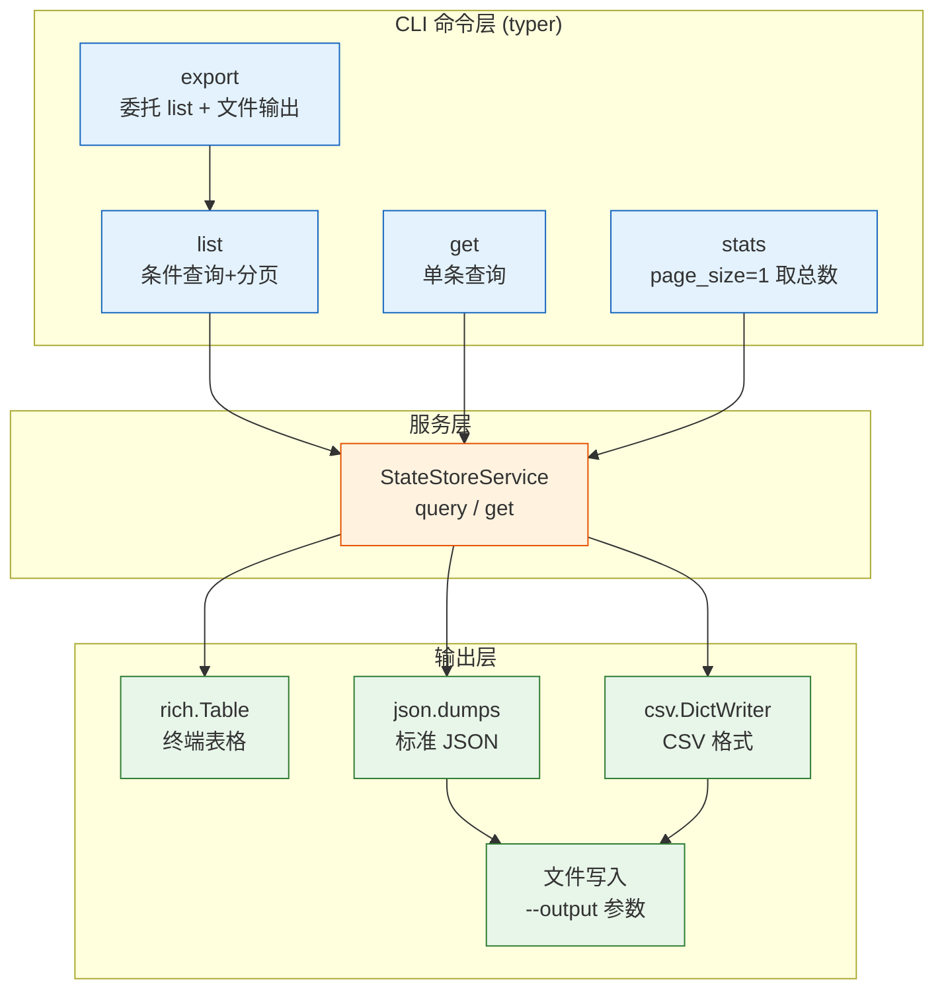
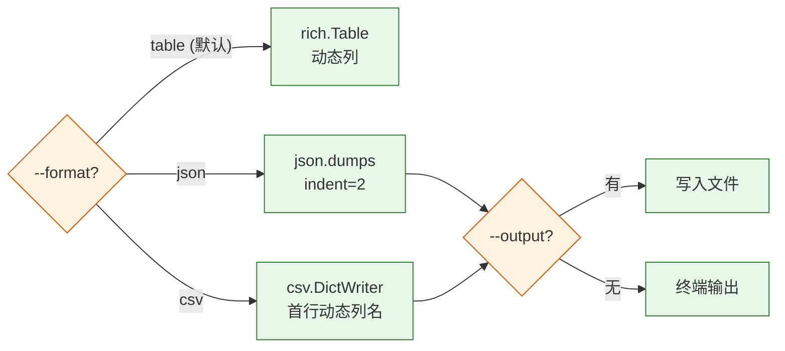

# YiAi-技术评审 — cli

> CLI 命令行工具技术评审。1 组件架构与接口设计。
>
> **来源**：源码分析 | **证据等级**：B | **项目类型**：backend → 跳过 §4/§5/§6

---

## 效果示意



---

## §1 架构设计

### 1.1 组件关系

| 组件 | 框架 | 命令数 | 依赖 |
|------|------|:---:|------|
| state_query.py | typer + rich | 4 | StateStoreService (异步) |

### 1.2 异步桥接

所有命令内部定义 `async def _run()` 嵌套函数，通过 `asyncio.run(_run())` 桥接同步 CLI 入口与异步服务调用。

### 1.3 输出格式路由



---

## §2 API / 方法签名

### list 命令

```
python state_query.py list [OPTIONS]
```

| 参数 | 短选项 | 默认值 | 说明 |
|------|--------|--------|------|
| --record-type | -t | None | 按类型过滤 |
| --tag | — | None | 按标签过滤（可多次指定） |
| --title | — | None | 标题模糊搜索 |
| --page | -p | 1 | 页码 |
| --page-size | -s | 20 | 每页条数 |
| --format | -f | "table" | 输出格式：table/json/csv |
| --output | -o | None | 输出文件路径 |

### get 命令

```
python state_query.py get KEY
```

### export 命令

```
python state_query.py export [OPTIONS]
```

| 参数 | 短选项 | 默认值 | 说明 |
|------|--------|--------|------|
| --record-type | -t | None | 按类型过滤 |
| --output | -o | (必填) | 输出文件路径 |
| --format | -f | "json" | json/csv |

### stats 命令

```
python state_query.py stats [OPTIONS]
```

| 参数 | 短选项 | 说明 |
|------|--------|------|
| --record-type | -t | 按类型过滤 |

---

### 主要价值

- 📊 **4 命令覆盖** — 查询/详情/导出/统计，日常运维全覆盖
- 🎨 **三格式输出** — rich 表格美观 + JSON 结构化 + CSV 表格处理
- 🔄 **异步桥接** — asyncio.run() 桥接 sync CLI 与 async 服务
- 📁 **文件导出** — --output 参数支持直接写入文件

---

## 回溯链

| 来源 | 路径 |
|------|------|
| 源码 | `src/cli/state_query.py` (132 行) |
| 故事任务 | `YiAi-故事任务.md` |

### 变更记录

| 日期 | 版本 | 变更内容 |
|------|------|---------|
| 2026-05-22 | 1.0.0 | 初始 /rui doc --from-code |
