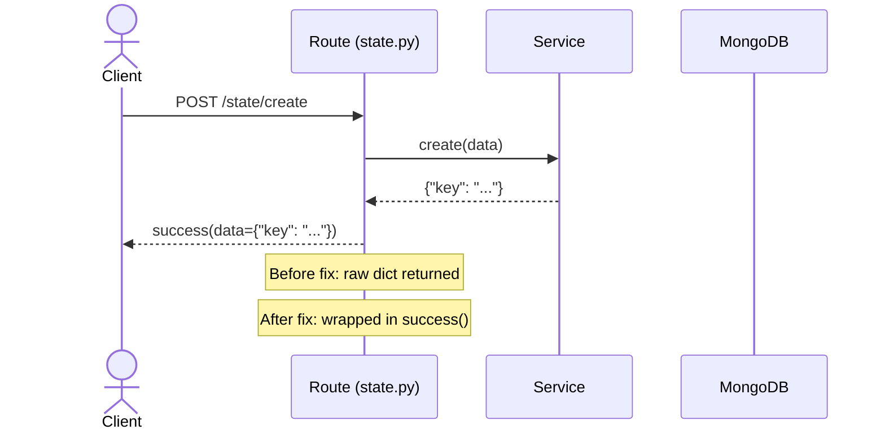
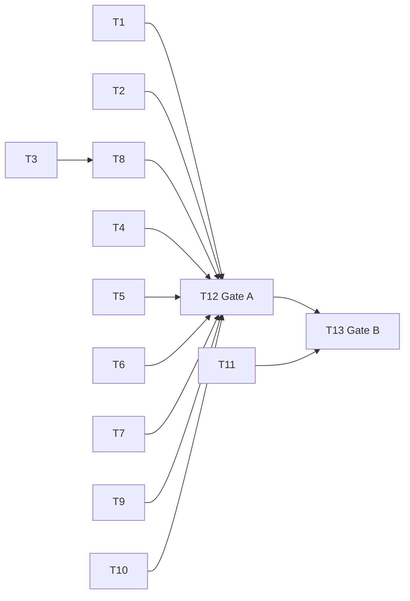

# 识别代码坏味道进行重构

> **第一原则**: 内容能被人类理解和记忆，文档内说明依赖。

> | v1 | 2026-05-08 | deepseek-v4-pro | — | 🌿 feat/code-smell-refactor | ⏱️ — | 📎 [CLAUDE.md](../../../CLAUDE.md) |

> **证据标准**: A=已验证(附路径) · B=可推导(附规则) · C=未验证(标注 `> 待补充`) · D=禁止(视为幻觉)

> **技术评审**: 详见 [后端技术评审.md](./后端技术评审.md) — 本项目为纯后端服务，前端无变更。

---

## Story 1: 修复代码坏味道，统一编码规范

### §1 Story（pm 定义）

| 字段 | 详情 |
|-------|--------|
| 作为 | 开发者 |
| 我想要 | 消除代码中的坏味道，统一异常处理、响应格式、路径安全等规范 |
| 以便 | 降低维护成本，防止因不一致导致的 bug 和安全漏洞 |
| 优先级 | P0 |
| 范围边界 | 修复 P0 级坏味道：异常吞咽、响应格式违规、路径安全、HTTP 异常泄露、线程安全。不包括大规模文件合并重构 |
| 依赖 | — |
| 子项目 | YiAi (全项目 src/) |

**范围外**: 合并 data_service.py / mongo_store.py（需要独立的架构设计故事）；重命名和删除辅助函数合并；God class 拆分；硬编码值迁移到配置（需要配置兼容性评估）

---

### §1.1 User Operations（tester 描述）

| # | 操作 | 触发条件 | 操作步骤 | 预期结果 |
|---|-----------|---------|-------------|-----------------|
| U1 | API 调用 state 相关接口 | 请求 /state/create、/state/query 等 | 1. 发送请求 → 2. 获取响应 | 响应体使用 `success()`/`fail()` 统一包装，包含 `code`、`data`、`message` 字段 |
| U2 | API 调用 /upload 接口 | 请求上传文件，使用恶意路径（含 `..`） | 1. 发送包含 `../` 或编码遍历序列的路径 → 2. 服务端处理 | 返回 `INVALID_PARAMS` 错误，不执行文件操作 |
| U3 | 服务内部异常抛出 | executor/oss_client 服务层抛出异常 | 1. 业务逻辑出错 → 2. 异常传播到路由层 | 服务层抛 `BusinessException`（非 `HTTPException`），全局异常处理器正确捕获 |

> tester 从 AC 推导用户可见的操作路径，每个故事至少描述一条主操作流。

非 UI 故事，§1.1 仅含 User Operations。

---

### §2 Requirements（pm 描述）

#### 功能点

| FP# | 描述 | 输入 | 输出 | 错误行为 | 优先级 |
|-----|-------------|-------|--------|---------------|----------|
| FP1 | 修复裸 `except:` — 改为具体异常类型 | `data_service.py` L194, L202 | `except (ValueError, TypeError):` | 无错误 | P0 |
| FP2 | state.py 路由统一使用 `success()` 包装响应 | 5 个路由处理函数的返回值 | `success(data=...)` / `fail(error=..., message=...)` | 内部错误时返回 `fail()` 包装的错误响应 | P0 |
| FP3 | 修复 `_validate_path()` 使用 realpath 验证 | 文件路径字符串 | 拒绝恶意路径或返回安全路径 | `BusinessException(ErrorCode.INVALID_PARAMS)` | P0 |
| FP4 | static_files.py 异常吞咽处添加日志 | ZIP 提取/清理异常 | 日志记录警告 | 不阻断流程但记录错误 | P0 |
| FP5 | executor.py 和 oss_client.py 服务层抛出 BusinessException 替代 HTTPException | 服务层业务错误 | `BusinessException` | 全局异常处理器正确映射为 HTTP 响应 | P0 |
| FP6 | database.py MongoDB 单例添加线程安全 | 并发初始化调用 | 安全的单例 | 无竞态条件 | P0 |
| FP7 | upload_file() 添加路径安全验证 | 上传文件的目标路径 | 在 base_dir 内的安全路径 | `BusinessException(ErrorCode.INVALID_PARAMS)` | P0 |
| FP8 | 异常丢失上下文处添加 `from e` 保留异常链 | 各 except 块中的 `raise BusinessException(...)` | `raise BusinessException(...) from e` | — | P1 |
| FP9 | 移除 `api/deps.py` 空占位文件 | — | 删除文件 | 确认无 import 引用后删除 | P2 |

#### 业务规则

| 规则# | 描述 | 校验方式 | 证据级别 |
|-------|-------------|-------------|----------|
| R1 | 所有路由响应必须通过 `success()`/`fail()` 包装 | grep 检查 | A |
| R2 | 服务层不得抛出 `HTTPException` | grep 检查 | A |
| R3 | 文件路径操作必须使用 realpath + commonpath 验证 | 代码审查 | A |
| R4 | 异常不得无声吞咽，至少 logger.warning | 代码审查 | A |

---

### §3 Design（coder + security 描述）

#### 影响分析

| 影响面 | 变更 | 说明 |
|--------|------|------|
| API 路由 | 修改 state.py 5 个路由的返回值包装 | 响应格式变更，需确认调用方兼容 `success()` 包装 |
| 数据模型 | 无变更 | — |
| 中间件链 | 无变更 | — |
| 服务层 | executor.py: HTTPException→BusinessException; oss_client.py: HTTPException→BusinessException | 异常类型变更，全局 handler 统一处理 |
| 核心模块 | database.py 单例加锁 | 不影响现有调用方 |
| 文件操作 | upload.py 路径验证增强 | 可能拒绝以前接受的边缘路径格式 |

#### 技术设计（coder 描述）

| 模块 | 文件 | 职责 | 变更类型 |
|--------|------|---------------|-------------|
| 状态路由 | `src/api/routes/state.py` | 5 个路由函数返回值包装 `success()` | 修改 |
| 数据库服务 | `src/services/database/data_service.py` | 修复 bare `except:` | 修改 |
| 文件上传路由 | `src/api/routes/upload.py` | 路径验证增强 + 异常链保留 | 修改 |
| 静态文件服务 | `src/services/static/static_files.py` | 异常处添加日志 | 修改 |
| 执行器 | `src/services/execution/executor.py` | HTTPException→BusinessException | 修改 |
| OSS 服务 | `src/services/storage/oss_client.py` | HTTPException→BusinessException | 修改 |
| 数据库核心 | `src/core/database.py` | 单例线程安全 | 修改 |
| 微信路由 | `src/api/routes/wework.py` | 异常链保留 `from e` | 修改 |
| API 占位 | `src/api/deps.py` | 删除 | 删除 |

**数据流**:

| 流程 | 来源 | 目标 | 数据 | 转换 |
|------|------|----|------|-----------|
| F1 | state 路由 | HTTP 响应 | `{"key": "..."}` | 包装为 `{"code":0,"data":{"key":"..."},"message":"ok"}` |
| F2 | 服务层抛异常 | 全局 handler | `BusinessException` / `HTTPException` | 统一转换为 `fail()` 响应 |
| F3 | 用户输入路径 | 文件系统 | 原始路径字符串 | realpath 规范化 + base_dir 边界验证 |

#### 安全约束（security 注入）

| # | 威胁 | 信任边界 | 缓解措施 | 优先级 |
|---|--------|---------------|-----------|----------|
| 1 | 路径遍历绕过 | 用户输入 → 文件系统 | `_validate_path()` 使用 realpath 验证替代字符串 `..` 检查 | P0 |
| 2 | 异常信息泄露 | 服务层 → HTTP 响应 | 服务层抛 `BusinessException`，全局 handler 控制暴露内容 | P0 |
| 3 | 竞态条件双重初始化 | 并发启动 → 数据库连接 | 单例加 `threading.Lock` | P0 |

---

### §4 Tasks（pm + coder + security + tester 拆解）

| ID | 描述 | 工作量 | 依赖 | 交付物 | Agent | 门禁 |
|----|-------------|--------|---------|-------------|-------|------|
| T1 | 修复 data_service.py 裸 except (FP1) | S | — | data_service.py L194, L202 | coder | — |
| T2 | state.py 路由包装 success() (FP2) | M | — | state.py 5 个路由 | coder | — |
| T3 | 修复 upload.py 路径验证 (FP3) | S | — | upload.py `_validate_path()` | coder | — |
| T4 | static_files.py 异常加日志 (FP4) | S | — | static_files.py | coder | — |
| T5 | executor.py HTTPException→BusinessException (FP5) | M | — | executor.py | coder | — |
| T6 | oss_client.py HTTPException→BusinessException (FP5) | M | — | oss_client.py | coder | — |
| T7 | database.py 单例加锁 (FP6) | S | — | database.py | coder | — |
| T8 | upload_file() 路径验证 (FP7) | S | T3 | upload.py `upload_file()` | coder | — |
| T9 | 异常链保留 from e (FP8) | S | — | upload.py, wework.py, executor.py | coder | — |
| T10 | 删除 api/deps.py (FP9) | S | — | 删除文件 | coder | — |
| T11 | 安全审查: 路径遍历、异常泄露、竞态 | S | T1-T10 | 审查报告 | security | — |
| T12 | Gate A: 测试方案+原型 | M | T1-T10 | 测试用例评审.md | tester | Gate A |
| T13 | Gate B: 冒烟验证 | M | T11, T12 | 测试用例报告.md | tester | Gate B |

**任务依赖图**:

---

### §5 Acceptance Criteria（tester 定义）

| AC# | 验收条件（可度量） | 测试方法 | 预期结果 | 门禁 |
|-----|------------------------|-------------|-----------------|------|
| AC1 | state.py 全部 5 个路由返回 `success()` 包装格式（含 `code`、`data`、`message`） | `python tests/smoke_state_api.py` | 所有请求返回 `{"code": 0, "data": ..., "message": "ok"}` | Gate A |
| AC2 | `_validate_path("../../../etc/passwd")` 抛出 `BusinessException` | 单元测试 | `BusinessException` 被抛出 | Gate A |
| AC3 | `_validate_path("normal/file.txt")` 返回 `"normal/file.txt"` | 单元测试 | 正常路径通过 | Gate A |
| AC4 | executor.py 和 oss_client.py 不再 import 或 raise `HTTPException` | `grep -rn "HTTPException" src/services/` | 0 结果 | Gate A |
| AC5 | database.py 多线程并发调用 `MongoDB()` 不创建多个实例 | 并发测试 | 所有线程获得同一实例 | Gate A |
| AC6 | 现有冒烟测试 `smoke_observer.py` 全部通过 | `python tests/smoke_observer.py` | `[GATE B PASSED]` | Gate B |
| AC7 | `grep -rn "except:" src/` (bare except) 仅匹配到合法的使用 | `grep` | 仅 data_service.py L194/202（含具体类型后不再是 bare） | Gate B |

---

### §6 .claude 改进清单

| # | 优先级 | 改进动作 | 原因 | 状态 |
|---|----------|------|-----------|--------|
| 1 | P1 | rules/code-pipeline.md 添加"禁止裸 except:" 规则 | 发现 2 处裸 except | pending |
| 2 | P1 | rules/gate-rules.md 添加"禁止服务层抛 HTTPException" 规则 | executor/oss_client 均有此问题 | pending |
| 3 | P2 | 添加 pre-commit hook: grep bare except/HTTPException in services | 自动化检查 | pending |

---

### §7 系统架构演进任务

| # | 优先级 | 架构变更 | 原因 | 状态 |
|---|----------|------|-----------|--------|
| 1 | P0 (近期) | 消除 data_service.py 与 mongo_store.py 重复 — 统一为单一服务层 | 460+534 行重复 CRUD 逻辑 | pending |
| 2 | P1 (中期) | oss_client.py 拆分：上传 / 元数据 / 查询三个模块 | 363 行 god class | pending |
| 3 | P1 (中期) | 迁移 maintenance.py 数据库访问到 services/database/ | 路由直接访问 MongoDB | pending |
| 4 | P2 (远期) | 硬编码值迁移到 config.yaml：并发限制、日志路径、RSS 大小限制 | 部署灵活性 | pending |
